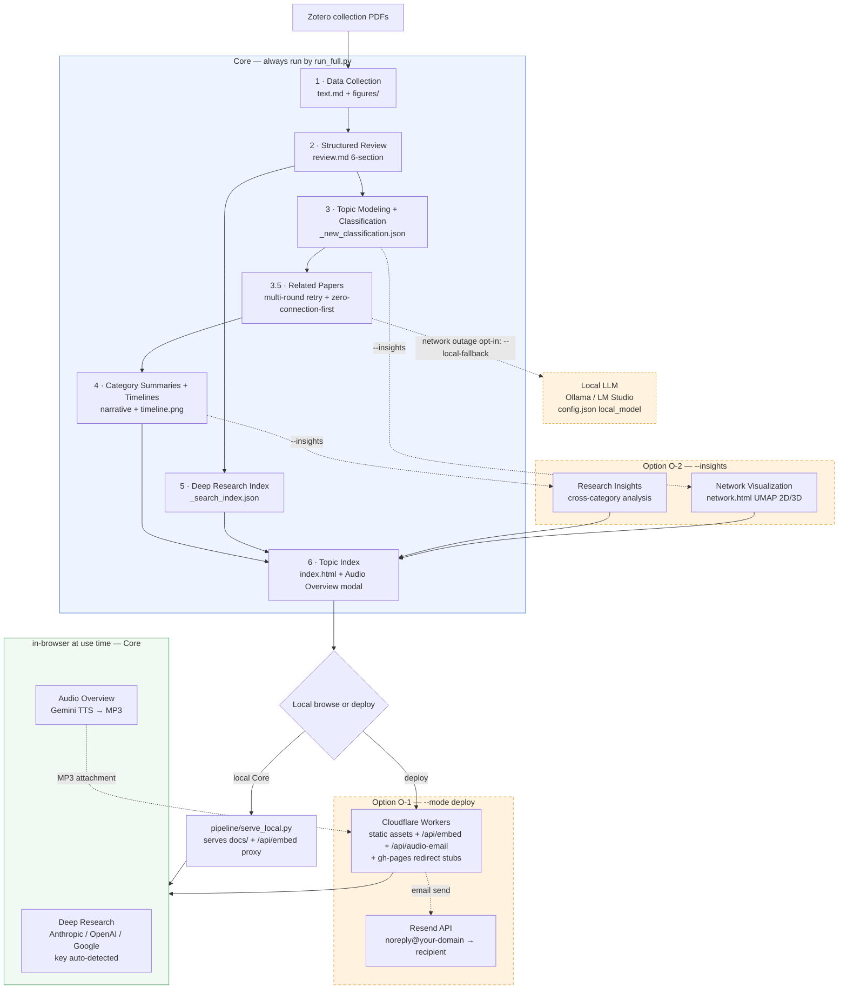

> 🇰🇷 **한국어**: [README.md](README.md) — the Korean README is the primary document.

# Paper Curation

**If you have PDFs in a Zotero collection, the rest is automatic.**

Turn hundreds of papers into structured Korean reviews, auto-classify them with AI, and ask natural-language questions grounded in the actual papers. A **personal research knowledge system** that runs locally. Deployment is optional.

---

## What It Does

Features are split into **Core** (always produced by the default pipeline) and **Option** (enabled on demand).

**Core** — one `run_full --mode curate` produces all of these:

| Feature | Description |
|---------|-------------|
| **Structured Review** | Extracts text/figures from PDF. Claude generates 6-section Korean reviews (Essence-Motivation-Achievement-How-Originality-Evaluation) |
| **Auto-Classification** | Bottom-up topic modeling (SPECTER2 + HDBSCAN + UMAP) creates categories and assigns papers automatically |
| **Related Papers** | Claude Sonnet curates per-paper connections from embedding top-20 candidates — relation type (alternative/extension/…) + one-sentence Korean reason. Network-resilient: multi-round retry + zero-connection-papers-first ordering |
| **Deep Research (multi-backend)** | Natural-language Q&A with embedding search + LLM answers grounded in paper text. Prefix-detects the key and routes to **Anthropic (Haiku/Sonnet) · OpenAI (GPT-4.1/GPT-5.5) · Google (Gemini Flash-Lite/Flash)** automatically. Natural prose + clickable `[N]` citation chips |
| **Audio Overview** | Generates a **2-3 speaker Korean podcast (Gemini TTS)** from any review or Deep Research answer. Runs in-browser → MP3 encoded client-side → download + (when deployed) **automatic email delivery with attachment** |
| **Timeline Visualization** | Per-category research trend narratives + auto-generated diagrams (PaperBanana) |
| **Knowledge Compounding** | Obsidian integration: your notes feed back into future queries |
| **Paper Discovery** | Parallel search across arXiv, Semantic Scholar, OpenAlex + auto-registration to Zotero (optional) |

**Option** — enabled by flag/mode only:

| Feature | How to enable | Description |
|---------|---------------|-------------|
| **Content Deploy (O-1)** | `--mode deploy` | Cloudflare Workers (static assets + `/api/embed` + `/api/audio-email`) + gh-pages redirect stubs. Deploying activates Audio Overview email delivery |
| **Research Insights + Network (O-2)** | `--insights` | Cross-category insight analysis + regenerates the interactive UMAP 2D/3D network (category filters, ego network, hub/bridge) |
| **Local LLM fallback** | `--local-fallback` | When Related Papers generation is blocked by network failures to the very end, a local model (Ollama/LM Studio/…) completes the remainder. Requires a `local_model` block in config.json |
| **Workflow diagram** | `generate_workflow.py` | Generates the pipeline diagram at the top of this README (PaperBanana, `--style cat/fairy/academic`) |

**What you need**: A Zotero collection with PDFs + API keys (required: Anthropic · Google · Zotero Web API). Search embeddings use Google `gemini-embedding-001`, so no separate OpenAI key is needed (OpenAI is optional — reader BYOK answers / insights fallback).

---

## Install: One Line

In [Claude Code](https://claude.ai/code), just say:

> *"Install paper-curation here: https://github.com/jehyunlee/paper-curation"*

Clone, dependencies, Zotero setup, and the first pipeline run — all handled automatically.

### Quickstart — local, in 5 steps

To install by hand, these five steps are the minimal path to running it locally. (See the sections just below for the full prerequisites and troubleshooting.)

```bash
# 1) Clone
git clone https://github.com/jehyunlee/paper-curation.git
cd paper-curation

# 2) Create one conda env (py312 = the standard single env)
conda create -n py312 -c conda-forge python=3.12 pip -y
conda activate py312

# 3) Install dependencies (includes umap-learn · hdbscan · sentence-transformers)
pip install -r requirements.txt
#    If the active interpreter can import umap/hdbscan, the orchestrator runs topic
#    modeling/classification in-process — no subprocess. (The legacy py314+py312 dual
#    setup keeps working via the same probe — see the collapsed note under "Prerequisites".)

# 4) Required API keys (reviews = Anthropic, search embeddings / figure validation / TTS = Google).
#    Search embeddings use Google gemini-embedding-001, so OpenAI is optional (BYOK answers / insights fallback).
export ANTHROPIC_API_KEY=sk-ant-...
export GOOGLE_API_KEY=...

# 5) Create config.json (interactive) → first pipeline run
python pipeline/setup.py
#    If your PDFs are already in Zotero, go straight to:
PYTHONUTF8=1 python pipeline/run_full.py --topic my_topic --mode curate --source zotero
cd docs && python -m http.server 8000   # → browse at http://localhost:8000
```

<details>
<summary><b>Manual Installation (setup.py path)</b></summary>

```bash
git clone https://github.com/jehyunlee/paper-curation.git
cd paper-curation
pip install -r requirements.txt   # full dependency set (anthropic, openai, umap-learn, hdbscan, sentence-transformers, …)
python pipeline/setup.py
```

`setup.py` interactively creates config.json, tests Zotero connectivity, checks API keys, and kicks off the first pipeline run.

</details>

### Prerequisites

Checklist — get these items ready and the first run won't stall:

| Item | Details |
|------|---------|
| **Zotero** | [API Key](https://www.zotero.org/settings/keys) + a collection with paper PDFs |
| **API keys** | `ANTHROPIC_API_KEY` (reviews/insights — **required**), `GOOGLE_API_KEY` (search embeddings `gemini-embedding-001` / figure validation / TTS — **required**), `RESEND_API_KEY` (Audio Overview email when deployed — required for deploy), `OPENAI_API_KEY` (reader BYOK answers / insights fallback — optional) |
| **conda env** | `py312` single env (standard) — created by the commands below. The legacy py314+py312 dual still works via the same probe |
| **Java Runtime** | For `opendataloader-pdf`'s PDF extraction. macOS: `brew install --cask temurin`. Without it the pipeline falls back to PyMuPDF (lower table/structure quality) |

**Create the conda env (standard: single py312)** — identical to Quickstart steps 2–3:

```bash
conda create -n py312 -c conda-forge python=3.12 pip -y
conda activate py312
pip install -r requirements.txt
```

Because `requirements.txt` includes umap-learn / hdbscan / sentence-transformers, the orchestrator runs topic modeling/classification **in-process, with no subprocess**, whenever the active interpreter can import the clustering libraries. Python 3.12 has no numba `CALL_KW` incompatibility, so a single env is enough.

<details>
<summary><b>Legacy: py314 + py312 dual env (optional)</b></summary>

If you want Python 3.14 (`py314`) as your main env, numba's bytecode interpreter doesn't yet handle 3.14's `CALL_KW` opcode, so `topic_modeling.py` / `classify_papers.py`'s `umap_cluster.transform()` → `sklearn.pairwise_distances(metric=callable)` path crashes (0.65.1 / 0.66.0rc1 / main are all affected). Create a sibling `py312` env and `run_update_force._resolve_topic_modeling_python()` uses the **same probe** (the active interpreter failing to import umap) to auto-detect the sibling `py312/bin/python` and route only those two clustering scripts there (priority: `PAPER_CURATION_PY312` env var → sibling env `<base>/envs/py312` → `which python3.12` → `sys.executable` fallback). Both envs install the same numba 0.65 / llvmlite 0.47 / numpy 2.x lineup.

```bash
conda create -n py314 -c conda-forge python=3.14 pip -y
conda create -n py312 -c conda-forge python=3.12 pip -y
conda run -n py314 pip install -r requirements.txt
conda run -n py312 pip install umap-learn hdbscan sentence-transformers \
    joblib numpy scikit-learn anthropic openai
conda activate py314
```

</details>

### Verify your install

Before launching the long pipeline, confirm the dependencies actually landed with a one-liner:

```bash
python -c "import umap, hdbscan, sentence_transformers, fitz, sklearn, anthropic; print('py312 OK')"
```

`OK` means you're ready. To preview the execution plan first, use `--dry-run`:

```bash
PYTHONUTF8=1 python pipeline/run_full.py --topic my_topic --mode curate --source zotero --dry-run
```

### Troubleshooting

| Symptom / error | Cause | Fix |
|---|---|---|
| `op_CALL_KW: pop from empty list` (numba traceback) | Classification ran under a Python 3.14 interpreter | Run in the standard single `py312` env, or — if you keep py314 as main — create a sibling `py312` env to route into. See the legacy note under "Create the conda env". If it isn't a sibling env, point `PAPER_CURATION_PY312` at it |
| `ModuleNotFoundError: umap` / `hdbscan` / `sentence_transformers` | Missing dependency | Activate the env and run `pip install -r requirements.txt` (it includes umap-learn / hdbscan / sentence-transformers) |
| Figures look low-quality / tables broken | Java missing → PyMuPDF fallback | `brew install --cask temurin` (macOS), then re-run |
| SPECTER2 / arXiv download hangs (Korean network) | huggingface LFS / arXiv blocked | Use the S3 mirror command in "Korean-network workarounds" below |
| `[COLLECTION_ERROR]` | Wrong Zotero collection name | Pick the correct name from the listed available collections, then re-run |
| Search index builds with empty embeddings | `GOOGLE_API_KEY` not set | `export GOOGLE_API_KEY=...`, then re-run — search embeddings use Google `gemini-embedding-001` (an OpenAI key is no longer required) |

---

## Workflow




> Blue = Core pipeline · Green = in-browser (Core) · **Amber dashed = Option** (opt-in)

### 1. Data Collection

| | Description |
|---|---|
| **Input** | <ul><li>PDFs from Zotero collection</li><li>Optional: parallel search (arXiv / Semantic Scholar / OpenAlex) + auto-registration to Zotero</li></ul> |
| **Processing** | <ul><li>PyMuPDF extracts text</li><li>Figure rendering (3× zoom, up to 5 per paper)</li><li>Gemini validates figure quality</li></ul> |
| **Output** | <ul><li><code>papers/{slug}/text.md</code></li><li><code>papers/{slug}/figures/*.webp</code></li></ul> |

### 2. Structured Review

| | Description |
|---|---|
| **Input** | Extracted text + figures |
| **Processing** | <ul><li>Claude Haiku writes 6-section Korean reviews (Essence · Motivation · Achievement · How · Originality · Evaluation)</li><li>Technical jargon kept verbatim</li><li>4 concurrent workers</li></ul> |
| **Output** | <ul><li><code>papers/{slug}/review.md</code></li><li><code>papers/{slug}/index.html</code></li></ul> |
| **Usage** | Browse reviews in browser with inline figures and auto-linked related papers |

### 3. Topic Modeling + Classification

| | Description |
|---|---|
| **Input** | Essence + title from all reviews |
| **Processing** | Bottom-up, minimal LLM calls:<ul><li>SPECTER2 embeddings (proximity adapter + CLS pooling) → HDBSCAN fine-grained clustering</li><li>c-TF-IDF keywords (BERTopic-style class-based distinctiveness) → Claude Sonnet names each cluster</li><li>Ward linkage groups clusters into categories</li><li>1–3 categories per paper (Node-based Hybrid C: KNN-vote primary + qualified-vote multi)</li></ul> |
| **Output** | <ul><li><code>_new_classification.json</code></li><li><code>_papers_index.json</code></li></ul> |

### 4. Insights + Timelines

| | Description |
|---|---|
| **Input** | Per-category paper lists + reviews |
| **Processing (Core)** | <ul><li>Claude Sonnet extracts category summaries and sub-themes</li><li>**Related Papers**: embedding top-20 candidates → Sonnet curates relation type + Korean reason per paper. Network-resilient — multi-round retry (only stuck batches), zero-connection-papers-first ordering, and an opt-in `--local-fallback` to a local model for anything still stranded</li><li>Claude Opus writes research-trend narratives per category</li><li>PaperBanana auto-generates timeline diagrams</li></ul> |
| **Processing (Option O-2, `--insights`)** | <ul><li>Cross-category Research Insights (Anthropic → OpenAI → Gemini 3-backend fallback)</li><li>Regenerates the network visualization (<code>network.html</code>)</li></ul> |
| **Output** | <ul><li><code>_category_summaries.json</code></li><li><code>_paper_connections.json</code></li><li><code>_timeline_narrative.json</code></li><li><code>category_timeline_*.png</code></li><li>(O-2) <code>_insights.json</code> + <code>network.html</code></li></ul> |

### 5. Deep Research Index

| | Description |
|---|---|
| **Input** | All reviews + personal notes (<code>notes/</code>) |
| **Processing** | <ul><li>Section-aware chunking</li><li>Google <code>gemini-embedding-001</code> embeddings (768d, <code>task_type=RETRIEVAL_DOCUMENT</code>, L2-normalized then int8-quantized)</li><li>BM25 sparse terms indexed alongside (for hybrid retrieval)</li><li>Personal notes are indexed and reflected in future queries</li></ul> |
| **Output** | <code>_search_index.json</code> |
| **Usage** | Natural-language query on topic page → the query embedding is computed for the reader by the worker <code>/api/embed</code> route (deployed) or <code>pipeline/serve_local.py</code> (local) with <code>gemini-embedding-001</code> (<code>task_type=RETRIEVAL_QUERY</code>) → **hybrid retrieval** (BM25 + dense, fused with RRF) → an LLM re-ranks the top candidates one sentence each → user-key prefix auto-detected, and **Anthropic / OpenAI / Google** streams a grounded answer. Retrieval needs no reader key at all; a key (BYOK) is only for answer generation. Output is natural prose + clickable `[N]` citation chips + auto-inlined figures. The Fast/Smart toggle labels show the actual model resolved for the detected backend (e.g. `Fast (cost: Haiku 4.5)`) |

### 6. Index + Network

| | Description |
|---|---|
| **Input** | All classifications + reviews + timelines + UMAP coordinates |
| **Processing** | <ul><li>(Core) Assembles category cards, search, timeline narratives, Deep Research UI, and the Audio Overview modal into a single HTML</li><li>(Option O-2, `--insights`) Regenerates the D3.js + Three.js interactive network from UMAP 2D/3D coordinates</li></ul> |
| **Output** | <ul><li><code>{topic}/index.html</code></li><li>(O-2) <code>{topic}/network.html</code></li></ul> |
| **Usage** | <code>cd docs && python -m http.server 8000</code> — browse locally. On both per-paper pages and Deep Research answers, the 🎧 **Audio Overview** button generates a Korean podcast (Gemini TTS, MP3 encoded in-browser → instant download). On the deployed site the finished MP3 is also delivered by email automatically |

### Deployment (Option O-1)

Local use is the default. For sharing, a **3-tier split-host** architecture deploys automatically:

| Tier | Role | Contents |
|------|------|----------|
| **Cloudflare Workers (Static Assets + Function)** | Serves user-facing content + the `/api/audio-email` route | Full `docs/` uploaded (local-only topics excluded via `docs/.assetsignore`) + `worker/index.js` (Audio Overview email handler) |
| **GitHub `gh-pages` branch** | Entry-URL → Cloudflare redirect | Per-topic redirect stubs (<1KB), `jehyunlee.github.io/paper-curation/{topic}/` → the operator-configured Cloudflare URL |
| **GitHub `master` branch** | Code / config / README only | Large `docs/papers/`, `docs/{topic}/` content is `.gitignore`'d |

```bash
# Deploy (requires env: CF_API_TOKEN + CLOUDFLARE_ACCOUNT_ID)
PYTHONUTF8=1 python pipeline/run_full.py --topic my_topic --mode deploy
```

Automatic:
- PNG → WebP conversion (~60% size reduction)
- API keys and local-only emails stripped from deployed HTML; local working tree restored after push
- `npx wrangler deploy` → Cloudflare (hash-based incremental upload) + Worker function deployed in the same step
- gh-pages redirect stub idempotent sync (auto-discovers new topics; no-op when unchanged)
- Cloudflare 200 OK verification (polls up to 5 min)
- Only code/config changes pushed to master (content is gitignored)

Token setup: Cloudflare Dashboard → My Profile → API Tokens → "Edit Cloudflare Workers" template.
```cmd
setx CF_API_TOKEN "..."
setx CLOUDFLARE_ACCOUNT_ID "..."
```

**Custom domain (recommended)** — drop a `[[routes]]` block into `wrangler.toml` with `pattern = "your-subdomain.your-domain.tld"`, `custom_domain = true`, and `zone_name = "your-domain.tld"`. `wrangler deploy` then provisions DNS, SSL, and routing in Cloudflare for you. Update `prepare_deploy.py`'s `CF_BASE_URL` constant to match so the gh-pages stubs point at the new domain. The default `*.workers.dev` URL works too, but a custom domain matters for email consistency.

**Cloudflare Worker secrets (email + query embedding)** — `worker/index.js` exposes two routes: `/api/audio-email` (ships finished MP3s through the [Resend](https://resend.com) API) and `/api/embed` (a `gemini-embedding-001` query-embedding proxy so readers can search without a key). Register the secrets with `wrangler secret put`:

```bash
npx wrangler secret put GOOGLE_API_KEY    # for the /api/embed query-embedding proxy (gemini-embedding-001, required)
npx wrangler secret put RESEND_API_KEY    # the re_xxx key from Resend (required for email)
npx wrangler secret put AUDIO_FROM        # e.g. "Paper Curation <noreply@your-domain.tld>" (domain must be verified)
npx wrangler secret put AUDIO_REPLY_TO    # operator inbox replies land in, e.g. "you@gmail.com" (optional)
```

- Without `GOOGLE_API_KEY`, `/api/embed` fails and Deep Research retrieval won't work (required for deploy). Locally, `pipeline/serve_local.py` plays the same role.
- When `RESEND_API_KEY` is unset, `/api/audio-email` returns 503 and the client falls back to download-only.
- `AUDIO_FROM` requires the domain to be SPF/DKIM/DMARC-verified in Resend before it can send to arbitrary recipients (without verification, only the Resend account's own address works).
- To bake operator addresses for localhost builds, add `"local_emails": ["a@b.com", ...]` to `config.json` or set `PAPER_CURATION_LOCAL_EMAILS="a@b.com,c@d.com"`. These are stripped at deploy time.

---

## Usage Modes — Single Orchestrator `run_full.py`

Three axes (`--mode` / `--source` / `--images`) replace the legacy Recipe A–H. `--source web` auto-chains search → register → sync.

```bash
# Weekly — search → register to Zotero → sync → review new papers
PYTHONUTF8=1 python pipeline/run_full.py --topic my_topic --mode curate --source web --days 7

# Local update — skip search, sync only, then review new papers
PYTHONUTF8=1 python pipeline/run_full.py --topic my_topic --mode curate --source zotero

# Re-review specific slugs (audit/recovery)
PYTHONUTF8=1 python pipeline/run_full.py --topic my_topic --mode rebuild --slugs 088,1093 --strict-pdf

# Reclassify only (HDBSCAN approximate_predict + centroid fallback, no LLM calls — auto-routed to py312)
PYTHONUTF8=1 python pipeline/run_full.py --topic my_topic --mode reclassify

# Also generate cross-category Research Insights (opt-in — Core runs paper-connections only)
PYTHONUTF8=1 python pipeline/run_full.py --topic my_topic --mode curate --source zotero --insights

# Regenerate timelines (narratives + images)
PYTHONUTF8=1 python pipeline/run_full.py --topic my_topic --mode retime --images all

# Deploy only (requires CF_API_TOKEN + CLOUDFLARE_ACCOUNT_ID)
PYTHONUTF8=1 python pipeline/run_full.py --topic my_topic --mode deploy

# Dry run — show execution plan
PYTHONUTF8=1 python pipeline/run_full.py --topic my_topic --mode curate --source web --dry-run

# Local server
cd docs && python -m http.server 8000
```

`--mode` meanings:
- **curate** — review new papers only, preserve existing (most common)
- **rebuild** — regenerate all review.md. Requires `--yes` or `--slugs`
- **reclassify** — keep reviews, reassign categories (node-based)
- **retime** — regenerate narratives + timeline images
- **deploy** — run `prepare_deploy.py` only (split-host: Cloudflare + gh-pages stubs + master code push)

Safety flags: `--strict-pdf` (block fuzzy PDF match), `--slugs A,B,C`, `--dry-run`, `--skip-dedup`, `--dedup-execute`, `--insights` (opt-in cross-category Research Insights; Core runs paper-connections only), `--yes`.

### Concurrency Tuning by Anthropic Tier

`--concurrency N` in the review step controls a paper-level `ThreadPoolExecutor`. Work is I/O bound (Anthropic + Gemini APIs), so the ceiling is **Anthropic's rate limits (RPM / ITPM)**, not the machine. Assume ~30–50K input tokens, ~5–10K output tokens, ~60 s per paper:

| Tier | Sonnet RPM (approx) | ITPM (approx) | Recommended `--concurrency` | Notes |
|------|---------------------|---------------|-----------------------------|-------|
| Free / 1 | 50 | 30K | **2–4** | ITPM caps you first. Be conservative. |
| 2 | 1,000 | 80K | **6–8** | Safe |
| 3 | 2,000 | 200K | **10–12** | 429s are rare |
| **4** | **4,000** | **400K+** | **16–20 (default 16)** | New default. Pushing higher risks ITPM ceiling. |

Default `--concurrency 16` targets **Tier 4**. Tier 1–3 users should pass `--concurrency 4` (or another table value) explicitly — 429s are retried via the checkpoint, but the resume overhead accumulates.

```bash
# Tier 1 (most conservative)
PYTHONUTF8=1 python pipeline/run_full.py --topic my_topic --mode curate --source web --concurrency 4
# Tier 4 (matches default, can be omitted)
PYTHONUTF8=1 python pipeline/run_full.py --topic my_topic --mode curate --source web --concurrency 16
```

Hardware is effectively unbounded — an M-series Mac with 18 cores / 64GB+ has plenty of headroom even at 30 workers (~few hundred MB each). The real ceiling is the ITPM column above.

### Korean-network workarounds — SPECTER2 / arXiv

From Korean ISPs two endpoints occasionally fail (other regions usually fine):

**1. `huggingface.co` LFS blocked** — `topic_modeling.py` cannot fetch the SPECTER2 embedding model. Download once from the AWS S3 mirror into `<project_root>/.cache/base/` and `topic_modeling.py` will auto-detect it (skipping the HF Hub call):

```bash
mkdir -p .cache && cd .cache
curl -L -o specter2_0.tar.gz "https://ai2-s2-research-public.s3.amazonaws.com/specter2_0/specter2_0.tar.gz"
tar -xzf specter2_0.tar.gz   # extracts base/ and adapters/
cd ..
```

Verify:
```bash
PYTHONUTF8=1 python -c "from pipeline.topic_modeling import SPECTER2_MODEL; print(SPECTER2_MODEL)"
# Should print /Users/.../paper-curation/.cache/base
```

**2. arXiv API chronic 429/timeout** — once `export.arxiv.org` fails to respond to the first request, the IP gets throttled for a while; even a proper User-Agent does not always help. Pass `--skip-arxiv` to skip arXiv entirely and search via OpenAlex + Semantic Scholar (saves ~8 min per window):

```bash
PYTHONUTF8=1 python pipeline/search_papers.py --topic scisci --since 2026-04-01 --until 2026-04-10 --skip-arxiv
```

OpenAlex returns 1k+ items per keyword and dominates the result pool, so missing arXiv rarely degrades coverage in practice.

**3. Korean-network↔Anthropic stale connections** — on bad days the Related Papers generation (batched Sonnet calls) gets stuck on half-open sockets to the very end. The default defenses are automatic (multi-round retry + zero-connection-papers-first ordering + anything unfinished keeps its previous connections and self-heals next cycle). If you run a local model, `--local-fallback` completes the remainder on the spot, independent of the network:

```bash
# Add a local_model block to config.json (Ollama example — measured: EXAONE-4.0-32B, ~32s per 8-paper batch)
#   "local_model": {
#     "base_url": "http://localhost:11434/v1",
#     "model": "exaone-4.0:latest",
#     "num_ctx": 8192, "retries": 2, "batch_size": 8
#   }
PYTHONUTF8=1 python pipeline/run_full.py --topic ai4s --mode curate --source zotero --local-fallback
```

Ollama is auto-detected and served via its native API (per-request `num_ctx`, `think:false`); LM Studio/llama.cpp/vLLM use the OpenAI-compatible path. A dead endpoint is skipped silently — the pipeline never blocks on it.

---

<details>
<summary><h2 id="advanced-internals-en">Advanced / internals (expand)</h2></summary>

> The following is maintainer/advanced reference. You don't need it for first-time use.

## Reliability (v2+)

Safety nets added through recent refactors:

| Guard | Description |
|-------|-------------|
| `run_full.py` orchestrator | 3-axis (`--mode/--source/--images`) single entrypoint. Auto-chains search·register·sync·review·post-processing·deploy. Prints a dry-run plan. |
| `find_pdf()` ID-first | Zotero attachment → DOI → arXiv → strict fuzzy. Eliminates the root cause of past fuzzy-mismatch incidents. |
| `--strict-pdf` | Blocks fuzzy matching entirely. Recommended for fresh reviews and recovery. |
| `classify_papers.py` (Phase 3) | SPECTER2 embedding → UMAP transform 5D → `hdbscan.approximate_predict` (density-faithful primary sub-cluster) → outlier (-1) forced to nearest 768D centroid → `all_categories` = top-N parents by centroid distance. Zero LLM calls. Auto-routed to `py312` (see Python environment above). |
| `_resolve_topic_modeling_python()` | Routes only `topic_modeling.py` / `classify_papers.py` to the `py312` interpreter. Override with `PAPER_CURATION_PY312` env var. Auto-detects a sibling env under the current interpreter's conda prefix. |
| `find_pdf()` cross-platform basename | Handles Zotero linked attachments stored as Windows absolute paths (`C:\Users\…\foo.pdf`) which macOS `os.path.basename` cannot split on backslash. Fix: `path.replace("\\", "/").rsplit("/", 1)[-1]`. |
| `make_slug()` 40-char collision fix | The original 25-char prefix matched different papers ("A Hierarchical Framework for Humanoid Locomotion" ↔ "A hierarchical framework for measuring scientific impact"). Compare length is now `min(40, min(len(a), len(b)))` with a 10-char floor, preserving exact matches on short titles. |
| `_zotero_text_sanity()` Korean/ASCII dual pass | Handles Zotero items with Korean titles but English PDFs. Includes Hangul syllables in keyword extraction, scales the threshold to `max(1, len(kw)*coverage)`, and adds an ASCII-only fallback (English tokens matching is sufficient when DOI/author also pass). |
| `extract_insights` 3-backend fallback | Cross-category insights chain: Anthropic → OpenAI → Gemini. Override order via `EXTRACT_INSIGHTS_CC_BACKENDS`. On ReadTimeout/connection error, the next backend is tried automatically; each backend is forced into the same tool-use / structured output schema. |
| `run_step()` CRITICAL_STEPS hard-fail | `build_papers_index` / `topic_modeling*` / `classify_papers` raise `RuntimeError` on failure, aborting the run. Prevents stale classifications from silently propagating to downstream stages. Degradable steps (LLM narrative, images, search index) still soft-fail. |
| `audit_matching.py` | Duplicate text.md hash detection (same PDF used for two reviews) + 4-axis cross-check. |
| `fix_matching.py` | Audit-driven artifact deletion + re-review command generation (dry-run by default). |
| `dedup_zotero.py` | Zotero-collection dedup (title-60 + DOI + arXiv + shared-PDF). Auto-integrated as `run_update_force` preflight. |
| `validate_papers.py --strict` | Category ↔ timeline image consistency, duplicate text.md detection. Deploy gate. |
| `cleanup.py` | Removes stale category timelines/caches + prunes stale entries from narrative JSONs. Auto-integrated into post-processing. |
| `prepare_deploy.py` | Split-host deploy automation: `wrangler deploy` → Cloudflare, idempotent gh-pages redirect-stub sync, Cloudflare 200-OK polling, master push (code/config only). API keys stripped in-memory and restored locally. |
| 21600s timeout | `generate_timelines` post-step cap raised from 1h to 6h to let PaperBanana finish multi-category runs. |

**Mismatch audit and recovery workflow**:
```bash
PYTHONUTF8=1 python pipeline/audit_matching.py --topic my_topic          # 1. detect
PYTHONUTF8=1 python pipeline/fix_matching.py --topic my_topic            # 2. dry-run
PYTHONUTF8=1 python pipeline/fix_matching.py --topic my_topic --execute  # 3. delete
# 4. Run the `run_update_force --slugs ... --strict-pdf` command printed by fix_matching
PYTHONUTF8=1 python pipeline/audit_matching.py --topic my_topic          # 5. verify
```

---

## Internal architecture (post-refactor)

Notes for users who want to call parts of the pipeline from other code or tune performance.

### 1. Programmatic API — `pipeline/api/`

The core logic of the 19 CLI scripts is exposed as a function facade in `pipeline/api/__init__.py` (25 public functions). Callable from other code/workflows without subprocess overhead:

```python
from pipeline.api import (
    search, register, sync, dedup_zotero,                        # ingest
    curate,                                                       # full batch
    build_papers_index, topic_model, classify,                   # index + classify
    category_summary, insights, timeline,                        # narrative (LLM)
    network, search_index, topic_index, review_to_html, deploy,  # render + publish
    validate, audit_matching, fix_matching, cleanup,             # safety
)

# Helpers
from pipeline.api._llm import cached_call, paper_cache_dir, topic_cache_dir
from pipeline.api.extract import pre_validate_figure
```

Each function shares the same `_run_X(**kwargs)` body that the thin CLI wrapper calls, so CLI and API behave identically.

### 2. LLM call caching — `api/_llm.cached_call`

SHA-256 hash of `(prompt, model, schema_version)` is used as the cache key; results are stored as JSON. Cache directories:

- Per-category / per-topic: `docs/{topic}/.llm_cache/{hash}.json`
- Per-paper (`write_review`): `docs/papers/{slug}/.llm_cache/{hash}.json`

Re-runs on unchanged input issue zero LLM calls. Bypass with `force=True`.

### 3. Category-level ThreadPool parallelism

LLM I/O-bound stages parallelise by category, cutting wall-clock by roughly 4×. Worker counts are tunable via env vars:

| Stage | env var | Default workers | Model |
|---|---|---|---|
| `build_category_summaries` (Korean descriptions + sub-themes) | `CAT_SUMMARY_PARALLEL` | 8 | Haiku |
| `generate_timelines` STEP 1 narrative | `TIMELINE_NARRATIVE_PARALLEL` | 8 | Opus streaming |
| `generate_timelines` STEP 2 PaperBanana images | `TIMELINE_IMAGE_PARALLEL` | 4 | Gemini image |
| `extract_insights` per-category paper_connections | `EXTRACT_INSIGHTS_PARALLEL` | 4 | Sonnet |

Tier 1–3 users should lower the worker counts to stay under the ITPM cap.

### 4. Tool-use schema enforcement — Anthropic structured output

LLM responses go through Anthropic tool-use schemas so JSON parse jitter is zero. The SDK auto-retries on schema mismatch, which let us delete the post-hoc fixers (formerly `fix_python_list_literals` / `fix_figure_paths` / `fix_evaluation_format`).

| Call site | Tool name | Model |
|---|---|---|
| `write_review` (per-paper review JSON) | `emit_review` | Haiku |
| `extract_insights.extract_cross_category_insights` | `emit_insights` | Sonnet (+ OpenAI/Gemini fallback) |
| `extract_insights._call_connections_batch` (Anthropic branch) | `emit_connections` | Sonnet (+ OpenAI `response_format=json_object` fallback) |

### 5. Figure pre-validator — `api/extract.pre_validate_figure`

Cheap heuristic check before each Gemini figure validation:

1. File size < 4 KB → clipped
2. Dimension < 100 px → clipped
3. Grayscale pixel variance < 30 → near-uniform (clipped)

Each branch returns the same dict shape as Gemini's response, so callers don't need to switch — about 30 % of LLM calls are saved.

### 6. Schema v1 frontmatter — Obsidian Properties compatible

Every `docs/papers/{slug}/review.md` carries v1 YAML frontmatter (generated by `inject_frontmatter.py` from `_papers_index.json`). Canonical fields + body sections:

```yaml
---
title: "<full paper title>"
authors: ["First Last", ...]
date: "2021-07-15"
doi: "..."
primary_topic: ai4s
primary_category: "..."
all_categories: [...]
sub_categories: {"Category": "Sub-category", ...}
scores: {novelty: 5, technical: 5, significance: 5, clarity: 4, overall: 5}
score: 5            # top-level (Obsidian sort)
essence: "..."
tags: [paper, ai4s, "ai4s/category-slug/sub-slug", ...]
schema_version: v1
---
```

Existing review.md files are bulk-migrated via `pipeline/_archive/migrate_to_toolschema.py` (a one-time migration, now archived; backups: `docs/papers/.legacy/{slug}_v0.md`). The migration is idempotent on re-run. All readers (`build_papers_index` / `build_topic_index` / `validate_papers`) take the frontmatter fast path first and fall back to the legacy body-regex if no v1 frontmatter is present.

---

## Comparison with Karpathy's LLM Wiki

[Karpathy's LLM Wiki](https://gist.github.com/karpathy/442a6bf555914893e9891c11519de94f) proposes a powerful concept: "LLM organizes, human curates — persistent knowledge base." Paper Curation shares this philosophy while adding an automated pipeline specialized for academic papers.

| | Karpathy LLM Wiki | Paper Curation |
|---|---|---|
| **Core concept** | LLM organizes, human curates | Same + automated pipeline |
| **Input** | Free-form text, web pages, etc. | Zotero PDFs (academic paper-focused) |
| **Structuring** | User writes markdown manually | 6-section auto-generation (Essence~Evaluation) |
| **Classification** | Manual tagging/folders | Bottom-up auto-classification (HDBSCAN + UMAP) |
| **Search** | Keyword/full-text search | Embedding RAG + natural-language Q&A + Claude answers |
| **Figures** | Not supported | Auto-extracted from PDF + inline display |
| **Visualization** | None | Timeline diagrams + UMAP 2D/3D network |
| **Knowledge compounding** | Wiki-link based | Obsidian wiki-links + notes re-indexed into answers |
| **Deployment** | Local files | Local + static hosting (optional) |
| **Installation** | Manual setup | One-line Claude Code install |
| **Strength** | General-purpose, lightweight, any topic | Paper-specific automation, figures/classification/visualization built-in |
| **Weakness** | Paper metadata/figures need manual handling | May be overkill for non-academic content |

Paper Curation's Obsidian integration implements the LLM Wiki compounding concept directly:

```
Deep Research query -> Obsidian note -> re-index -> your notes cited in next query
```

</details>

---

## Requirements

| Category | Items |
|----------|-------|
| **Required** | Python 3.12 (macOS conda env `py312` is the single standard; the legacy py314+py312 dual also works), Zotero (API Key + collection + PDFs) |
| **APIs** | Anthropic (Claude Haiku/Sonnet/Opus), Google (Gemini + `gemini-embedding-001` search embeddings), Zotero Web API, Resend (Audio Overview email when deployed). OpenAI is optional (reader BYOK answers / insights fallback) |
| **Python** | `pip install -r requirements.txt` — anthropic, openai, google-genai, pymupdf, Pillow, requests, pyzotero, opendataloader-pdf, numpy, scikit-learn, joblib, umap-learn, hdbscan, sentence-transformers |
| **Optional** | Obsidian (notes/Graph View), PaperBanana (timeline images), Zotero Desktop (one-click PDF) |

---

*Built with Claude Code.*
