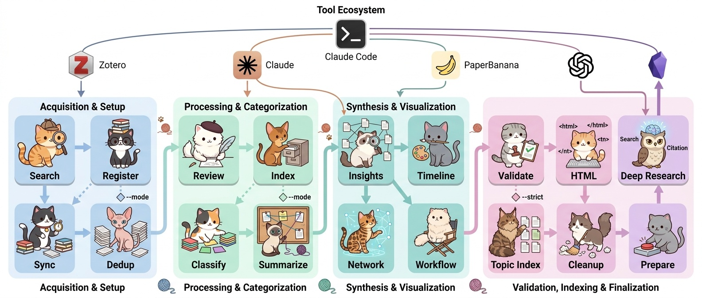

> 🇰🇷 **한국어**: [README.md](README.md) — the Korean README is the primary document.

# Paper Curation

**If you have PDFs in a Zotero collection, the rest is automatic.**

Turn hundreds of papers into structured Korean reviews, auto-classify them with AI, and ask natural-language questions grounded in the actual papers. A **personal research knowledge system** that runs locally; deployment is optional. Orchestrated by Claude Code.



> 🐱 **The whole pipeline in one picture** — collection, review, classification, related-paper linking, timelines, Deep Research, and deploy, all handled by cats.

---

## What It Does

Features are split into **Core** (always produced by the default pipeline) and **Option** (enabled on demand).

**Core** — one `run_full --mode curate` produces all of these:

| Feature | Description |
|---------|-------------|
| **Structured Review** | Extracts text/figures from PDF. Claude generates 6-section Korean reviews (Essence-Motivation-Achievement-How-Originality-Evaluation) |
| **Auto-Classification** | Bottom-up topic modeling (SPECTER2 + HDBSCAN + UMAP) creates categories and assigns papers automatically |
| **Related Papers** | Claude Sonnet curates per-paper connections from embedding top-20 candidates — relation type (alternative/extension/…) + one-sentence Korean reason. Network-resilient: multi-round retry + zero-connection-papers-first ordering |
| **Deep Research (multi-backend)** | Natural-language Q&A with hybrid search (BM25 + dense) + LLM answers grounded in paper text. Prefix-detects the key and routes to **Anthropic · OpenAI · Google** automatically. Natural prose + clickable `[N]` citation chips |
| **Audio Overview** | Generates a **2-3 speaker Korean podcast (Gemini TTS)** from any review or Deep Research answer. Runs in-browser → MP3 encoded client-side → download + (when deployed) **automatic email delivery with attachment** |
| **Timeline Visualization** | Per-category research trend narratives + auto-generated diagrams (PaperBanana) |
| **Knowledge Compounding** | Obsidian integration: your notes feed back into future queries |
| **Paper Discovery** | Parallel search across arXiv, Semantic Scholar, OpenAlex + auto-registration to Zotero (optional) |

**Option** — enabled by flag/mode only:

| Feature | How to enable | Description |
|---------|---------------|-------------|
| **Content Deploy (O-1)** | `--mode deploy` | Cloudflare Workers (static assets + `/api/embed` + `/api/audio-email`) + gh-pages redirect stubs. Deploying activates Audio Overview email delivery |
| **Research Insights + Network (O-2)** | `--insights` | Cross-category insight analysis + regenerates the interactive UMAP 2D/3D network (category filters, ego network, hub/bridge) |
| **Local LLM fallback** | `--local-fallback` | When Related Papers generation is blocked by network failures to the very end, a local model (Ollama/LM Studio/…) completes the remainder. Requires a `local_model` block in config.json |
| **Workflow diagram** | `generate_workflow.py` | Generates the cat pipeline diagram at the top of this README (PaperBanana, `--style cat/fairy/academic`) |

**What you need**: a Zotero collection with PDFs, a Zotero API key, a Google API key, and one Claude authentication mode:

- **Subscription OAuth (recommended)** — Claude Pro/Max/Team/Enterprise through Claude Code >= 2.1.205. Use a saved `claude auth login` session or an env-only `CLAUDE_CODE_OAUTH_TOKEN` generated by `claude setup-token`.
- **Console API key** — `ANTHROPIC_API_KEY`, billed as metered Anthropic Console API usage.

OpenAI is optional. Resend is needed only for deployed Audio Overview email.

---

## Install
Prerequisites for the NPX path: Git, Node.js 18+, and a working `conda` command (Miniconda or Miniforge).

### NPX onboarding (recommended)

```bash
# Fresh clone + setup using Claude subscription OAuth
npx --yes github:jehyunlee/paper-curation init --auth oauth --dir paper-curation

# Existing checkout
npx . setup --auth oauth

# Metered Anthropic Console API alternative
npx . setup --auth api-key

# Diagnose and run
npx . doctor --network
npx . run -- --topic my_topic --mode curate --source zotero
```
`config.json` is intentionally untracked because it contains local credentials; a clone or pull never creates it. The simplest path requires no export: run setup and paste the Zotero API key at the prompt.

```bash
cd ~/dev/paper-curation
npx . setup --auth oauth

# Optional alternative to editing .env
export ZOTERO_API_KEY=...
export GEMINI_API_KEY=...
npx . setup --auth oauth
```

An export only changes the current shell and never creates a file. To fill every value in one editable file:

```bash
cp .env.example .env
open -e .env                    # or open .env in any editor
npx . setup --auth oauth
```

The template contains only the two required values: `ZOTERO_API_KEY=` and `GEMINI_API_KEY=`. Setup lists collections through the Zotero API, asks for a numbered selection, derives the topic alias, and creates `pdf_cache/`. Zotero Storage PDFs are downloaded into that cache on demand. Add the advanced `ZOTERO_DIR` override only for local linked attachments that are not stored in Zotero Storage. `.env` remains untracked.

NPX creates/uses the `py312` conda environment, installs `requirements.txt`, and runs the interactive setup. It does **not** start the costly pipeline by default; add `--run-first` explicitly to do that.

OAuth tokens are never written to `config.json`; setup stores only `anthropic_auth.mode = "oauth"`. Claude Code itself may give API credentials precedence over OAuth, so unset `ANTHROPIC_API_KEY` and `ANTHROPIC_AUTH_TOKEN` in an OAuth shell. This repository removes both from OAuth child calls, and `auto` mode prefers an OAuth token/login over API keys.

### Manual conda fallback

```bash
git clone https://github.com/jehyunlee/paper-curation.git
cd paper-curation
conda create -n py312 -c conda-forge python=3.12 pip -y
conda activate py312
pip install -r requirements.txt

# Subscription OAuth
claude auth login
# For a long-lived token instead:
claude setup-token
export CLAUDE_CODE_OAUTH_TOKEN='token_printed_by_setup-token'

export GOOGLE_API_KEY=...
export ZOTERO_API_KEY=...
PYTHONUTF8=1 python pipeline/setup.py --anthropic-auth oauth --no-run

# Or metered Console API billing
export ANTHROPIC_API_KEY=sk-ant-...
PYTHONUTF8=1 python pipeline/setup.py --anthropic-auth api-key --no-run
```

`setup.py` creates `config.json`, tests Zotero connectivity, and installs the Claude Code skill. Run the pipeline separately after setup.

### Prerequisites

| Item | Details |
|------|---------|
| **Zotero** | [API Key](https://www.zotero.org/settings/keys) + a collection with paper PDFs |
| **Claude auth** | Subscription OAuth (`claude auth login` or env-only `CLAUDE_CODE_OAUTH_TOKEN`) **or** metered Console `ANTHROPIC_API_KEY` |
| **Google API key** | `GOOGLE_API_KEY` for search embeddings, figure validation, and TTS |
| **Optional keys** | `OPENAI_API_KEY` for reader BYOK/insights fallback; `RESEND_API_KEY` for deployed Audio Overview email |
| **conda env** | `py312` (Python 3.12), created automatically by NPX or manually above |
| **Java Runtime** | For `opendataloader-pdf`; without it, the pipeline falls back to PyMuPDF |

**Create the conda env** — identical to Quickstart steps 2–3:

```bash
conda create -n py312 -c conda-forge python=3.12 pip -y
conda activate py312
pip install -r requirements.txt
```

Because `requirements.txt` includes umap-learn / hdbscan / sentence-transformers, the orchestrator runs topic modeling/classification **in-process, with no subprocess** — a single `py312` env is all you need.

### Verify your install

Before launching the long pipeline, confirm the dependencies actually landed:

```bash
python -c "import umap, hdbscan, sentence_transformers, fitz, sklearn, anthropic; print('py312 OK')"
```

`OK` means you're ready. To preview the execution plan first, use `--dry-run`:

```bash
PYTHONUTF8=1 python pipeline/run_full.py --topic my_topic --mode curate --source zotero --dry-run
```

### Troubleshooting

| Symptom / error | Cause | Fix |
|---|---|---|
| `op_CALL_KW: pop from empty list` (numba traceback) | Classification ran outside the `py312` env | `conda activate py312` and re-run |
| `ModuleNotFoundError: umap` / `hdbscan` / `sentence_transformers` | Missing dependency | Activate the env and run `pip install -r requirements.txt` (it includes umap-learn / hdbscan / sentence-transformers) |
| Figures look low-quality / tables broken | Java missing → PyMuPDF fallback | `brew install --cask temurin` (macOS), then re-run |
| SPECTER2 / arXiv download hangs (Korean network) | huggingface LFS / arXiv blocked | Use the S3 mirror command in "Korean-network workarounds" below |
| `[COLLECTION_ERROR]` | Wrong Zotero collection name | Pick the correct name from the listed available collections, then re-run |
| Search index builds with empty embeddings | `GOOGLE_API_KEY` not set | `export GOOGLE_API_KEY=...`, then re-run — search embeddings use Google `gemini-embedding-001` |

---

## Pipeline

The cat diagram at the top is the bird's-eye view. `run_full.py` runs the Core stages below in order — each table is one stage's input → processing → output.

### 1. Data Collection

| | Description |
|---|---|
| **Input** | <ul><li>PDFs from Zotero collection</li><li>Optional: parallel search (arXiv / Semantic Scholar / OpenAlex) + auto-registration to Zotero</li></ul> |
| **Processing** | <ul><li>PyMuPDF extracts text</li><li>Figure rendering (3× zoom, up to 5 per paper)</li><li>Gemini validates figure quality</li></ul> |
| **Output** | <ul><li><code>papers/{slug}/text.md</code></li><li><code>papers/{slug}/figures/*.webp</code></li></ul> |

### 2. Structured Review

| | Description |
|---|---|
| **Input** | Extracted text + figures |
| **Processing** | <ul><li>Claude Haiku writes 6-section Korean reviews (Essence · Motivation · Achievement · How · Originality · Evaluation)</li><li>Technical jargon kept verbatim</li><li>Concurrent workers (default 16)</li></ul> |
| **Output** | <ul><li><code>papers/{slug}/review.md</code></li><li><code>papers/{slug}/index.html</code></li></ul> |
| **Usage** | Browse reviews in browser with inline figures and auto-linked related papers |

### 3. Topic Modeling + Classification

| | Description |
|---|---|
| **Input** | Essence + title from all reviews |
| **Processing** | Bottom-up, minimal LLM calls:<ul><li>SPECTER2 embeddings (proximity adapter + CLS pooling) → HDBSCAN fine-grained clustering</li><li>c-TF-IDF keywords (BERTopic-style class-based distinctiveness) → Claude Sonnet names each cluster</li><li>Ward linkage groups clusters into categories</li><li>1–3 categories per paper (Node-based Hybrid C: KNN-vote primary + qualified-vote multi)</li></ul> |
| **Output** | <ul><li><code>_new_classification.json</code></li><li><code>_papers_index.json</code></li></ul> |

### 4. Insights + Timelines

| | Description |
|---|---|
| **Input** | Per-category paper lists + reviews |
| **Processing (Core)** | <ul><li>Claude Sonnet extracts category summaries and sub-themes</li><li>**Related Papers**: embedding top-20 candidates → Sonnet curates relation type + Korean reason per paper. Network-resilient — multi-round retry (only stuck batches), zero-connection-papers-first ordering, and an opt-in `--local-fallback` to a local model for anything still stranded</li><li>Claude Opus writes research-trend narratives per category</li><li>PaperBanana generates several diagram candidates per category, and a Claude vision review selects the best — judged on consistent per-category color, clear emergence/disappearance and convergence/divergence of categories, and the absence of spurious text such as color names or indices</li></ul> |
| **Processing (Option O-2, `--insights`)** | <ul><li>Cross-category Research Insights (Anthropic → OpenAI → Gemini 3-backend fallback)</li><li>Regenerates the network visualization (<code>network.html</code>)</li></ul> |
| **Output** | <ul><li><code>_category_summaries.json</code></li><li><code>_paper_connections.json</code></li><li><code>_timeline_narrative.json</code></li><li><code>category_timeline_*.png</code></li><li>(O-2) <code>_insights.json</code> + <code>network.html</code></li></ul> |

### 5. Deep Research Index

| | Description |
|---|---|
| **Input** | All reviews + personal notes (<code>notes/</code>) |
| **Processing** | <ul><li>Section-aware chunking</li><li>Google <code>gemini-embedding-001</code> embeddings (768d, <code>task_type=RETRIEVAL_DOCUMENT</code>, L2-normalized then int8-quantized)</li><li>BM25 sparse terms indexed alongside (for hybrid retrieval)</li><li>Personal notes are indexed and reflected in future queries</li></ul> |
| **Output** | <code>_search_index.json</code> + <code>_search_index_emb.bin</code> |
| **Usage** | Natural-language query on topic page → the query embedding is computed for the reader by the worker <code>/api/embed</code> route (deployed) or <code>pipeline/serve_local.py</code> (local) with <code>gemini-embedding-001</code> (<code>task_type=RETRIEVAL_QUERY</code>) → **hybrid retrieval** (BM25 + dense, fused with RRF) → an LLM re-ranks the top candidates → user-key prefix auto-detected, and **Anthropic / OpenAI / Google** streams a grounded answer. Retrieval needs no reader key; a key (BYOK) is only for answer generation. Output is natural prose + clickable `[N]` citation chips + auto-inlined figures |

### 6. Index + Network

| | Description |
|---|---|
| **Input** | All classifications + reviews + timelines + UMAP coordinates |
| **Processing** | <ul><li>(Core) Assembles category cards, search, timeline narratives, Deep Research UI, and the Audio Overview modal into a single HTML</li><li>(Option O-2, `--insights`) Regenerates the D3.js + Three.js interactive network from UMAP 2D/3D coordinates</li></ul> |
| **Output** | <ul><li><code>{topic}/index.html</code></li><li>(O-2) <code>{topic}/network.html</code></li></ul> |
| **Usage** | `PYTHONUTF8=1 python pipeline/serve_local.py` — browse locally. On both per-paper pages and Deep Research answers, the 🎧 **Audio Overview** button generates a Korean podcast (Gemini TTS, MP3 encoded in-browser → instant download). On the deployed site the finished MP3 is also delivered by email automatically |

### Deployment (Option O-1)

Local use is the default. For sharing, a **3-tier split-host** architecture deploys automatically:

| Tier | Role | Contents |
|------|------|----------|
| **Cloudflare Workers (Static Assets + Function)** | Serves user-facing content + the `/api/embed` and `/api/audio-email` routes | Full `docs/` uploaded (local-only topics excluded via `docs/.assetsignore`) + `worker/index.js` |
| **GitHub `gh-pages` branch** | Entry-URL → Cloudflare redirect | Per-topic redirect stubs (<1KB), `jehyunlee.github.io/paper-curation/{topic}/` → the operator-configured Cloudflare URL |
| **GitHub `master` branch** | Code / config / README only | Large `docs/papers/`, `docs/{topic}/` content is `.gitignore`'d |

```bash
# Deploy (requires env: CF_API_TOKEN + CLOUDFLARE_ACCOUNT_ID)
PYTHONUTF8=1 python pipeline/run_full.py --topic my_topic --mode deploy
```

Automatic: PNG → WebP conversion (~60% smaller) · API keys and local-only emails stripped from deployed HTML (local working tree restored after push) · `npx wrangler deploy` → Cloudflare (hash-based incremental upload, Worker deployed in the same step) · gh-pages redirect-stub idempotent sync · Cloudflare 200-OK verification (polls up to 5 min) · only code/config pushed to master (content is gitignored).

**Custom domain (recommended)** — add a `[[routes]]` block to `wrangler.toml` (`pattern`, `custom_domain = true`, `zone_name`); `wrangler deploy` provisions DNS, SSL, and routing. Update `prepare_deploy.py`'s `CF_BASE_URL` so the gh-pages stubs point at it. The default `*.workers.dev` URL works too, but a custom domain matters for email consistency.

**Worker secrets** — `worker/index.js` exposes `/api/embed` (a `gemini-embedding-001` query-embedding proxy so readers search without a key) and `/api/audio-email` (ships finished MP3s via [Resend](https://resend.com)). Register them with `wrangler secret put`:

```bash
npx wrangler secret put GOOGLE_API_KEY    # /api/embed proxy (gemini-embedding-001, required)
npx wrangler secret put RESEND_API_KEY    # re_xxx from Resend (required for email)
npx wrangler secret put AUDIO_FROM        # e.g. "Paper Curation <noreply@your-domain.tld>" (domain must be verified)
npx wrangler secret put AUDIO_REPLY_TO    # operator inbox for replies, e.g. "you@gmail.com" (optional)
```

- Without `GOOGLE_API_KEY`, `/api/embed` fails and Deep Research retrieval won't work. Locally, `pipeline/serve_local.py` plays the same role.
- When `RESEND_API_KEY` is unset, `/api/audio-email` returns 503 and the client falls back to download-only.
- `AUDIO_FROM` requires the domain to be SPF/DKIM/DMARC-verified in Resend before sending to arbitrary recipients.
- To bake operator addresses for localhost builds, add `"local_emails": [...]` to `config.json` or set `PAPER_CURATION_LOCAL_EMAILS`. These are stripped at deploy time.

---

## Usage Modes — Single Orchestrator `run_full.py`

Three axes (`--mode` / `--source` / `--images`). `--source web` auto-chains search → register → sync.

```bash
# Weekly — search → register to Zotero → sync → review new papers
PYTHONUTF8=1 python pipeline/run_full.py --topic my_topic --mode curate --source web --days 7

# Local update — skip search, sync only, then review new papers
PYTHONUTF8=1 python pipeline/run_full.py --topic my_topic --mode curate --source zotero

# Re-review specific slugs (audit/recovery)
PYTHONUTF8=1 python pipeline/run_full.py --topic my_topic --mode rebuild --slugs 088,1093 --strict-pdf

# Reclassify only (HDBSCAN approximate_predict + centroid fallback, no LLM calls)
PYTHONUTF8=1 python pipeline/run_full.py --topic my_topic --mode reclassify

# Also generate cross-category Research Insights (opt-in — Core runs paper-connections only)
PYTHONUTF8=1 python pipeline/run_full.py --topic my_topic --mode curate --source zotero --insights

# Regenerate timelines (narratives + images)
PYTHONUTF8=1 python pipeline/run_full.py --topic my_topic --mode retime --images all

# Deploy only (requires CF_API_TOKEN + CLOUDFLARE_ACCOUNT_ID)
PYTHONUTF8=1 python pipeline/run_full.py --topic my_topic --mode deploy

# Dry run — show execution plan
PYTHONUTF8=1 python pipeline/run_full.py --topic my_topic --mode curate --source web --dry-run

# Local server
PYTHONUTF8=1 python pipeline/serve_local.py   # http://localhost:8000 + /api/embed
```

`--mode` meanings:
- **curate** — review new papers only, preserve existing (most common)
- **rebuild** — regenerate all review.md. Requires `--yes` or `--slugs`
- **reclassify** — keep reviews, reassign categories (node-based)
- **retime** — regenerate narratives + timeline images
- **deploy** — run `prepare_deploy.py` only (split-host: Cloudflare + gh-pages stubs + master code push)

Safety flags: `--strict-pdf` (block fuzzy PDF match), `--slugs A,B,C`, `--dry-run`, `--skip-dedup`, `--dedup-execute`, `--insights`, `--yes`.

### Concurrency Tuning by Anthropic Tier

`--concurrency N` in the review step controls a paper-level `ThreadPoolExecutor`. Work is I/O bound (Anthropic + Gemini APIs), so the ceiling is **Anthropic's rate limits (RPM / ITPM)**, not the machine. Assume ~30–50K input tokens, ~5–10K output, ~60 s per paper:

| Tier | Sonnet RPM (approx) | ITPM (approx) | Recommended `--concurrency` | Notes |
|------|---------------------|---------------|-----------------------------|-------|
| Free / 1 | 50 | 30K | **2–4** | ITPM caps you first. Be conservative. |
| 2 | 1,000 | 80K | **6–8** | Safe |
| 3 | 2,000 | 200K | **10–12** | 429s are rare |
| **4** | **4,000** | **400K+** | **16–20 (default 16)** | New default. Pushing higher risks ITPM ceiling. |

Default `--concurrency 16` targets **Tier 4**. Tier 1–3 users should pass a lower value explicitly — 429s are retried via the checkpoint, but resume overhead accumulates.

### Korean-network workarounds — SPECTER2 / arXiv

From Korean ISPs two endpoints occasionally fail (other regions usually fine):

**1. `huggingface.co` LFS blocked** — `topic_modeling.py` cannot fetch the SPECTER2 model. Download once from the AWS S3 mirror into `<project_root>/.cache/base/` and it auto-detects it (skipping the HF Hub call):

```bash
mkdir -p .cache && cd .cache
curl -L -o specter2_0.tar.gz "https://ai2-s2-research-public.s3.amazonaws.com/specter2_0/specter2_0.tar.gz"
tar -xzf specter2_0.tar.gz   # extracts base/ and adapters/
cd ..
```

**2. arXiv API chronic 429/timeout** — once `export.arxiv.org` throttles your IP, even a proper User-Agent doesn't always help. Pass `--skip-arxiv` to search via OpenAlex + Semantic Scholar only (saves ~8 min per window):

```bash
PYTHONUTF8=1 python pipeline/search_papers.py --topic scisci --since 2026-04-01 --until 2026-04-10 --skip-arxiv
```

OpenAlex returns 1k+ items per keyword and dominates the result pool, so missing arXiv rarely degrades coverage.

**3. Korean-network ↔ Anthropic stale connections** — on bad days the Related Papers step (batched Sonnet calls) gets stuck on half-open sockets. Defenses are automatic (multi-round retry + zero-connection-papers-first + anything unfinished keeps its previous connections and self-heals next cycle). If you run a local model, `--local-fallback` completes the remainder on the spot:

```bash
# Add a local_model block to config.json (Ollama example — measured: EXAONE-4.0-32B, ~32s per 8-paper batch)
PYTHONUTF8=1 python pipeline/run_full.py --topic ai4s --mode curate --source zotero --local-fallback
```

Ollama is auto-detected and served via its native API; LM Studio/llama.cpp/vLLM use the OpenAI-compatible path. A dead endpoint is skipped silently.

---

<details>
<summary><h2 id="advanced-internals-en">Advanced / internals (expand)</h2></summary>

> Maintainer/advanced reference. You don't need it for first-time use.

## Reliability

Safety nets added through recent refactors:

| Guard | Description |
|-------|-------------|
| `run_full.py` orchestrator | 3-axis (`--mode/--source/--images`) single entrypoint. Auto-chains search·register·sync·review·post-processing·deploy. Prints a dry-run plan. |
| `find_pdf()` ID-first | Zotero attachment → DOI → arXiv → strict fuzzy. Eliminates past fuzzy-mismatch incidents. |
| `--strict-pdf` | Blocks fuzzy matching entirely. Recommended for fresh reviews and recovery. |
| `classify_papers.py` (Phase 3) | SPECTER2 embedding → UMAP transform 5D → `hdbscan.approximate_predict` → outlier (-1) forced to nearest 768D centroid → `all_categories` = top-N parents. Zero LLM calls, runs in the `py312` env. |
| `find_pdf()` cross-platform basename | Handles Zotero linked attachments stored as Windows absolute paths (`C:\Users\…\foo.pdf`). |
| `make_slug()` 40-char collision fix | Compare length is `min(40, min(len(a), len(b)))` with a 10-char floor, preventing different papers from colliding on a short prefix. |
| `_zotero_text_sanity()` Korean/ASCII dual pass | Handles Zotero items with Korean titles but English PDFs (Hangul-aware keyword extraction + ASCII-only fallback). |
| `extract_insights` 3-backend fallback | Cross-category insights: Anthropic → OpenAI → Gemini. Override via `EXTRACT_INSIGHTS_CC_BACKENDS`; each backend forced into the same tool-use schema. |
| `run_step()` CRITICAL_STEPS hard-fail | `build_papers_index` / `topic_modeling*` / `classify_papers` raise on failure, aborting the run (no stale classifications downstream). Degradable steps (narrative, images, search index) soft-fail. |
| `audit_matching.py` / `fix_matching.py` | Duplicate text.md detection + 4-axis cross-check; audit-driven artifact deletion + re-review command (dry-run by default). |
| `dedup_zotero.py` | Zotero-collection dedup (title-60 + DOI + arXiv + shared-PDF). Auto-integrated as preflight. |
| `validate_papers.py --strict` | Category ↔ timeline image consistency, duplicate text.md detection. Deploy gate. |
| `prepare_deploy.py` | Split-host deploy: `wrangler deploy` → Cloudflare, idempotent gh-pages stub sync, 200-OK polling, master push (code/config only). API keys stripped in-memory and restored locally. |

**Mismatch audit and recovery workflow**:
```bash
PYTHONUTF8=1 python pipeline/audit_matching.py --topic my_topic          # 1. detect
PYTHONUTF8=1 python pipeline/fix_matching.py --topic my_topic            # 2. dry-run
PYTHONUTF8=1 python pipeline/fix_matching.py --topic my_topic --execute  # 3. delete
# 4. Run the run_update_force --slugs ... --strict-pdf command printed by fix_matching
PYTHONUTF8=1 python pipeline/audit_matching.py --topic my_topic          # 5. verify
```

## Internal architecture

For calling parts of the pipeline from other code or tuning performance.

**Programmatic API — `pipeline/api/`** — the core logic of the CLI scripts is exposed as a function facade in `pipeline/api/__init__.py` (search, register, curate, classify, insights, timeline, network, deploy, …). CLI and API share the same `_run_X(**kwargs)` body, so they behave identically.

**LLM call caching — `api/_llm.cached_call`** — SHA-256 of `(prompt, model, schema_version)` keys a JSON cache (`docs/{topic}/.llm_cache/` and per-paper `docs/papers/{slug}/.llm_cache/`). Re-runs on unchanged input issue zero LLM calls; bypass with `force=True`. The Deep Research index adds a content-addressed embedding cache, so an unchanged chunk is never re-embedded.

**Category-level ThreadPool parallelism** — LLM I/O stages parallelize by category (~4× wall-clock). Worker counts via env vars: `CAT_SUMMARY_PARALLEL` (8, Haiku), `TIMELINE_NARRATIVE_PARALLEL` (8, Opus), `TIMELINE_IMAGE_PARALLEL` (4, Gemini image), `EXTRACT_INSIGHTS_PARALLEL` (4, Sonnet). Lower these under Tier 1–3.

**Tool-use schema enforcement** — LLM responses go through Anthropic tool-use schemas (`emit_review` Haiku, `emit_insights` Sonnet, `emit_connections` Sonnet) so JSON parse jitter is zero and post-hoc fixers were deleted.

**Figure pre-validator — `api/extract.pre_validate_figure`** — cheap heuristics (file < 4 KB, dimension < 100 px, grayscale variance < 30) skip ~30% of Gemini figure-validation calls, returning Gemini's response shape so callers don't branch.

**Schema v1 frontmatter** — every `docs/papers/{slug}/review.md` carries v1 YAML frontmatter (generated by `inject_frontmatter.py` from `_papers_index.json`): `title, authors, date, doi, primary_topic, primary_category, all_categories, sub_categories, scores, essence, tags, schema_version`. All readers take the frontmatter fast path, falling back to legacy body-regex.

## Comparison with Karpathy's LLM Wiki

[Karpathy's LLM Wiki](https://gist.github.com/karpathy/442a6bf555914893e9891c11519de94f) proposes "LLM organizes, human curates — persistent knowledge base." Paper Curation shares this philosophy while adding an automated pipeline specialized for academic papers.

| | Karpathy LLM Wiki | Paper Curation |
|---|---|---|
| **Core concept** | LLM organizes, human curates | Same + automated pipeline |
| **Input** | Free-form text, web pages | Zotero PDFs (paper-focused) |
| **Structuring** | Manual markdown | 6-section auto-generation |
| **Classification** | Manual tags/folders | Bottom-up auto (HDBSCAN + UMAP) |
| **Search** | Keyword/full-text | Embedding RAG + natural-language Q&A |
| **Figures** | Not supported | Auto-extracted + inline |
| **Visualization** | None | Timeline diagrams + UMAP 2D/3D network |
| **Knowledge compounding** | Wiki-link based | Obsidian wiki-links + notes re-indexed into answers |
| **Installation** | Manual setup | One-command NPX onboarding |

```
Deep Research query -> Obsidian note -> re-index -> your notes cited in next query
```

</details>

---

## Requirements

| Category | Items |
|----------|-------|
| **Required** | Node.js 18+, Python 3.12 (`py312`), Zotero (API key + collection + PDFs), Google API key |
| **Claude auth** | Claude Code subscription OAuth (>=2.1.205) or metered Anthropic Console API key |
| **Python** | `pip install -r requirements.txt` — anthropic, openai, google-genai, pymupdf, Pillow, requests, pyzotero, opendataloader-pdf, numpy, scikit-learn, joblib, umap-learn, hdbscan, sentence-transformers |
| **Optional** | Obsidian (notes/Graph View), PaperBanana (timeline images), Zotero Desktop (one-click PDF) |

---

## Talks

This project was presented at **AAiCON 2026** (National Science Museum, Daejeon, Korea · 2026.06.25–26).

| Format | Slides |
|--------|--------|
| **Oral presentation** | [260625_이제현_AAiCon.pdf](docs/public/260625_이제현_AAiCon.pdf) |
| **Poster** | [260625_이제현_AAiCon_poster.pdf](docs/public/260625_이제현_AAiCon_poster.pdf) |

---

*Built with Claude Code.* 🐱
