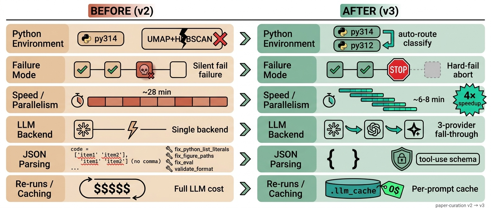
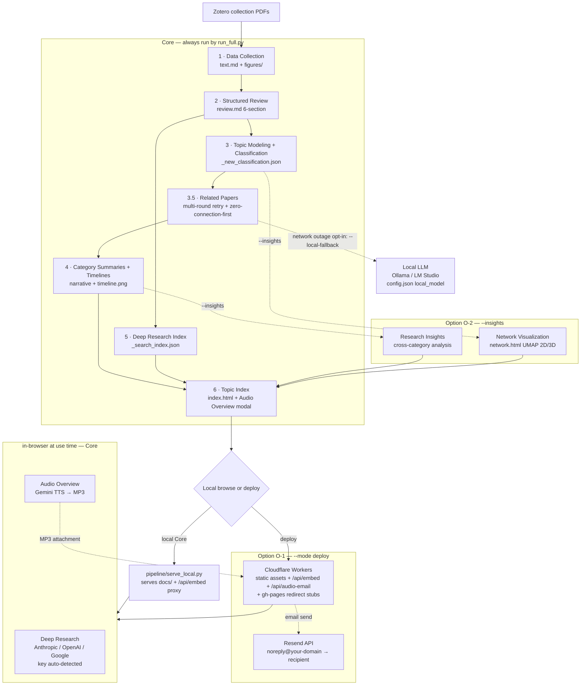

# Paper Curation

**Zotero에 논문 PDF만 모아두었다면, 나머지는 자동입니다.**

논문 수백 편을 한국어 구조화 리뷰로 변환하고, AI가 자동 분류하고, 자연어로 질문하면 논문을 근거로 답변하는 **개인 연구 지식 시스템**을 만듭니다. 로컬에서 동작하며 배포는 선택입니다.

<a href="#english">English</a>

---

## 이런 걸 할 수 있습니다

기능은 **Core**(기본 파이프라인이 항상 생성)와 **Option**(원할 때만 켜는 기능)으로 나뉩니다.

**Core** — `run_full --mode curate` 한 줄이면 전부 생성:

| 기능 | 설명 |
|------|------|
| **구조화 리뷰** | PDF에서 텍스트/Figure를 추출하고, Claude가 Essence-Motivation-Achievement-How-Originality-Evaluation 6개 섹션의 한국어 리뷰를 자동 작성 |
| **자동 분류** | Bottom-up 토픽 모델링(SPECTER2 + HDBSCAN + UMAP)으로 카테고리를 자동 생성하고 논문을 분류 |
| **같이 보면 좋은 논문** | 임베딩 top-20 후보를 Claude Sonnet이 선별 — 논문마다 관련 논문 + 관계 유형(alternative/extension/…) + 한국어 이유 1문장. 망 장애 시 multi-round 재시도 + 연결 없는 논문 우선 처리로 강건 |
| **Deep Research (멀티 백엔드)** | 자연어 질의 + 임베딩 검색 + LLM 답변. 키 prefix 자동 감지로 **Anthropic(Haiku/Sonnet) · OpenAI(GPT-4.1/GPT-5.5) · Google(Gemini Flash-Lite/Flash) 중 하나**를 자동 사용. 자연어 본문 + 클릭 가능한 `[N]` 인용 |
| **Audio Overview** | 리뷰 또는 Deep Research 답변을 **2-3인 팟캐스트형 한국어 오디오 (Gemini TTS)** 로 생성. 페이지에서 직접 → 브라우저 안에서 MP3 인코딩 → 다운로드 + (배포 시) **이메일 발송 자동 첨부** |
| **타임라인 시각화** | 카테고리별 연구 동향 내러티브 + 다이어그램 자동 생성 (PaperBanana) |
| **지식 축적** | Obsidian 연동으로 메모가 다음 질의에 반영되는 compounding knowledge |
| **논문 검색/등록** | arXiv, Semantic Scholar, OpenAlex 병렬 검색 + Zotero 자동 등록 (선택) |

**Option** — 플래그/모드로 켤 때만:

| 기능 | 켜는 법 | 설명 |
|------|---------|------|
| **콘텐츠 배포 (O-1)** | `--mode deploy` | Cloudflare Workers(정적 자산 + `/api/embed` + `/api/audio-email`) + gh-pages 리다이렉트 스텁. 배포해야 Audio Overview 이메일 발송이 활성화 |
| **Research Insights + 네트워크 (O-2)** | `--insights` | 크로스카테고리 인사이트 분석 + UMAP 2D/3D 인터랙티브 네트워크(카테고리 필터, Ego Network, Hub/Bridge) 재생성 |
| **로컬 LLM fallback** | `--local-fallback` | "같이 보면 좋은 논문" 생성이 망 장애로 끝까지 막히면 로컬 모델(Ollama/LM Studio 등)로 잔여분을 완결. config.json `local_model` 블록 필요 |
| **워크플로 다이어그램** | `generate_workflow.py` | 이 README 상단의 파이프라인 다이어그램 생성 (PaperBanana, `--style cat/fairy/academic`) |

**필요한 것**: Zotero 컬렉션 + PDF + API 키 (필수: Anthropic · Google · Zotero Web API). 검색 임베딩은 Google `gemini-embedding-001` 을 쓰므로 별도 OpenAI 키는 필요 없습니다 (OpenAI 는 답변 BYOK·insights fallback 용 선택).

---

## 설치: 명령어 한 줄

[Claude Code](https://claude.ai/code)에서 아래 한 줄이면 클론, 의존성 설치, Zotero 연결, 첫 파이프라인 실행까지 자동으로 완료됩니다:

> *"여기에 paper-curation을 설치해줘: https://github.com/jehyunlee/paper-curation"*

### Quickstart — 로컬에서 5단계로 시작

직접 손으로 설치하고 싶다면, 아래 다섯 단계가 로컬에서 돌려보는 최소 경로입니다. (자세한 사전 준비·문제 해결은 바로 아래 섹션 참고.)

```bash
# 1) 클론
git clone https://github.com/jehyunlee/paper-curation.git
cd paper-curation

# 2) conda env 하나 생성 (py312 = 표준 단일 env)
conda create -n py312 -c conda-forge python=3.12 pip -y
conda activate py312

# 3) 의존성 설치 (umap-learn · hdbscan · sentence-transformers 포함)
pip install -r requirements.txt
#    오케스트레이터는 현재 인터프리터로 umap/hdbscan import 가 되면 토픽 모델링/분류를
#    별도 서브프로세스 없이 in-process 로 실행합니다. (레거시 py314+py312 듀얼 구성도
#    동일 probe 로 계속 동작 — "사전 준비" 의 접힌 노트 참고.)

# 4) 필수 API 키 (리뷰=Anthropic, 검색 임베딩·Figure 검증·TTS=Google).
#    검색 임베딩은 Google gemini-embedding-001 이라 OpenAI 키는 선택입니다 (답변 BYOK·insights fallback).
export ANTHROPIC_API_KEY=sk-ant-...
export GOOGLE_API_KEY=...

# 5) config.json 생성(대화형) → 첫 파이프라인 실행
python pipeline/setup.py
#    이미 Zotero 에 PDF 가 있다면 곧바로:
PYTHONUTF8=1 python pipeline/run_full.py --topic my_topic --mode curate --source zotero
cd docs && python -m http.server 8000   # → http://localhost:8000 에서 열람
```

<details>
<summary><b>수동 설치 (setup.py 위주)</b></summary>

```bash
git clone https://github.com/jehyunlee/paper-curation.git
cd paper-curation
pip install -r requirements.txt   # 전체 의존성 (anthropic·openai·umap-learn·hdbscan·sentence-transformers 등)
python pipeline/setup.py
```

`setup.py`가 대화형으로 config.json 생성, Zotero 연결 테스트, API 키 확인, 첫 파이프라인 실행을 안내합니다.

</details>

### 사전 준비

체크리스트 — 아래 항목이 준비되면 첫 실행이 막히지 않습니다:

| 항목 | 내용 |
|------|------|
| **Zotero** | [API Key 발급](https://www.zotero.org/settings/keys) + 큐레이션할 컬렉션에 논문 PDF 준비 |
| **API 키** | `ANTHROPIC_API_KEY` (리뷰·인사이트 — **필수**), `GOOGLE_API_KEY` (검색 임베딩 `gemini-embedding-001`·Figure 검증·TTS — **필수**), `RESEND_API_KEY` (배포 시 Audio Overview 이메일 — 배포 필수), `OPENAI_API_KEY` (답변 BYOK·insights fallback — 선택) |
| **conda env** | `py312` 단일 env (표준) — 아래 명령으로 생성. 레거시 py314+py312 듀얼도 동일 probe 로 동작 |
| **Java Runtime** | `opendataloader-pdf` 의 PDF 추출용. macOS: `brew install --cask temurin`. 없으면 PyMuPDF 로 fallback (표·구조 품질 ↓) |

**conda env 생성 (표준: 단일 py312)** — Quickstart 의 2~3단계와 동일합니다:

```bash
conda create -n py312 -c conda-forge python=3.12 pip -y
conda activate py312
pip install -r requirements.txt
```

`requirements.txt` 가 umap-learn / hdbscan / sentence-transformers 를 포함하므로, 오케스트레이터는 현재 인터프리터로 클러스터링 라이브러리 import 가 성공하면 토픽 모델링/분류를 **별도 서브프로세스 없이 in-process** 로 실행합니다. Python 3.12 는 numba 의 `CALL_KW` 비호환 문제가 없으므로 단일 env 로 충분합니다.

<details>
<summary><b>레거시: py314 + py312 듀얼 env (선택)</b></summary>

메인을 Python 3.14 (`py314`) 로 쓰고 싶다면 numba 의 bytecode interpreter 가 3.14 의 `CALL_KW` opcode 를 아직 처리하지 못해 `topic_modeling.py` / `classify_papers.py` 의 `umap_cluster.transform()` → `sklearn.pairwise_distances(metric=callable)` 경로가 죽습니다 (0.65.1 / 0.66.0rc1 / main 모두 동일). 이때 형제 `py312` env 를 따로 만들면, `run_update_force._resolve_topic_modeling_python()` 가 **동일한 probe** (현재 인터프리터로 umap import 실패 시) 로 형제 `py312/bin/python` 를 자동으로 잡아 클러스터링 두 스크립트만 그쪽으로 보냅니다 (우선순위: `PAPER_CURATION_PY312` env var → 형제 env `<base>/envs/py312` → `which python3.12` → `sys.executable` fallback). 두 env 모두 numba 0.65 / llvmlite 0.47 / numpy 2.x 동일 라인업입니다.

```bash
conda create -n py314 -c conda-forge python=3.14 pip -y
conda create -n py312 -c conda-forge python=3.12 pip -y
conda run -n py314 pip install -r requirements.txt
conda run -n py312 pip install umap-learn hdbscan sentence-transformers \
    joblib numpy scikit-learn anthropic openai
conda activate py314
```

</details>

### 설치 확인 (verify)

긴 파이프라인을 돌리기 전에, 한 줄로 의존성이 제대로 깔렸는지 확인하세요:

```bash
python -c "import umap, hdbscan, sentence_transformers, fitz, sklearn, anthropic; print('py312 OK')"
```

`OK` 가 찍히면 준비 완료입니다. 실행 계획만 먼저 보려면 `--dry-run` 도 가능합니다:

```bash
PYTHONUTF8=1 python pipeline/run_full.py --topic my_topic --mode curate --source zotero --dry-run
```

### 문제 해결 (Troubleshooting)

| 증상 / 에러 메시지 | 원인 | 해결 |
|---|---|---|
| `op_CALL_KW: pop from empty list` (numba 트레이스백) | 분류가 Python 3.14 인터프리터에서 실행됨 | 표준 단일 `py312` env 로 실행하거나, py314 메인을 쓰면 형제 `py312` env 를 만들어 라우팅 — 위 "conda env 생성" 의 레거시 노트 참고. 형제 위치가 아니면 `PAPER_CURATION_PY312` 로 경로 지정 |
| `ModuleNotFoundError: umap` / `hdbscan` / `sentence_transformers` | 의존성 누락 | env 활성화 후 `pip install -r requirements.txt` (umap-learn·hdbscan·sentence-transformers 포함) |
| Figure 품질이 낮음 / 표·구조가 깨짐 | Java 미설치로 PyMuPDF fallback | `brew install --cask temurin` (macOS) 후 재실행 |
| SPECTER2 / arXiv 다운로드가 멈춤 (한국 망) | huggingface LFS·arXiv 차단 | 아래 "한국 망 환경 우회" 의 S3 미러 명령 사용 |
| `[COLLECTION_ERROR]` | Zotero 컬렉션 이름 오타 | 출력의 사용 가능한 컬렉션 목록에서 올바른 이름 선택 후 재실행 |
| 검색 인덱스가 빈 임베딩으로 빌드됨 | `GOOGLE_API_KEY` 미설정 | `export GOOGLE_API_KEY=...` 후 재실행 — 검색 임베딩은 Google `gemini-embedding-001` 사용 (OpenAI 키는 더 이상 필수 아님) |

---

## 워크플로우


### 1. 데이터 수집

| | 설명 |
|---|---|
| **입력** | <ul><li>Zotero 컬렉션의 PDF</li><li>선택: arXiv / Semantic Scholar / OpenAlex 병렬 검색 + Zotero 자동 등록</li></ul> |
| **처리** | <ul><li>PyMuPDF로 텍스트 추출</li><li>Figure 렌더링 (3× zoom, 최대 5장)</li><li>Gemini가 Figure 품질 검증</li></ul> |
| **출력** | <ul><li><code>papers/{slug}/text.md</code></li><li><code>papers/{slug}/figures/*.webp</code></li></ul> |

### 2. 구조화 리뷰

| | 설명 |
|---|---|
| **입력** | 추출된 텍스트 + Figure |
| **처리** | <ul><li>Claude Haiku가 한국어 리뷰 6개 섹션 작성 (Essence · Motivation · Achievement · How · Originality · Evaluation)</li><li>기술 용어는 원문 그대로 유지</li><li>병렬 4건 동시 처리</li></ul> |
| **출력** | <ul><li><code>papers/{slug}/review.md</code></li><li><code>papers/{slug}/index.html</code></li></ul> |
| **활용** | 브라우저에서 리뷰 열람, Figure 인라인 표시, Related Papers 자동 연결 |

### 3. 토픽 모델링 + 분류

| | 설명 |
|---|---|
| **입력** | 전체 리뷰의 Essence + Title |
| **처리** | Bottom-up, LLM 호출 최소화:<ul><li>SPECTER2 임베딩 (proximity adapter + CLS pooling) → HDBSCAN fine-grained 클러스터링</li><li>c-TF-IDF 키워드 추출 (BERTopic 표준 — 클러스터 단위 구별성) → Claude Sonnet이 클러스터 작명</li><li>Ward linkage로 카테고리 그룹핑</li><li>논문당 1~3개 카테고리 복수 분류 (Node-based Hybrid C: KNN-vote primary + qualified-vote multi)</li></ul> |
| **출력** | <ul><li><code>_new_classification.json</code></li><li><code>_papers_index.json</code></li></ul> |

### 4. 인사이트 + 타임라인

| | 설명 |
|---|---|
| **입력** | 카테고리별 논문 목록 + 리뷰 |
| **처리 (Core)** | <ul><li>Claude Sonnet이 카테고리 요약·세부 주제 작성</li><li>**같이 보면 좋은 논문**: 임베딩 top-20 후보 → Sonnet이 관계 유형 + 한국어 이유 선별. 망 장애에 강건 — multi-round 재시도(막힌 배치만), 연결 0개 논문 우선 처리(priority-first), 그래도 남으면 `--local-fallback`(Option)으로 로컬 모델이 완결</li><li>Claude Opus가 카테고리별 연구 동향 내러티브 작성</li><li>PaperBanana가 타임라인 다이어그램 자동 생성</li></ul> |
| **처리 (Option O-2, `--insights`)** | <ul><li>크로스카테고리 Research Insights 분석 (Anthropic → OpenAI → Gemini 3-backend fallback)</li><li>네트워크 시각화(<code>network.html</code>) 재생성</li></ul> |
| **출력** | <ul><li><code>_category_summaries.json</code></li><li><code>_paper_connections.json</code></li><li><code>_timeline_narrative.json</code></li><li><code>category_timeline_*.png</code></li><li>(O-2) <code>_insights.json</code> + <code>network.html</code></li></ul> |

### 5. Deep Research 인덱스

| | 설명 |
|---|---|
| **입력** | 전체 리뷰 + 개인 메모(<code>notes/</code>) |
| **처리** | <ul><li>Section-aware chunking</li><li>Google <code>gemini-embedding-001</code> 임베딩 (768d, <code>task_type=RETRIEVAL_DOCUMENT</code>, L2 정규화 후 int8 양자화)</li><li>BM25 sparse 텀도 함께 인덱싱 (hybrid 검색용)</li><li>개인 메모도 인덱싱되어 다음 질의에 반영</li></ul> |
| **출력** | <code>_search_index.json</code> |
| **활용** | 토픽 페이지에서 자연어 질의 → 질의 임베딩은 worker <code>/api/embed</code> (배포) 또는 <code>pipeline/serve_local.py</code> (로컬) 가 <code>gemini-embedding-001</code> (<code>task_type=RETRIEVAL_QUERY</code>) 로 대신 계산 → **hybrid 검색** (BM25 + dense, RRF 융합) → LLM 이 상위 후보를 한 문장씩 re-rank → 사용자 키 prefix 자동 감지로 **Anthropic / OpenAI / Google 중 하나**가 논문 근거 답변 스트리밍. 검색에는 독자 키가 전혀 필요 없고, 키(BYOK)는 답변 생성에만 쓰입니다. 응답은 자연어 본문 + 클릭 가능 `[N]` 인용 + 자동 figure 인라인. Fast/Smart 토글 라벨은 감지된 백엔드의 실제 모델명을 표시 (예: `Fast (cost: Haiku 4.5)`) |

### 6. 인덱스 + 네트워크

| | 설명 |
|---|---|
| **입력** | 전체 분류 + 리뷰 + 타임라인 + UMAP 좌표 |
| **처리** | <ul><li>(Core) 카테고리 카드·검색·타임라인·Deep Research UI·Audio Overview 모달을 하나의 HTML로 조립</li><li>(Option O-2, `--insights`) UMAP 2D/3D 좌표로 D3.js + Three.js 인터랙티브 네트워크 재생성</li></ul> |
| **출력** | <ul><li><code>{topic}/index.html</code></li><li>(O-2) <code>{topic}/network.html</code></li></ul> |
| **활용** | <code>cd docs && python -m http.server 8000</code> → 브라우저에서 바로 사용. 개별 논문 페이지 / Deep Research 답변 양쪽에서 🎧 **Audio Overview** 버튼으로 팟캐스트형 한국어 오디오 생성 (Gemini TTS, 브라우저 안에서 MP3 인코딩 → 즉시 다운로드). 배포 환경에선 완성된 MP3 가 이메일로도 자동 발송됨 |

### 배포 (Option O-1)

로컬 사용이 기본(Core)입니다. 외부 공유가 필요하면 **3-계층 split-host** 구조로 자동 배포됩니다:

| 계층 | 역할 | 내용 |
|------|------|------|
| **Cloudflare Workers (Static Assets + Function)** | 사용자 콘텐츠 서빙 + `/api/audio-email` 라우트 | `docs/` 전체 업로드 (`docs/.assetsignore`로 로컬 전용 토픽 제외) + `worker/index.js` (Audio Overview 이메일 발송 핸들러) |
| **GitHub `gh-pages` 브랜치** | 진입 URL → Cloudflare 리다이렉트 | 토픽별 리다이렉트 스텁 (1KB 미만), `jehyunlee.github.io/paper-curation/{topic}/` → 운영자가 설정한 Cloudflare URL |
| **GitHub `master` 브랜치** | 코드·설정·README | 대용량 `docs/papers/`, `docs/{topic}/` 콘텐츠는 `.gitignore`로 제외 |

```bash
# 배포 (환경변수 필요: CF_API_TOKEN + CLOUDFLARE_ACCOUNT_ID)
PYTHONUTF8=1 python pipeline/run_full.py --topic my_topic --mode deploy
```

자동 처리:
- PNG → WebP 변환 (용량 ~60% 절감)
- 배포용 HTML에서 API 키·로컬 이메일 제거 후 로컬 working tree 자동 복원
- `npx wrangler deploy` → Cloudflare 업로드 (해시 기반 증분 업로드) + Worker 함수 동시 배포
- gh-pages 리다이렉트 스텁 idempotent 동기화 (새 토픽 자동 감지, 변경 없으면 푸시 스킵)
- Cloudflare 200 OK 검증 (최대 5분 폴링)
- master에는 **코드·설정 변경만** commit + push (대용량 콘텐츠는 `.gitignore`)

환경변수 발급: Cloudflare Dashboard → My Profile → API Tokens → "Edit Cloudflare Workers" 템플릿.
```cmd
setx CF_API_TOKEN "..."
setx CLOUDFLARE_ACCOUNT_ID "..."
```

**Custom domain (권장)** — `wrangler.toml` 의 `[[routes]]` 블록에 `pattern = "your-subdomain.your-domain.tld"` + `custom_domain = true` + `zone_name = "your-domain.tld"` 를 박으면 `wrangler deploy` 가 Cloudflare DNS · SSL · 라우팅까지 자동 설정합니다. 동시에 `prepare_deploy.py` 의 `CF_BASE_URL` 도 같은 값으로 갱신해야 gh-pages 스텁이 새 도메인을 가리킵니다. workers.dev 기본 도메인으로도 동작은 하지만 메일 도메인 일관성을 위해 custom domain 권장.

**Cloudflare Worker secrets (이메일 + 질의 임베딩)** — `worker/index.js` 가 두 라우트를 노출합니다: `/api/audio-email` ([Resend](https://resend.com) API 로 MP3 첨부 메일 발송) + `/api/embed` (`gemini-embedding-001` 질의 임베딩 프록시 — 독자가 키 없이 검색하도록). `wrangler secret put` 으로 등록:

```bash
npx wrangler secret put GOOGLE_API_KEY    # /api/embed 질의 임베딩 프록시용 (gemini-embedding-001, 필수)
npx wrangler secret put RESEND_API_KEY    # Resend 대시보드의 re_xxx 키 (이메일 발송 필수)
npx wrangler secret put AUDIO_FROM        # 예: "Paper Curation <noreply@your-domain.tld>" (도메인 verify 필요)
npx wrangler secret put AUDIO_REPLY_TO    # 답장이 갈 운영자 메일, 예: "you@gmail.com" (선택)
```

- `GOOGLE_API_KEY` 가 없으면 `/api/embed` 가 실패해 Deep Research 검색이 동작하지 않습니다 (배포 시 필수). 로컬에서는 `pipeline/serve_local.py` 가 같은 역할을 합니다.
- `RESEND_API_KEY` 가 비어 있으면 `/api/audio-email` 이 503 을 반환하고, 클라이언트는 다운로드만으로 fallback 합니다.
- `AUDIO_FROM` 의 도메인은 Resend 에서 SPF/DKIM/DMARC TXT 3개를 등록해 verify 해두어야 임의 수신자에게 발송할 수 있습니다 (verify 전엔 Resend 계정 메일 1명만 가능).
- 로컬 빌드 시 운영자 본인 메일을 미리 박아두려면 `config.json` 에 `"local_emails": ["a@b.com", ...]` 또는 환경변수 `PAPER_CURATION_LOCAL_EMAILS="a@b.com,c@d.com"`. 배포 시 자동 strip 됩니다.

---

## 사용 모드 — 단일 오케스트레이터 `run_full.py`

3축(`--mode` / `--source` / `--images`)으로 SKILL.md의 구 Recipe A~H를 한 줄로 통합. `--source web`이면 검색·등록·sync까지 자동 체인.

```bash
# 주간 운영 — 검색 → Zotero 등록 → sync → 신규만 리뷰
PYTHONUTF8=1 python pipeline/run_full.py --topic my_topic --mode curate --source web --days 7

# 로컬 업데이트 — 검색 스킵, sync만 후 신규 리뷰
PYTHONUTF8=1 python pipeline/run_full.py --topic my_topic --mode curate --source zotero

# 특정 슬러그만 재리뷰 (감사·복구 시)
PYTHONUTF8=1 python pipeline/run_full.py --topic my_topic --mode rebuild --slugs 088,1093 --strict-pdf

# 분류만 재실행 (HDBSCAN approximate_predict + centroid fallback, LLM 호출 없음 — py312 자동 라우팅)
PYTHONUTF8=1 python pipeline/run_full.py --topic my_topic --mode reclassify

# 크로스카테고리 Research Insights 까지 생성 (opt-in — 기본 curate 는 paper-connections 만 생성)
PYTHONUTF8=1 python pipeline/run_full.py --topic my_topic --mode curate --source zotero --insights

# 타임라인 narrative + 이미지 재생성
PYTHONUTF8=1 python pipeline/run_full.py --topic my_topic --mode retime --images all

# 배포만
PYTHONUTF8=1 python pipeline/run_full.py --topic my_topic --mode deploy

# 실행 계획 미리보기
PYTHONUTF8=1 python pipeline/run_full.py --topic my_topic --mode curate --source web --dry-run

# 로컬 서버
cd docs && python -m http.server 8000
```

`--mode` 의미:
- **curate** — 신규 논문만 리뷰, 기존 유지 (가장 자주 사용)
- **rebuild** — 전체 review.md 재생성. `--yes` 또는 `--slugs`와 조합해서만 실행
- **reclassify** — review.md 유지, 카테고리만 재배정 (node-based)
- **retime** — narrative + 타임라인 이미지 재생성
- **deploy** — `prepare_deploy.py`만 실행

`--source` 매핑:
- **web** → `search_papers + register_zotero + sync_zotero + run_update_force`
- **zotero** → `sync_zotero + run_update_force`

명시 override: `--with-search` / `--no-search` / `--with-register` / `--no-register` / `--with-sync` / `--no-sync`

주요 안전 플래그:
- `--strict-pdf`: fuzzy PDF 매칭 차단 — ID(Zotero/DOI/arXiv) 매칭 안 되면 skip
- `--slugs A,B,C`: 특정 슬러그만 처리
- `--dry-run`: 실행 계획만 출력
- `--skip-dedup`: Zotero dedup preflight 스킵
- `--dedup-execute`: preflight가 실제 삭제까지 수행 (기본은 dry-run 리포트)
- `--insights`: 크로스카테고리 Research Insights 생성 opt-in (기본 Core 는 paper-connections 만)
- `--yes`: rebuild 모드 확인 게이트 우회

### Concurrency 가이드 — Anthropic Tier 기준

리뷰 단계의 `--concurrency N` 은 paper 단위 ThreadPoolExecutor 워커 수. 작업은 I/O bound (Anthropic + Gemini API) 라 하드웨어보다 **Anthropic 레이트 리밋(RPM / ITPM)** 이 천장. paper 당 input ~30~50K tokens / output ~5~10K tokens / 약 60초 소요 가정:

| Tier | Sonnet RPM (approx) | ITPM (approx) | 권장 `--concurrency` | 비고 |
|------|---------------------|---------------|----------------------|------|
| Free / 1 | 50 | 30K | **2~4** | ITPM 이 먼저 막힘. 보수적으로 |
| 2 | 1,000 | 80K | **6~8** | 안전권 |
| 3 | 2,000 | 200K | **10~12** | 429 거의 없음 |
| **4** | **4,000** | **400K+** | **16~20 (default 16)** | 새 default. 더 올리면 ITPM 한계 근처 |

기본값 `--concurrency 16` 은 **Tier 4 기준**. Tier 1~3 사용자는 명시적으로 `--concurrency 4` (또는 위 표 값) 으로 낮추세요 — 429 발생 시 자동 재시도되지만 체크포인트 재개 오버헤드가 누적됩니다.

```bash
# Tier 1 (가장 보수적)
PYTHONUTF8=1 python pipeline/run_full.py --topic my_topic --mode curate --source web --concurrency 4
# Tier 4 (기본값과 동일, 생략 가능)
PYTHONUTF8=1 python pipeline/run_full.py --topic my_topic --mode curate --source web --concurrency 16
```

하드웨어는 사실상 천장이 아님 — M-series Mac 18코어/64GB+ 정도면 워커 30개도 메모리 여유 충분 (워커당 ~수백 MB). 진짜 한계는 위 표의 ITPM.

`run_update_force.py`는 `run_full.py`의 review + post-processing 단계로 호출됩니다 — legacy 진입점으로 직접 호출도 가능.

### 한국 망 환경 우회 — SPECTER2 / arXiv

한국 ISP 에서 종종 다음 두 가지가 막힙니다 (다른 국가에선 보통 무문제):

**1. `huggingface.co` LFS 다운로드 차단** — `topic_modeling.py` 가 SPECTER2 임베딩 모델을 받아오지 못함. AWS S3 미러에서 한 번 받아 `<project_root>/.cache/base/` 에 두면 `topic_modeling.py` 가 자동 인식 (HF Hub 호출 우회):

```bash
mkdir -p .cache && cd .cache
curl -L -o specter2_0.tar.gz "https://ai2-s2-research-public.s3.amazonaws.com/specter2_0/specter2_0.tar.gz"
tar -xzf specter2_0.tar.gz   # base/ 와 adapters/ 가 풀림
cd ..
```

확인:
```bash
PYTHONUTF8=1 python -c "from pipeline.topic_modeling import SPECTER2_MODEL; print(SPECTER2_MODEL)"
# /Users/.../paper-curation/.cache/base 가 찍히면 OK
```

**2. arXiv API chronic 429/timeout** — `export.arxiv.org` 가 첫 요청에 응답 못 주면 그 IP 를 한동안 throttle. User-Agent 명시도 도움이 안 될 때가 있음. 그 경우 `--skip-arxiv` 로 arXiv 건너뛰고 OpenAlex + Semantic Scholar 만으로 검색 (윈도우당 ~8분 절약):

```bash
PYTHONUTF8=1 python pipeline/search_papers.py --topic scisci --since 2026-04-01 --until 2026-04-10 --skip-arxiv
```

OpenAlex(1k+건/키워드) 가 압도적으로 큰 소스라 arXiv 누락이 결과 품질에 큰 영향 주지 않습니다.

**3. 한국망↔Anthropic stale-connection** — "같이 보면 좋은 논문" 생성(Sonnet 배치 호출)이 half-open 소켓으로 끝까지 막히는 날이 있습니다. 기본 방어는 자동입니다 (multi-round 재시도 + 연결 0개 논문 우선 처리 + 미완분은 기존 연결 유지 후 다음 사이클에 자동 보강). 로컬 모델이 있다면 `--local-fallback` 으로 망과 무관하게 그 자리에서 완결할 수 있습니다:

```bash
# config.json 에 local_model 블록 추가 (Ollama 예시 — 실측: EXAONE-4.0-32B, 8편 배치당 ~32초)
#   "local_model": {
#     "base_url": "http://localhost:11434/v1",
#     "model": "exaone-4.0:latest",
#     "num_ctx": 8192, "retries": 2, "batch_size": 8
#   }
PYTHONUTF8=1 python pipeline/run_full.py --topic ai4s --mode curate --source zotero --local-fallback
```

Ollama 는 자동 감지되어 네이티브 API(요청 단위 `num_ctx`, `think:false`)로 전송되고, LM Studio/llama.cpp/vLLM 은 OpenAI 호환 경로를 씁니다. 엔드포인트가 죽어 있으면 조용히 건너뛰므로 파이프라인은 절대 막히지 않습니다.

---

## v2 → v3 한눈에 보기



6개 paired row: Python env (단일 → py314+py312 자동 라우팅) · Failure mode (silent → hard-fail) · LLM 단계 wall-clock (~28분 → ~6-8분, 4×) · Insights backend (Anthropic 단일 → A→O→G fall-through) · JSON 파싱 (markdown + 4 fixer → tool-use schema) · Re-runs (full LLM cost → `.llm_cache` 0$). 도식 자체는 PaperBanana (gemini-3.1-pro-preview, demo_planner_critic, 3 critic rounds) 로 생성.

---

<details>
<summary><h2 id="advanced-internals">고급 / 내부 구조 (펼치기)</h2></summary>

> 아래는 유지보수·심화용 레퍼런스입니다. 처음 사용에는 필요 없습니다.

## Reliability (v2+)

최근 리팩터링으로 추가된 안전장치:

| 장치 | 설명 |
|------|------|
| `run_full.py` 오케스트레이터 | 3축(`--mode/--source/--images`) 단일 진입점. 검색·등록·sync·리뷰·후처리·배포 자동 체인. dry-run plan 출력 |
| `find_pdf()` ID-first | Zotero attachment → DOI → arXiv → fuzzy(강화) 순서. 과거 fuzzy 오매칭 근본 원인 제거 |
| `--strict-pdf` | fuzzy 완전 차단 모드. 신규/복구 리뷰에 권장 |
| `classify_papers.py` (Phase 3) | SPECTER2 임베딩 → UMAP transform 5D → `hdbscan.approximate_predict` (density-faithful primary sub-cluster) → outlier(-1) 는 768D centroid 코사인 최단점으로 강제 배정 → `all_categories` = centroid 거리 top-N parent. LLM 호출 0. `py312` 자동 라우팅 필요 (위 Python 환경 참고). |
| `_resolve_topic_modeling_python()` | `topic_modeling.py` / `classify_papers.py` 만 `py312` 인터프리터로 라우팅. `PAPER_CURATION_PY312` env var 로 절대 경로 override 가능. 현재 인터프리터의 conda prefix 에서 형제 env 자동 발견 |
| `find_pdf()` cross-platform basename | Zotero linked attachment 이 Windows 절대경로 (`C:\Users\…\foo.pdf`) 로 저장된 경우 macOS `os.path.basename` 이 백슬래시를 분리자로 인식 못해 매칭 실패하던 버그. `path.replace("\\", "/").rsplit("/", 1)[-1]` 로 해결 |
| `make_slug()` 40-char collision fix | 25-char prefix matching 이 다른 논문을 거짓 매칭하던 버그 (예: "A Hierarchical Framework for Humanoid Locomotion" ↔ "A hierarchical framework for measuring scientific impact"). 비교 길이를 `min(40, min(len(a), len(b)))` 로 변경, 10-char floor 추가. 짧은 제목의 자기-자신 매칭 (예: "Robot Learning from Human Videos: A Survey", 35 norm chars) 보존 |
| `_zotero_text_sanity()` 한국어/ASCII 듀얼 패스 | Zotero 에 한국어 제목으로 등록된 영문 PDF 케이스 통과. 한글 syllable 을 keyword 추출 정규식에 포함, threshold 스케일링 (구 `max(3, …)` → `max(1, len(kw)*coverage)`), ASCII-only fallback (영문 token 만 일치해도 DOI/author 통과하면 OK) |
| `extract_insights` 3-backend fallback | cross-category insights 호출에 Anthropic → OpenAI → Gemini chain. `EXTRACT_INSIGHTS_CC_BACKENDS` env var 로 순서 override. ReadTimeout/connection 에러 시 다음 backend 자동 시도. 각 backend 는 동일한 tool-use / structured output schema 로 강제 |
| `run_step()` CRITICAL_STEPS hard-fail | `build_papers_index` / `topic_modeling*` / `classify_papers` 는 실패 시 `RuntimeError` 로 abort. 신규 분류 누락된 채로 나머지 단계가 stale 분류로 silent 진행되던 문제 해결. 그 외 LLM narrative/이미지/검색 인덱스는 degradable 로 soft-fail 유지 |
| `audit_matching.py` | 동일 text.md 해시 공유 슬러그 탐지 (duplicate PDF) + 4축 cross-check |
| `fix_matching.py` | 감사 결과 기반 리뷰 삭제 + 재리뷰 명령 자동 출력 (기본 dry-run) |
| `dedup_zotero.py` | Zotero 컬렉션 중복 탐지/삭제 (제목 60자 + DOI + arXiv + PDF 공유). `run_update_force` preflight 자동 통합 |
| `validate_papers.py --strict` | 카테고리↔timeline 이미지 매치, duplicate text.md 탐지. 배포 게이트 |
| `cleanup.py` | stale 카테고리 timeline/캐시 삭제 + narrative JSON 내 stale 엔트리 pruning. 후처리 단계에 자동 통합 |
| `prepare_deploy.py` | split-host 배포 자동화: `wrangler deploy` → Cloudflare, gh-pages 리다이렉트 스텁 idempotent 동기화, Cloudflare 200 OK 폴링, master에 코드 변경만 push. API 키 메모리 제거 후 로컬 원복 |
| 21600s timeout | `generate_timelines` 후처리 호출 타임아웃 1h → 6h (PaperBanana 다중 카테고리 완주) |

**오매칭 감사·복구 워크플로우**:
```bash
PYTHONUTF8=1 python pipeline/audit_matching.py --topic my_topic          # 1. 탐지
PYTHONUTF8=1 python pipeline/fix_matching.py --topic my_topic            # 2. dry-run
PYTHONUTF8=1 python pipeline/fix_matching.py --topic my_topic --execute  # 3. 삭제
# 4. fix_matching이 출력한 run_update_force --slugs ... --strict-pdf 실행
PYTHONUTF8=1 python pipeline/audit_matching.py --topic my_topic          # 5. 검증
```

---

## Internal architecture (post-refactor)

파이프라인을 외부 코드에서 부분 호출하거나, 성능을 튜닝하려는 사용자를 위한 내부 구조 노트.

### 1. 프로그래매틱 API — `pipeline/api/`

19 개 CLI 스크립트의 핵심 로직이 `pipeline/api/__init__.py` 에 함수 facade 로 노출됩니다 (총 25 개 public 함수). subprocess 오버헤드 없이 다른 코드/워크플로에서 직접 호출 가능:

```python
from pipeline.api import (
    search, register, sync, dedup_zotero,                        # ingest
    curate,                                                       # full batch
    build_papers_index, topic_model, classify,                   # index + classify
    category_summary, insights, timeline,                        # narrative (LLM)
    network, search_index, topic_index, review_to_html, deploy,  # render + publish
    validate, audit_matching, fix_matching, cleanup,             # safety
)

# 헬퍼
from pipeline.api._llm import cached_call, paper_cache_dir, topic_cache_dir
from pipeline.api.extract import pre_validate_figure
```

각 함수는 thin CLI wrapper 와 같은 `_run_X(**kwargs)` 본체를 공유하므로 CLI 와 API 가 100% 같은 동작을 합니다.

### 2. LLM 호출 캐싱 — `api/_llm.cached_call`

`(prompt, model, schema_version)` 의 SHA-256 해시를 키로 결과를 JSON 으로 저장합니다. 캐시 디렉토리:

- 카테고리/토픽 단위: `docs/{topic}/.llm_cache/{hash}.json`
- 논문 단위 (`write_review`): `docs/papers/{slug}/.llm_cache/{hash}.json`

미변경 입력 재실행 시 LLM 호출 0회. `force=True` 로 우회 가능.

### 3. 카테고리 단위 ThreadPool 병렬화

LLM I/O bound 단계는 카테고리 단위로 병렬화돼 wall-clock 이 약 4× 단축됩니다. env var 로 worker 수 조정:

| 단계 | env var | 기본 worker | 모델 |
|---|---|---|---|
| `build_category_summaries` (카테고리 한글 description + sub-themes) | `CAT_SUMMARY_PARALLEL` | 8 | Haiku |
| `generate_timelines` STEP 1 narrative | `TIMELINE_NARRATIVE_PARALLEL` | 8 | Opus streaming |
| `generate_timelines` STEP 2 PaperBanana 이미지 | `TIMELINE_IMAGE_PARALLEL` | 4 | Gemini image |
| `extract_insights` per-category paper_connections | `EXTRACT_INSIGHTS_PARALLEL` | 4 | Sonnet |

Tier 1~3 에서는 worker 수를 낮춰 ITPM cap 을 피해야 합니다.

### 4. Tool-use schema 강제 — Anthropic structured output

LLM 응답의 JSON 파싱 흔들림을 0 으로 만들기 위해 Anthropic tool-use schema 를 강제합니다. SDK 가 schema mismatch 시 자동 재시도하므로 post-hoc fixer (구 `fix_python_list_literals` / `fix_figure_paths` / `fix_evaluation_format`) 가 모두 폐기됐습니다.

| 호출처 | tool 이름 | 모델 |
|---|---|---|
| `write_review` (논문 1편 리뷰 JSON) | `emit_review` | Haiku |
| `extract_insights.extract_cross_category_insights` | `emit_insights` | Sonnet (+ OpenAI/Gemini fallback) |
| `extract_insights._call_connections_batch` (Anthropic 분기) | `emit_connections` | Sonnet (+ OpenAI `response_format=json_object` fallback) |

### 5. Figure pre-validator — `api/extract.pre_validate_figure`

Gemini 의 figure 검증 호출 전 cheap heuristic check:

1. 파일 크기 < 4 KB → clipped
2. dimension < 100 px → clipped
3. 그레이스케일 픽셀 variance < 30 → near-uniform (clipped)

각 케이스에서 Gemini 의 응답 shape 와 동일한 dict 를 반환하므로 caller 분기 변경 없이 ~30 % 의 LLM 호출이 절감됩니다.

### 6. Schema v1 frontmatter — Obsidian Properties 호환

모든 `docs/papers/{slug}/review.md` 가 v1 YAML frontmatter 를 가집니다 (`inject_frontmatter.py` 가 `_papers_index.json` 에서 생성). 정본 필드 + 본문 섹션 구조:

```yaml
---
title: "<full paper title>"
authors: ["First Last", ...]
date: "2021-07-15"
doi: "..."
primary_topic: ai4s
primary_category: "..."
all_categories: [...]
sub_categories: {"Category": "Sub-category", ...}
scores: {novelty: 5, technical: 5, significance: 5, clarity: 4, overall: 5}
score: 5            # top-level (Obsidian sort)
essence: "..."
tags: [paper, ai4s, "ai4s/category-slug/sub-slug", ...]
schema_version: v1
---
```

기존 review.md 는 `pipeline/_archive/migrate_to_toolschema.py` (일회성 마이그레이션, 현재 아카이브됨) 로 일괄 변환 (백업: `docs/papers/.legacy/{slug}_v0.md`). 재실행 idempotent. 모든 readers (`build_papers_index` / `build_topic_index` / `validate_papers`) 가 frontmatter fast path 우선, 레거시 body-regex 는 fallback.

---

## Karpathy LLM Wiki와의 비교

[Karpathy의 LLM Wiki](https://gist.github.com/karpathy/442a6bf555914893e9891c11519de94f)는 "LLM이 정리하고 사람이 큐레이션하는 persistent knowledge base"라는 강력한 개념을 제안했습니다. Paper Curation은 이 철학을 공유하면서, 학술 논문에 특화된 자동화 파이프라인을 결합합니다.

| | Karpathy LLM Wiki | Paper Curation |
|---|---|---|
| **핵심 개념** | LLM이 정보를 정리하고 사람이 큐레이션 | 동일 + 자동 파이프라인 |
| **입력** | 자유 형식 텍스트, 웹 페이지 등 | Zotero PDF (학술 논문 특화) |
| **구조화** | 사용자가 직접 마크다운 작성 | 6개 섹션 자동 생성 (Essence~Evaluation) |
| **분류** | 수동 태깅/폴더 | Bottom-up 자동 분류 (HDBSCAN + UMAP) |
| **검색** | 키워드/전문 검색 | 임베딩 RAG + 자연어 질의 + Claude 답변 |
| **Figure** | 지원하지 않음 | PDF에서 자동 추출 + 인라인 표시 |
| **시각화** | 없음 | 타임라인 다이어그램 + UMAP 2D/3D 네트워크 |
| **지식 축적** | wiki-link 기반 | Obsidian wiki-link + 메모 -> 인덱스 재반영 |
| **배포** | 로컬 파일 | 로컬 + 정적 호스팅 (선택) |
| **설치** | 직접 구성 | Claude Code 한 줄 설치 |
| **장점** | 범용, 가벼움, 어떤 주제든 적용 가능 | 논문 특화 자동화, Figure/분류/시각화 내장 |
| **단점** | 논문 메타데이터/Figure 수동 처리 | 학술 논문 외 콘텐츠에는 과도할 수 있음 |

Paper Curation의 Obsidian 연동은 LLM Wiki의 compounding 개념을 그대로 구현합니다:

```
Deep Research 질의 -> Obsidian 메모 작성 -> 인덱스 재빌드 -> 다음 질의에 내 메모가 인용됨
```

</details>

---

## 요구사항

| 구분 | 항목 |
|------|------|
| **필수** | Python 3.12 (macOS conda env `py312` 단일 표준; 레거시 py314+py312 듀얼도 동작), Zotero (API Key + 컬렉션 + PDF) |
| **API** | Anthropic (Claude Haiku/Sonnet/Opus), Google (Gemini + `gemini-embedding-001` 검색 임베딩), Zotero Web API, Resend (배포 시 Audio Overview 이메일). OpenAI 는 선택 (답변 BYOK·insights fallback) |
| **Python** | `pip install -r requirements.txt` — anthropic, openai, google-genai, pymupdf, Pillow, requests, pyzotero, opendataloader-pdf, numpy, scikit-learn, joblib, umap-learn, hdbscan, sentence-transformers |
| **선택** | Obsidian (메모/Graph View), PaperBanana (타임라인 이미지), Zotero Desktop (PDF 원클릭) |

---

<details>
<summary><h2 id="english">English</h2></summary>

# Paper Curation

**If you have PDFs in a Zotero collection, the rest is automatic.**

Turn hundreds of papers into structured Korean reviews, auto-classify them with AI, and ask natural-language questions grounded in the actual papers. A **personal research knowledge system** that runs locally. Deployment is optional.

---

## What It Does

Features are split into **Core** (always produced by the default pipeline) and **Option** (enabled on demand).

**Core** — one `run_full --mode curate` produces all of these:

| Feature | Description |
|---------|-------------|
| **Structured Review** | Extracts text/figures from PDF. Claude generates 6-section Korean reviews (Essence-Motivation-Achievement-How-Originality-Evaluation) |
| **Auto-Classification** | Bottom-up topic modeling (SPECTER2 + HDBSCAN + UMAP) creates categories and assigns papers automatically |
| **Related Papers** | Claude Sonnet curates per-paper connections from embedding top-20 candidates — relation type (alternative/extension/…) + one-sentence Korean reason. Network-resilient: multi-round retry + zero-connection-papers-first ordering |
| **Deep Research (multi-backend)** | Natural-language Q&A with embedding search + LLM answers grounded in paper text. Prefix-detects the key and routes to **Anthropic (Haiku/Sonnet) · OpenAI (GPT-4.1/GPT-5.5) · Google (Gemini Flash-Lite/Flash)** automatically. Natural prose + clickable `[N]` citation chips |
| **Audio Overview** | Generates a **2-3 speaker Korean podcast (Gemini TTS)** from any review or Deep Research answer. Runs in-browser → MP3 encoded client-side → download + (when deployed) **automatic email delivery with attachment** |
| **Timeline Visualization** | Per-category research trend narratives + auto-generated diagrams (PaperBanana) |
| **Knowledge Compounding** | Obsidian integration: your notes feed back into future queries |
| **Paper Discovery** | Parallel search across arXiv, Semantic Scholar, OpenAlex + auto-registration to Zotero (optional) |

**Option** — enabled by flag/mode only:

| Feature | How to enable | Description |
|---------|---------------|-------------|
| **Content Deploy (O-1)** | `--mode deploy` | Cloudflare Workers (static assets + `/api/embed` + `/api/audio-email`) + gh-pages redirect stubs. Deploying activates Audio Overview email delivery |
| **Research Insights + Network (O-2)** | `--insights` | Cross-category insight analysis + regenerates the interactive UMAP 2D/3D network (category filters, ego network, hub/bridge) |
| **Local LLM fallback** | `--local-fallback` | When Related Papers generation is blocked by network failures to the very end, a local model (Ollama/LM Studio/…) completes the remainder. Requires a `local_model` block in config.json |
| **Workflow diagram** | `generate_workflow.py` | Generates the pipeline diagram at the top of this README (PaperBanana, `--style cat/fairy/academic`) |

**What you need**: A Zotero collection with PDFs + API keys (required: Anthropic · Google · Zotero Web API). Search embeddings use Google `gemini-embedding-001`, so no separate OpenAI key is needed (OpenAI is optional — reader BYOK answers / insights fallback).

---

## Install: One Line

In [Claude Code](https://claude.ai/code), just say:

> *"Install paper-curation here: https://github.com/jehyunlee/paper-curation"*

Clone, dependencies, Zotero setup, and the first pipeline run — all handled automatically.

### Quickstart — local, in 5 steps

To install by hand, these five steps are the minimal path to running it locally. (See the sections just below for the full prerequisites and troubleshooting.)

```bash
# 1) Clone
git clone https://github.com/jehyunlee/paper-curation.git
cd paper-curation

# 2) Create one conda env (py312 = the standard single env)
conda create -n py312 -c conda-forge python=3.12 pip -y
conda activate py312

# 3) Install dependencies (includes umap-learn · hdbscan · sentence-transformers)
pip install -r requirements.txt
#    If the active interpreter can import umap/hdbscan, the orchestrator runs topic
#    modeling/classification in-process — no subprocess. (The legacy py314+py312 dual
#    setup keeps working via the same probe — see the collapsed note under "Prerequisites".)

# 4) Required API keys (reviews = Anthropic, search embeddings / figure validation / TTS = Google).
#    Search embeddings use Google gemini-embedding-001, so OpenAI is optional (BYOK answers / insights fallback).
export ANTHROPIC_API_KEY=sk-ant-...
export GOOGLE_API_KEY=...

# 5) Create config.json (interactive) → first pipeline run
python pipeline/setup.py
#    If your PDFs are already in Zotero, go straight to:
PYTHONUTF8=1 python pipeline/run_full.py --topic my_topic --mode curate --source zotero
cd docs && python -m http.server 8000   # → browse at http://localhost:8000
```

<details>
<summary><b>Manual Installation (setup.py path)</b></summary>

```bash
git clone https://github.com/jehyunlee/paper-curation.git
cd paper-curation
pip install -r requirements.txt   # full dependency set (anthropic, openai, umap-learn, hdbscan, sentence-transformers, …)
python pipeline/setup.py
```

`setup.py` interactively creates config.json, tests Zotero connectivity, checks API keys, and kicks off the first pipeline run.

</details>

### Prerequisites

Checklist — get these items ready and the first run won't stall:

| Item | Details |
|------|---------|
| **Zotero** | [API Key](https://www.zotero.org/settings/keys) + a collection with paper PDFs |
| **API keys** | `ANTHROPIC_API_KEY` (reviews/insights — **required**), `GOOGLE_API_KEY` (search embeddings `gemini-embedding-001` / figure validation / TTS — **required**), `RESEND_API_KEY` (Audio Overview email when deployed — required for deploy), `OPENAI_API_KEY` (reader BYOK answers / insights fallback — optional) |
| **conda env** | `py312` single env (standard) — created by the commands below. The legacy py314+py312 dual still works via the same probe |
| **Java Runtime** | For `opendataloader-pdf`'s PDF extraction. macOS: `brew install --cask temurin`. Without it the pipeline falls back to PyMuPDF (lower table/structure quality) |

**Create the conda env (standard: single py312)** — identical to Quickstart steps 2–3:

```bash
conda create -n py312 -c conda-forge python=3.12 pip -y
conda activate py312
pip install -r requirements.txt
```

Because `requirements.txt` includes umap-learn / hdbscan / sentence-transformers, the orchestrator runs topic modeling/classification **in-process, with no subprocess**, whenever the active interpreter can import the clustering libraries. Python 3.12 has no numba `CALL_KW` incompatibility, so a single env is enough.

<details>
<summary><b>Legacy: py314 + py312 dual env (optional)</b></summary>

If you want Python 3.14 (`py314`) as your main env, numba's bytecode interpreter doesn't yet handle 3.14's `CALL_KW` opcode, so `topic_modeling.py` / `classify_papers.py`'s `umap_cluster.transform()` → `sklearn.pairwise_distances(metric=callable)` path crashes (0.65.1 / 0.66.0rc1 / main are all affected). Create a sibling `py312` env and `run_update_force._resolve_topic_modeling_python()` uses the **same probe** (the active interpreter failing to import umap) to auto-detect the sibling `py312/bin/python` and route only those two clustering scripts there (priority: `PAPER_CURATION_PY312` env var → sibling env `<base>/envs/py312` → `which python3.12` → `sys.executable` fallback). Both envs install the same numba 0.65 / llvmlite 0.47 / numpy 2.x lineup.

```bash
conda create -n py314 -c conda-forge python=3.14 pip -y
conda create -n py312 -c conda-forge python=3.12 pip -y
conda run -n py314 pip install -r requirements.txt
conda run -n py312 pip install umap-learn hdbscan sentence-transformers \
    joblib numpy scikit-learn anthropic openai
conda activate py314
```

</details>

### Verify your install

Before launching the long pipeline, confirm the dependencies actually landed with a one-liner:

```bash
python -c "import umap, hdbscan, sentence_transformers, fitz, sklearn, anthropic; print('py312 OK')"
```

`OK` means you're ready. To preview the execution plan first, use `--dry-run`:

```bash
PYTHONUTF8=1 python pipeline/run_full.py --topic my_topic --mode curate --source zotero --dry-run
```

### Troubleshooting

| Symptom / error | Cause | Fix |
|---|---|---|
| `op_CALL_KW: pop from empty list` (numba traceback) | Classification ran under a Python 3.14 interpreter | Run in the standard single `py312` env, or — if you keep py314 as main — create a sibling `py312` env to route into. See the legacy note under "Create the conda env". If it isn't a sibling env, point `PAPER_CURATION_PY312` at it |
| `ModuleNotFoundError: umap` / `hdbscan` / `sentence_transformers` | Missing dependency | Activate the env and run `pip install -r requirements.txt` (it includes umap-learn / hdbscan / sentence-transformers) |
| Figures look low-quality / tables broken | Java missing → PyMuPDF fallback | `brew install --cask temurin` (macOS), then re-run |
| SPECTER2 / arXiv download hangs (Korean network) | huggingface LFS / arXiv blocked | Use the S3 mirror command in "Korean-network workarounds" below |
| `[COLLECTION_ERROR]` | Wrong Zotero collection name | Pick the correct name from the listed available collections, then re-run |
| Search index builds with empty embeddings | `GOOGLE_API_KEY` not set | `export GOOGLE_API_KEY=...`, then re-run — search embeddings use Google `gemini-embedding-001` (an OpenAI key is no longer required) |

---

## Workflow




### 1. Data Collection

| | Description |
|---|---|
| **Input** | <ul><li>PDFs from Zotero collection</li><li>Optional: parallel search (arXiv / Semantic Scholar / OpenAlex) + auto-registration to Zotero</li></ul> |
| **Processing** | <ul><li>PyMuPDF extracts text</li><li>Figure rendering (3× zoom, up to 5 per paper)</li><li>Gemini validates figure quality</li></ul> |
| **Output** | <ul><li><code>papers/{slug}/text.md</code></li><li><code>papers/{slug}/figures/*.webp</code></li></ul> |

### 2. Structured Review

| | Description |
|---|---|
| **Input** | Extracted text + figures |
| **Processing** | <ul><li>Claude Haiku writes 6-section Korean reviews (Essence · Motivation · Achievement · How · Originality · Evaluation)</li><li>Technical jargon kept verbatim</li><li>4 concurrent workers</li></ul> |
| **Output** | <ul><li><code>papers/{slug}/review.md</code></li><li><code>papers/{slug}/index.html</code></li></ul> |
| **Usage** | Browse reviews in browser with inline figures and auto-linked related papers |

### 3. Topic Modeling + Classification

| | Description |
|---|---|
| **Input** | Essence + title from all reviews |
| **Processing** | Bottom-up, minimal LLM calls:<ul><li>SPECTER2 embeddings (proximity adapter + CLS pooling) → HDBSCAN fine-grained clustering</li><li>c-TF-IDF keywords (BERTopic-style class-based distinctiveness) → Claude Sonnet names each cluster</li><li>Ward linkage groups clusters into categories</li><li>1–3 categories per paper (Node-based Hybrid C: KNN-vote primary + qualified-vote multi)</li></ul> |
| **Output** | <ul><li><code>_new_classification.json</code></li><li><code>_papers_index.json</code></li></ul> |

### 4. Insights + Timelines

| | Description |
|---|---|
| **Input** | Per-category paper lists + reviews |
| **Processing (Core)** | <ul><li>Claude Sonnet extracts category summaries and sub-themes</li><li>**Related Papers**: embedding top-20 candidates → Sonnet curates relation type + Korean reason per paper. Network-resilient — multi-round retry (only stuck batches), zero-connection-papers-first ordering, and an opt-in `--local-fallback` to a local model for anything still stranded</li><li>Claude Opus writes research-trend narratives per category</li><li>PaperBanana auto-generates timeline diagrams</li></ul> |
| **Processing (Option O-2, `--insights`)** | <ul><li>Cross-category Research Insights (Anthropic → OpenAI → Gemini 3-backend fallback)</li><li>Regenerates the network visualization (<code>network.html</code>)</li></ul> |
| **Output** | <ul><li><code>_category_summaries.json</code></li><li><code>_paper_connections.json</code></li><li><code>_timeline_narrative.json</code></li><li><code>category_timeline_*.png</code></li><li>(O-2) <code>_insights.json</code> + <code>network.html</code></li></ul> |

### 5. Deep Research Index

| | Description |
|---|---|
| **Input** | All reviews + personal notes (<code>notes/</code>) |
| **Processing** | <ul><li>Section-aware chunking</li><li>Google <code>gemini-embedding-001</code> embeddings (768d, <code>task_type=RETRIEVAL_DOCUMENT</code>, L2-normalized then int8-quantized)</li><li>BM25 sparse terms indexed alongside (for hybrid retrieval)</li><li>Personal notes are indexed and reflected in future queries</li></ul> |
| **Output** | <code>_search_index.json</code> |
| **Usage** | Natural-language query on topic page → the query embedding is computed for the reader by the worker <code>/api/embed</code> route (deployed) or <code>pipeline/serve_local.py</code> (local) with <code>gemini-embedding-001</code> (<code>task_type=RETRIEVAL_QUERY</code>) → **hybrid retrieval** (BM25 + dense, fused with RRF) → an LLM re-ranks the top candidates one sentence each → user-key prefix auto-detected, and **Anthropic / OpenAI / Google** streams a grounded answer. Retrieval needs no reader key at all; a key (BYOK) is only for answer generation. Output is natural prose + clickable `[N]` citation chips + auto-inlined figures. The Fast/Smart toggle labels show the actual model resolved for the detected backend (e.g. `Fast (cost: Haiku 4.5)`) |

### 6. Index + Network

| | Description |
|---|---|
| **Input** | All classifications + reviews + timelines + UMAP coordinates |
| **Processing** | <ul><li>(Core) Assembles category cards, search, timeline narratives, Deep Research UI, and the Audio Overview modal into a single HTML</li><li>(Option O-2, `--insights`) Regenerates the D3.js + Three.js interactive network from UMAP 2D/3D coordinates</li></ul> |
| **Output** | <ul><li><code>{topic}/index.html</code></li><li>(O-2) <code>{topic}/network.html</code></li></ul> |
| **Usage** | <code>cd docs && python -m http.server 8000</code> — browse locally. On both per-paper pages and Deep Research answers, the 🎧 **Audio Overview** button generates a Korean podcast (Gemini TTS, MP3 encoded in-browser → instant download). On the deployed site the finished MP3 is also delivered by email automatically |

### Deployment (Option O-1)

Local use is the default. For sharing, a **3-tier split-host** architecture deploys automatically:

| Tier | Role | Contents |
|------|------|----------|
| **Cloudflare Workers (Static Assets + Function)** | Serves user-facing content + the `/api/audio-email` route | Full `docs/` uploaded (local-only topics excluded via `docs/.assetsignore`) + `worker/index.js` (Audio Overview email handler) |
| **GitHub `gh-pages` branch** | Entry-URL → Cloudflare redirect | Per-topic redirect stubs (<1KB), `jehyunlee.github.io/paper-curation/{topic}/` → the operator-configured Cloudflare URL |
| **GitHub `master` branch** | Code / config / README only | Large `docs/papers/`, `docs/{topic}/` content is `.gitignore`'d |

```bash
# Deploy (requires env: CF_API_TOKEN + CLOUDFLARE_ACCOUNT_ID)
PYTHONUTF8=1 python pipeline/run_full.py --topic my_topic --mode deploy
```

Automatic:
- PNG → WebP conversion (~60% size reduction)
- API keys and local-only emails stripped from deployed HTML; local working tree restored after push
- `npx wrangler deploy` → Cloudflare (hash-based incremental upload) + Worker function deployed in the same step
- gh-pages redirect stub idempotent sync (auto-discovers new topics; no-op when unchanged)
- Cloudflare 200 OK verification (polls up to 5 min)
- Only code/config changes pushed to master (content is gitignored)

Token setup: Cloudflare Dashboard → My Profile → API Tokens → "Edit Cloudflare Workers" template.
```cmd
setx CF_API_TOKEN "..."
setx CLOUDFLARE_ACCOUNT_ID "..."
```

**Custom domain (recommended)** — drop a `[[routes]]` block into `wrangler.toml` with `pattern = "your-subdomain.your-domain.tld"`, `custom_domain = true`, and `zone_name = "your-domain.tld"`. `wrangler deploy` then provisions DNS, SSL, and routing in Cloudflare for you. Update `prepare_deploy.py`'s `CF_BASE_URL` constant to match so the gh-pages stubs point at the new domain. The default `*.workers.dev` URL works too, but a custom domain matters for email consistency.

**Cloudflare Worker secrets (email + query embedding)** — `worker/index.js` exposes two routes: `/api/audio-email` (ships finished MP3s through the [Resend](https://resend.com) API) and `/api/embed` (a `gemini-embedding-001` query-embedding proxy so readers can search without a key). Register the secrets with `wrangler secret put`:

```bash
npx wrangler secret put GOOGLE_API_KEY    # for the /api/embed query-embedding proxy (gemini-embedding-001, required)
npx wrangler secret put RESEND_API_KEY    # the re_xxx key from Resend (required for email)
npx wrangler secret put AUDIO_FROM        # e.g. "Paper Curation <noreply@your-domain.tld>" (domain must be verified)
npx wrangler secret put AUDIO_REPLY_TO    # operator inbox replies land in, e.g. "you@gmail.com" (optional)
```

- Without `GOOGLE_API_KEY`, `/api/embed` fails and Deep Research retrieval won't work (required for deploy). Locally, `pipeline/serve_local.py` plays the same role.
- When `RESEND_API_KEY` is unset, `/api/audio-email` returns 503 and the client falls back to download-only.
- `AUDIO_FROM` requires the domain to be SPF/DKIM/DMARC-verified in Resend before it can send to arbitrary recipients (without verification, only the Resend account's own address works).
- To bake operator addresses for localhost builds, add `"local_emails": ["a@b.com", ...]` to `config.json` or set `PAPER_CURATION_LOCAL_EMAILS="a@b.com,c@d.com"`. These are stripped at deploy time.

---

## Usage Modes — Single Orchestrator `run_full.py`

Three axes (`--mode` / `--source` / `--images`) replace the legacy Recipe A–H. `--source web` auto-chains search → register → sync.

```bash
# Weekly — search → register to Zotero → sync → review new papers
PYTHONUTF8=1 python pipeline/run_full.py --topic my_topic --mode curate --source web --days 7

# Local update — skip search, sync only, then review new papers
PYTHONUTF8=1 python pipeline/run_full.py --topic my_topic --mode curate --source zotero

# Re-review specific slugs (audit/recovery)
PYTHONUTF8=1 python pipeline/run_full.py --topic my_topic --mode rebuild --slugs 088,1093 --strict-pdf

# Reclassify only (HDBSCAN approximate_predict + centroid fallback, no LLM calls — auto-routed to py312)
PYTHONUTF8=1 python pipeline/run_full.py --topic my_topic --mode reclassify

# Also generate cross-category Research Insights (opt-in — Core runs paper-connections only)
PYTHONUTF8=1 python pipeline/run_full.py --topic my_topic --mode curate --source zotero --insights

# Regenerate timelines (narratives + images)
PYTHONUTF8=1 python pipeline/run_full.py --topic my_topic --mode retime --images all

# Deploy only (requires CF_API_TOKEN + CLOUDFLARE_ACCOUNT_ID)
PYTHONUTF8=1 python pipeline/run_full.py --topic my_topic --mode deploy

# Dry run — show execution plan
PYTHONUTF8=1 python pipeline/run_full.py --topic my_topic --mode curate --source web --dry-run

# Local server
cd docs && python -m http.server 8000
```

`--mode` meanings:
- **curate** — review new papers only, preserve existing (most common)
- **rebuild** — regenerate all review.md. Requires `--yes` or `--slugs`
- **reclassify** — keep reviews, reassign categories (node-based)
- **retime** — regenerate narratives + timeline images
- **deploy** — run `prepare_deploy.py` only (split-host: Cloudflare + gh-pages stubs + master code push)

Safety flags: `--strict-pdf` (block fuzzy PDF match), `--slugs A,B,C`, `--dry-run`, `--skip-dedup`, `--dedup-execute`, `--insights` (opt-in cross-category Research Insights; Core runs paper-connections only), `--yes`.

### Concurrency Tuning by Anthropic Tier

`--concurrency N` in the review step controls a paper-level `ThreadPoolExecutor`. Work is I/O bound (Anthropic + Gemini APIs), so the ceiling is **Anthropic's rate limits (RPM / ITPM)**, not the machine. Assume ~30–50K input tokens, ~5–10K output tokens, ~60 s per paper:

| Tier | Sonnet RPM (approx) | ITPM (approx) | Recommended `--concurrency` | Notes |
|------|---------------------|---------------|-----------------------------|-------|
| Free / 1 | 50 | 30K | **2–4** | ITPM caps you first. Be conservative. |
| 2 | 1,000 | 80K | **6–8** | Safe |
| 3 | 2,000 | 200K | **10–12** | 429s are rare |
| **4** | **4,000** | **400K+** | **16–20 (default 16)** | New default. Pushing higher risks ITPM ceiling. |

Default `--concurrency 16` targets **Tier 4**. Tier 1–3 users should pass `--concurrency 4` (or another table value) explicitly — 429s are retried via the checkpoint, but the resume overhead accumulates.

```bash
# Tier 1 (most conservative)
PYTHONUTF8=1 python pipeline/run_full.py --topic my_topic --mode curate --source web --concurrency 4
# Tier 4 (matches default, can be omitted)
PYTHONUTF8=1 python pipeline/run_full.py --topic my_topic --mode curate --source web --concurrency 16
```

Hardware is effectively unbounded — an M-series Mac with 18 cores / 64GB+ has plenty of headroom even at 30 workers (~few hundred MB each). The real ceiling is the ITPM column above.

### Korean-network workarounds — SPECTER2 / arXiv

From Korean ISPs two endpoints occasionally fail (other regions usually fine):

**1. `huggingface.co` LFS blocked** — `topic_modeling.py` cannot fetch the SPECTER2 embedding model. Download once from the AWS S3 mirror into `<project_root>/.cache/base/` and `topic_modeling.py` will auto-detect it (skipping the HF Hub call):

```bash
mkdir -p .cache && cd .cache
curl -L -o specter2_0.tar.gz "https://ai2-s2-research-public.s3.amazonaws.com/specter2_0/specter2_0.tar.gz"
tar -xzf specter2_0.tar.gz   # extracts base/ and adapters/
cd ..
```

Verify:
```bash
PYTHONUTF8=1 python -c "from pipeline.topic_modeling import SPECTER2_MODEL; print(SPECTER2_MODEL)"
# Should print /Users/.../paper-curation/.cache/base
```

**2. arXiv API chronic 429/timeout** — once `export.arxiv.org` fails to respond to the first request, the IP gets throttled for a while; even a proper User-Agent does not always help. Pass `--skip-arxiv` to skip arXiv entirely and search via OpenAlex + Semantic Scholar (saves ~8 min per window):

```bash
PYTHONUTF8=1 python pipeline/search_papers.py --topic scisci --since 2026-04-01 --until 2026-04-10 --skip-arxiv
```

OpenAlex returns 1k+ items per keyword and dominates the result pool, so missing arXiv rarely degrades coverage in practice.

**3. Korean-network↔Anthropic stale connections** — on bad days the Related Papers generation (batched Sonnet calls) gets stuck on half-open sockets to the very end. The default defenses are automatic (multi-round retry + zero-connection-papers-first ordering + anything unfinished keeps its previous connections and self-heals next cycle). If you run a local model, `--local-fallback` completes the remainder on the spot, independent of the network:

```bash
# Add a local_model block to config.json (Ollama example — measured: EXAONE-4.0-32B, ~32s per 8-paper batch)
#   "local_model": {
#     "base_url": "http://localhost:11434/v1",
#     "model": "exaone-4.0:latest",
#     "num_ctx": 8192, "retries": 2, "batch_size": 8
#   }
PYTHONUTF8=1 python pipeline/run_full.py --topic ai4s --mode curate --source zotero --local-fallback
```

Ollama is auto-detected and served via its native API (per-request `num_ctx`, `think:false`); LM Studio/llama.cpp/vLLM use the OpenAI-compatible path. A dead endpoint is skipped silently — the pipeline never blocks on it.

---

## v2 → v3 at a glance


Six paired rows: Python env (single → auto-routed py314 + py312) · failure mode (silent → hard-fail) · per-category LLM wall-clock (~28 min → ~6-8 min, 4×) · insights backend (Anthropic single → A→O→G fall-through) · JSON parsing (markdown + 4 fixers → tool-use schema) · re-runs (full LLM cost → `.llm_cache` zero-cost). The diagram itself was generated by PaperBanana (gemini-3.1-pro-preview, demo_planner_critic mode, 3 critic rounds).

---

<details>
<summary><h2 id="advanced-internals-en">Advanced / internals (expand)</h2></summary>

> The following is maintainer/advanced reference. You don't need it for first-time use.

## Reliability (v2+)

Safety nets added through recent refactors:

| Guard | Description |
|-------|-------------|
| `run_full.py` orchestrator | 3-axis (`--mode/--source/--images`) single entrypoint. Auto-chains search·register·sync·review·post-processing·deploy. Prints a dry-run plan. |
| `find_pdf()` ID-first | Zotero attachment → DOI → arXiv → strict fuzzy. Eliminates the root cause of past fuzzy-mismatch incidents. |
| `--strict-pdf` | Blocks fuzzy matching entirely. Recommended for fresh reviews and recovery. |
| `classify_papers.py` (Phase 3) | SPECTER2 embedding → UMAP transform 5D → `hdbscan.approximate_predict` (density-faithful primary sub-cluster) → outlier (-1) forced to nearest 768D centroid → `all_categories` = top-N parents by centroid distance. Zero LLM calls. Auto-routed to `py312` (see Python environment above). |
| `_resolve_topic_modeling_python()` | Routes only `topic_modeling.py` / `classify_papers.py` to the `py312` interpreter. Override with `PAPER_CURATION_PY312` env var. Auto-detects a sibling env under the current interpreter's conda prefix. |
| `find_pdf()` cross-platform basename | Handles Zotero linked attachments stored as Windows absolute paths (`C:\Users\…\foo.pdf`) which macOS `os.path.basename` cannot split on backslash. Fix: `path.replace("\\", "/").rsplit("/", 1)[-1]`. |
| `make_slug()` 40-char collision fix | The original 25-char prefix matched different papers ("A Hierarchical Framework for Humanoid Locomotion" ↔ "A hierarchical framework for measuring scientific impact"). Compare length is now `min(40, min(len(a), len(b)))` with a 10-char floor, preserving exact matches on short titles. |
| `_zotero_text_sanity()` Korean/ASCII dual pass | Handles Zotero items with Korean titles but English PDFs. Includes Hangul syllables in keyword extraction, scales the threshold to `max(1, len(kw)*coverage)`, and adds an ASCII-only fallback (English tokens matching is sufficient when DOI/author also pass). |
| `extract_insights` 3-backend fallback | Cross-category insights chain: Anthropic → OpenAI → Gemini. Override order via `EXTRACT_INSIGHTS_CC_BACKENDS`. On ReadTimeout/connection error, the next backend is tried automatically; each backend is forced into the same tool-use / structured output schema. |
| `run_step()` CRITICAL_STEPS hard-fail | `build_papers_index` / `topic_modeling*` / `classify_papers` raise `RuntimeError` on failure, aborting the run. Prevents stale classifications from silently propagating to downstream stages. Degradable steps (LLM narrative, images, search index) still soft-fail. |
| `audit_matching.py` | Duplicate text.md hash detection (same PDF used for two reviews) + 4-axis cross-check. |
| `fix_matching.py` | Audit-driven artifact deletion + re-review command generation (dry-run by default). |
| `dedup_zotero.py` | Zotero-collection dedup (title-60 + DOI + arXiv + shared-PDF). Auto-integrated as `run_update_force` preflight. |
| `validate_papers.py --strict` | Category ↔ timeline image consistency, duplicate text.md detection. Deploy gate. |
| `cleanup.py` | Removes stale category timelines/caches + prunes stale entries from narrative JSONs. Auto-integrated into post-processing. |
| `prepare_deploy.py` | Split-host deploy automation: `wrangler deploy` → Cloudflare, idempotent gh-pages redirect-stub sync, Cloudflare 200-OK polling, master push (code/config only). API keys stripped in-memory and restored locally. |
| 21600s timeout | `generate_timelines` post-step cap raised from 1h to 6h to let PaperBanana finish multi-category runs. |

**Mismatch audit and recovery workflow**:
```bash
PYTHONUTF8=1 python pipeline/audit_matching.py --topic my_topic          # 1. detect
PYTHONUTF8=1 python pipeline/fix_matching.py --topic my_topic            # 2. dry-run
PYTHONUTF8=1 python pipeline/fix_matching.py --topic my_topic --execute  # 3. delete
# 4. Run the `run_update_force --slugs ... --strict-pdf` command printed by fix_matching
PYTHONUTF8=1 python pipeline/audit_matching.py --topic my_topic          # 5. verify
```

---

## Internal architecture (post-refactor)

Notes for users who want to call parts of the pipeline from other code or tune performance.

### 1. Programmatic API — `pipeline/api/`

The core logic of the 19 CLI scripts is exposed as a function facade in `pipeline/api/__init__.py` (25 public functions). Callable from other code/workflows without subprocess overhead:

```python
from pipeline.api import (
    search, register, sync, dedup_zotero,                        # ingest
    curate,                                                       # full batch
    build_papers_index, topic_model, classify,                   # index + classify
    category_summary, insights, timeline,                        # narrative (LLM)
    network, search_index, topic_index, review_to_html, deploy,  # render + publish
    validate, audit_matching, fix_matching, cleanup,             # safety
)

# Helpers
from pipeline.api._llm import cached_call, paper_cache_dir, topic_cache_dir
from pipeline.api.extract import pre_validate_figure
```

Each function shares the same `_run_X(**kwargs)` body that the thin CLI wrapper calls, so CLI and API behave identically.

### 2. LLM call caching — `api/_llm.cached_call`

SHA-256 hash of `(prompt, model, schema_version)` is used as the cache key; results are stored as JSON. Cache directories:

- Per-category / per-topic: `docs/{topic}/.llm_cache/{hash}.json`
- Per-paper (`write_review`): `docs/papers/{slug}/.llm_cache/{hash}.json`

Re-runs on unchanged input issue zero LLM calls. Bypass with `force=True`.

### 3. Category-level ThreadPool parallelism

LLM I/O-bound stages parallelise by category, cutting wall-clock by roughly 4×. Worker counts are tunable via env vars:

| Stage | env var | Default workers | Model |
|---|---|---|---|
| `build_category_summaries` (Korean descriptions + sub-themes) | `CAT_SUMMARY_PARALLEL` | 8 | Haiku |
| `generate_timelines` STEP 1 narrative | `TIMELINE_NARRATIVE_PARALLEL` | 8 | Opus streaming |
| `generate_timelines` STEP 2 PaperBanana images | `TIMELINE_IMAGE_PARALLEL` | 4 | Gemini image |
| `extract_insights` per-category paper_connections | `EXTRACT_INSIGHTS_PARALLEL` | 4 | Sonnet |

Tier 1–3 users should lower the worker counts to stay under the ITPM cap.

### 4. Tool-use schema enforcement — Anthropic structured output

LLM responses go through Anthropic tool-use schemas so JSON parse jitter is zero. The SDK auto-retries on schema mismatch, which let us delete the post-hoc fixers (formerly `fix_python_list_literals` / `fix_figure_paths` / `fix_evaluation_format`).

| Call site | Tool name | Model |
|---|---|---|
| `write_review` (per-paper review JSON) | `emit_review` | Haiku |
| `extract_insights.extract_cross_category_insights` | `emit_insights` | Sonnet (+ OpenAI/Gemini fallback) |
| `extract_insights._call_connections_batch` (Anthropic branch) | `emit_connections` | Sonnet (+ OpenAI `response_format=json_object` fallback) |

### 5. Figure pre-validator — `api/extract.pre_validate_figure`

Cheap heuristic check before each Gemini figure validation:

1. File size < 4 KB → clipped
2. Dimension < 100 px → clipped
3. Grayscale pixel variance < 30 → near-uniform (clipped)

Each branch returns the same dict shape as Gemini's response, so callers don't need to switch — about 30 % of LLM calls are saved.

### 6. Schema v1 frontmatter — Obsidian Properties compatible

Every `docs/papers/{slug}/review.md` carries v1 YAML frontmatter (generated by `inject_frontmatter.py` from `_papers_index.json`). Canonical fields + body sections:

```yaml
---
title: "<full paper title>"
authors: ["First Last", ...]
date: "2021-07-15"
doi: "..."
primary_topic: ai4s
primary_category: "..."
all_categories: [...]
sub_categories: {"Category": "Sub-category", ...}
scores: {novelty: 5, technical: 5, significance: 5, clarity: 4, overall: 5}
score: 5            # top-level (Obsidian sort)
essence: "..."
tags: [paper, ai4s, "ai4s/category-slug/sub-slug", ...]
schema_version: v1
---
```

Existing review.md files are bulk-migrated via `pipeline/_archive/migrate_to_toolschema.py` (a one-time migration, now archived; backups: `docs/papers/.legacy/{slug}_v0.md`). The migration is idempotent on re-run. All readers (`build_papers_index` / `build_topic_index` / `validate_papers`) take the frontmatter fast path first and fall back to the legacy body-regex if no v1 frontmatter is present.

---

## Comparison with Karpathy's LLM Wiki

[Karpathy's LLM Wiki](https://gist.github.com/karpathy/442a6bf555914893e9891c11519de94f) proposes a powerful concept: "LLM organizes, human curates — persistent knowledge base." Paper Curation shares this philosophy while adding an automated pipeline specialized for academic papers.

| | Karpathy LLM Wiki | Paper Curation |
|---|---|---|
| **Core concept** | LLM organizes, human curates | Same + automated pipeline |
| **Input** | Free-form text, web pages, etc. | Zotero PDFs (academic paper-focused) |
| **Structuring** | User writes markdown manually | 6-section auto-generation (Essence~Evaluation) |
| **Classification** | Manual tagging/folders | Bottom-up auto-classification (HDBSCAN + UMAP) |
| **Search** | Keyword/full-text search | Embedding RAG + natural-language Q&A + Claude answers |
| **Figures** | Not supported | Auto-extracted from PDF + inline display |
| **Visualization** | None | Timeline diagrams + UMAP 2D/3D network |
| **Knowledge compounding** | Wiki-link based | Obsidian wiki-links + notes re-indexed into answers |
| **Deployment** | Local files | Local + static hosting (optional) |
| **Installation** | Manual setup | One-line Claude Code install |
| **Strength** | General-purpose, lightweight, any topic | Paper-specific automation, figures/classification/visualization built-in |
| **Weakness** | Paper metadata/figures need manual handling | May be overkill for non-academic content |

Paper Curation's Obsidian integration implements the LLM Wiki compounding concept directly:

```
Deep Research query -> Obsidian note -> re-index -> your notes cited in next query
```

</details>

---

## Requirements

| Category | Items |
|----------|-------|
| **Required** | Python 3.12 (macOS conda env `py312` is the single standard; the legacy py314+py312 dual also works), Zotero (API Key + collection + PDFs) |
| **APIs** | Anthropic (Claude Haiku/Sonnet/Opus), Google (Gemini + `gemini-embedding-001` search embeddings), Zotero Web API, Resend (Audio Overview email when deployed). OpenAI is optional (reader BYOK answers / insights fallback) |
| **Python** | `pip install -r requirements.txt` — anthropic, openai, google-genai, pymupdf, Pillow, requests, pyzotero, opendataloader-pdf, numpy, scikit-learn, joblib, umap-learn, hdbscan, sentence-transformers |
| **Optional** | Obsidian (notes/Graph View), PaperBanana (timeline images), Zotero Desktop (one-click PDF) |

</details>

---

*Built with Claude Code*.
