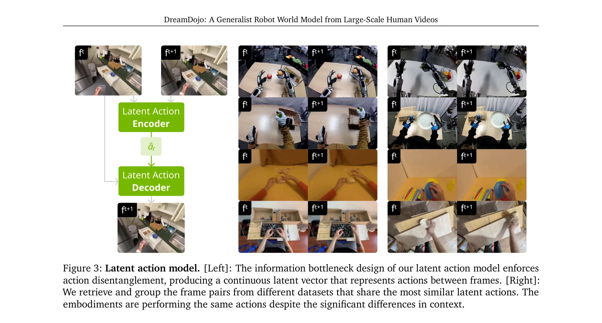

# DreamDojo: A Generalist Robot World Model from Large-Scale Human Videos

> **저자**: Shenyuan Gao, William Liang, Kaiyuan Zheng, Ayaan Malik, Seonghyeon Ye, Sihyun Yu, Wei-Cheng Tseng, Yuzhu Dong, Kaichun Mo, Chen-Hsuan Lin, Qianli Ma, Seungjun Nah, Loic Magne, Jiannan Xiang, Yuqi Xie, Ruijie Zheng, Dantong Niu, You Liang Tan, K. R. Zentner, George Kurian, Suneel Indupuru, Pooya Jannaty, Jinwei Gu, Jun Zhang, Jitendra Malik, Pieter Abbeel, Ming-Yu Liu, Yuke Zhu, Joel Jang, Linxi "Jim" Fan | **날짜**: 2026-02-06 | **URL**: [https://arxiv.org/abs/2602.06949](https://arxiv.org/abs/2602.06949)

---

## Essence

*Figure 1: DreamDojo overview. DreamDojo acquires comprehensive physical knowledge from large-scale*

44k시간의 대규모 인간 동영상으로부터 연속 잠재 행동(continuous latent actions)을 통일된 프록시로 사용하여 학습한 DreamDojo는 로봇의 손재주 제어와 물리 이해를 갖춘 기초 세계 모델로, 실시간 텔레오퍼레이션과 모델 기반 계획을 가능하게 한다.

## Motivation

- **Known**: Video world models는 미래 상태를 비디오 프레임으로 표현하여 로봇 제어에 활용되고 있으며, 최근 video generation 기술의 발전이 이를 촉진하고 있다. 다만 기존 접근법은 이산 제어에 제한되고 로봇 데이터의 제한된 커버리지로 인해 분포 외(OOD) 환경에서의 일반화 능력이 부족하다.
- **Gap**: 로봇 데이터는 수집 비용이 높고 커버리지가제한적이며 세밀한 행동 레이블이 부족하고, 기존 세계 모델들은 관찰된 설정 시뮬레이션에 국한되어 반사실적 행동에 반응하지 못한다. 또한 다양한 행동 형식을 통일된 프레임워크로 통합하는 문제가 존재한다.
- **Why**: 일반화된 로봇 에이전트의 대규모 개발을 위해서는 다양한 환경에서 행동의 결과를 시뮬레이션할 수 있는 능력이 필수적이며, 이는 실제 배포 없이 정책 평가와 모델 기반 계획을 가능하게 하여 로봇 학습의 효율성을 혁신할 수 있다.
- **Approach**: 대규모 인간 동영상 데이터셋(DreamDojo-HV: 44k시간)을 수집하고, 연속 잠재 행동을 통일된 프록시 행동으로 도입하여 레이블 없는 비디오에서 행동 인과성을 학습한다. Cosmos-Predict2.5 기반으로 human 비디오에서 사전학습 후 로봇 데이터로 후학습하고, Self Forcing 패러다임의 증류 파이프라인을 통해 실시간 예측 능력을 확보한다.

## Achievement

*Figure 2: Distribution analysis of DreamDojo-HV. (a) Distribution of the scenarios and random examples*

- **DreamDojo-HV 데이터셋**: 44k시간의 egocentric human videos로 구성된 최대 규모 세계 모델 학습 데이터셋으로, 기존 공개 데이터셋 대비 96배 많은 기술과 2,000배 많은 장면을 포함하며 다양한 일상 활동을 아우른다.
- **연속 잠재 행동 기반 학습**: 자기지도 방식으로 프레임 간 의미 있는 행동을 추출하여 세밀한 행동 레이블 부족 문제를 해결하고, 인간과 로봇 간 embodiment gap을 극복하며 효과적인 지식 전이를 달성한다.
- **실시간 증류 모델**: Self Forcing 패러다임 기반 증류 파이프라인으로 640×480 해상도에서 10.81 FPS의 실시간 자동회귀 예측을 구현하고, 맥락 일관성을 개선하여 1분 이상 연속 상호작용이 가능하다.
- **OOD 일반화 능력**: 여러 challenging 분포 외 벤치마크에서 체계적 평가를 통해 미보기 객체와 새로운 환경으로의 zero-shot 일반화, 접촉 기반(contact-rich) 작업 시뮬레이션 능력을 검증한다.
- **다중 응용 프로그램**: live teleoperation, policy evaluation, model-based planning 등 생성형 세계 모델 기반 여러 실질적 응용이 가능함을 입증한다.

## How

*Figure 3: Latent action model. [Left]: The information bottleneck design of our latent action model enforces*

- DreamDojo-HV 구축: YouTube 등 공개 소스에서 46개 언어의 egocentric human 동영상을 수집하고, 자동 처리 파이프라인과 인간 검증을 통해 44k시간의 고품질 데이터셋을 큐레이션
- 연속 잠재 행동 모델: 정보 병목(information bottleneck) 설계로 프레임 쌍 간 의미 있는 행동을 자기지도 방식으로 학습하여, 다양한 행동 형식을 통일된 벡터 표현으로 변환
- Cosmos-Predict2.5 기반 구조: pretrained latent video diffusion 모델을 기초로 하여 flow matching loss로 학습하되, 행동 조건을 텍스트 및 프레임 조건과 함께 DiT 블록에 주입
- 3단계 학습 파이프라인: (1) human 비디오에서 연속 잠재 행동 조건으로 사전학습, (2) 목표 로봇 데이터로 행동 조건화 층을 재설정하고 후학습, (3) 실시간성과 맥락 일관성 개선을 위한 증류
- Self Forcing 기반 증류: 짧은 시간 맥락을 효율적으로 모델링하면서 자동회귀 예측의 시각적 품질 저하를 방지하고 장기 일관성을 향상
- 다중 로봇 어댑테이션: 서로 다른 embodiment(GR-1, G1, AgiBot, YAM 등)에 대해 행동 공간 재학습을 통해 모델 적응 가능

## Originality

- **인간 비디오 대규모 활용**: 기존 로봇 세계 모델이 teleoperation 데이터에 의존한 반면, embodiment gap을 극복하면서 44k시간의 인간 동영상을 직접 활용한 최초의 시도
- **연속 잠재 행동의 통합 프레임워크**: 다양한 행동 형식(skeleton, joint angles 등)을 단일 연속 벡터 공간으로 통합하는 자기지도 방식의 혁신적 접근으로, 대규모 이질적 데이터 학습 가능
- **Zero-shot OOD 일반화**: 사전학습 단계에서 미보기 객체와 환경으로의 일반화를 달성하여, 기존 모델의 분포 내 한계를 초월
- **실시간 증류 파이프라임**: Self Forcing 패러다임을 world model 증류에 적용하여 실시간 예측과 시각 품질을 동시에 확보한 최초의 실현
- **다중 벤치마크 체계적 평가**: 6개의 challenging OOD 벤치마크로 엄격한 평가를 수행하여 현실적 적용 가능성을 입증

## Limitation & Further Study

- **Embodiment gap 완전 해결 미흡**: 인간과 로봇의 기하학적, 동역학적 차이(팔 길이, 조작 방식 등)가 존재하여 완전한 zero-shot 전이는 제한될 수 있으며, 후학습이 여전히 필요
- **데이터 편향성**: YouTube 기반 인간 동영상은 특정 지역, 문화, 언어에 편중될 수 있어 글로벌 일반화 가능성이 제한될 수 있음
- **복잡한 다물체 상호작용**: 추상적인 물리 개념(중력, 마찰 등) 이해는 강하나, 여러 물체의 복잡한 동시 상호작용이나 카오스적 동역학 시뮬레이션 능력의 한계 미검증
- **장기 예측 정확도**: 1분 이상 연속 예측이 가능하나 시간이 증가할수록 누적 오차 가능성이 있으며, 극도의 장기(수분 이상) 예측에 대한 분석 부족
- **후속 연구 방향**: (1) 다양한 로봇 embodiment의 자동 적응 메커니즘 개발, (2) 물리 법칙 명시적 제약 통합을 통한 물리적 일관성 강화, (3) 다중 모달 입력(촉각, 힘 센서 등) 통합, (4) 실제 정책 학습 성과 검증을 위한 광범위한 로봇 배포 실험

## Evaluation

- Novelty: 4/5
- Technical Soundness: 3/5
- Significance: 4/5
- Clarity: 4/5
- Overall: 4/5

**총평**: DreamDojo는 대규모 인간 동영상과 연속 잠재 행동의 혁신적 결합으로 로봇 세계 모델의 스케일과 일반화 능력을 획기적으로 향상시킨 중요한 기여이다. 실시간 성능과 다양한 실제 응용 가능성이 입증되었으나, embodiment gap 완전 해결과 극도의 장기 예측에 대한 추가 검증이 필요하다.

## Related Papers

- 🏛 기반 연구: [[papers/1315_AutoRT_Embodied_Foundation_Models_for_Large_Scale_Orchestrat/review]] — DreamDojo의 대규모 인간 동영상 학습과 AutoRT의 로봇 함대 데이터 수집은 모두 대규모 데이터 기반 로봇 학습의 기초를 제공한다.
- 🔗 후속 연구: [[papers/1581_Structured_World_Models_from_Human_Videos/review]] — DreamDojo의 인간 동영상 기반 세계 모델과 Structured World Models의 인간 비디오 활용은 비디오 데이터 활용의 발전된 형태이다.
- 🔄 다른 접근: [[papers/1632_World_Simulation_with_Video_Foundation_Models_for_Physical_A/review]] — DreamDojo의 인간 동영상 기반 세계 모델과 비디오 foundation model 기반 세계 시뮬레이션은 영상 데이터 활용의 서로 다른 접근법이다.
- 🔄 다른 접근: [[papers/1292_A_Comprehensive_Survey_on_World_Models_for_Embodied_AI/review]] — 세계 모델 학습에서 인간 동영상과 3D 표현을 각각 활용하는 서로 다른 접근법입니다.
- 🔗 후속 연구: [[papers/1452_Learning_Interactive_Real-World_Simulators/review]] — 동영상 기반 세계 모델을 실시간 상호작용이 가능한 시뮬레이터로 확장한 연구입니다.
- 🔗 후속 연구: [[papers/1450_Learning_Fine-Grained_Bimanual_Manipulation_with_Low-Cost_Ha/review]] — 대규모 dexterous manipulation 데이터를 저비용 시스템에 적용하여 접근 가능한 양팔 조작 학습을 실현할 수 있다.
- 🔄 다른 접근: [[papers/1540_RoboGen_Towards_Unleashing_Infinite_Data_for_Automated_Robot/review]] — DreamDojo가 현실 데이터에서 꿈을 통해 로봇 학습을 확장하는 반면, RoboGen은 생성 모델을 통해 완전히 합성된 학습 환경을 제공한다.
- 🏛 기반 연구: [[papers/1581_Structured_World_Models_from_Human_Videos/review]] — 대규모 인간 비디오에서 로봇 정책을 학습하는 기본 아이디어를 공유하며, SWIM의 이론적 기반을 제공한다.
- 🔄 다른 접근: [[papers/1347_D2E_Scaling_Vision-Action_Pretraining_on_Desktop_Data_for_Tr/review]] — 대규모 비전-액션 데이터를 데스크톱 환경과 인간 동영상에서 각각 수집하는 서로 다른 접근법입니다.
- 🏛 기반 연구: [[papers/1315_AutoRT_Embodied_Foundation_Models_for_Large_Scale_Orchestrat/review]] — AutoRT의 대규모 로봇 데이터 수집과 DreamDojo의 인간 동영상 기반 세계 모델은 모두 대규모 데이터를 통한 로봇 학습 기반을 제공한다.
