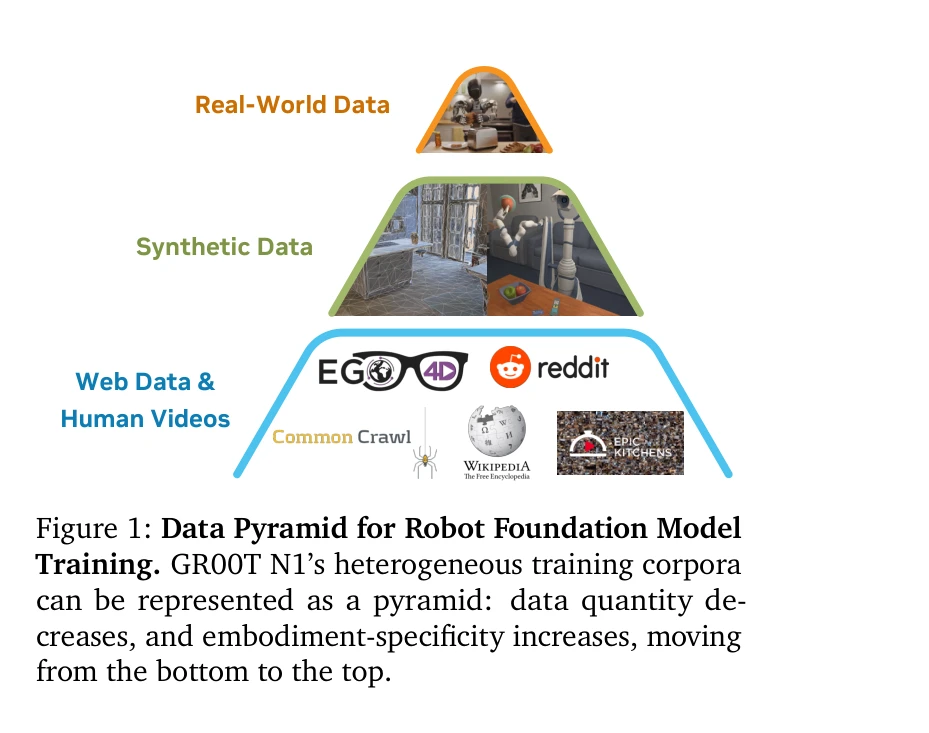
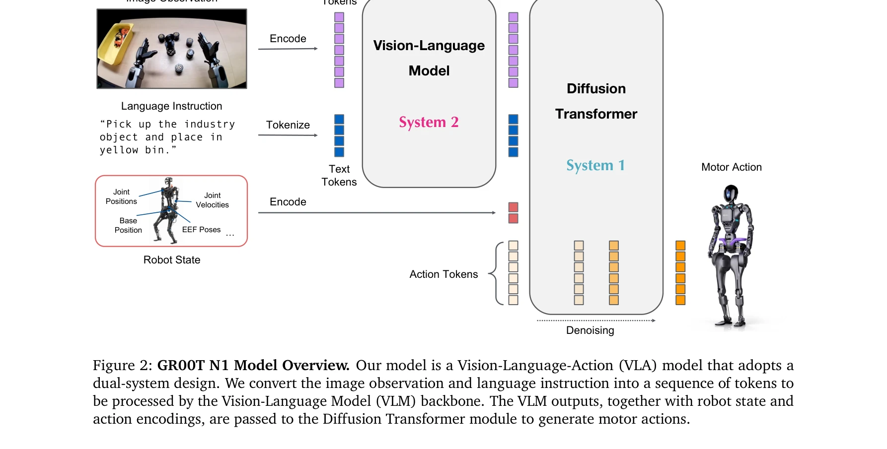

# GR00T N1: An Open Foundation Model for Generalist Humanoid Robots

> **저자**: , , Johan Bjorck, Fernando Castañeda, Nikita Cherniadev, Xingye Da, Runyu Ding, Linxi "Jim" Fan, Yu Fang, Dieter Fox, Fengyuan Hu, Spencer Huang, Joel Jang, Zhenyu Jiang, Jan Kautz, Kaushil Kundalia, Lawrence Lao, Zhiqi Li, Zongyu Lin, Kevin Lin, Guilin Liu, Edith Llontop, Loic Magne, Ajay Mandlekar, Avnish Narayan, Soroush Nasiriany, Scott Reed, You Liang Tan, Guanzhi Wang, Zu Wang, Jing Wang, Qi Wang, Jiannan Xiang, Yuqi Xie, Yinzhen Xu, Zhenjia Xu, Seonghyeon Ye, Zhiding Yu, Ao Zhang, Hao Zhang, Yizhou Zhao, Ruijie Zheng, Yuke Zhu | **날짜**: 2025-03-18 | **URL**: [https://arxiv.org/abs/2503.14734](https://arxiv.org/abs/2503.14734)

---

## Essence

*Figure 1: Data Pyramid for Robot Foundation Model*

GR00T N1은 Vision-Language-Action (VLA) 모델로, dual-system 아키텍처를 통해 다양한 휴머노이드 로봇을 제어할 수 있는 오픈 소스 기초 모델이다. 웹 데이터, 인간 비디오, 합성 데이터, 실제 로봇 궤적을 계층적으로 조합하여 학습한다.

## Motivation

- **Known**: 최근 휴머노이드 로봇 하드웨어가 진전되었고, foundation model이 다양한 태스크 학습에 효과적임이 알려져 있다. 또한 Open X-Embodiment와 같은 노력들이 cross-embodied learning을 탐색하고 있다.
- **Gap**: 기존 접근법들은 서로 다른 로봇 embodiment 간의 데이터 불일치로 인해 '데이터 아일랜드' 문제를 겪고 있으며, 대규모 통합 휴머노이드 로봇 데이터셋이 부족하다. 또한 action-less 데이터 소스(인간 비디오 등)를 효과적으로 활용하는 방법이 제한적이다.
- **Why**: 일반적 목적의 로봇이 인간 세계에서 다양한 태스크를 수행하려면 대규모의 다양한 데이터로 학습된 생성형 모델이 필수적이며, 이는 로봇의 일반화 능력과 빠른 학습을 가능하게 한다.
- **Approach**: System 2 (Vision-Language Model)와 System 1 (Diffusion Transformer)으로 구성된 dual-system 아키텍처를 설계하고, 웹 데이터-합성 데이터-실제 로봇 데이터의 계층적 pyramid 구조로 co-training을 수행한다. latent-action codebook과 inverse dynamics model을 사용하여 action-less 데이터를 처리한다.

## Achievement

*Figure 2: GR00T N1 Model Overview. Our model is a Vision-Language-Action (VLA) model that adopts a*

- **Dual-system 아키텍처**: System 2의 Vision-Language Model이 10Hz로 환경을 해석하고 System 1의 Diffusion Transformer가 120Hz로 실시간 모터 액션을 생성하는 계층적 설계
- **데이터 pyramid 전략**: 웹 데이터, 합성 데이터, 실제 로봇 데이터를 통합하여 'data island' 문제를 해결하고 cross-embodiment 학습 가능", '**다중 embodiment 지원**: 단일 팔, 양팔, 휴머노이드 로봇을 포함한 다양한 로봇 형태를 하나의 모델로 지원
- **벤치마크 성능**: 표준 simulation 벤치마크에서 state-of-the-art imitation learning baseline을 능가
- **실제 로봇 배포**: Fourier GR-1 휴머노이드 로봇에서 language-conditioned bimanual manipulation 태스크에서 높은 성능 달성
- **오픈소스 공개**: GR00T-N1-2B 모델 체크포인트, 학습 데이터, 시뮬레이션 벤치마크 공개

## How

*Figure 3: GR00T N1 Model Architecture. GR00T N1 is trained on a diverse set of embodiments ranging from*

- Eagle-2 Vision-Language Model을 backbone으로 사용하여 이미지와 텍스트 명령어를 토큰으로 변환
- Flow-matching을 통한 action 생성으로 Diffusion Transformer 학습
- Embodiment별 MLP를 통해 가변 차원의 state와 action을 공유 embedding 차원으로 투영
- Latent-action codebook을 학습하여 action-less 데이터(인간 비디오 등)에서 pseudo-action 생성
- Inverse dynamics model (IDM)을 사용하여 action 주석이 없는 비디오에 대한 action 추론
- Pre-training과 post-training 단계에서 전체 data pyramid에 걸친 co-training 수행
- Embodiment-specific encoder와 decoder를 통해 다양한 로봇 형태의 state와 action 처리
- Vision-Language token과의 cross-attention을 통해 reasoning과 action generation 통합

## Originality

- **Cognitive science 영감의 dual-system**: 인간의 인지 처리 방식(Kahneman의 System 1/2)을 로봇 제어에 적용하는 혁신적 설계
- **계층적 데이터 pyramid 구조**: 단순한 데이터 혼합이 아닌 의도적 계층화로 data scale과 embodiment-specificity의 trade-off 체계화
- **Action-less 데이터 활용 기법**: Latent-action codebook과 IDM을 조합하여 대규모 인간 비디오를 로봇 학습에 직접 활용하는 방법론
- **End-to-end joint training**: System 1과 System 2를 단일 가중치로 통합 최적화하면서도 모듈화된 구조 유지
- **실제 배포 검증**: 시뮬레이션 성능뿐만 아니라 실제 GR-1 로봇에서의 language-conditioned bimanual manipulation 검증

## Limitation & Further Study

- **Computational resource 요구**: L40 GPU에서 63.9ms의 inference 시간이 필요하며, 실시간 제어가 요구되는 고속 태스크에는 제한적일 수 있음
- **Data quality and annotation 의존성**: Pseudo-action 생성의 정확도가 IDM 성능에 크게 의존하며, 이로 인한 noise 누적 가능성
- **Embodiment 적응의 일반화 한계**: 학습 중 보지 못한 embodiment에 대한 zero-shot 성능은 논문에서 충분히 검증되지 않음
- **실제 로봇 실험 규모 제한**: GR-1 로봇에서의 실험이 제시되었으나, 다른 humanoid 형태(예: Boston Dynamics Atlas, Tesla Optimus 등)에서의 성능 검증 필요
- **Language instruction 한계**: 복잡한 multi-step 추론이 필요한 태스크에서 VLM 기반의 System 2의 성능 상한 미검증
- **후속 연구 방향**: (1) On-device inference 최적화로 edge deployment 가능성 탐색, (2) 더 다양한 humanoid 체형 데이터 수집 및 학습, (3) Closed-loop feedback 기반의 adaptive control 통합, (4) Long-horizon planning 능력 강화

## Evaluation

- Novelty: 4/5
- Technical Soundness: 3/5
- Significance: 4/5
- Clarity: 4/5
- Overall: 4/5

**총평**: GR00T N1은 휴머노이드 로봇 기초 모델 개발에서 중요한 진전을 이루었으며, data pyramid 전략과 dual-system 아키텍처의 혁신적 설계가 돋보인다. 오픈소스 공개와 실제 로봇 검증을 통해 로봇 학습 커뮤니티에 실질적 기여를 할 것으로 기대된다.
