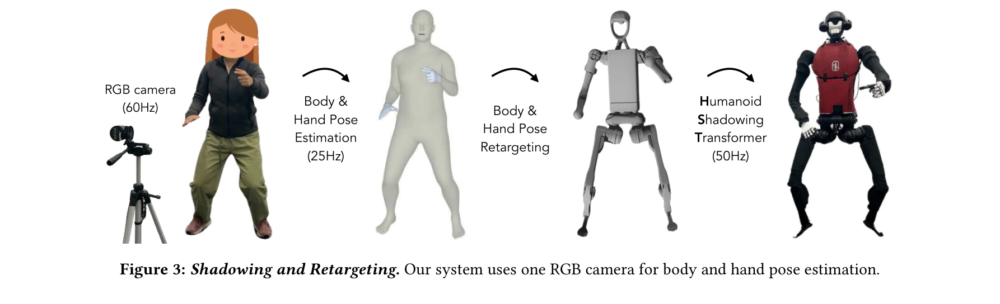
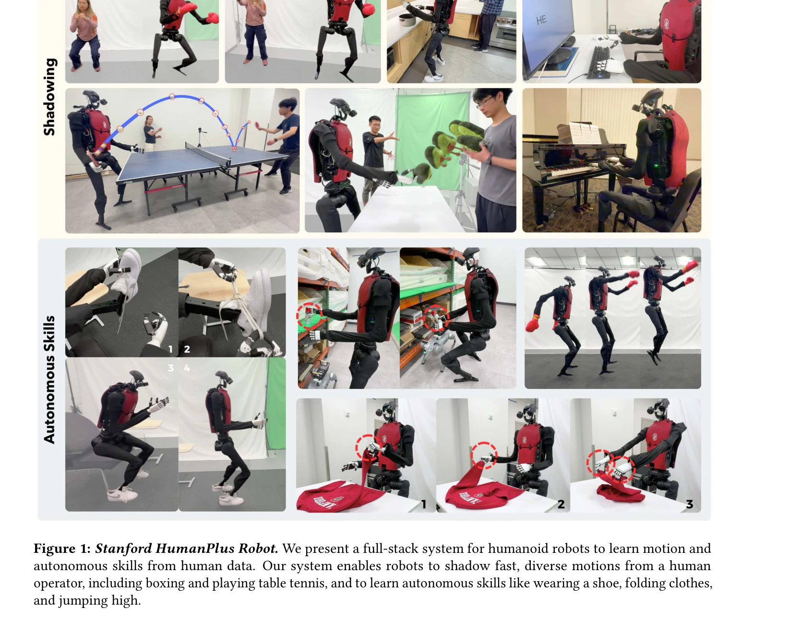

# HumanPlus: Humanoid Shadowing and Imitation from Humans

> **저자**: Zipeng Fu, Qingqing Zhao, Qi Wu, Gordon Wetzstein, Chelsea Finn | **날짜**: 2024-06-15 | **URL**: [https://arxiv.org/abs/2406.10454](https://arxiv.org/abs/2406.10454)

---

## Essence

*Figure 3: Shadowing and Retargeting. Our system uses one RGB camera for body and hand pose estimation.*

휴머노이드 로봇이 단일 RGB 카메라를 사용하여 인간의 동작을 실시간으로 따라할 수 있는 shadowing 시스템과, 수집된 데이터로부터 자율적인 작업 기술을 학습하는 imitation learning 파이프라인을 제시하는 전체 스택 시스템이다.

## Motivation

- **Known**: 휴머노이드 로봇은 인간 형태의 이점으로 인해 대규모 인간 데이터 활용이 가능하지만, 실제로는 perception과 control의 복잡성, 형태론적 차이, 자율 기술 학습을 위한 데이터 파이프라인 부족으로 인해 인간 데이터 활용이 어려웠다.
- **Gap**: 기존 연구들은 모션 캡처 시스템이나 exoskeleton을 사용한 비용이 높은 teleoperation 방식에 의존하고 있었으며, 휴머노이드의 복잡한 전신 제어와 고자유도 환경에서 효율적으로 학습할 수 있는 통합 시스템이 부족하였다.
- **Why**: 인간과 유사한 형태의 휴머노이드가 인간 환경과 도구에 대한 일반적인 적응 능력을 갖출 수 있다면, 이는 범용 로봇 지능 달성을 향한 유망한 경로이며 로봇 공학에서 오랫동안 추구해온 목표를 실현할 수 있기 때문이다.
- **Approach**: AMASS 데이터셋으로부터 reinforcement learning을 통해 Humanoid Shadowing Transformer라는 저수준 정책을 학습하여 pose 조건부 제어를 가능하게 하고, 이를 통해 수집한 데이터로 behavior cloning을 수행하여 egocentric vision 기반의 자율 기술 정책을 학습한다.

## Achievement

*Figure 1: Stanford HumanPlus Robot. We present a full-stack system for humanoid robots to learn motion and*

- **Shadowing 시스템**: 단일 RGB 카메라와 body & hand pose estimation을 사용하여 실시간으로 인간 동작을 휴머노이드에 따라하게 하는 저비용 teleoperation 시스템 개발
- **Humanoid Shadowing Transformer**: AMASS 40시간 데이터로 학습된 task-agnostic 저수준 정책으로 zero-shot sim-to-real transfer 달성
- **Humanoid Imitation Transformer**: Forward dynamics prediction을 통합한 transformer 기반 imitation learning으로 40개 시연만으로 자율 작업 학습
- **자율 작업 달성**: 신발 신기-일어나기-걷기, 창고 물품 언로드, 스웨터 접기, 물품 정렬, 타이핑, 다른 로봇 인사 등 6개 작업을 60-100% 성공률로 수행
- **통합 시스템**: 데이터 수집부터 자율 실행까지의 완전한 파이프라인을 33-DoF 180cm 커스텀 휴머노이드에서 구현

## How

*Figure 3: Shadowing and Retargeting. Our system uses one RGB camera for body and hand pose estimation.*

- AMASS 데이터셋의 인간 모션을 pose retargeting을 통해 휴머노이드 pose로 변환
- Pose 조건부 목표를 입력으로 하는 Humanoid Shadowing Transformer를 RL로 시뮬레이션에서 학습
- 학습된 저수준 정책을 실제 로봇에 zero-shot으로 배포
- 실시간 body & hand pose estimation 알고리즘으로 인간 동작 추정
- 추정된 인간 동작을 휴머노이드 공간으로 retarget하여 shadowing 제어
- Shadowing 중 binocular egocentric RGB 카메라로 전신 데이터 수집
- 수집한 데이터로 Humanoid Imitation Transformer를 behavior cloning으로 학습
- Forward dynamics prediction 보조 작업으로 vision feature 공간에서 정규화하여 과적합 방지

## Originality

- 기존 teleoperation 방식의 mocap/exoskeleton 대신 단일 RGB 카메라 기반의 저비용 실시간 shadowing 시스템 제안
- Task-agnostic 저수준 정책으로 다양한 인간 동작을 일반화하는 새로운 접근
- Forward dynamics prediction을 imitation learning에 통합하여 egocentric vision 학습 안정성 개선
- 완전한 end-to-end 시스템 구현: RL 기반 shadowing과 behavior cloning 기반 자율 학습의 synergy 활용

## Limitation & Further Study

- 성공률이 작업별로 편차가 크며(60-100%) 일부 작업은 여전히 낮은 성능을 보임
- 40개 시연이라는 적정량의 데이터 필요성이 여전히 존재하며 더 적은 시연으로의 확장성 미흡
- Pose retargeting의 형태학적 차이에 대한 손실이 완전히 해결되지 않음
- Egocentric vision 기반 정책이 특정 환경 조건에서 일반화 능력 부족 가능성
- 후속 연구: 더 작은 데이터셋으로 학습하는 메타러닝 기법 탐색, 양손 협력 조작 작업 확대, 동적 환경에 대한 적응성 강화

## Evaluation

- Novelty: 4/5
- Technical Soundness: 3/5
- Significance: 4/5
- Clarity: 4/5
- Overall: 4/5

**총평**: 본 논문은 휴머노이드 로봇의 인간 데이터 활용이라는 오랫동안의 과제에 대해 실용적이고 완성도 높은 end-to-end 시스템을 제시했으며, RGB 카메라 기반 shadowing의 단순성과 효율성, 그리고 다양한 자율 작업의 성공적 구현은 로봇 공학 분야에 실질적인 기여를 한다.

## Related Papers

- 🔄 다른 접근: [[papers/1451_Learning_Human-to-Humanoid_Real-Time_Whole-Body_Teleoperatio/review]] — 둘 다 인간-휴머노이드 학습이지만 HumanPlus는 모방 학습에, H2O는 실시간 원격조종에 집중한다.
- 🏛 기반 연구: [[papers/1376_EgoScale_Scaling_Dexterous_Manipulation_with_Diverse_Egocent/review]] — 다양한 egocentric 데이터 수집 방법이 HumanPlus의 인간 동작 데이터 수집 파이프라인에 기반이 된다.
- 🔗 후속 연구: [[papers/1425_Human2Robot_Learning_Robot_Actions_from_Paired_Human-Robot_V/review]] — 인간 동작 데이터를 로봇이 학습하는 방법을 paired human-robot 데이터로 더 정교하게 발전시켰다.
- 🔗 후속 연구: [[papers/1515_Phantom_Training_Robots_Without_Robots_Using_Only_Human_Vide/review]] — Phantom은 HumanPlus의 인간 비디오 학습 개념을 로봇 없이 훈련하는 극한까지 발전시킴
- 🏛 기반 연구: [[papers/1279_BEHAVIOR_Robot_Suite_Streamlining_Real-World_Whole-Body_Mani/review]] — 휴머노이드 섀도잉과 모방 학습 기술은 BEHAVIOR Robot Suite의 전신 조작 학습에 기초 이론을 제공한다.
- 🔄 다른 접근: [[papers/1390_Expressive_Whole-Body_Control_for_Humanoid_Robots/review]] — 표현력 있는 전신 제어와 HumanPlus 휴머노이드 섀도잉은 인간 동작 모방의 서로 다른 학습 및 제어 접근법이다.
- 🔄 다른 접근: [[papers/1451_Learning_Human-to-Humanoid_Real-Time_Whole-Body_Teleoperatio/review]] — 둘 다 인간-휴머노이드 학습이지만 H2O는 실시간 원격조종에, HumanPlus는 모방 학습에 집중한다.
- 🏛 기반 연구: [[papers/1498_OmniH2O_Universal_and_Dexterous_Human-to-Humanoid_Whole-Body/review]] — HumanPlus의 휴머노이드 모방 학습 기술이 OmniH2O의 인간 동작을 휴머노이드로 전이하는 핵심 기반을 제공한다.
- 🏛 기반 연구: [[papers/1513_Parallels_Between_VLA_Model_Post-Training_and_Human_Motor_Le/review]] — VLA post-training 분석이 참조하는 인간 운동 학습의 실제 적용 사례인 humanoid imitation
- 🏛 기반 연구: [[papers/1601_UniSkill_Imitating_Human_Videos_via_Cross-Embodiment_Skill_R/review]] — 인간 시연에서 로봇으로의 전이 학습 기본 개념을 제공하여 UniSkill의 cross-embodiment 접근법의 이론적 토대를 마련한다.
- 🏛 기반 연구: [[papers/1628_WholeBodyVLA_Towards_Unified_Latent_VLA_for_Whole-Body_Loco-/review]] — humanoid shadowing and imitation learning의 기본 개념을 제공하여 WholeBodyVLA의 전신 제어에 이론적 기반을 제공합니다.
- 🏛 기반 연구: [[papers/1354_Dex1B_Learning_with_1B_Demonstrations_for_Dexterous_Manipula/review]] — 인간의 손가락 동작을 로봇이 모방하는 기본 원리를 제공합니다.
- 🏛 기반 연구: [[papers/1491_NaVILA_Legged_Robot_Vision-Language-Action_Model_for_Navigat/review]] — NaVILA의 legged robot control을 위한 기본적인 humanoid shadowing 및 imitation learning 기법을 제공한다.
- 🏛 기반 연구: [[papers/1376_EgoScale_Scaling_Dexterous_Manipulation_with_Diverse_Egocent/review]] — 인간 동작 데이터 수집 방법론과 로봇 imitation learning 파이프라인의 기반 연구입니다.
