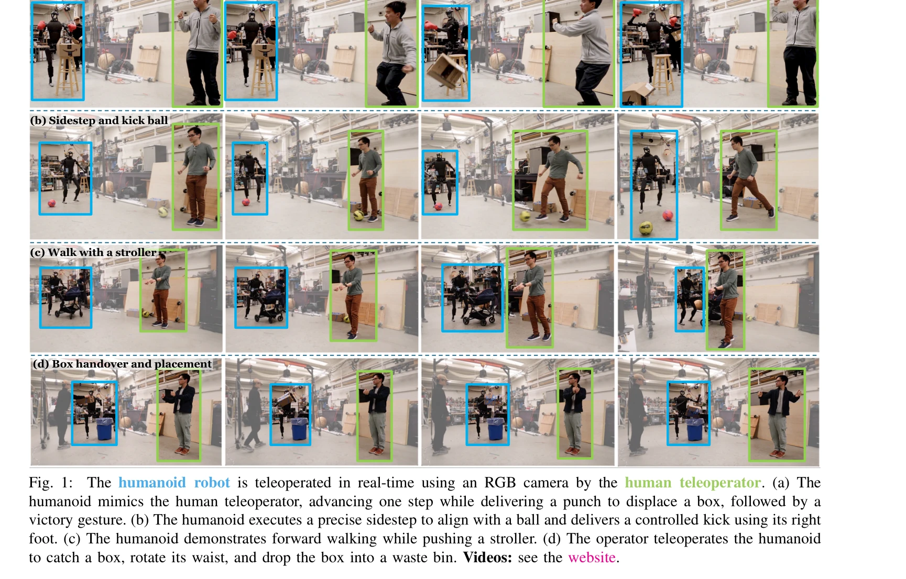

# Learning Human-to-Humanoid Real-Time Whole-Body Teleoperation

> **저자**: Tairan He, Zhengyi Luo, Wenli Xiao, Chong Zhang, Kris Kitani, Changliu Liu, Guanya Shi | **날짜**: 2024-03-07 | **URL**: [https://arxiv.org/abs/2403.04436](https://arxiv.org/abs/2403.04436)

---

## Essence

*Fig. 4: Overview of H2O: (a) Retargeting (Section IV): H2O first aligns the SMPL body model to a humanoid’s structure*

RGB 카메라만을 사용하여 실시간으로 전신 휴머노이드 로봇을 원격조종할 수 있는 RL 기반 프레임워크 H2O를 제시하며, 'sim-to-data' 프로세스로 인간 동작을 로봇 친화적으로 필터링하고 sim-to-real 전이를 달성했다.

## Motivation

- **Known**: 기존의 모델 기반 제어 방식은 단순화된 모델에 의존하고 외부 센서를 필요로 하며, 그래픽스 분야의 RL 기반 인간 동작 생성은 시뮬레이션에만 국한되어 있었다. RL 기반 이족 보행은 실제 로봇에서 성공했지만 전신 제어의 경우는 입증되지 않았다.
- **Gap**: 인간과 휴머노이드 사이의 동역학 불일치로 인해 대규모 인간 동작 데이터셋을 로봇에 직접 적용할 수 없고, RGB 카메라 입력만으로 실시간 전신 원격조종을 달성한 RL 기반 연구가 존재하지 않는다.
- **Why**: 휴머노이드 로봇의 인간과의 신체적 유사성을 활용한 원격조종은 복잡한 실무 작업(가사, 의료, 구조활동)에서 자율 로봇보다 효율적이며, 대규모 고품질 로봇 학습 데이터 수집의 새로운 경로를 제공한다.
- **Approach**: 'sim-to-data' 프로세스에서 IK를 통해 인간 동작을 SMPL 기반으로 휴머노이드에 재타겟팅한 후, privileged motion imitator로 실행 불가능한 동작을 필터링하여 정제된 대규모 데이터셋을 생성하고, 광범위한 domain randomization으로 sim-to-real 전이를 수행한다.

## Achievement

*Fig. 1:*

- **첫 RL 기반 실시간 전신 휴머노이드 원격조종 달성**: 걷기, 뒤로 점프, 차기, 박싱, 손흔들기, 밀기, 손수레 밀기 등 다양한 동적 동작을 RGB 카메라로 실시간 제어
- **확장성 높은 'sim-to-data' 프로세스**: 대규모 인간 동작 데이터셋을 자동으로 필터링하여 로봇 친화적인 동작 데이터셋 구성", '**효과적인 sim-to-real 전이**: Domain randomization을 통해 시뮬레이션 환경에서 학습한 정책을 zero-shot으로 실제 로봇에 전이

## How

*Fig. 4: Overview of H2O: (a) Retargeting (Section IV): H2O first aligns the SMPL body model to a humanoid’s structure*

- SMPL 신체 모델을 H1 휴머노이드에 적합시켜 인간 포즈를 로봇 관절 공간으로 매핑
- Privileged state information을 가진 motion imitator를 시뮬레이션에서 학습시켜 추적 불가능한 동작 판별
- RGB 카메라 입력에서 추출 가능한 3D keypoint 위치를 goal state로 설정하여 실시간 조종 가능하게 설계
- Off-the-shelf 인간 포즈 추정기를 사용하여 전역 신체 위치 정보 제공
- 목표 지향형 RL 프레임워크에서 PPO 알고리즘으로 motion tracking 정책 학습
- 광범위한 domain randomization (시각적, 물리적 파라미터)을 적용하여 시뮬레이션-현실 간격 해소

## Originality

- 그래픽스 커뮤니티의 physics-based 인간 동작 생성 기법과 로보틱스 커뮤니티의 실제 로봇 제어를 통합한 첫 시도
- Privileged information을 활용한 자동화된 동작 필터링으로 대규모 데이터셋 정제 문제 해결
- RGB 카메라만으로 전신 원격조종을 달성하여 기존 모션캡처 마커나 외부 센서 의존성 제거
- 목표 지향형 RL로 단일 정책으로 다양한 동작을 추적하는 확장성 있는 아키텍처 제시

## Limitation & Further Study

- 현재 고정된 환경에서만 테스트되었으며, 변화하는 환경 조건에서의 강건성 미검증
- RGB 포즈 추정기의 정확도에 의존하므로 추정 오류 누적에 대한 분석 부족
- Privileged imitator 학습이 필요한 추가 계산 비용 및 이 과정의 효율성 개선 여지
- 상체와 하체의 일관된 추적이 어려운 경우(예: 동시 다리 및 팔 동작)에 대한 상세 분석 필요
- 더 복잡한 제약이 있는 조작 작업이나 접촉 기반 상호작용에서의 성능 평가 부재
- 다양한 체형의 인간 동작 적응에 대한 연구 필요

## Evaluation

- Novelty: 4/5
- Technical Soundness: 3/5
- Significance: 4/5
- Clarity: 4/5
- Overall: 4/5

**총평**: 본 논문은 인간-휴머노이드 상호작용의 새로운 패러다임을 제시하며, 'sim-to-data' 필터링과 효과적인 sim-to-real 전이를 통해 RL 기반 전신 원격조종을 처음 실현했다는 점에서 획기적 기여이다. 대규모 데이터셋 생성, RGB 카메라 기반 제어, 다양한 동작 실현 등에서 높은 완성도를 보여주며, 향후 로봇 원격조종 및 자율 시스템 학습의 중요한 토대가 될 것으로 예상된다.

## Related Papers

- 🔄 다른 접근: [[papers/1426_HumanPlus_Humanoid_Shadowing_and_Imitation_from_Humans/review]] — 둘 다 인간-휴머노이드 학습이지만 H2O는 실시간 원격조종에, HumanPlus는 모방 학습에 집중한다.
- 🔗 후속 연구: [[papers/1498_OmniH2O_Universal_and_Dexterous_Human-to-Humanoid_Whole-Body/review]] — 실시간 전신 원격조종을 더 정교한 dexterous whole-body control로 발전시킨 통합 시스템이다.
- 🏛 기반 연구: [[papers/1526_Real-World_Humanoid_Locomotion_with_Reinforcement_Learning/review]] — 강화학습 기반 휴머노이드 보행 제어가 H2O의 전신 제어 프레임워크에 기반이 된다.
- 🏛 기반 연구: [[papers/1390_Expressive_Whole-Body_Control_for_Humanoid_Robots/review]] — 표현력 있는 전신 제어 정책이 H2O의 실시간 원격조종 시스템 설계의 기술적 기반이 됨
- 🧪 응용 사례: [[papers/1628_WholeBodyVLA_Towards_Unified_Latent_VLA_for_Whole-Body_Loco-/review]] — WholeBodyVLA는 H2O의 전신 제어 개념을 VLA 모델과 통합한 실제 적용 사례임
- 🧪 응용 사례: [[papers/1279_BEHAVIOR_Robot_Suite_Streamlining_Real-World_Whole-Body_Mani/review]] — BRS의 JoyLo 원격조작 인터페이스와 인간-휴머노이드 실시간 전신 텔레오퍼레이션은 동일한 인간-로봇 제어 문제를 다룬다.
- 🏛 기반 연구: [[papers/1390_Expressive_Whole-Body_Control_for_Humanoid_Robots/review]] — 인간-휴머노이드 실시간 전신 텔레오퍼레이션 학습은 표현력 있는 전신 제어의 인간 모션 캡처 학습에 데이터 수집 기반을 제공한다.
- 🔄 다른 접근: [[papers/1426_HumanPlus_Humanoid_Shadowing_and_Imitation_from_Humans/review]] — 둘 다 인간-휴머노이드 학습이지만 HumanPlus는 모방 학습에, H2O는 실시간 원격조종에 집중한다.
- 🔄 다른 접근: [[papers/1498_OmniH2O_Universal_and_Dexterous_Human-to-Humanoid_Whole-Body/review]] — 인간-휴머노이드 텔레오퍼레이션에서 다른 연구는 실시간 학습에, OmniH2O는 다양한 입력 모달리티 통합에 초점을 맞춘다.
- 🔗 후속 연구: [[papers/1526_Real-World_Humanoid_Locomotion_with_Reinforcement_Learning/review]] — human-to-humanoid teleop 기술을 강화학습 기반 locomotion과 결합하여 더 자연스럽고 적응적인 휴머노이드 제어 시스템을 구축한다.
- 🏛 기반 연구: [[papers/1572_Sim-to-Real_Reinforcement_Learning_for_Vision-Based_Dexterou/review]] — Human-to-Humanoid Teleoperation 연구는 정교한 조작을 위한 sim-to-real의 기반이 되는 인간-로봇 인터페이스를 제공한다.
