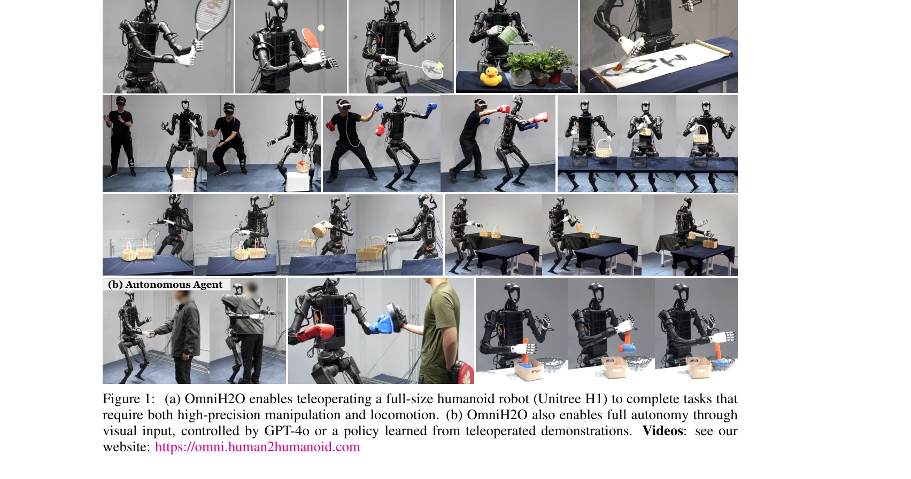
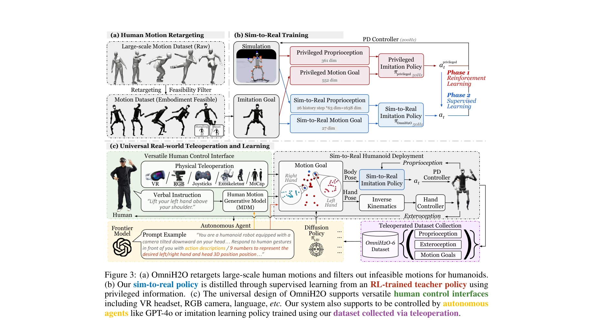

# OmniH2O: Universal and Dexterous Human-to-Humanoid Whole-Body Teleoperation and Learning

> **저자**: Tairan He, Zhengyi Luo, Xialin He, Wenli Xiao, Chong Zhang, Weinan Zhang, Kris Kitani, Changliu Liu, Guanya Shi | **날짜**: 2024-06-13 | **URL**: [https://arxiv.org/abs/2406.08858](https://arxiv.org/abs/2406.08858)

---

## Essence

*Figure 1: (a) OmniH2O enables teleoperating a full-size humanoid robot (Unitree H1) to complete tasks that*

OmniH2O는 kinematic pose를 보편적 제어 인터페이스로 사용하여 VR, RGB 카메라, 음성 명령 등 다양한 입력을 통해 전신 인형 로봇을 조작하고 자율 작업을 수행할 수 있는 학습 기반 시스템이다.

## Motivation

- **Known**: 기존 인형 로봇 제어는 주로 하체 이동 또는 상체 조작에만 집중했으며, 전신 제어를 위해서는 모션 캡처나 외골격 같은 고비용 장비가 필요했다. 최근 H2O 등이 RL 기반 전신 조작을 시도했으나 RGB 기반 포즈 추정의 정확도 한계와 MoCap 의존성으로 인해 정밀 조작 작업에는 부적합했다.
- **Gap**: 안정적이고 정밀한 전신 로코-조작(locomotion-manipulation)을 동시에 지원하면서도 접근 가능한 인터페이스로 대규모 시연 데이터를 수집할 수 있는 통합 시스템이 부재했다. 또한 인형 로봇 전신 제어에 대한 공개 데이터셋도 없었다.
- **Why**: 인형 로봇은 인간과의 신체 구조 정렬로 인해 범용 지능 구현의 유망한 플랫폼이며, 대규모 인간 시연 데이터를 통한 학습이 가능하다. 전신 제어 능력은 스포츠, 물체 조작, 인간 상호작용 등 현실적 작업 수행에 필수적이다.
- **Approach**: teacher-student distillation 프레임워크를 통해 시뮬레이션의 특권적 정보로 학습한 교사 정책이 실제 센서 입력만 사용하는 학생 정책을 지도한다. 대규모 인간 모션 데이터셋(AMASS)을 인형 로봇에 맞게 재타겟팅하고, 데이터 분포 균형, 보상 설계, 상태 공간 설계를 통해 안정적인 전신 제어 정책을 학습한다.

## Achievement

*Figure 3: (a) OmniH2O retargets large-scale human motions and filters out infeasible motions for humanoids.*

- **통합 제어 시스템**: kinematic pose를 중간 표현으로 사용하여 VR, RGB 카메라, GPT-4o 등 다양한 입력 소스를 지원하는 호환 가능한 제어 프레임워크 개발
- **실시간 정밀 조작**: 스포츠(라켓 스윙), 물체 조작(꽃에 물주기, 바구니 픽업), 인간 상호작용(복싱) 등 다양한 현실 전신 작업을 원격 조작 또는 자율 모드로 수행
- **Sim-to-Real 파이프라인**: MoCap 없이 입력 히스토리로 전역 선속도를 대체하는 방법과 curriculum을 활용한 정규화 보상 설계로 실로봇 배포 성공
- **공개 데이터셋**: 첫 번째 인형 로봇 전신 로코-조작 데이터셋 OmniH2O-6 공개 (6개 일상 작업, RGBD 카메라, 제어 입력, 전신 모터 액션 포함)

## How

*Figure 3: (a) OmniH2O retargets large-scale human motions and filters out infeasible motions for humanoids.*

- AMASS 데이터셋의 인간 모션을 인형 로봇(Unitree H1)으로 재타겟팅하되, 안정적 서있기/스쿼팅을 위해 고정된 하체 모션 시퀀스를 추가하여 데이터 분포 편향
- 모션 추적 작업을 goal-conditioned RL (MDP 공식화)로 정의하고 PPO 알고리즘 적용
- 두 단계 학습: (1) 시뮬레이션에서 privileged proprioception 사용 교사 정책 RL 학습, (2) 교사의 privileged motion goal과 proprioception을 sparse sensor input으로 학습하는 학생 정책 supervised learning
- kinematic pose의 회전(θ)과 위치(p) 성분을 직접 입력으로, 관절 속도와 히스토리를 상태에 포함하여 전역 선속도 추정 제거
- 원격 조작을 통한 시연 수집 및 이모테이션 러닝으로 자율 정책 학습

## Originality

- Kinematic pose를 보편적 제어 인터페이스로 정의함으로써 다양한 입력 소스(VR, RGB, 언어)의 호환성 달성 (기존: 특정 입력 방식에 의존)
- 입력 히스토리를 활용하여 MoCap에 의존하지 않고 전역 선속도 추정 문제 해결 (H2O 대비 개선)
- 데이터 분포 편향(standing/squatting), curriculum 기반 보상 설계, 상태 공간 설계의 명시적 통합으로 안정적 전신 로코-조작 달성
- 첫 공개 인형 로봇 전신 제어 데이터셋(OmniH2O-6) 제공 및 이모테이션 러닝 벤치마크 제시

## Limitation & Further Study

- **정밀도 한계**: RGB 기반 포즈 추정의 고유 오차를 완전히 제거하지 못해 일부 고정밀 작업에서 성능 저하 가능성
- **데이터 규모**: OmniH2O-6이 6개 작업에만 국한되어 있으며, 일반화 가능성을 위해서는 더 광범위한 작업 데이터 필요
- **sim-to-real gap**: 시뮬레이션과 실제 환경의 동역학 불일치로 인한 일부 작업 실패 사례 가능성 (동적 환경 미언급)
- **외부 상호작용**: 인간의 강한 충격(striking) 등 예측 불가능한 외부 강제에 대한 강건성이 충분한지 한계 분석 부족
- **후속 연구**: 더 큰 규모 인형 로봇 전신 데이터셋 구축, 다양한 환경과 작업 조건에서의 일반화 성능 개선, 실시간 적응 제어 메커니즘 개발 필요

## Evaluation

- Novelty: 4/5
- Technical Soundness: 3/5
- Significance: 4/5
- Clarity: 4/5
- Overall: 4/5

**총평**: OmniH2O는 kinematic pose 기반의 보편적 제어 인터페이스와 정교한 sim-to-real 파이프라인을 통해 인형 로봇의 전신 로코-조작을 처음으로 체계적으로 해결한 연구이며, 공개 데이터셋과 다양한 실제 작업 시연으로 높은 실무 가치를 제공한다.

## Related Papers

- 🔄 다른 접근: [[papers/1451_Learning_Human-to-Humanoid_Real-Time_Whole-Body_Teleoperatio/review]] — 인간-휴머노이드 텔레오퍼레이션에서 다른 연구는 실시간 학습에, OmniH2O는 다양한 입력 모달리티 통합에 초점을 맞춘다.
- 🏛 기반 연구: [[papers/1426_HumanPlus_Humanoid_Shadowing_and_Imitation_from_Humans/review]] — HumanPlus의 휴머노이드 모방 학습 기술이 OmniH2O의 인간 동작을 휴머노이드로 전이하는 핵심 기반을 제공한다.
- 🏛 기반 연구: [[papers/1390_Expressive_Whole-Body_Control_for_Humanoid_Robots/review]] — whole-body 휴머노이드 제어 기술은 OmniH2O의 전신 텔레오퍼레이션 구현에 필수적인 기반입니다.
- 🧪 응용 사례: [[papers/1279_BEHAVIOR_Robot_Suite_Streamlining_Real-World_Whole-Body_Mani/review]] — OmniH2O의 teleoperation 시스템을 BEHAVIOR robot suite의 다양한 whole-body manipulation 작업에 적용할 수 있다.
- 🔗 후속 연구: [[papers/1279_BEHAVIOR_Robot_Suite_Streamlining_Real-World_Whole-Body_Mani/review]] — 전신 조작을 위한 원격조작 기술을 휴머노이드 로봇에 확장 적용한다.
- 🔄 다른 접근: [[papers/1403_Gemini_Robotics_15_Pushing_the_Frontier_of_Generalist_Robots/review]] — 둘 다 전신 휴머노이드 제어이지만 Gemini는 VLA 모델을, OmniH2O는 원격조종 기반 접근법을 사용한다.
- 🧪 응용 사례: [[papers/1390_Expressive_Whole-Body_Control_for_Humanoid_Robots/review]] — OmniH2O는 표현력 있는 전신 제어 방법론을 범용적인 인간-휴머노이드 제어 시스템으로 실용화함
- 🔗 후속 연구: [[papers/1451_Learning_Human-to-Humanoid_Real-Time_Whole-Body_Teleoperatio/review]] — 실시간 전신 원격조종을 더 정교한 dexterous whole-body control로 발전시킨 통합 시스템이다.
- 🔄 다른 접근: [[papers/1628_WholeBodyVLA_Towards_Unified_Latent_VLA_for_Whole-Body_Loco-/review]] — 둘 다 humanoid whole-body control을 다루지만 OmniH2O는 human-to-humanoid teleop에, WholeBodyVLA는 VLA 기반 자율 제어에 집중합니다.
- 🔄 다른 접근: [[papers/1355_DexGarmentLab_Dexterous_Garment_Manipulation_Environment_wit/review]] — OmniH2O는 의류 조작과 유사한 복잡한 전신 조작을 다루지만 휴머노이드 로봇에 특화된 다른 접근법을 사용합니다.
