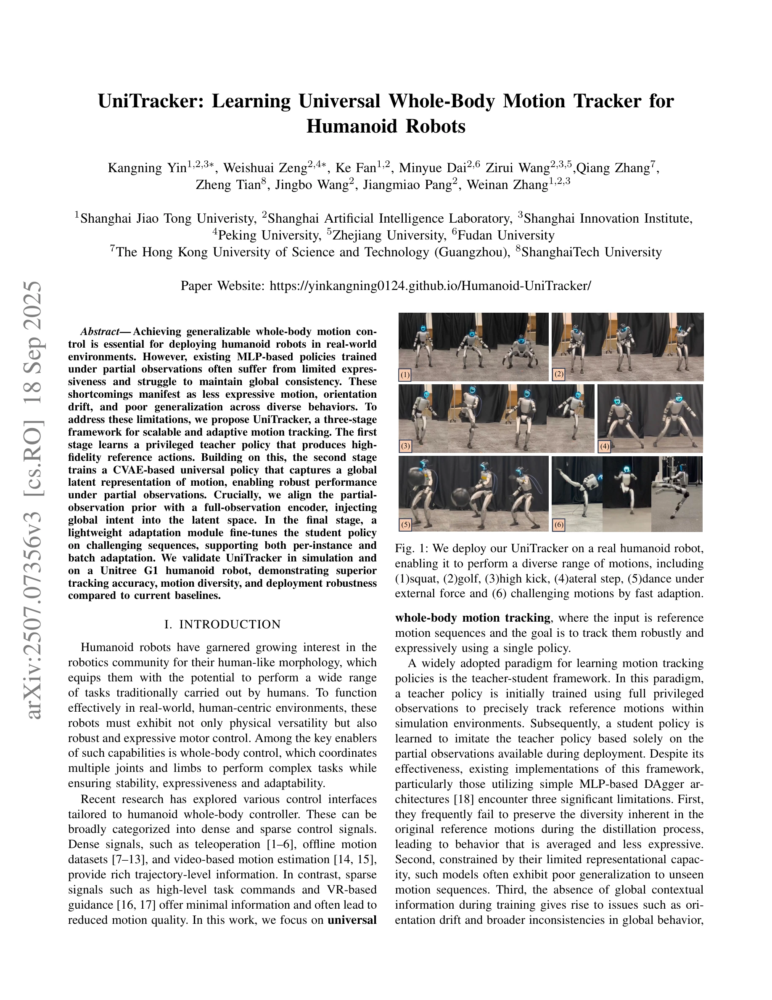

# UniTracker: Learning Universal Whole-Body Motion Tracker for Humanoid Robots

> **저자**: Kangning Yin, Weishuai Zeng, Ke Fan, Minyue Dai, Zirui Wang, Qiang Zhang, Zheng Tian, Jingbo Wang, Jiangmiao Pang, Weinan Zhang | **날짜**: 2025-07-10 | **URL**: [https://arxiv.org/abs/2507.07356](https://arxiv.org/abs/2507.07356)

---

## Essence

*Fig. 2: An overview of UniTracker: In Stage 1, we train a teacher policy using oracle states via goal-conditioned*

UniTracker는 CVAE 기반 세 단계 학습 프레임워크를 통해 부분 관측 조건에서도 다양하고 일관성 있는 전신 동작 추적을 실현하는 휴머노이드 로봇 제어 정책이다.

## Motivation

- **Known**: Teacher-student 프레임워크는 특권적 관측으로 학습한 교사 정책을 부분 관측 학생 정책으로 증류하는 방식으로 널리 사용되어 왔다. MLP 기반 정책들은 간단하고 효율적이지만 표현력과 일반화 능력의 제약이 있다.
- **Gap**: 기존 MLP 기반 teacher-student 정책들은 동작 다양성 손실, 부분 관측 하에서의 낮은 표현력, 그리고 방향 드리프트 같은 전역 일관성 문제를 해결하지 못한다.
- **Why**: 휴머노이드 로봇이 실제 환경에서 다양한 인간 행동을 표현력 있게 추적할 수 있어야 하며, 이는 로봇의 실용적 배포와 사용자 만족도에 직결된다.
- **Approach**: Stage 1에서 특권적 관측으로 고품질 교사 정책을 학습하고, Stage 2에서 전역 의도를 인코더-프라이어 정렬을 통해 주입한 CVAE 기반 학생 정책으로 증류하며, Stage 3에서 어려운 동작에 대한 빠른 적응 모듈을 도입한다.

## Achievement

*Fig. 1: We deploy our UniTracker on a real humanoid robot,*

- **CVAE 기반 전역 맥락 통합**: 부분 관측 프라이어를 전역 관측 인코더와 정렬하여 KL 발산 목표로 제약함으로써 배포 시에도 전역 맥락 정보를 활용하게 함
- **다양성과 표현력 향상**: 확률적 잠재 표현을 통해 단일 결정론적 출력이 아닌 그럴듯한 동작의 분포를 모델링하여 동작 다양성과 일반화 능력 개선
- **빠른 적응 메커니즘**: 단일 시퀀스 및 배치 모드 적응을 지원하여 훈련 분포 밖의 도전적 동작에 대한 실시간 전문화 가능
- **실제 로봇 검증**: 29-DoF Unitree G1 휴머노이드에서 8,100개 이상의 다양한 동작 추적 성공

## How

*Fig. 2: An overview of UniTracker: In Stage 1, we train a teacher policy using oracle states via goal-conditioned*

- AMASS 데이터셋에서 동작 획득 후 PHC 필터링을 통해 물리적으로 실현 가능한 8,179개 동작으로 큐레이션
- Stage 1: Goal-conditioned RL (PPO)을 사용하여 전체 상태 정보로부터 고품질 교사 정책 학습
- Stage 2: Conditional Variational Autoencoder (CVAE) 구조로 부분 관측 상에서 작동하는 학생 정책 학습
- 인코더는 특권적 관측 s_t^full로 학습하고 프라이어는 배포 시 관측 s_t^partial로 학습하여 두 분포를 KL 발산으로 정렬
- Stage 3: Residual decoder를 사용한 빠른 적응 모듈로 어려운 동작에 대해 기본 정책을 미세조정

## Originality

- 기존 teacher-student 프레임워크에 CVAE를 통합하여 확률적 잠재 표현과 다양성 모델링 도입
- 전역 관측 인코더와 부분 관측 프라이어 정렬을 통한 새로운 전역 맥락 주입 방식으로 방향 드리프트 문제 해결
- 세 단계 모듈식 파이프라인 구조로 기본 정책과 빠른 적응을 분리하여 유연성과 확장성 확보
- 8,000개 이상의 동작 추적을 단일 정책으로 구현하는 규모면에서의 혁신

## Limitation & Further Study

- CVAE 모델의 복잡성 증가로 인한 학습 시간과 계산 비용 증가에 대한 분석 부재
- 부분 관측의 정의와 배포 시 관측 가능한 정보의 구체적 범위에 대한 명확한 정의 필요
- 빠른 적응 모듈의 배치 모드 성능과 단일 시퀀스 모드 간의 정량적 비교 분석 부족
- 후속 연구: 더 복잡한 인간-물체 상호작용 동작으로의 확장, 온라인 적응 능력 강화, 다른 플랫폼으로의 일반화

## Evaluation

- Novelty: 4/5
- Technical Soundness: 3/5
- Significance: 4/5
- Clarity: 4/5
- Overall: 4/5

**총평**: UniTracker는 CVAE 기반 증류와 전역 맥락 정렬을 통해 기존 teacher-student 프레임워크의 핵심 한계를 우아하게 해결하며, 실제 로봇에서 8,000개 이상의 동작 추적을 성공시킨 강력한 기여이다. 방법론의 창의성, 실제 배포 검증, 그리고 실용적 영향 면에서 높은 평가를 받을 만한 논문이다.

## Related Papers

- 🔄 다른 접근: [[papers/1667_SCDP_Learning_Humanoid_Locomotion_from_Partial_Observations/review]] — 부분 관측 조건에서의 전신 모션 트래킹을 다루며, CVAE 기반 다양성 생성과 센서 조건부 확산 정책이라는 서로 다른 생성 모델을 사용한다.
- 🏛 기반 연구: [[papers/1692_StageACT_Stage-Conditioned_Imitation_for_Robust_Humanoid_Doo/review]] — 부분 관찰성 문제 해결에서 CVAE 기반 다양성과 작업 단계 조건부 접근법이 상호 보완적이다.
- 🔗 후속 연구: [[papers/1955_GMT_General_Motion_Tracking_for_Humanoid_Whole-Body_Control/review]] — 일반적 모션 트래킹에서 UniTracker의 universal 접근법과 GMT의 general 접근법이 유사한 목표를 가진다.
- 🏛 기반 연구: [[papers/1667_SCDP_Learning_Humanoid_Locomotion_from_Partial_Observations/review]] — 부분 관측 환경에서의 전신 동작 추적이라는 공통 과제를 다루며, CVAE와 확산 모델이라는 서로 다른 생성 모델 접근법을 사용한다.
- 🔄 다른 접근: [[papers/1692_StageACT_Stage-Conditioned_Imitation_for_Robust_Humanoid_Doo/review]] — 부분 관찰성 환경에서의 휴머노이드 제어를 다루며, 작업 단계 조건부 학습과 CVAE 기반 다양성 생성이라는 서로 다른 접근법을 사용한다.
- 🔗 후속 연구: [[papers/1896_EGM_Efficiently_Learning_General_Motion_Tracking_Policy_for/review]] — EGM의 효율적인 일반 모션 추적 정책이 UniTracker의 universal whole-body motion tracking으로 확장되어 더 포괄적인 동작 추적을 실현한다.
- 🏛 기반 연구: [[papers/1955_GMT_General_Motion_Tracking_for_Humanoid_Whole-Body_Control/review]] — UniTracker의 universal whole-body motion tracking 연구가 GMT의 다양한 전신 모션 추적을 위한 통합 정책 학습의 기초를 제공합니다.
- 🔗 후속 연구: [[papers/1969_HDMI_Learning_Interactive_Humanoid_Whole-Body_Control_from_H/review]] — UniTracker의 전신 동작 추적 기술을 물체와의 상호작용 학습에 특화하여 발전시킨 HDMI의 확장 버전이다.
- 🔄 다른 접근: [[papers/2159_TrajBooster_Boosting_Humanoid_Whole-Body_Manipulation_via_Tr/review]] — 둘 다 전신 동작 추적을 다루지만 이 논문은 휠드-이족 간 전이에, UniTracker는 범용 추적기 학습에 중점을 둡니다.
