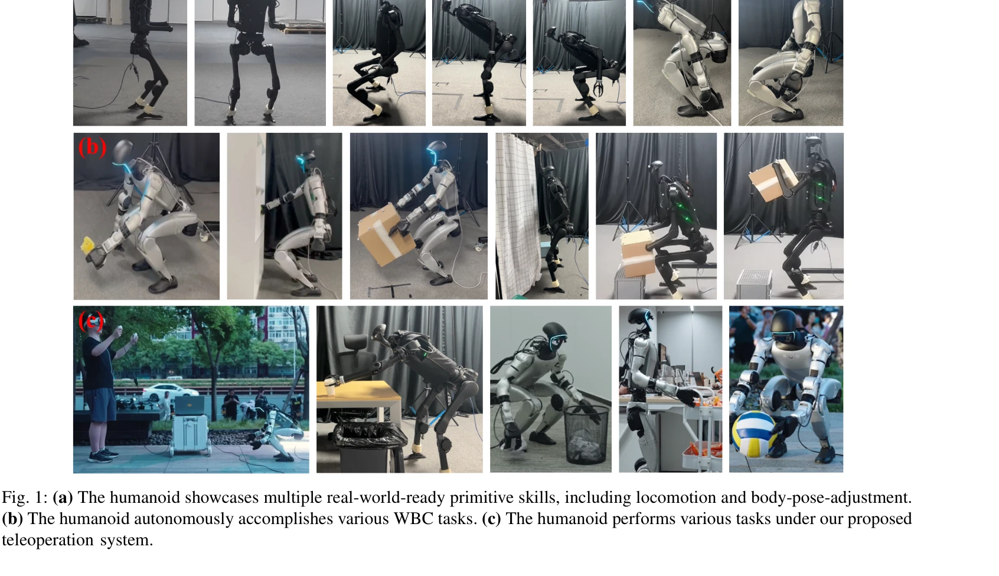
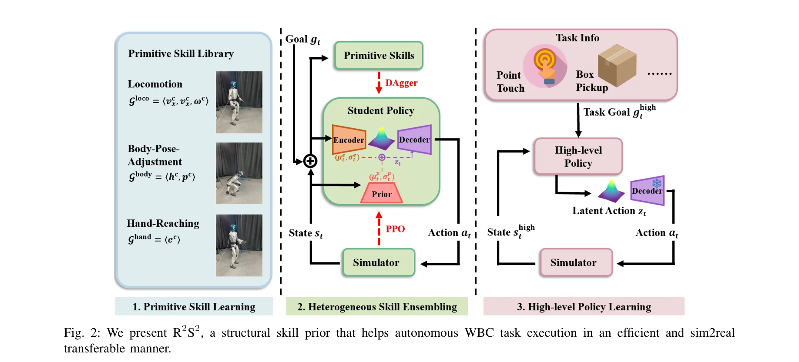

# Unleashing Humanoid Reaching Potential via Real-world-Ready Skill Space

> **저자**: Zhikai Zhang, Chao Chen, Han Xue, Jilong Wang, Sikai Liang, Yun Liu, Zongzhang Zhang, He Wang, Li Yi | **날짜**: 2025-05-16 | **URL**: [https://arxiv.org/abs/2505.10918](https://arxiv.org/abs/2505.10918)

---

## Essence

*Fig. 1: (a) The humanoid showcases multiple real-world-ready primitive skills, including locomotion and body-pose-adjust*

휴머노이드 로봇의 대규모 도달 공간 확보를 위해 사전 학습된 원시 스킬들을 통합하는 Real-world-Ready Skill Space (R2S2)를 제안하며, CVAE 기반의 통일된 신경 스킬 표현을 통해 효율적이고 sim2real 전이 가능한 전신 제어를 실현한다.

## Motivation

- **Known**: 최근 RL 기반 휴머노이드 전신 제어(WBC)는 로코모션과 신체 자세 조정을 결합하여 도달 능력을 시연했으나, 복잡한 보상 엔지니어링과 궤적 최적화에 의존하고 있다.
- **Gap**: 개별 스킬들을 독립적으로 학습하면 스킬 간 협력과 전환이 분포 밖이 되고, 이질적 스킬들이 불일치하는 명령 공간을 가지고 있어 통일된 표현이 부족하다.
- **Why**: 휴머노이드 로봇이 일상 작업을 수행하려면 인간 수준의 대규모 도달 공간이 필수적이며, 보상 엔지니어링 최소화와 강한 sim2real 전이 가능성이 실제 배포의 핵심 요구사항이다.
- **Approach**: 원시 스킬 라이브러리 구축 → 이질적 스킬 통합(heterogeneous skill ensembling)을 통한 CVAE 기반 통일 표현 학습 → R2S2로부터 샘플링하는 고수준 계획기 훈련으로 목표 도달 태스크 실현.

## Achievement

*Fig. 1: (a) The humanoid showcases multiple real-world-ready primitive skills, including locomotion and body-pose-adjust*

- **R2S2 프레임워크 제안**: 사전학습된 원시 스킬로부터 지식을 상속받으면서 통일된 신경 스킬 표현으로 확장하는 구조적 스킬 사전을 개발
- **최소 보상 엔지니어링**: 기존 AMO, HOMIE와 달리 복잡한 보상 설계나 인간 시연 없이 RL 탐색 활용
- **Dual 휴머노이드 플랫폼 검증**: Unitree G1(29 DoF)과 Unitree H1(1.8m 높이)에서 일반화 가능성 입증
- **실제 배포 성과**: 자율 목표 도달 태스크와 대규모 도달 공간을 지원하는 전신 텔레오퍼레이션 시스템 구현
- **Zero-shot Sim2Real 전이**: 광범위한 현실 세계 실험을 통해 강한 전이 가능성 검증

## How

*Fig. 2: We present R2S2, a structural skill prior that helps autonomous WBC task execution in an efficient and sim2real*

- 원시 스킬 라이브러리 구축: locomotion, body-pose-adjustment, end-effector 제어 등 개별 스킬을 실제 배포 가능하도록 별도 튜닝 및 sim2real 평가
- 이질적 스킬 통합: heterogeneous skill training environment에서 Imitation Learning과 Reinforcement Learning을 동적으로 조합
- CVAE 기반 학생 정책: 사전학습된 교사 정책들로부터 실제 배포 가능 스킬 사전을 상속받으면서 새로운 스킬 협력과 전환 탐색
- 통일 스킬 표현: proprioception에 조건화된 운동 스킬 분포를 신경망으로 모델링하여 다중 스킬 계획을 위한 효율적 표현 제공
- 고수준 계획기 훈련: R2S2로부터 스킬 샘플링을 수행하는 계획 정책을 태스크별로 학습하여 자율 실행

## Originality

- 기존 계층적 휴머노이드 제어 프레임워크(AMO, HOMIE)와 달리 MLP 기반 저수준 제어기의 1차 명령 공간이 아닌 CVAE 신경 스킬 공간에서 계획을 수행하는 참신한 설계
- 캐릭터 애니메이션의 인간 동작 사전과 달리 실제 배포 가능한 원시 스킬로부터 스킬 공간을 구축하는 실용적 접근
- 스킬 간 협력과 전환 문제를 이질적 스킬 통합 단계에서 명시적으로 해결하는 데커플링 전략
- RL 탐색과 IL 상속을 동적으로 조합하여 보상 엔지니어링과 인간 시연 없이도 다중 스킬 학습을 효율적으로 수행

## Limitation & Further Study

- 원시 스킬 라이브러리의 초기 구축이 수동으로 이루어지므로, 새로운 스킬 추가 시 개별 튜닝 및 sim2real 평가 필요
- CVAE 기반 표현의 계획 효율성과 다양성의 균형에 대한 상세한 분석 부족
- 복잡한 환경(동적 장애물, 협력 객체 조작 등) 확장성에 대한 평가 미흡
- 후속연구: 자동 스킬 발견 메커니즘, 더 복잡한 다체 조작 태스크로의 확장, 실시간 환경 적응 능력 강화

## Evaluation

- Novelty: 4/5
- Technical Soundness: 4/5
- Significance: 4/5
- Clarity: 4/5
- Overall: 4/5

**총평**: 이 논문은 휴머노이드 로봇의 대규모 도달 공간 실현이라는 중요한 문제를 실용적 관점에서 해결하며, 이질적 스킬 통합과 CVAE 기반 신경 스킬 표현이라는 참신한 기술을 통해 보상 엔지니어링 최소화와 강한 sim2real 전이를 동시에 달성한 우수한 연구이다.
