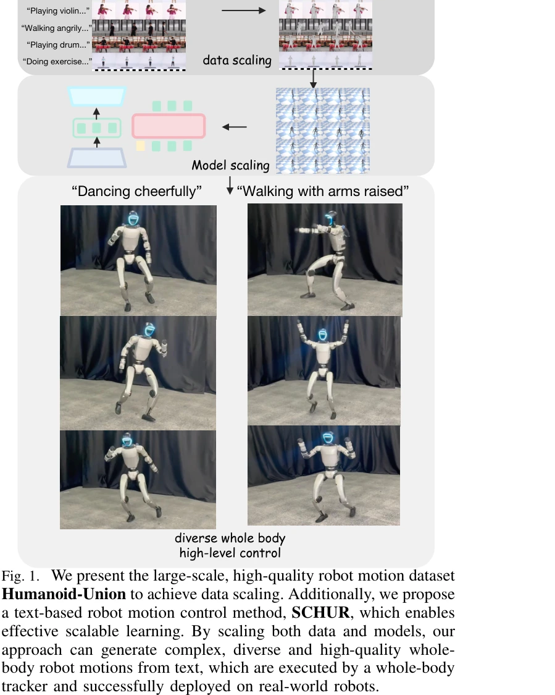
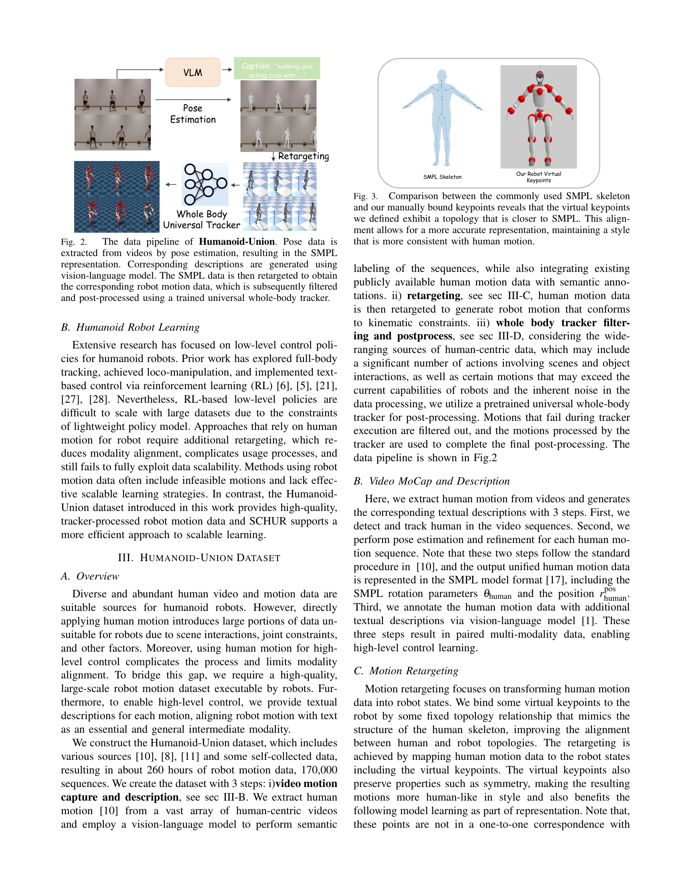

# Unveiling the Impact of Data and Model Scaling on High-Level Control for Humanoid Robots

> **저자**: Yuxi Wei, Zirui Wang, Kangning Yin, Yue Hu, Jingbo Wang, Siheng Chen | **날짜**: 2025-12-07 | **DOI**: [10.48550/arXiv.2511.09241](https://doi.org/10.48550/arXiv.2511.09241)

---

## Essence

*Fig. 1. We present the large-scale, high-quality robot motion dataset*

대규모 인간 모션 데이터를 활용하여 자동 파이프라인으로 생성한 Humanoid-Union 데이터셋(260시간)과 이를 기반으로 하는 SCHUR 프레임워크를 제안하여 텍스트 기반 휴머노이드 로봇 모션 생성의 확장성을 달성했다.

## Motivation

- **Known**: 휴머노이드 로봇 제어를 위해 인간 모션 데이터를 활용하는 연구가 진행되어 왔으나, 기존 연구들은 HumanML3D 같은 소규모 데이터셋(30시간 미만)에 의존하고 인간-로봇 모션 분포 불일치 및 실행 불가능한 모션 문제를 해결하지 못했다.
- **Gap**: 로봇 모션 표현 최적화 부재, 대규모 데이터 자동 필터링 파이프라인 부족, 효과적인 모델 확장 전략 미흡, 실제 로봇 배포 시 하체 모션 검증 부족 등이 남아있다.
- **Why**: 데이터 확장은 로봇 학습의 중요한 병목이며, 대규모 고품질 로봇 모션 데이터와 효과적인 확장 학습 전략을 통해 휴머노이드 로봇의 고수준 제어 능력과 일반화 성능을 향상시킬 수 있다.
- **Approach**: 자동 파이프라인을 통해 비디오 포즈 추정, SMPL 표현, 로봇 모션 retargeting, universal whole-body tracker를 이용한 필터링으로 고품질 로봇 모션 데이터셋을 구축하고, FSQ VAE 기반의 tokenization과 LLaMA 기반 autoregressive generation으로 텍스트-로봇 모션 정렬을 학습한다.

## Achievement

*Fig. 1. We present the large-scale, high-quality robot motion dataset*

- **Humanoid-Union 데이셋**: 260시간 이상의 대규모 다양한 휴머노이드 로봇 모션 데이터와 자동 생성된 의미론적 주석을 포함하며 확장 가능한 파이프라인 제공
- **SCHUR 프레임워크**: FSQ VAE tokenization과 prefix bidirectional attention mask를 활용한 텍스트 기반 고품질 로봇 모션 생성
- **성능 향상**: MPJPE에서 37% reconstruction 개선, FID에서 25% alignment 개선
- **실제 로봇 배포 검증**: 실제 휴머노이드 로봇에 성공적으로 배포 및 검증

## How

*Fig. 2.*

- 비디오로부터 pose estimation으로 SMPL 표현 추출
- GPT-4V 등 vision-language model으로 자동 caption 생성
- Human motion을 robot motion으로 retargeting
- Universal whole-body motion tracker로 물리적 제약 조건 준수하는 고품질 데이터만 필터링
- Root position, root orientation, DoF 외에 forward kinematics로 계산한 virtual keypoint 위치와 방향을 추가 표현으로 포함
- FSQ VAE를 사용한 효과적인 motion tokenization (VQ-VAE 대비 collapse 저항성 강화)
- LLaMA 기반 architecture에서 text prefix로 autoregressive token generation
- Codebook size와 모델 파라미터 증가를 통한 data/model scaling 실험

## Originality

- 자동 파이프라인으로 대규모 고품질 로봇 모션 데이셋을 인간 데이터에서 직접 생성하는 새로운 접근
- Direct robot motion generation으로 human-to-robot retargeting의 분포 불일치 문제 해결
- Virtual keypoint 표현을 robot motion에 통합하여 생성 품질 향상
- FSQ VAE의 scaling 특성을 로봇 모션에 처음 적용
- 실제 로봇에서의 tracking accuracy와 execution success rate로 검증하는 평가 방법론

## Limitation & Further Study

- 데이터셋 구축에서 universal tracker 품질에 의존하므로, tracker 오류가 최종 데이터 품질에 영향을 미칠 수 있음
- Virtual keypoint 추가로 인한 표현 차원 증가가 생성 복잡도에 미치는 영향에 대한 분석 부족
- 실험이 대부분 생성 모델 품질(MPJPE, FID)에 초점이며, 다양한 제어 패러다임(vision-based, affordance-based 등)으로의 확장 미흡
- 모델 확장의 상한선(saturation point)에 대한 탐구 부족 - 추가 확장이 여전히 효과적인지 불명확
- Real robot 실험이 제한적이므로, 다양한 로봇 플랫폼에서의 일반화 가능성 검증 필요

## Evaluation

- Novelty: 4/5
- Technical Soundness: 3/5
- Significance: 4/5
- Clarity: 4/5
- Overall: 4/5

**총평**: 본 논문은 대규모 자동화 파이프라인으로 고품질 로봇 모션 데이터셋을 구축하고, FSQ VAE 및 LLaMA 기반 SCHUR 프레임워크로 효과적인 data/model scaling을 달성하여 휴머노이드 로봇의 텍스트 기반 고수준 제어의 실질적 발전을 보여준다.
