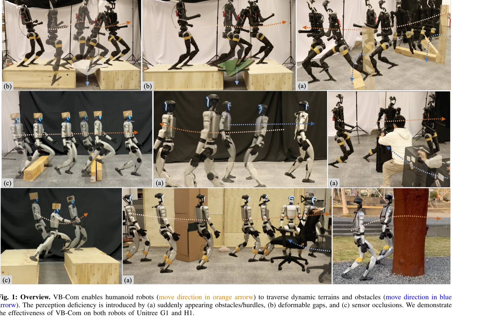
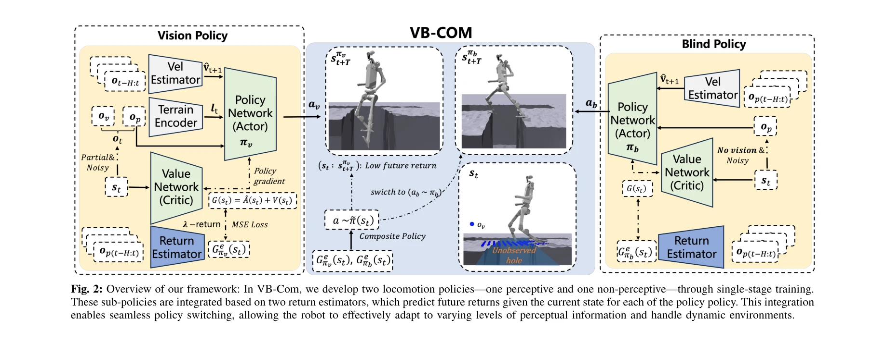

# VB-Com: Learning Vision-Blind Composite Humanoid Locomotion Against Deficient Perception

> **저자**: Junli Ren, Tao Huang, Huayi Wang, Zirui Wang, Qingwei Ben, Junfeng Long, Yanchao Yang, Jiangmiao Pang, Ping Luo | **날짜**: 2025-02-20 | **URL**: [https://arxiv.org/abs/2502.14814](https://arxiv.org/abs/2502.14814)

---

## Essence

*Fig. 1: Overview. VB-Com enables humanoid robots (move direction in orange arrorw) to traverse dynamic terrains and obst*

VB-Com은 휴머노이드 로봇이 시각 정보의 결손에 대응하기 위해 시각 기반 정책과 고유감각 기반의 맹목 정책을 동적으로 전환하는 복합 제어 프레임워크를 제안한다.

## Motivation

- **Known**: 다리 로봇의 운동 제어는 RL 기반으로 잘 연구되었으며, 시각 정책은 미리 계획하고 맹목 정책은 높은 견고성을 제공한다. 하지만 각각 속도 제한과 동적 환경 대응 능력의 한계가 있다.
- **Gap**: 휴머노이드 로봇은 불안정한 이족 구조로 인해 지각 결손에 매우 취약하며, 특히 동적 지형이나 센서 노이즈에 의한 신뢰할 수 없는 외부 상태 정보가 즉시 낙상으로 이어질 수 있다. 기존 연구는 주로 정적 지형에 제한되어 있다.
- **Why**: 동적 장애물과 변형 지형을 포함한 복잡한 환경에서 휴머노이드 로봇의 안정적 운동이 가능해지면 실제 환경 배포 시 견고성과 성능 간 트레이드오프를 해결할 수 있어 실용적 가치가 높다.
- **Approach**: 비전 정책과 맹목 정책 두 개를 독립적으로 훈련하고, return estimator를 통해 각 정책의 미래 성능을 예측하여 현재 고유감각 상태에 기반해 두 정책 중 하나를 선택하도록 하는 방식이다.

## Achievement

*Fig. 1: Overview. VB-Com enables humanoid robots (move direction in orange arrorw) to traverse dynamic terrains and obst*

- **비전 및 맹목 정책 개발**: 간격 통과, 허들 회피, 장애물 회피가 가능한 두 개의 독립적 휴머노이드 로봇 운동 정책 구현
- **하드웨어 배포 가능한 Return Estimator**: 고유감각 상태만으로 미래 return을 예측하는 학습 가능한 추정기 개발
- **적응형 정책 합성 시스템**: 지각 결손 상황에서 동적으로 정책을 전환하여 Unitree G1, H1에서 동적 장애물과 지형 통과 성공

## How

*Fig. 2: Overview of our framework: In VB-Com, we develop two locomotion policies—one perceptive and one non-perceptive—t*

- PPO를 사용하여 외부 시각 정보를 입력받는 비전 정책과 고유감각만 사용하는 맹목 정책을 별도로 훈련
- 각 정책의 value function을 통해 현재 상태에서 달성 가능한 기대 return을 추정하는 return estimator 학습
- 현재 고유감각 관측값 기반으로 두 정책의 예상 return을 비교하여 선택 확률을 결정
- Generalized Advantage Estimation (GAE)를 활용하여 return 추정 정확도 향상
- 시뮬레이션에서 4가지 유형의 지각 노이즈(갑작스러운 장애물, 변형 간격, 센서 폐색, 노이즈)를 도입하여 훈련 및 평가

## Originality

- 휴머노이드 로봇의 불안정한 이족 구조에 특화된 지각 결손 대응 방법론 제시 (기존 연구는 주로 사족 로봇)
- 정책 선택을 위해 return estimator를 사용하는 접근—단순 threshold 기반이 아닌 학습 가능한 affordance 추정
- 비전 정책과 맹목 정책의 동일한 상태-행동 공간 공유로 빠른 회복 가능성 실현
- 동적 지형, 변형 간격 등 기존 시뮬레이션에서 다루기 어려운 시나리오 시스템적으로 포함

## Limitation & Further Study

- 훈련 중 적용된 4가지 지각 노이즈 유형이 제한적일 수 있으며, 다른 형태의 센서 실패에 대한 일반화 능력 미검증
- Return estimator의 성능이 전체 시스템의 효과성에 결정적이지만, 고유감각만으로 복잡한 외부 상태를 추정하는 데 내재적 한계 존재
- 실제 로봇 배포 결과가 제한적이며 시뮬레이션-현실 갭(sim-to-real gap)에 대한 상세 논의 부족
- 정책 전환 시 지연이나 부자연스러운 동작 전환에 대한 분석 미흡
- 후속 연구로 더 복잡한 지각 결손 패턴, 다중 로봇 협력, 온라인 적응형 학습 메커니즘 필요

## Evaluation

- Novelty: 4/5
- Technical Soundness: 3/5
- Significance: 4/5
- Clarity: 4/5
- Overall: 4/5

**총평**: VB-Com은 휴머노이드 로봇의 지각 견고성 문제를 정책 합성으로 우아하게 해결하며, return estimator 기반 동적 선택 메커니즘은 창의적이고 실용적이다. 동적 지형 및 지각 노이즈 시나리오의 체계적 구성과 두 휴머노이드 플랫폼에서의 검증이 강점이나, 실제 배포 결과 확장과 일반화 능력 분석이 보강되면 더욱 설득력 있을 것이다.
