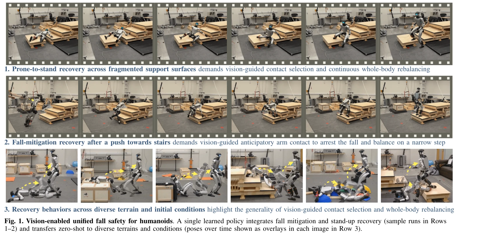

# VIGOR: Visual Goal-In-Context Inference for Unified Humanoid Fall Safety

> **저자**: Osher Azulay, Zhengjie Xu, Andrew Scheffer, Stella X. Yu | **날짜**: 2026-03-03 | **DOI**: [10.48550/arXiv.2602.16511](https://doi.org/10.48550/arXiv.2602.16511)

---

## Essence

*Fig. 1. Vision-enabled unified fall safety for humanoids. A single learned policy integrates fall mitigation and stand-u*

휴머노이드 로봇의 넘어짐 안전성을 위해 teacher-student 증류 방식으로 egocentric depth와 proprioception만 사용하여 시각적 goal-in-context 표현을 학습하는 통합 접근법을 제시한다.

## Motivation

- **Known**: 휴머노이드 로봇의 넘어짐 안전성은 fall avoidance, impact mitigation, stand-up recovery로 분리되어 연구되어 왔으며, 기존 학습 기반 방법들은 proprioception만 사용하거나 flat terrain에서만 학습된다.
- **Gap**: fall mitigation과 recovery의 coupling 관계를 간과하고, 시각 정보를 통합하지 못하며, pose-dynamics-terrain을 monolithic 데이터 문제로 처리하여 확장성과 일반화 능력이 제한된다.
- **Why**: 휴머노이드는 높은 무게중심과 복잡한 접촉 동역학으로 인해 넘어짐이 빈번하고, 실제 환경의 복잡한 지형에서 안정적인 recovery가 필수적이다.
- **Approach**: Natural human pose가 지형 간 이동 가능하다는 통찰과 빠른 whole-body reaction이 통합된 perceptual-motor 표현을 필요로 한다는 통찰에 기반하여, sparse human demonstration으로 privileged teacher를 학습하고 이를 egocentric vision 기반 student로 증류한다.

## Achievement

*Fig. 1. Vision-enabled unified fall safety for humanoids. A single learned policy integrates fall mitigation and stand-u*

- **통합 fall safety 프레임워크**: fall avoidance, impact mitigation, stand-up recovery를 단일 정책으로 처리
- **factorized data generation**: pose와 terrain을 독립적 요소로 분해하여 sample-efficient learning 달성
- **visual goal-in-context representation**: 목표 pose와 로컬 terrain을 단일 latent 공간에 통합
- **zero-shot transfer**: 시뮬레이션에서 학습한 정책이 실제 Unitree G1 로봇에서 다양한 non-flat 환경에 전이

## How

*Fig. 2: Factorized data generation yields sample-efficient imitation and scalable adaptation for humanoid fall safety*

- Sparse human demonstration을 flat terrain에서 수집하고 motion retargeting으로 정규화
- RL을 사용하여 privileged teacher 정책 학습 (terrain geometry 접근 가능)
- Teacher의 goal-in-context latent representation을 student에게 matching loss로 증류
- Student는 egocentric depth image와 proprioceptive history만 사용
- 다양한 시뮬레이션 환경(rough, fragmented, stair 등)에서 학습 및 평가
- Real-world deployment는 추가 fine-tuning 없이 수행

## Originality

- Fall safety 문제를 처음으로 unified visual perception-action 프레임워크로 접근
- Goal-in-context latent representation이라는 novel한 perceptual-motor abstraction 제안
- Pose-terrain factorization을 통한 monolithic data complexity 해결 방법 제시
- Fall recovery 중 dynamic viewpoint 변화를 처리하는 egocentric depth 기반 접근이 신규

## Limitation & Further Study

- Real-world 실험이 단일 로봇(Unitree G1) 플랫폼에만 수행됨
- Teacher 정책 학습에 필요한 sparse human demonstration의 수집 과정이 완전히 자동화되지 않음
- 극단적인 충격이나 매우 높은 낙하(예: 계단에서의 다단계 낙하)에 대한 평가 부족
- 추가 일반화 테스트: 다른 휴머노이드 형태, 실내/실외 환경, 동적 장애물 고려

## Evaluation

- Novelty: 4/5
- Technical Soundness: 3/5
- Significance: 4/5
- Clarity: 4/5
- Overall: 4/5

**총평**: 휴머노이드의 통합적 fall safety를 시각 기반으로 해결하는 창의적 접근으로, factorized data generation과 goal-in-context representation의 개념이 우수하며 zero-shot transfer 결과가 인상적이다. 다만 실제 환경 적용성을 더 광범위하게 검증할 필요가 있다.

## Related Papers

- 🔄 다른 접근: [[papers/1661_SafeFall_Learning_Protective_Control_for_Humanoid_Robots/review]] — 휴머노이드 안전성에서 넘어짐 안전과 보호 제어라는 서로 다른 안전 메커니즘을 다룬다.
- 🔗 후속 연구: [[papers/1880_Discovering_Self-Protective_Falling_Policy_for_Humanoid_Robo/review]] — 휴머노이드 넘어짐 안전에서 goal-in-context 추론과 자기보호 정책이라는 보완적 접근법을 제시한다.
- 🏛 기반 연구: [[papers/2068_Learning_to_Get_Up_Across_Morphologies_Zero-Shot_Recovery_wi/review]] — 다양한 형태에서의 zero-shot 회복 능력이 VIGOR의 통합된 넘어짐 안전 접근법과 관련된다.
- 🏛 기반 연구: [[papers/1954_Geometry-Aware_Predictive_Safety_Filters_on_Humanoids_From_P/review]] — geometry-aware 예측 안전 필터 기술이 VIGOR의 넘어짐 방지 메커니즘에 이론적 기반을 제공합니다.
- 🔗 후속 연구: [[papers/2171_Unified_Humanoid_Fall-Safety_Policy_from_a_Few_Demonstration/review]] — 소수 시연에서 학습한 통합 낙상 안전 정책을 VIGOR의 시각적 추론 방식과 결합할 수 있습니다.
- 🔄 다른 접근: [[papers/1686_SPARK_Safe_Protective_and_Assistive_Robot_Kit/review]] — 휴머노이드 안전성을 위해 서로 다른 접근(넘어짐 특화 안전 시스템 vs 포괄적 벤치마크 프레임워크)을 통해 안전한 자율 제어를 실현한다.
- 🏛 기반 연구: [[papers/1897_Ego-Vision_World_Model_for_Humanoid_Contact_Planning/review]] — 휴머노이드 접촉 계획을 위한 ego-vision 월드 모델의 개념을 넘어짐 안전성이라는 특정 목표로 확장하여 teacher-student 증류 방식을 적용했다.
- 🔄 다른 접근: [[papers/1686_SPARK_Safe_Protective_and_Assistive_Robot_Kit/review]] — 휴머노이드 안전성을 위해 서로 다른 접근(포괄적 벤치마크 프레임워크 vs 넘어짐 특화 안전 시스템)을 통해 안전한 자율 제어를 실현한다.
- 🏛 기반 연구: [[papers/1892_E-SDS_Environment-aware_See_it_Do_it_Sorted_-_Automated_Envi/review]] — vision-based goal inference가 E-SDS의 VLM 기반 환경 인식 보행 정책 학습에 시각적 목표 설정의 이론적 토대를 제공한다.
- 🏛 기반 연구: [[papers/2055_Learning_Humanoid_End-Effector_Control_for_Open-Vocabulary_V/review]] — 비전 기반 목표 추론의 원리가 HERO 시스템의 open-vocabulary 객체 인식 및 조작에 대한 이론적 토대를 제공한다.
