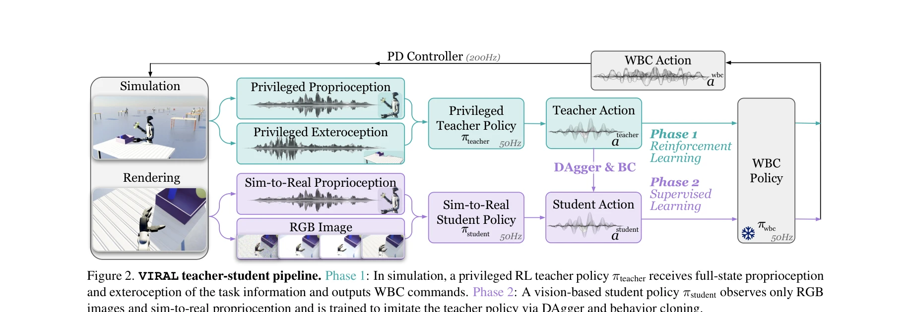
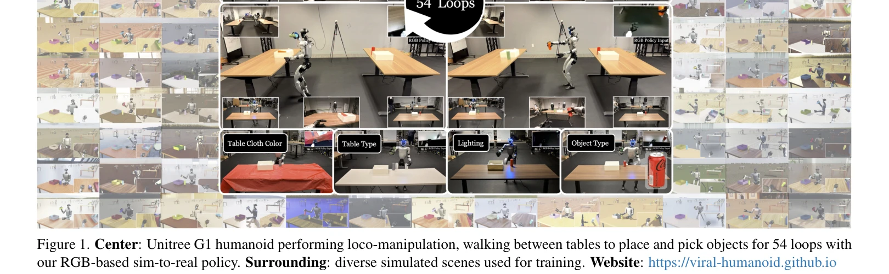

# VIRAL: Visual Sim-to-Real at Scale for Humanoid Loco-Manipulation

> **저자**: Tairan He, Zi Wang, Haoru Xue, Qingwei Ben, Zhengyi Luo, Wenli Xiao, Ye Yuan, Xingye Da, Fernando Castañeda, Shankar Sastry, Changliu Liu, Guanya Shi, Linxi Fan, Yuke Zhu | **날짜**: 2025-11-27 | **DOI**: [10.48550/arXiv.2511.15200](https://doi.org/10.48550/arXiv.2511.15200)

---

## Essence

*Figure 2. VIRAL teacher-student pipeline. Phase 1: In simulation, a privileged RL teacher policy πteacher receives full-*

VIRAL은 humanoid robot의 loco-manipulation을 시뮬레이션에서 학습하고 zero-shot으로 실제 로봇에 배포하는 visual sim-to-real 프레임워크이며, teacher-student 구조와 대규모 GPU 컴퓨팅을 활용하여 RGB 기반 정책을 통해 54개 사이클의 연속적인 객체 이동을 달성했다.

## Motivation

- **Known**: Sim-to-real은 legged locomotion에서 성공적으로 적용되었고, visual sim-to-real은 tabletop manipulation 등에서 구현되어 왔다. 최근 대규모 실제 데이터 수집을 통한 foundation model 접근이 로보틱스에서 시도되고 있다.
- **Gap**: Humanoid loco-manipulation은 locomotion과 manipulation을 결합해야 하며 모바일 플랫폼의 높은 자유도로 인해 많은 실제 데이터가 필요한데, 현재 대부분의 humanoid 시스템은 blind locomotion, 고정 tabletop manipulation, 또는 원격 조종에 의존하고 있다.
- **Why**: Humanoid robot이 일반 목적의 물리 지능을 구현하려면 장기간에 걸친 자율적 loco-manipulation이 필수적이며, 실제 데이터 수집의 비용 대비 시뮬레이션 기반 접근의 효율성이 높아 대규모 배포의 실현성을 높인다.
- **Approach**: Teacher-student 구조로 privileged state를 활용한 RL teacher를 먼저 학습하고, 이를 RGB 기반 student policy로 distill하며, DAgger와 behavior cloning의 혼합, 대규모 visual domain randomization, 그리고 실제 하드웨어와의 real-to-sim alignment를 통해 sim-to-real 전이를 달성한다.

## Achievement

*Figure 1. Center: Unitree G1 humanoid performing loco-manipulation, walking between tables to place and pick objects for*

- **54 사이클 연속 loco-manipulation**: Unitree G1 humanoid가 테이블 간 이동, 객체 배치, 파지, 운반을 54개 사이클에 걸쳐 연속으로 수행
- **Zero-shot 실제 배포**: 시뮬레이션에서 학습한 정책이 실제 로봇에 미세 조정 없이 바로 배포 가능
- **전문가 수준의 성능**: 원격 조종 성능 수준에 근접한 성공률 달성
- **일반화 능력**: 공간적 및 시각적 변화에 대한 강건한 일반화 (diverse spatial and appearance variations)
- **대규모 GPU 컴퓨팅의 효과**: 64개 GPU 스케일링이 teacher와 student 학습의 안정성 향상에 필수적임을 실증

## How

*Figure 2. VIRAL teacher-student pipeline. Phase 1: In simulation, a privileged RL teacher policy πteacher receives full-*

- **Teacher 정책 학습**: Privileged state (full proprioception, exteroception, object transforms)를 입력으로 하는 PPO 기반 RL teacher를 16개 GPU로 학습
- **Action space 설계**: Delta velocity commands (∆v_t, ∆ω_t)와 delta joint targets (∆q_arm_t, ∆q_finger_t)를 WBC policy에 입력
- **Stage-based reward design**: Walking, placing, grasping, turning의 4개 단계별 reward 정의 (exponential distance, force-based, height-based 등)
- **Reference state initialization**: 시연으로부터 환경 초기화를 통한 RL 학습 부스팅
- **Student 정책 distillation**: 64개 GPU의 Isaac Lab tiled rendering을 활용한 대규모 시뮬레이션에서 DAgger와 behavior cloning 혼합으로 학습
- **Visual domain randomization**: Lighting, materials, camera parameters, image quality, sensor delays 등 다양한 시각 요소 무작위화
- **Real-to-sim alignment**: Dexterous hand의 system identification과 camera extrinsics calibration을 통한 시뮬레이터-실제 하드웨어 정렬

## Originality

- Humanoid loco-manipulation에 teacher-student privileged learning을 대규모 GPU 컴퓨팅과 결합한 최초의 체계적 적용
- 시뮬레이션 기반 humanoid loco-manipulation에서 visual sim-to-real의 실제 가능성을 광범위한 ablation과 함께 실증
- Delta action space와 reference state initialization, stage-based reward design, multi-modal distillation 등의 설계 선택 사항들이 실제 배포에 미치는 영향을 체계적으로 분석
- 64개 GPU 규모의 병렬 시뮬레이션 인프라를 통한 시뮬레이션 효율 극대화

## Limitation & Further Study

- **작업 복잡도 제한**: 현재 프레임워크는 walking, placing, grasping, object transport 등 사전 정의된 작업 시퀀스에 제한되어 있으며, 더 복잡하거나 예측 불가능한 작업으로의 확장성 미검증
- **환경 다양성**: 테이블과 객체 배치에 대한 특정 설정에 최적화되어 있으며, 크게 다른 환경 구조로의 일반화 가능성 불명확
- **컴퓨팅 자원 의존성**: 안정적인 학습을 위해 64개 GPU 규모의 대규모 컴퓨팅 자원이 필수적이므로 접근성과 확장성 제한
- **실제 로봇 하드웨어 특수성**: Unitree G1 humanoid에만 검증되었으며, 다른 humanoid 플랫폼으로의 전이 가능성 미검증
- **후속 연구 방향**: 장기-단기 스킬 학습 및 재사용을 위한 계층적 제어 구조 개발, 실시간 환경 적응 메커니즘, 다중 로봇 협력 loco-manipulation 확장

## Evaluation

- Novelty: 4/5
- Technical Soundness: 4/5
- Significance: 4/5
- Clarity: 4/5
- Overall: 4/5

**총평**: 본 논문은 humanoid loco-manipulation에 대한 시뮬레이션 기반 접근의 실현 가능성을 대규모 GPU 컴퓨팅과 체계적인 설계를 통해 실증한 중요한 연구로, teacher-student 프레임워크와 visual domain randomization의 조합이 zero-shot sim-to-real 전이를 가능하게 함을 보여준다.

## Related Papers

- 🔄 다른 접근: [[papers/1753_VisualMimic_Visual_Humanoid_Loco-Manipulation_via_Motion_Tra/review]] — 둘 다 visual sim-to-real humanoid loco-manipulation을 다루지만 VisualMimic은 motion tracking에 더 초점을 맞춥니다.
- 🔗 후속 연구: [[papers/2125_Opening_the_Sim-to-Real_Door_for_Humanoid_Pixel-to-Action_Po/review]] — VIRAL의 visual sim-to-real 프레임워크가 pixel-to-action 정책 배포의 기반이 됩니다.
- 🏛 기반 연구: [[papers/1673_Sim-and-Real_Co-Training_A_Simple_Recipe_for_Vision-Based_Ro/review]] — Sim-and-Real Co-Training의 방법론이 VIRAL의 teacher-student 구조 설계에 영향을 줍니다.
- 🏛 기반 연구: [[papers/1751_Visual_Imitation_Enables_Contextual_Humanoid_Control/review]] — visual sim-to-real 접근법에서 RGB 기반 정책과 4D 기하학 재구성이라는 보완적 시각 처리 방법을 사용한다.
- 🔗 후속 연구: [[papers/1674_Sim-to-Real_Learning_for_Humanoid_Box_Loco-Manipulation/review]] — 휴머노이드 박스 로코-조작을 위한 sim-to-real 학습을 대규모 visual sim-to-real 프레임워크로 확장하여 teacher-student 구조를 통한 54사이클 연속 작업을 실현했다.
- 🔄 다른 접근: [[papers/1850_Contrastive_Representation_Learning_for_Robust_Sim-to-Real_T/review]] — 강건한 sim-to-real 전이를 위해 서로 다른 접근(대규모 visual 프레임워크 vs 대조적 표현 학습)을 통해 현실 환경에서의 성능을 보장한다.
- 🔄 다른 접근: [[papers/1673_Sim-and-Real_Co-Training_A_Simple_Recipe_for_Vision-Based_Ro/review]] — sim-to-real 전이에서 co-training과 teacher-student 구조라는 서로 다른 접근법을 사용하여 시뮬레이션-실제 간격을 해결한다.
- 🔗 후속 연구: [[papers/1751_Visual_Imitation_Enables_Contextual_Humanoid_Control/review]] — 휴머노이드 loco-manipulation에서 4D 기하학 재구성과 visual sim-to-real이라는 보완적 시각 처리 접근법을 다룬다.
- 🔄 다른 접근: [[papers/1753_VisualMimic_Visual_Humanoid_Loco-Manipulation_via_Motion_Tra/review]] — 둘 다 visual humanoid loco-manipulation을 다루지만 VIRAL은 대규모 GPU 컴퓨팅에, VisualMimic은 motion tracking에 특화됩니다.
- 🧪 응용 사례: [[papers/1858_cuRoboV2_Dynamics-Aware_Motion_Generation_with_Depth-Fused_D/review]] — VIRAL의 대규모 시각적 sim-to-real 전환 과정에서 cuRoboV2의 통합적 동역학 인식 운동 생성이 핵심적인 역할을 수행한다.
- 🔗 후속 연구: [[papers/1901_EgoHumanoid_Unlocking_In-the-Wild_Loco-Manipulation_with_Rob/review]] — EgoHumanoid의 대규모 인간 시연 데이터는 VIRAL의 visual sim-to-real 프레임워크를 보완하여 실제 환경 적응력을 크게 향상시킬 수 있다.
- 🔄 다른 접근: [[papers/2125_Opening_the_Sim-to-Real_Door_for_Humanoid_Pixel-to-Action_Po/review]] — VIRAL의 visual sim-to-real at scale이 Opening the Door의 GPU 가속 포토리얼리스틱 시뮬레이션과 다른 스케일로 유사한 visual policy transfer 문제를 해결합니다.
