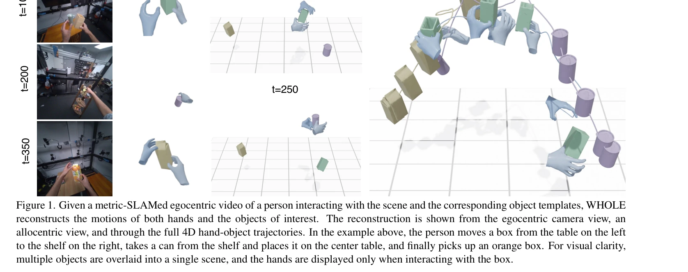

# WHOLE: World-Grounded Hand-Object Lifted from Egocentric Videos

> **저자**: Yufei Ye, Jiaman Li, Ryan Rong, C. Karen Liu | **날짜**: 2026-02-25 | **URL**: [https://arxiv.org/abs/2602.22209](https://arxiv.org/abs/2602.22209)

---

## Essence

*Figure 2. Reconstruction Using the Generative Motion Prior. Given a metric-SLAMed egocentric videos, and the object temp*

WHOLE는 손잡이와 물체의 상호작용을 joint generative motion prior를 통해 이용하여 egocentric 비디오에서 world space로의 hand-object 궤적을 holistically 재구성한다.

## Motivation

- **Known**: 기존 방법들은 hand pose estimation과 object pose estimation을 독립적으로 수행하거나, short temporal window에서 상세한 기하학을 복원하는 데 초점을 맞춘다.
- **Gap**: 손과 물체의 상호작용을 joint으로 모델링하면서 global 3D world frame에서 장시간의 coherent 궤적을 복원하는 통합적 접근이 부재하다.
- **Why**: egocentric manipulation 이해는 robot learning from demonstrations 및 AR/VR 환경 등 downstream applications에 필수적이며, 손과 물체의 관계적 일관성을 확보해야 정확한 interaction modeling이 가능하다.
- **Approach**: diffusion 기반 generative motion prior를 학습하여 hand-object interaction의 mutual dynamics를 모델링하고, test time에 visual observations와 VLM-derived contact cues로 guided generation을 수행하여 globally consistent trajectories를 생성한다.

## Achievement

*Figure 1. Given a metric-SLAMed egocentric video of a person interacting with the scene and the corresponding object tem*

- **Joint Generative Prior**: hand와 object의 상호의존적 동작을 jointly reason하는 diffusion-based motion prior 학습으로 separate prediction의 inconsistency 문제 해결
- **VLM-enhanced Contact Detection**: spatially grounded visual prompts로 enhanced vision-language model이 cluttered scenes에서도 robust contact localization 달성
- **State-of-the-art Performance**: hand motion estimation, 6D object pose estimation, interaction reconstruction 모두에서 baseline methods를 크게 초과하는 성능
- **Global 4D Motion Reconstruction**: metric-SLAM을 활용하여 world coordinate frame에서 long temporal sequences의 coherent hand-object trajectories 복원

## How

*Figure 2. Reconstruction Using the Generative Motion Prior. Given a metric-SLAMed egocentric videos, and the object temp*

- Diffusion model을 gravity-aware local frame에서 hand-object motion의 conditional distribution p(H, T, C | O, H̄)로 학습
- Off-the-shelf hand estimator로부터 approximate hand trajectory H̄을 초기 조건으로 활용
- Test time에 diffusion과 guidance step을 번갈아 수행하여 iterative refinement
- 2D segmentation masks를 visual observation으로 하여 reprojection guidance objective 구성
- VLM (vision-language model)에 spatial prompt engineering을 적용하여 자동 contact label 생성
- Contact labels를 binary indicator Ct=1:T로 모델링하여 interaction constraint로 활용
- Fixed-length time window (T=120)에서 처리하여 computational efficiency 확보

## Originality

- Hand-object interaction을 joint generative prior로 모델링하는 novel formulation - 기존 isolated pose estimation과 차별화
- Guided generation framework를 통해 generative prior를 test-time observation으로 condition하는 새로운 inference strategy
- VLM의 spatial grounding capability를 강화하는 visual prompt design로 자동 contact annotation 가능하게 함
- Global 4D world-space trajectory reconstruction에 joint interaction modeling을 처음 체계적으로 적용

## Limitation & Further Study

- Object template 제공이 필수 requirement - template-free approaches에 비해 제약이 있음
- Metric-SLAM 입력에 의존하므로 camera localization 오류가 누적될 수 있음
- T=120 fixed-length window로 인한 temporal flexibility 제약 - 매우 길거나 복잡한 interaction sequence 처리 어려움
- VLM 기반 contact labeling의 robustness가 visual complexity에 따라 변할 수 있음
- 후속 연구: template-free object reconstruction 통합, sliding window를 이용한 arbitrary length sequence 처리, more sophisticated temporal modeling (e.g., Transformer-based prior)

## Evaluation

- Novelty: 4/5
- Technical Soundness: 4/5
- Significance: 4/5
- Clarity: 4/5
- Overall: 4/5

**총평**: WHOLE는 hand-object interaction을 joint generative prior로 모델링하여 egocentric video에서 globally consistent world-space trajectories를 복원하는 혁신적 접근으로, 기존 isolated method들의 inconsistency 문제를 근본적으로 해결하며 practical application에 중요한 기여를 한다.

## Related Papers

- 🔄 다른 접근: [[papers/1900_EgoDex_Learning_Dexterous_Manipulation_from_Large-Scale_Egoc/review]] — egocentric video에서 hand-object 상호작용 재구성을 다루며, world-grounded lifting과 large-scale dexterity라는 서로 다른 접근법을 사용한다.
- 🔗 후속 연구: [[papers/2022_In-N-On_Scaling_Egocentric_Manipulation_with_in-the-wild_and/review]] — egocentric manipulation에서 hand-object 궤적 재구성과 in-the-wild/on-table 조작이라는 보완적 데이터 활용 접근법을 다룬다.
- 🏛 기반 연구: [[papers/1899_EgoDemoGen_Egocentric_Demonstration_Generation_for_Viewpoint/review]] — egocentric video 기반 demonstration에서 hand-object holistic reconstruction과 viewpoint-agnostic generation이라는 관련 방법론을 사용한다.
- 🏛 기반 연구: [[papers/1616_PICO_Reconstructing_3D_People_In_Contact_with_Objects/review]] — PICO-db 데이터셋의 밀집된 3D 접촉 주석이 WHOLE의 egocentric hand-object interaction 학습에 필수적인 ground truth를 제공한다
- 🏛 기반 연구: [[papers/1826_Biomechanical_Comparisons_Reveal_Divergence_of_Human_and_Hum/review]] — 인간 참조 데이터를 활용한 전신 로봇 보행이 GDAF의 인간-로봇 보행 비교 분석에 필요한 기준 데이터를 제공한다
- 🏛 기반 연구: [[papers/1779_A_Humanoid_Visual-Tactile-Action_Dataset_for_Contact-Rich_Ma/review]] — egocentric 비디오에서 손-물체 상호작용을 학습하는 WHOLE의 기법이 시각-촉각-행동 데이터셋 구축에 기반을 제공합니다.
- 🧪 응용 사례: [[papers/1933_FRAME_Floor-aligned_Representation_for_Avatar_Motion_from_Eg/review]] — FRAME의 egocentric 자세 추정을 WHOLE의 world-grounded hand-object 학습에 적용하여 더 정확한 손-물체 상호작용 모델링이 가능하다.
- 🏛 기반 연구: [[papers/1966_Hand-Eye_Autonomous_Delivery_Learning_Humanoid_Navigation_Lo/review]] — 에고센트릭 비디오에서의 손-객체 상호작용이 손-눈 학습의 기반 기술이다.
- 🏛 기반 연구: [[papers/2169_UniDex_A_Robot_Foundation_Suite_for_Universal_Dexterous_Hand/review]] — 자기중심 비디오에서 전신 손-객체 상호작용 학습의 기본 기술이 UniDex의 범용 손재주 제어에 적용된다.
- 🔗 후속 연구: [[papers/2130_OSMO_Open-Source_Tactile_Glove_for_Human-to-Robot_Skill_Tran/review]] — WHOLE의 hand-object interaction 데이터가 OSMO 촉각 피드백과 함께 사용되면 embodiment 격차를 더 효과적으로 해소할 수 있음
