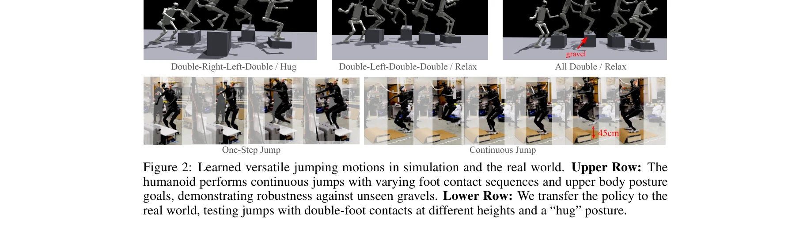

# WoCoCo: Learning Whole-Body Humanoid Control with Sequential Contacts

> **저자**: Chong Zhang, Wenli Xiao, Tairan He, Guanya Shi | **날짜**: 2024-06-10 | **URL**: [https://arxiv.org/abs/2406.06005](https://arxiv.org/abs/2406.06005)

---

## Essence

*Figure 1: An overview of WoCoCo and tasks. (A) We decompose the task into separate contact*

WoCoCo는 순차적 접촉(sequential contacts)을 포함한 전신 휴머노이드 제어를 학습하기 위한 통합 RL 프레임워크로, 작업을 접촉 단계별로 분해하여 task-agnostic 보상 설계와 sim-to-real 파이프라인을 제시한다.

## Motivation

- **Known**: Model-free RL은 강건한 휴머노이드 제어를 가능하게 했으나, 순차적 접촉이 필요한 작업에서는 task-specific 튜닝, 상태 머신 설계, 그리고 장기 탐색 문제를 겪고 있다. 반면 model-based 방법은 일반성은 있으나 시간이 오래 걸린다.
- **Gap**: 기존 RL 기반 휴머노이드 제어 연구는 개별 작업별로 특화된 정책을 요구하며, 여러 접촉 시퀀스를 포함한 작업에 일관되게 적용할 수 있는 체계적이고 일반화된 방법이 부족하다.
- **Why**: 순차적 접촉을 수반하는 파쿠르 점프, 박스 조작, 댄싱, 절벽 등반 등의 작업은 현실 로봇 운영에서 중요하며, 일반화 가능한 학습 프레임워크는 실제 배포의 효율성과 실용성을 크게 향상시킨다.
- **Approach**: 작업을 접촉 목표(contact goal)와 작업 목표(task goal)로 정의된 별도의 접촉 단계로 자연스럽게 분해하고, task-agnostic WoCoCo 보상(접촉 보상, 단계 카운트 보상, 호기심 보상)과 domain randomization 기반 sim-to-real 파이프라인을 설계한다.

## Achievement

*Figure 1: An overview of WoCoCo and tasks. (A) We decompose the task into separate contact*

- **일반화된 프레임워크**: 휴머노이드와 22-DoF 공룡 로봇까지 적용 가능한 통일된 RL 프레임워크 제시
- **현실 검증**: 파쿠르 점프, 박스 로코-조작, 댄싱, 절벽 등반 등 4가지 도전적인 휴머노이드 작업을 end-to-end RL로 실제 로봇에서 성공 (각 작업의 첫 RL 기반 해결)
- **Task-agnostic 설계**: 각 작업마다 1-2개의 task-specific 항만 지정하면 되는 최소한의 튜닝으로 다양한 접촉 시퀀스 대응
- **탐색 효율성 개선**: 단계별 분해를 통해 긴 지평선 탐색 문제 완화 및 dense contact rewards로 접촉 기반 탐색 가이드

## How

*Figure 2: Learned versatile jumping motions in simulation and the real world. Upper Row: The*

- **접촉 단계 분해**: 작업을 predefined 접촉 시퀀스 기반 다중 단계로 분해하여 MDP를 확장
- **Dense Contact Rewards (r_con)**: 개별 접촉의 정확/오류를 세어서 0-1 보상보다 더 촘촘한 신호 제공
- **Stage Count Rewards (r_stage)**: 완료된 단계 수에 따라 정책이 현 단계에만 머물러있는 단기적 행동 억제
- **Curiosity Rewards (r_curi)**: Task-agnostic 호기심 보상으로 상태 공간 탐색 촉진
- **Curriculum-based Sim-to-Real**: 비도메인 랜더마이제이션 → 도메인 랜더마이제이션 → 정규화 보상 증가의 3단계 커리큘럼으로 sim-to-real 전환 부담 완화
- **PPO + 대칭성 증강**: PPO 알고리즘에 symmetry augmentation 적용하여 Isaac Gym에서 학습

## Originality

- **자연스러운 작업 분해**: 접촉 시퀀스 기반 단계 분해는 직관적이며 탐색을 체계적으로 단순화
- **Dense Contact Reward 메커니즘**: 개별 접촉 이벤트를 세는 방식으로 sparse contact 문제를 효과적으로 해결
- **Stage Count Reward**: RL 정책의 단기 이기주의적 행동을 명시적으로 억제하는 새로운 보상 설계
- **Task-agnostic + Minimal Task-specific 설계**: 1-2개 task-specific 항으로 다양한 작업을 처리하는 우아한 일반화
- **검증된 현실 배포**: 4가지 서로 다른 도전적 작업을 실제 로봇에서 최초로 성공시킴

## Limitation & Further Study

- **사전 정의된 접촉 단계**: 접촉 계획이 미리 정해져야 하며, 고수준 접촉 계획 생성기와의 완전 통합은 향후 과제
- **관찰 또는 센서 기반 단계 전환**: 실제 로봇에서 단계 완료 판정이 수동 확인 또는 센서 기반이므로 완전 자동화 필요
- **Domain randomization의 범위**: 현실 복잡도가 높아질 경우 sim-to-real 갭이 커질 수 있음
- **비교 분석 부재**: Model-based 방법(예: Crocoddyl)과의 직접적인 성능 비교가 제시되지 않음
- **확장성**: 더 긴 작업 지평선이나 더 복잡한 동역학 환경에서의 성능 평가 필요
- **일반화된 접촉 계획**: 작업 구조가 크게 다를 때 프레임워크 적용의 일반성 검증 필요

## Evaluation

- Novelty: 4/5
- Technical Soundness: 3/5
- Significance: 4/5
- Clarity: 4/5
- Overall: 4/5

**총평**: WoCoCo는 순차적 접촉을 포함한 휴머노이드 제어 문제에 대해 개념적으로 우아하고 실용적인 RL 프레임워크를 제시하며, 4가지 도전적 작업의 현실 검증을 통해 높은 응용 가치를 입증한다. 다만 접촉 계획의 자동 생성 및 더 복잡한 작업 환경으로의 확장은 향후 연구 방향이다.

## Related Papers

- 🏛 기반 연구: [[papers/1702_Task_and_Motion_Planning_for_Humanoid_Loco-manipulation/review]] — TAMP의 접촉 모드 통일 표현이 WoCoCo의 순차적 접촉 단계별 분해 학습을 위한 이론적 기반
- 🔄 다른 접근: [[papers/1614_Physically_Consistent_Humanoid_Loco-Manipulation_using_Laten/review]] — 순차적 접촉 RL 프레임워크와 LDM 기반 접촉 생성은 휴머노이드 접촉 제어의 상호 보완적 방법론
- 🔗 후속 연구: [[papers/2159_TrajBooster_Boosting_Humanoid_Whole-Body_Manipulation_via_Tr/review]] — 궤도 부스팅 기반 전신 조작이 WoCoCo의 순차적 접촉 제어를 동적 궤도 최적화로 확장
- 🔄 다른 접근: [[papers/1757_Whole-Body_Dynamic_Throwing_with_Legged_Manipulators/review]] — 둘 다 전신 동역학 제어를 다루지만 하나는 MPC, 다른 하나는 RL 기반 투척 제어입니다.
- 🔗 후속 연구: [[papers/1632_RAPT_Model-Predictive_Out-of-Distribution_Detection_and_Fail/review]] — RAPT의 model-predictive OOD 감지가 MuJoCo MPC의 실시간 제어 안정성을 향상시킵니다.
- 🏛 기반 연구: [[papers/1636_Reference-Free_Sampling-Based_Model_Predictive_Control/review]] — Reference-Free MPC 방법론이 MuJoCo 기반 전신 제어의 이론적 기반을 제공합니다.
- 🔄 다른 접근: [[papers/1938_Full-Order_Sampling-Based_MPC_for_Torque-Level_Locomotion_Co/review]] — 둘 다 MPC 기반 제어를 다루지만 MuJoCo 연구는 실시간 iLQR에, Full-Order는 sampling 기반 토크 레벨 제어에 중점을 둔다.
- 🔗 후속 연구: [[papers/1855_Cost-Matching_Model_Predictive_Control_for_Efficient_Reinfor/review]] — Cost-Matching MPC의 효율적인 강화학습 접근법이 MuJoCo 기반 실시간 MPC의 성능과 적응성을 향상시킬 수 있다.
- 🔄 다른 접근: [[papers/1759_WoCoCo_Learning_Whole-Body_Humanoid_Control_with_Sequential/review]] — MPC와 순차적 접촉 학습은 모두 whole-body 제어를 다루지만 하나는 모델 기반, 다른 하나는 강화학습 기반이다.
- 🔗 후속 연구: [[papers/1702_Task_and_Motion_Planning_for_Humanoid_Loco-manipulation/review]] — WoCoCo의 순차적 접촉 학습이 TAMP의 접촉 모드 계획을 강화학습 기반 실행으로 확장
- 🔄 다른 접근: [[papers/1614_Physically_Consistent_Humanoid_Loco-Manipulation_using_Laten/review]] — LDM 기반 접촉 계획과 WoCoCo의 순차적 접촉 RL 프레임워크는 휴머노이드 접촉 조작의 서로 다른 학습 패러다임
- 🔄 다른 접근: [[papers/1757_Whole-Body_Dynamic_Throwing_with_Legged_Manipulators/review]] — 둘 다 전신 동역학 제어를 다루지만 MPC는 모델 예측 제어, 투척 논문은 강화학습을 사용합니다.
- 🔄 다른 접근: [[papers/1897_Ego-Vision_World_Model_for_Humanoid_Contact_Planning/review]] — whole-body MPC with multiple contacts가 learned world model 없이도 contact planning 문제를 해결하는 다른 접근법을 제시한다.
- 🏛 기반 연구: [[papers/2032_JAEGER_Dual-Level_Humanoid_Whole-Body_Controller/review]] — 다중 접촉점을 가진 전신 모델 예측 제어의 이론적 기반을 JAEGER의 dual-level 제어 아키텍처에 적용할 수 있다.
- 🔄 다른 접근: [[papers/2165_ULC_A_Unified_and_Fine-Grained_Controller_for_Humanoid_Loco-/review]] — 둘 다 휴머노이드 전신 제어를 다루지만 이 논문은 보행-조작 통합에, WoCoCo는 순차적 전신 제어 학습에 중점을 둡니다.
