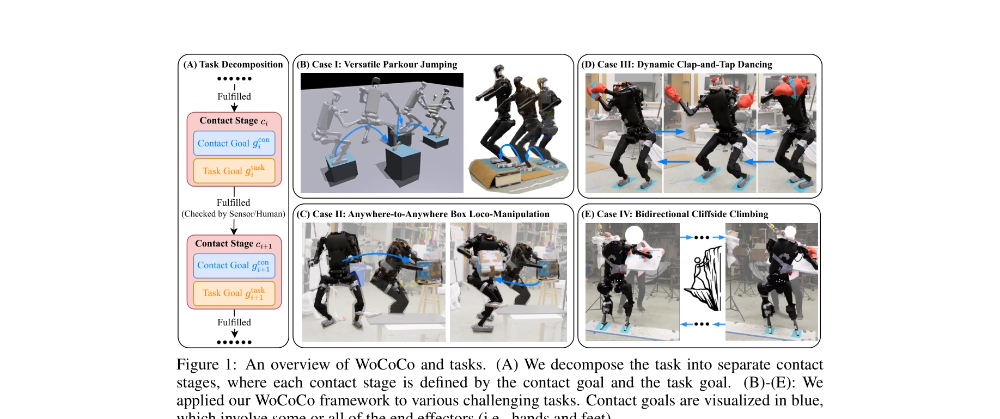

# WoCoCo: Learning Whole-Body Humanoid Control with Sequential Contacts

> **저자**: Chong Zhang, Wenli Xiao, Tairan He, Guanya Shi | **날짜**: 2024-06-10 | **URL**: [https://arxiv.org/abs/2406.06005](https://arxiv.org/abs/2406.06005)

---

## Essence

*Figure 1: An overview of WoCoCo and tasks. (A) We decompose the task into separate contact*

WoCoCo는 순차적 접촉(sequential contacts)을 포함하는 휴머노이드 로봇의 전신 제어를 학습하기 위한 통합 RL 프레임워크로, 작업을 접촉 단계로 자연스럽게 분해하여 일반화된 정책 학습을 가능하게 한다.

## Motivation

- **Known**: 모델 기반 운동 계획(motion planning)은 접촉 수열이 필요한 로봇 작업을 해결할 수 있지만 시간이 많이 걸리고 단순화된 동역학 모델에 의존한다. Model-free RL은 견고성을 보여주었지만 접촉 수열 작업에서 긴 수평선 탐색 문제(long-horizon exploration issues)를 겪는다.
- **Gap**: 기존 RL 방법은 특정 작업별로 별도의 튜닝과 상태 머신 설계가 필요하며, 다양한 접촉 수열을 가진 작업에 일반적으로 적용할 수 있는 체계적인 방법이 부재하다.
- **Why**: 휴머노이드 로봇이 현실의 복잡한 상호작용(파쿠르 점프, 박스 조작, 춤, 절벽 등반)을 수행하려면 순차적 접촉을 효율적으로 처리할 수 있는 일반화된 제어 프레임워크가 필수적이다.
- **Approach**: 작업을 접촉 목표(contact goal)와 작업 목표(task goal)로 정의되는 별도의 접촉 단계로 분해하고, 밀도 높은 접촉 보상(dense contact rewards), 단계 카운트 보상(stage count rewards), 호기심 보상(curiosity rewards)으로 구성된 task-agnostic WoCoCo 보상을 설계한다.

## Achievement

*Figure 1: An overview of WoCoCo and tasks. (A) We decompose the task into separate contact*

- **통합 프레임워크**: 접촉 단계 분해를 통해 다양한 휴머노이드 작업을 일관된 방식으로 처리하는 일반적인 RL 프레임워크 제시
- **현실 세계 성과**: 파쿠르 점프(versatile parkour jumping), 박스 로코-조작(box loco-manipulation), 동적 박수-탭 춤(clap-and-tap dancing), 절벽 등반(cliffside climbing) 등 4가지 도전적인 작업을 실제 로봇에서 성공적으로 수행
- **확장성**: 22-DoF 공룡 로봇(dinosaur robot)에 적용하여 휴머노이드 이상의 일반성 입증
- **최소한의 작업 특화 설정**: 각 작업당 1-2개의 작업 관련 항목만 지정하면 되는 간단한 설정 요구

## How

- 작업을 순차적 접촉 단계로 분해하여 탐색 부담을 각 단계별로 분산
- Dense contact rewards: 모든 올바른/올바르지 않은 접촉을 계산하여 0-1 보상보다 더 효과적인 지도 제공
- Stage count rewards: 완료된 접촉 단계 수 기반 보상으로 정책이 현재 단계에 머물러 탐색을 회피하는 문제 해결
- Task-agnostic curiosity rewards: 상태 공간 탐색 촉진
- 3단계 훈련 커리큘럼: (1)도메인 랜더마이제이션 없음, (2)도메인 랜더마이제이션 적용, (3)정규화 보상 가중치 증가로 sim-to-real 전이 최적화
- PPO 최적화 + 대칭 데이터 증강(symmetry augmentation) + 저수준 PD 컨트롤러 기반 정책 학습
- End-to-end MLP 정책으로 proprioception, exteroception, 목표 관련 관찰 포함

## Originality

- 접촉 단계를 기반으로 한 작업 분해는 model-based 솔버의 장점(일반성)을 RL 프레임워크에 도입한 창의적 접근
- Dense contact rewards와 stage count rewards의 조합은 RL에서 희소 접촉 신호와 장기 탐색 문제를 체계적으로 해결
- Task-agnostic 보상 설계는 다양한 작업에 최소한의 튜닝으로 적용 가능한 일반성 제공
- 현실 세계에서 여러 도전적 휴머노이드 작업을 단일 end-to-end 정책으로 처음 성공시킨 실증적 성과

## Limitation & Further Study

- 접촉 단계가 사전에 정의되어야 하며, 자동 접촉 계획은 고수준 플래너(예: [29])와의 통합에 의존
- 현재 방법은 감지 센서 또는 인간 관찰에 의존하여 단계 전환을 검증하므로 자동화 수준에 제약
- 도메인 랜더마이제이션에 의존하는 sim-to-real 전이는 여전히 현실 환경의 다양성에 완전히 강건하지 않을 가능성
- 후속 연구: (1)자동 접촉 단계 생성 알고리즘 개발, (2)접촉 상태 자동 감지 메커니즘 강화, (3)더욱 다양한 실제 환경에서의 강건성 검증

## Evaluation

- Novelty: 4/5
- Technical Soundness: 3/5
- Significance: 4/5
- Clarity: 4/5
- Overall: 4/5

**총평**: WoCoCo는 순차적 접촉 제어라는 현실적 도전을 체계적으로 해결하며, 다양한 휴머노이드 작업을 실제 로봇에서 성공적으로 구현한 높은 학술적·실용적 기여도를 보여준다.
