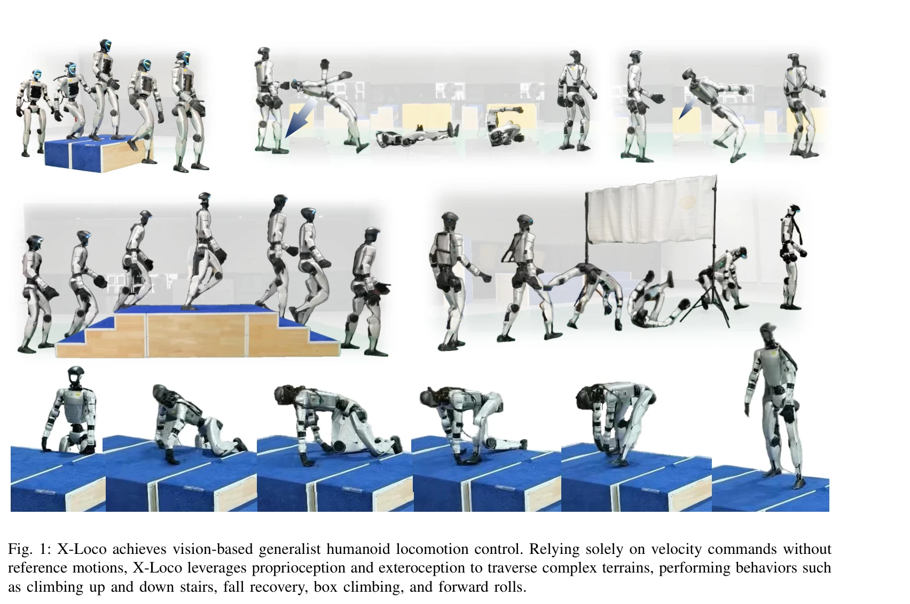

# X-Loco: Towards Generalist Humanoid Locomotion Control via Synergetic Policy Distillation

> **저자**:  | **날짜**: 2026-03-31 | **URL**: [https://arxiv.org/abs/2603.03733](https://arxiv.org/abs/2603.03733)

---

## Essence

*Fig. 2: Overview of X-Loco. (a) X-Loco integrates the capabilities of three specialist policies into a vision-based gene*

X-Loco는 시너지 정책 증류를 통해 세 개의 전문가 정책(upright locomotion, fall recovery, whole-body coordination)을 단일 비전 기반 범용 정책으로 통합하여, 속도 명령만으로 다양한 휴머노이드 보행 스킬을 수행하는 프레임워크이다.

## Motivation

- **Known**: 기존 연구들은 개별 휴머노이드 스킬(upright locomotion, fall recovery, whole-body coordination)에서 강력한 성능을 보였으나, 이들을 통합한 단일 정책 학습은 서로 다른 역학과 충돌하는 제어 목표로 인해 어려웠다.
- **Gap**: 비전 기반으로 upright locomotion, whole-body coordination, fall recovery를 동시에 통합하면서 reference motion이나 teleoperation 없이 순전히 속도 명령으로 작동하는 일반화된 휴머노이드 로콜로모션 컨트롤러는 아직 개발되지 않았다.
- **Why**: 자율적으로 다양한 지형을 횡단하고 낙상에서 복구하며 전신 협응 동작을 수행할 수 있는 범용 휴머노이드 제어기는 로봇의 실제 배포와 자율성을 위해 필수적이며, 이는 현실의 복잡한 환경에서 휴머노이드 로봇의 활용성을 크게 확대할 수 있다.
- **Approach**: X-Loco는 세 개의 특화된 전문가 정책을 학습한 후, Case-Adaptive Specialist Selection (CASS) 메커니즘으로 상태와 지형에 따라 가장 적절한 전문가를 동적으로 선택하여 학생 정책에 지도 신호를 제공하는 synergetic policy distillation 방식을 채택한다.

## Achievement

*Fig. 1: X-Loco achieves vision-based generalist humanoid locomotion control. Relying solely on velocity commands without*

- **통합된 다중 스킬**: upright locomotion, fall recovery, whole-body coordination (rolling, box climbing)을 reference motion 없이 단일 시각 기반 정책으로 통합
- **CASS 메커니즘**: 로봇의 상태와 주변 지형에 기반하여 전문가 정책을 동적으로 선택하는 적응형 specialist selection 구현
- **SAR 및 SFI**: Specialist Annealing Rollout로 효율적인 학습을 달성하고, Stochastic Fall Injection으로 다양한 낙상 시나리오에 강건한 정책 개발
- **실제 로봇 배포**: Unitree G1에서 검증되어 시뮬레이션-현실 전이 가능성 입증
- **우수한 성능**: fall recovery와 terrain traversal 작업에서 기존 방법 대비 우수한 성능 및 안정성 달성

## How

*Fig. 2: Overview of X-Loco. (a) X-Loco integrates the capabilities of three specialist policies into a vision-based gene*

- 세 개의 specialist 정책(upright locomotion, fall recovery, whole-body coordination) 각각을 PPO와 GAE를 사용하여 학습
- Case-Adaptive Specialist Selection (CASS)을 통해 현재 로봇 상태와 환경 정보에 기반하여 전문가 정책을 선택
- Specialist Annealing Rollout (SAR)으로 전문가 정책의 데이터 비율을 점진적으로 감소시켜 학생 정책의 exploration 촉진
- Stochastic Fall Injection (SFI)으로 학습 중 외부 교란을 적용하여 낙상과 보행 간의 전환 능력 개발
- 깊이 카메라 렌더링과 독립적 병렬 렌더링으로 효율적인 시각 기반 정책 학습 지원
- Velocity command 기반 제어로 reference motion이나 인간 개입 없이 자율적 로콜로모션 달성

## Originality

- **최초의 통합 프레임워크**: upright locomotion, whole-body coordination, fall recovery를 비전 기반으로 동시 통합하는 첫 시도
- **CASS 메커니즘**: 상태 적응형 specialist 선택으로 기존 혼합 전문가(MoE) 방식을 넘어선 동적 선택 구현
- **SAR와 SFI**: ratio-based 데이터 수집 전략과 능동적 낙상 주입으로 training efficiency와 robustness 동시 달성
- **Reference motion 제거**: motion tracking 패러다임에서 벗어나 순수 exteroceptive 정보와 velocity command만으로 작동
- **Real-world validation**: Unitree G1에서의 실제 배포로 sim-to-real transferability 입증

## Limitation & Further Study

- 현재 세 가지 specialist 정책으로 제한되어 있으며, 추가적인 복잡한 전신 협응 동작(예: 옆으로 구르기, 더 난이도 높은 조작 작업)의 통합 필요
- CASS의 specialist 선택 메커니즘이 휴리스틱 기반일 가능성이 있어 더욱 학습 가능한 selection module 필요
- 깊이 카메라(64×64)만 사용하므로 매우 먼 거리의 지형 인식 제한 가능성
- Sim-to-real transfer 시 환경 변동성(light, texture, camera noise)에 대한 추가 강건화 필요
- 계산 복잡도 분석 및 실시간 성능(inference latency) 관련 상세 정보 부재
- 추가 specialist 정책의 확장성과 컴퓨팅 리소스 증가에 대한 분석 필요

## Evaluation

- Novelty: 4/5
- Technical Soundness: 3/5
- Significance: 4/5
- Clarity: 4/5
- Overall: 4/5

**총평**: X-Loco는 policy distillation을 통해 다양한 휴머노이드 로콜로모션 스킬을 효과적으로 통합하는 혁신적인 접근법을 제시하며, CASS, SAR, SFI 등의 설계 요소들이 이론적으로 잘 동기부여되고 실제 로봇 배포로 검증되어 휴머노이드 로봇 제어 분야에 중요한 기여를 한다.

## Related Papers

- 🔗 후속 연구: [[papers/1761_Zero-Shot_Whole-Body_Humanoid_Control_via_Behavioral_Foundat/review]] — FB-CPR의 behavioral foundation model이 X-Loco의 synergetic policy distillation을 더욱 강력하게 만듭니다.
- 🏛 기반 연구: [[papers/1821_BFM-Zero_A_Promptable_Behavioral_Foundation_Model_for_Humano/review]] — BFM-Zero의 promptable behavioral foundation이 X-Loco의 범용 정책 통합 개념의 기반이 됩니다.
- 🔗 후속 연구: [[papers/1678_SkillBlender_Towards_Versatile_Humanoid_Whole-Body_Loco-Mani/review]] — SkillBlender의 다재다능한 whole-body 제어가 X-Loco의 전문가 정책 통합 방식을 보완합니다.
- 🔄 다른 접근: [[papers/1934_From_Experts_to_a_Generalist_Toward_General_Whole-Body_Contr/review]] — 둘 다 범용 전신 제어를 목표로 하지만 X-Loco는 정책 증류로, From Experts는 전문가 통합으로 접근한다.
- 🧪 응용 사례: [[papers/2166_ULTRA_Unified_Multimodal_Control_for_Autonomous_Humanoid_Who/review]] — ULTRA의 통합 multimodal 제어 프레임워크가 X-Loco의 범용 locomotion 기능을 자율적인 whole-body 제어로 확장할 수 있다.
- 🏛 기반 연구: [[papers/1761_Zero-Shot_Whole-Body_Humanoid_Control_via_Behavioral_Foundat/review]] — X-Loco의 전문가 정책 증류 개념이 FB-CPR의 behavioral foundation model 정규화에 영향을 줍니다.
- 🔄 다른 접근: [[papers/1784_A_Unified_and_General_Humanoid_Whole-Body_Controller_for_Ver/review]] — 둘 다 통일된 휴머노이드 제어를 목표로 하지만 HugWBC는 RL 기반 다양한 보행에, X-Loco는 정책 증류 기반 범용성에 중점을 둔다.
- 🏛 기반 연구: [[papers/2122_One_Policy_but_Many_Worlds_A_Scalable_Unified_Policy_for_Ver/review]] — X-Loco의 일반화된 휴머노이드 로코모션 제어 기술이 One Policy의 다양한 지형에서 단일 정책으로 작동하는 통합 시스템 개발에 기반을 제공한다.
