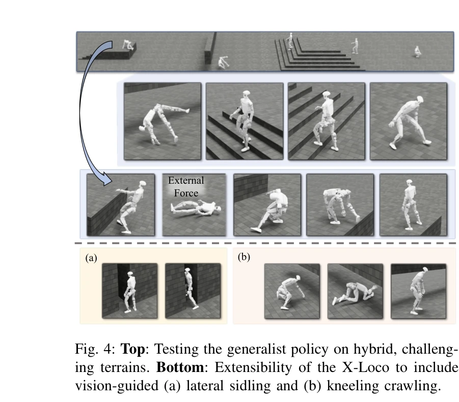

# X-Loco: Towards Generalist Humanoid Locomotion Control via Synergetic Policy Distillation

> **저자**:  | **날짜**: 2026-03-31 | **URL**: [https://arxiv.org/abs/2603.03733](https://arxiv.org/abs/2603.03733)

---

## Essence

*Fig. 2: Overview of X-Loco. (a) X-Loco integrates the capabilities of three specialist policies into a vision-based gene*

X-Loco는 시너지 정책 증류(Synergetic Policy Distillation)를 통해 세 개의 전문가 정책(직립 보행, 낙상 복구, 전신 협응)을 하나의 범용 시각 기반 정책으로 통합하는 휴머노이드 보행 제어 프레임워크이다.

## Motivation

- **Known**: 최근 휴머노이드 로봇은 직립 보행, 낙상 복구, 전신 협응 등 개별 기술에서 뛰어난 성능을 보였으나, 이들을 단일 정책으로 통합하거나 시각 기반 자율 제어는 실현하지 못했다.
- **Gap**: 기존 방법들은 특정 보행 기술에 집중되어 있어 복합 시나리오(낙상 후 보행 재개 등)를 처리하지 못하며, 참조 동작 없이 전신 협응과 시각 기반 제어를 함께 달성하는 것이 미해결 과제이다.
- **Why**: 범용 휴머노이드 보행 제어는 인간형 로봇의 자율성과 다용도성을 크게 향상시키며, 복잡한 실환경에서 안전하고 효율적인 로봇 운용을 가능하게 한다.
- **Approach**: X-Loco는 케이스 적응형 전문가 선택(CASS), 전문가 어닐링 롤아웃(SAR), 확률적 낙상 주입(SFI) 메커니즘을 통해 세 전문가 정책의 지식을 증류하며, 깊이 이미지 기반 시각 입력과 속도 명령만으로 작동한다.

## Achievement

*Fig. 4: Top: Testing the generalist policy on hybrid, challeng-*

- **통합 범용 정책**: 직립 보행, 낙상 복구, 전신 협응(계단 오르내리기, 박스 등반, 전방 구르기)을 단일 비전 기반 정책으로 통합한 최초 프레임워크
- **시너지 정책 증류 패러다임**: 복수 전문가 정책의 지식을 효과적으로 융합하면서 다양한 보행 기술 간 간섭 완화
- **학습 효율성 향상**: SAR를 통한 적응형 롤아웃 혼합과 SFI를 통한 낙상 상황 노출로 전문 지식 내재화 및 강건성 증대
- **실제 로봇 검증**: Unitree G1에서 다양한 지형과 도전적 시나리오에서 우수한 성능과 안정성 입증

## How

*Fig. 2: Overview of X-Loco. (a) X-Loco integrates the capabilities of three specialist policies into a vision-based gene*

- 세 개의 전문가 정책 학습: PPO와 GAE를 활용하여 각각 직립 보행, 낙상 복구, 전신 협응에 특화된 정책 훈련
- Case-Adaptive Specialist Selection (CASS): 로봇 상태와 환경 지형에 기반하여 동적으로 가장 관련성 높은 전문가 정책 선택
- Specialist Annealing Rollout (SAR): 학습 초기 전문가 롤아웃 비율을 높이다 수렴에 따라 감소시켜 노이즈 감소 및 자율 탐색 촉진
- Stochastic Fall Injection (SFI): 보행 중 능동적 외부 교란 적용으로 예기치 못한 균형 상실 상황에 대응하고 보행과 낙상 복구 간의 전환 유도
- 독립적 깊이 렌더링: 병렬 환경 간 빠른 카메라 렌더링으로 시각 기반 정책 학습 효율성 향상
- 통일된 행동 공간: 세 전문가가 동일한 행동 공간을 공유하여 증류 과정 단순화

## Originality

- **최초의 통합 접근**: 직립 보행, 낙상 복구, 전신 협응을 참조 동작 없이 단일 비전 기반 정책으로 통합
- **케이스 적응형 메커니즘**: 정적 혼합이 아닌 상태 및 환경 기반 동적 전문가 선택으로 유연한 스킬 활용
- **SAR 및 SFI의 혁신**: 단순한 데이터 혼합을 넘어 동적 비율 감쇠와 능동적 낙상 주입을 통한 정교한 학습 전략
- **실제 로봇 검증**: 시뮬레이션에서 실제 Unitree G1로의 성공적 전이

## Limitation & Further Study

- **계산 복잡도**: 세 전문가 정책을 동시에 유지하고 CASS 메커니즘을 실시간 적용하는 데 따른 연산 오버헤드 미분석
- **일반화 범위**: 특정 로봇 형태(Unitree G1)에서만 검증되었으며 다른 휴머노이드 플랫폼으로의 확장성 미검토
- **환경 제한**: 훈련 및 평가 지형이 특정 유형으로 제한될 가능성 및 극도로 복잡한 지형에서의 성능 미보고
- **후속 연구 방향**: (1) 더 복잡한 조작 작업과의 통합, (2) 온라인 적응 학습 메커니즘 추가, (3) 다양한 로봇 플랫폼으로의 일반화, (4) 실시간 성능 최적화 및 전문가 수 증가에 따른 확장성 연구

## Evaluation

- Novelty: 4/5
- Technical Soundness: 3/5
- Significance: 4/5
- Clarity: 4/5
- Overall: 4/5

**총평**: X-Loco는 정책 증류를 창의적으로 활용하여 휴머노이드 보행 제어의 오랜 과제인 다중 기술 통합을 최초로 달성했으며, 동적 전문가 선택과 적응형 학습 전략으로 실제 로봇에서 우수한 성능을 입증함으로써 휴머노이드 로봇의 자율성과 강건성을 크게 향상시켰다.
