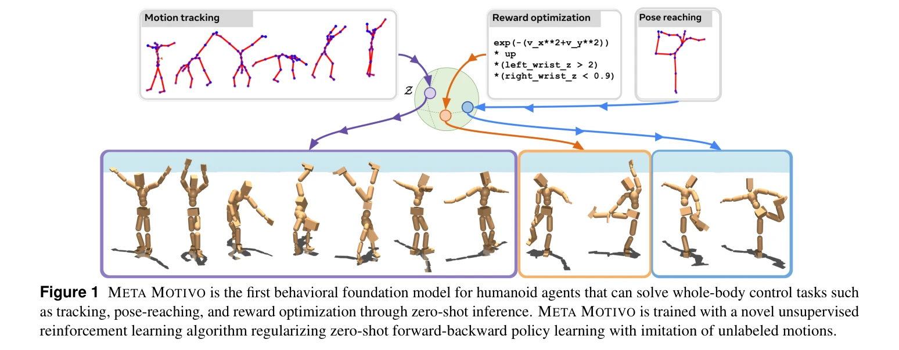

# Zero-Shot Whole-Body Humanoid Control via Behavioral Foundation Models

> **저자**: Andrea Tirinzoni, Ahmed Touati, Jesse Farebrother, Mateusz Guzek, Anssi Kanervisto, Yingchen Xu, Alessandro Lazaric, Matteo Pirotta | **날짜**: 2025-04-15 | **URL**: [https://arxiv.org/abs/2504.11054](https://arxiv.org/abs/2504.11054)

---

## Essence

*Figure 1 META MOTIVO is the first behavioral foundation model for humanoid agents that can solve whole-body control task*

Forward-Backward representations with Conditional-Policy Regularization (FB-CPR)을 통해 unlabeled behavior dataset으로 unsupervised RL을 정규화하여, humanoid agent의 zero-shot whole-body control을 가능하게 하는 behavioral foundation model Meta Motivo를 개발했다.

## Motivation

- **Known**: Unsupervised RL과 behavior cloning 기반 접근법들은 각각의 장단점이 있으며, 최근 demonstration을 활용한 정규화 방법들이 등장했다. Foundation model의 개념은 언어와 vision 영역에서 성공적이다.
- **Gap**: 기존 zero-shot RL은 고차원 불안정 제어(humanoid)에서 unsupervised exploration의 한계로 성능이 떨어지며, behavior cloning은 dataset의 behavior 외 generalization이 제한적이다. 두 접근법의 장점을 결합한 방법이 부재하다.
- **Why**: Humanoid control은 로보틱스, 가상 캐릭터, NPC 등 광범위한 응용분야가 있으며, 일반화된 behavioral foundation model은 task-specific 학습의 필요성을 제거하여 실무적 가치가 크다.
- **Approach**: FB representation으로 unlabeled trajectory를 state-reward-policy 잠재공간에 embedding하고, latent-conditional discriminator로 dataset 상태 분포를 cover하도록 정책을 장려하여, imitation 정규화와 zero-shot 일반화를 동시에 달성한다.

## Achievement

*Figure 3 Human-evaluation. Left figure reports the percentage of times a behavior solved a reward-based (blue) or a goal*

- **FB-CPR 알고리즘**: Forward-Backward representation을 unlabeled behavior dataset으로 정규화하는 online unsupervised RL 알고리즘 제안
- **Meta Motivo 모델**: SMPL 기반 humanoid의 최초 behavioral foundation model로 motion tracking, goal reaching, reward optimization을 zero-shot으로 수행
- **경쟁력 있는 성능**: Task-specific 방법과 유사한 수준의 성능을 달성하면서 unsupervised RL 및 model-based baseline 초과
- **Human-like behavior 표현**: AMASS dataset을 활용하여 인간다운 동작을 학습하고 표현
- **재현성 보장**: 환경, 코드, 사전학습 모델 공개

## How

*Figure 2 Illustration of the main components of FB-CPR: the discriminator is trained to estimate the ratio between the l*

- Successor measure의 low-rank decomposition인 FB representation 활용하여 reward-policy factorization 구현
- Latent-conditional discriminator를 통해 학습된 정책이 unlabeled dataset의 상태 분포를 'cover'하도록 장려", 'Forward embedding F(s,a,z)와 backward embedding B(s)를 동일한 잠재공간에 매핑하여 trajectory embedding
- Measure-valued Bellman equation (식 2)의 temporal difference 손실함수로 FB 학습
- Actor network을 통해 연속 action space에서 arg max 근사
- AMASS 모션캡처 데이터셋을 observation-only unlabeled behavior로 활용하여 정규화

## Originality

- Unlabeled trajectory를 같은 잠재공간에 embedding하고 latent-conditional discriminator로 상태 distribution 정규화하는 아이디어는 novel
- Zero-shot RL의 exploration 한계를 behavior dataset 정규화로 해결하는 통합 프레임워크 제시
- 고차원 불안정 동역학을 가진 humanoid 제어에 FB representation 최초 적용
- Behavioral foundation model 개념을 embodied agent에 처음 체계적으로 구현

## Limitation & Further Study

- AMASS 같은 고품질 unlabeled behavior dataset의 availability에 의존 - 다른 도메인이나 task-misaligned dataset에서의 성능 불명확
- Humanoid와 bipedal walker, ant maze에서만 평가 - 더 다양한 제어 문제에 대한 일반성 미검증
- Discriminator 기반 정규화의 computational overhead와 scalability 논의 부재
- Zero-shot 성능이 task-specific 방법대비 여전히 gap이 있음 - 더 나은 in-context learning 메커니즘 필요
- 후속연구: (1) task-misaligned 데이터셋에 robust한 방법 개발, (2) real robot 전이학습 검증, (3) 다중 embodiment 지원 BFM 확장

## Evaluation

- Novelty: 4/5
- Technical Soundness: 3/5
- Significance: 4/5
- Clarity: 4/5
- Overall: 4/5

**총평**: FB-CPR은 unsupervised RL의 exploration 한계를 behavior dataset 정규화로 창의적으로 해결하고, 복잡한 humanoid 제어에서 zero-shot generalization을 달성한 기술적으로 견실하고 의미 있는 연구이다. 재현성 보장과 다양한 평가는 강점이나, 데이터셋 의존성과 실제 로봇 검증 부재는 향후 개선이 필요하다.

## Related Papers

- 🏛 기반 연구: [[papers/1760_X-Loco_Towards_Generalist_Humanoid_Locomotion_Control_via_Sy/review]] — X-Loco의 전문가 정책 증류 개념이 FB-CPR의 behavioral foundation model 정규화에 영향을 줍니다.
- 🔗 후속 연구: [[papers/1782_A_Survey_of_Behavior_Foundation_Model_Next-Generation_Whole-/review]] — Behavior Foundation Model 서베이가 FB-CPR의 unsupervised RL 정규화 방법론을 더 넓은 맥락에서 이해하게 합니다.
- 🔄 다른 접근: [[papers/1944_General_Humanoid_Whole-Body_Control_via_Pretraining_and_Fast/review]] — 둘 다 사전훈련을 통한 일반화된 humanoid 제어를 다루지만 서로 다른 사전훈련 전략을 사용합니다.
- 🔄 다른 접근: [[papers/2050_Learning_from_Massive_Human_Videos_for_Universal_Humanoid_Po/review]] — 대규모 인간 비디오 데이터 활용에서 zero-shot control과 universal policy라는 서로 다른 일반화 접근법을 사용한다.
- 🔗 후속 연구: [[papers/1821_BFM-Zero_A_Promptable_Behavioral_Foundation_Model_for_Humano/review]] — behavioral foundation model에서 promptable과 zero-shot이라는 보완적 제어 패러다임을 제시한다.
- 🏛 기반 연구: [[papers/1812_Behavior_Foundation_Model_for_Humanoid_Robots/review]] — 휴머노이드를 위한 behavior foundation model에서 unlabeled dataset과 전신 제어라는 공통 목표를 가진다.
- 🔄 다른 접근: [[papers/2005_Humanoid_World_Models_Open_World_Foundation_Models_for_Human/review]] — 둘 다 foundation model 기반 휴머노이드 제어를 다루지만 하나는 behavior regularization에, 다른 하나는 world model에 중점을 둔다.
- 🔗 후속 연구: [[papers/1412_GR00T_N1_An_Open_Foundation_Model_for_Generalist_Humanoid_Ro/review]] — GR00T N1의 VLA 모델이 Zero-Shot Whole-Body Control의 behavioral foundation 접근법과 결합되어 더 강력한 제어 시스템을 구축할 수 있다
- 🔗 후속 연구: [[papers/1760_X-Loco_Towards_Generalist_Humanoid_Locomotion_Control_via_Sy/review]] — FB-CPR의 behavioral foundation model이 X-Loco의 synergetic policy distillation을 더욱 강력하게 만듭니다.
- 🏛 기반 연구: [[papers/1782_A_Survey_of_Behavior_Foundation_Model_Next-Generation_Whole-/review]] — BFM 서베이가 FB-CPR과 같은 behavioral foundation model 연구의 이론적 배경과 발전 방향을 제시합니다.
- 🏛 기반 연구: [[papers/1888_DreamZero_World_Action_Models_are_Zero-shot_Policies/review]] — 행동 기반 모델이 VLA 모델의 zero-shot 정책 학습을 위한 이론적 기반을 제공한다.
- 🔄 다른 접근: [[papers/2050_Learning_from_Massive_Human_Videos_for_Universal_Humanoid_Po/review]] — 범용 휴머노이드 제어에서 행동 기반 모델과 언어 조건부 모델의 다른 접근법
