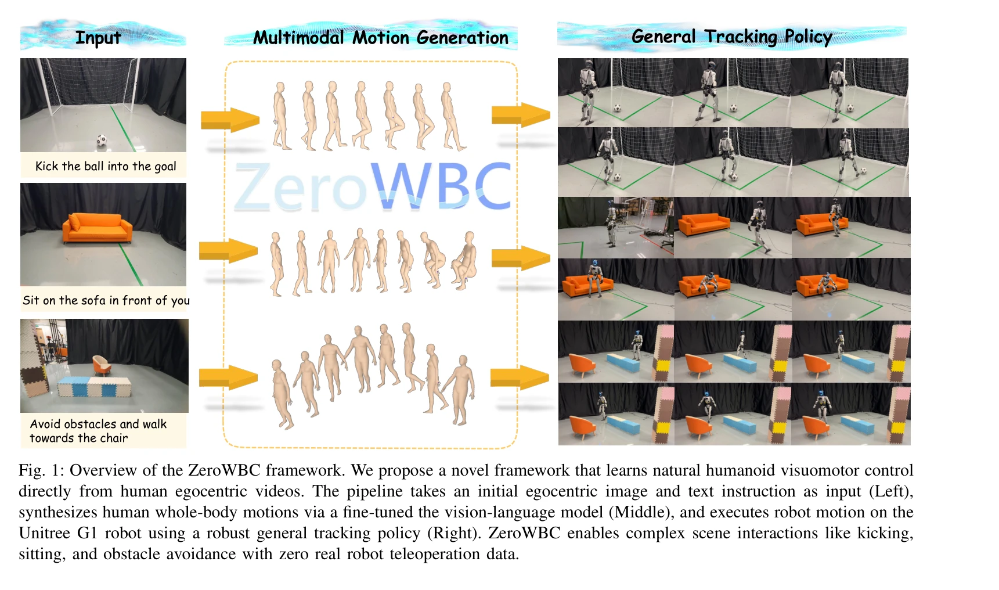
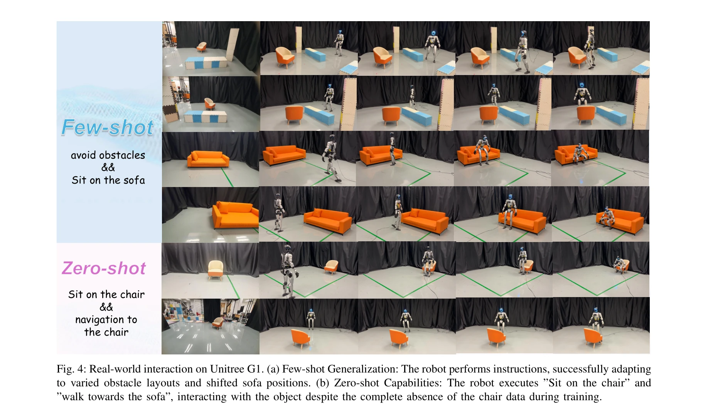
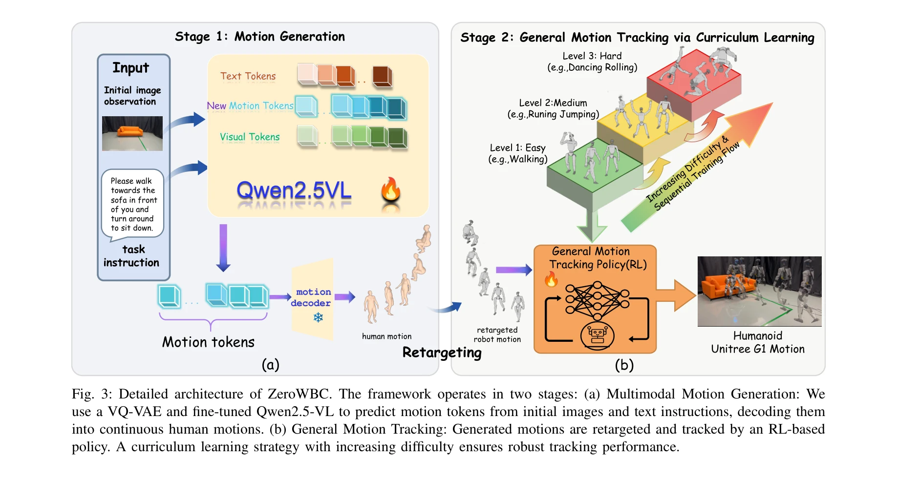

# ZeroWBC: Learning Natural Visuomotor Humanoid Control Directly from Human Egocentric Video

> **저자**: Haoran Yang, Jiacheng Bao, Yucheng Xin, Haoming Song, Yuyang Tian, Bin Zhao, Dong Wang, Xuelong Li | **날짜**: 2026-03-10 | **DOI**: [10.48550/arXiv.2603.09170](https://doi.org/10.48550/arXiv.2603.09170)

---

## Essence

*Fig. 1: Overview of the ZeroWBC framework. We propose a novel framework that learns natural humanoid visuomotor control*

ZeroWBC는 인간의 egocentric 비디오로부터 직접 학습하여 휴머노이드 로봇의 자연스러운 전신 제어를 실현하는 프레임워크로, 비용이 많이 드는 텔레오퍼레이션 데이터 수집을 제거한다.

## Motivation

- **Known**: 휴머노이드 로봇의 전신 제어는 단일 참조 모션 추적과 text-to-motion 생성 기술이 발전했으나, 기존 방법들은 시뮬레이션 기반이거나 비싼 텔레오퍼레이션 데이터에 의존한다.
- **Gap**: 실제 환경과의 상호작용을 위한 egocentric 시각 컨텍스트 기반의 자연스러운 전신 제어 방법이 부족하며, 기존 방법들은 텔레오퍼레이션 데이터 수집 오버헤드가 크거나 특정 작업에만 최적화되어 있다.
- **Why**: 휴머노이드 로봇이 다양한 실제 환경에서 인간답게 행동하려면 scalable하고 자연스러운 제어 방법이 필수이며, 텔레오퍼레이션 데이터 수집의 병목을 해결해야 한다.
- **Approach**: Vision-Language Model을 fine-tuning하여 egocentric 이미지와 텍스트 명령으로부터 인간 전신 모션을 생성하고, 이를 로봇 관절로 retarget한 후 사전학습된 일반 motion tracking policy로 실행하는 2단계 파이프라인을 제안한다.

## Achievement

*Fig. 4: Real-world interaction on Unitree G1. (a) Few-shot Generalization: The robot performs instructions, successfully*

- **인간 egocentric 비디오 기반 학습**: 로봇 텔레오퍼레이션 데이터 없이 대규모 인간 비디오와 MoCap 데이터를 활용하여 자연스러운 제어 신호 생성
- **2단계 통합 아키텍처**: VQ-VAE 기반 motion token 생성과 일반 motion tracking policy를 결합하여 자연스럽고 정확한 전신 제어 실현
- **다양한 장면 상호작용**: 앉기, 공 차기, 장애물 회피 등 다양한 작업을 높은 성공률로 수행
- **우수한 성능**: 기존 motion tracking 방법 대비 정확도와 안정성 향상, 그리고 실제 환경에서 뛰어난 일반화 능력

## How

*Fig. 3: Detailed architecture of ZeroWBC. The framework operates in two stages: (a) Multimodal Motion Generation: We*

- VQ-VAE를 사용하여 연속적 인간 모션을 discrete motion token으로 인코딩
- Vision-Language Model을 text-image-motion 데이터셋으로 fine-tuning하여 egocentric 이미지와 텍스트 명령 조건에서 future motion token 생성
- 생성된 인간 모션을 로봇 관절 구조에 맞게 retargeting
- 대규모 MoCap 데이터로 사전학습된 general tracking policy로 retargeted motion을 로봇에서 정확하게 실행
- 실제 Unitree G1 휴머노이드 로봇에서 end-to-end 파이프라인 검증

## Originality

- 인간 egocentric 비디오와 MoCap 데이터를 결합하여 휴머노이드 제어를 학습하는 최초의 프레임워크
- 텔레오퍼레이션 데이터 수집 없이 자연스러운 전신 제어를 실현하는 novel paradigm
- motion generation과 tracking을 통합한 계층적 2단계 아키텍처 설계
- egocentric 시각 입력 기반 장면 상호작용 제어라는 새로운 연구 방향 제시

## Limitation & Further Study

- 논문에서 정량적 비교 평가 지표가 제한적이며, 구체적인 성공률 수치나 baseline 대비 성능 개선도가 명확하지 않음
- VQ-VAE 기반 motion discretization의 정보 손실이 생성된 모션의 세밀함에 영향을 미칠 수 있으며, 극도로 복잡한 모션에 대한 성능이 불명확함
- Retargeting 과정에서 인간과 로봇의 신체 비율 차이로 인한 부자연스러움이 발생할 가능성
- 현재 Unitree G1 로봇에만 검증되었으므로 다른 휴머노이드 플랫폼으로의 일반화 가능성은 미지수
- 후속 연구: 더 강력한 일반 motion tracking policy 개발, 다양한 로봇 플랫폼 확장, 실시간 egocentric 피드백을 통한 적응적 제어 추가

## Evaluation

- Novelty: 4/5
- Technical Soundness: 3/5
- Significance: 4/5
- Clarity: 4/5
- Overall: 4/5

**총평**: ZeroWBC는 인간 egocentric 비디오를 활용하여 비싼 로봇 데이터 수집을 제거하면서도 자연스럽고 다양한 전신 제어를 실현하는 실질적으로 중요한 기여를 한다. 다만 정량적 평가 결과와 다른 플랫폼으로의 일반화 검증이 더 필요하다.
