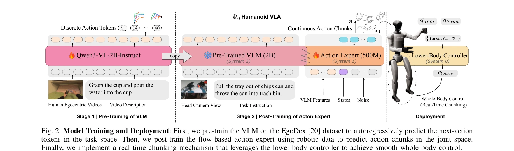

# $Ψ_0$: An Open Foundation Model Towards Universal Humanoid Loco-Manipulation

> **저자**: Songlin Wei, Hongyi Jing, Boqian Li, Zhenyu Zhao, Jiageng Mao, Zhenhao Ni, Sicheng He, Jie Liu, Xiawei Liu, Kaidi Kang, Sheng Zang, Weiduo Yuan, Marco Pavone, Di Huang, Yue Wang | **날짜**: 2026-03-12 | **DOI**: [10.48550/arXiv.2603.12263](https://doi.org/10.48550/arXiv.2603.12263)

---

## Essence

*Fig. 2: Model Training and Deployment: First, we pre-train the VLM on the EgoDex [20] dataset to autoregressively predic*

Ψ0는 인간의 egocentric 동영상으로 VLM을 사전학습한 후, 실제 humanoid 로봇 데이터로 flow-based action expert를 후학습하는 2단계 훈련 패러다임을 제안하여 humanoid loco-manipulation을 효율적으로 학습하는 오픈 foundation model이다.

## Motivation

- **Known**: 최근 VLA 기반 로봇 학습이 대규모 데이터와 모델 스케일링으로 성과를 보였으나, humanoid loco-manipulation은 인간과 로봇의 운동학적 차이로 인해 인간-로봇 혼합 데이터로 학습하는 것이 비효율적이다.
- **Gap**: 기존 접근법은 heterogeneous한 인간-로봇 데이터를 단일 정책으로 모델링하려 하나, 근본적으로 다른 action distribution 때문에 성능과 데이터 효율성이 제한적이다.
- **Why**: Humanoid 로봇의 조작 능력 향상은 사회적 영향이 크며, 고품질 데이터를 효율적으로 활용하는 방법론 발견은 robotics 커뮤니티에 중요한 기여가 될 수 있다.
- **Approach**: VLM을 인간 egocentric 동영상으로 사전학습하여 시각-행동 표현을 학습하고, 이어서 MM-DiT 기반 action expert를 실제 humanoid 데이터로 후학습하는 decoupled multi-stage 패러다임을 도입한다.

## Achievement

*Fig. 2: Model Training and Deployment: First, we pre-train the VLM on the EgoDex [20] dataset to autoregressively predic*

- **데이터 효율성**: 800시간의 인간 동영상과 30시간의 실제 로봇 데이터만으로 10배 이상의 데이터로 학습한 baseline을 40% 이상 상회하는 성공률 달성
- **이중 처리 아키텍처**: VLM은 task-level motion priors를 학습하고, action expert는 embodiment-specific 역학을 학습하는 분리된 목표 설정
- **실시간 배포**: Training-time real-time action chunking을 도입하여 inference latency로 인한 motion jitter 완화
- **고품질 데이터 레시피**: Noisy internet clips 대신 고품질 egocentric 인간 조작 데이터 활용의 중요성 입증

## How

*Fig. 2: Model Training and Deployment: First, we pre-train the VLM on the EgoDex [20] dataset to autoregressively predic*

- Stage 1: Qwen3-VL 2B를 EgoDex 데이터셋의 egocentric 동영상으로 autoregressive하게 사전학습하여 unified human-robot action space에서 다음 action token 예측
- Stage 2: MM-DiT 기반 500M 파라미터 action expert를 humanoid 로봇 데이터로 post-train하여 joint space에서 action chunk 직접 예측
- Deployment: Lower-body controller를 활용한 real-time chunking 메커니즘으로 smooth whole-body control 구현
- Teleoperation: MANUS 글러브 기반 조작 지향 원격조종 파이프라인으로 lower-body stability 개선

## Originality

- 기존의 human-robot 혼합 co-training 대신 **decoupled staged training paradigm** 제안으로 heterogeneous 데이터 활용의 근본적 개선
- High-quality egocentric 데이터의 중요성을 체계적으로 입증하는 **data recipe 발견**으로 'scale quantity over quality' 기조에 대한 도전", '**MM-DiT 기반 action expert** 도입으로 VLM 표현을 효율적으로 활용하면서도 joint-space 제어 학습
- Training-time real-time action chunking으로 inference-deployment gap 해결하는 **실용적 기여**

## Limitation & Further Study

- Stage 1과 Stage 2 사이의 정보 병목이 존재할 수 있으며, VLM feature 차원이 action expert 성능에 미치는 영향에 대한 ablation 부족
- Egocentric 데이터의 '고품질' 정의가 명확하지 않으며, 다른 도메인의 egocentric 데이터 활용 가능성 미검토", '30시간의 humanoid 데이터는 여전히 제한적이며, 복잡한 task로의 확장성 및 transfer learning 능력에 대한 분석 부재
- Lower-body stability 개선의 정량적 평가와 다양한 humanoid 플랫폼으로의 일반화 가능성에 대한 논의 필요

## Evaluation

- Novelty: 4/5
- Technical Soundness: 3/5
- Significance: 4/5
- Clarity: 4/5
- Overall: 4/5

**총평**: Ψ0는 humanoid loco-manipulation의 효율적 학습을 위한 실용적이고 확장 가능한 접근법을 제시하며, high-quality egocentric 데이터의 가치를 입증함으로써 로봇 학습의 data scaling 전략에 중요한 인사이트를 제공한다. 오픈소스 공개 약속과 함께 커뮤니티에 의미 있는 기여가 될 수 있다.
