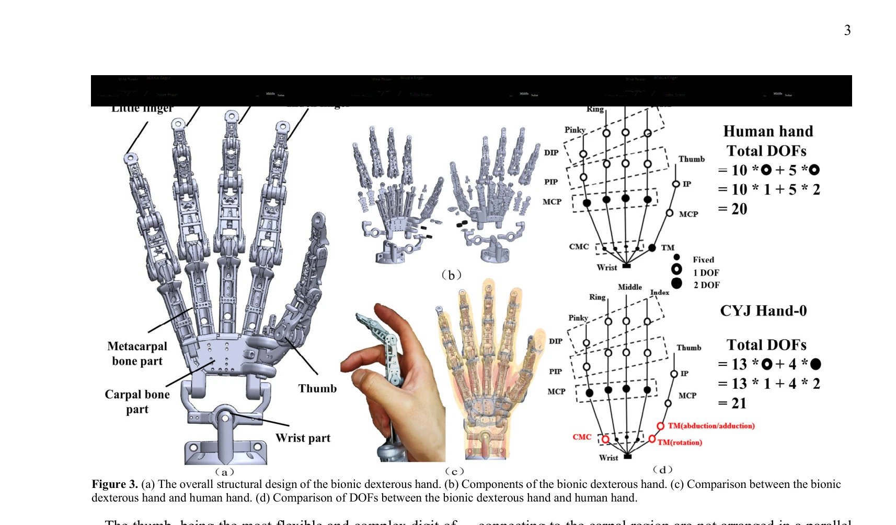

# A 21-DOF Humanoid Dexterous Hand with Hybrid SMA-Motor Actuation: CYJ Hand-0

> **저자**: Jin Chai, Xiang Yao, Mengfan Hou, Yanghong Li, Erbao Dong | **날짜**: 2025-07-19 | **URL**: [https://arxiv.org/abs/2507.14538](https://arxiv.org/abs/2507.14538)

---

## Essence

*Figure 3. (a) The overall structural design of the bionic dexterous hand. (b) Components of the bionic dexterous hand. (*

CYJ Hand-0는 SMA와 DC 모터의 하이브리드 구동 방식을 결합한 21-DOF 휴머노이드 손으로, 3D 프린팅 AlSi10Mg 금속 프레임과 고강도 낚싯줄 텐던을 활용하여 인간의 손 구조를 생체모방한다.

## Motivation

- **Known**: 기존의 휴머노이드 손들은 복잡한 뼈 구조(27개 뼈), 제한된 자유도, 부족한 감각 능력, 낮은 내충격성과 높은 제조 비용 등의 문제를 가지고 있다.
- **Gap**: 기존 휴머노이드 손들은 구조적 생체모방성 부족, 불충분한 자유도, 유연성 부족, 낮은 하중 용량 등의 한계가 있어 실제 인간 손의 다재다능함을 완전히 재현하지 못한다.
- **Why**: 휴머노이드 손의 정교한 조작 능력은 의료 지원, 가정용 로봇, 우주 탐사, 해양 개발 등 다양한 분야에서 필수적이며, 효율적이고 저렴한 제조 기술이 필요하다.
- **Approach**: 인간 손의 해부학 구조(뼈, 관절, 텐던)를 상세히 분석하여 모방하고, SMA 선형 구동 모듈과 DC 모터 모듈을 하이브리드로 통합하며, 3D 프린팅 기술로 경량화된 알루미늄 합금 프레임을 제작한다.

## Achievement

*Figure 3. (a) The overall structural design of the bionic dexterous hand. (b) Components of the bionic dexterous hand. (*

- **높은 생체모방성**: 27개 뼈의 구조와 tendon-muscle 구조를 1:1 스케일로 복제한 21-DOF 설계
- **경량 설계**: 380g의 초경량 구조로 인간 손 무게(413g)의 92%에 불과
- **하이브리드 구동 시스템**: SMA 기반 모듈과 DC 모터 모듈을 통합하여 손가락 굴곡, 신전, 외전 제어
- **우수한 하중 용량**: 단일 손가락 1.2 kgf, 전체 손 8 kgf의 하중 처리 능력
- **포괄적 기능성**: 모든 Kapandji 테스트, 32개 동작, 30회 이상의 파지 실험 수행 가능
- **비용 효율적 제조**: AlSi10Mg 금속 3D 프린팅 기술을 통한 저비용 제조

## How

*Figure 4. Structure and size of the universal finger.*

- 해부학적 원리 분석: 인간 손의 뼈 구조(27개), 관절 범위(MCP 90°, PIP 110°, DIP 90°), intra-finger coupling 관계식(Eq. 1) 정의
- 모듈화 설계: 검지, 중지, 약지의 통일된 구조 설계(각 9개 component type, 12개 부품) 및 엄지손가락 커스텀 설계
- SMA 선형 구동 모듈: 2배 증폭된 스트로크를 가진 shape memory alloy 기반 손가락 신전 및 외전 제어
- DC 모터 구동 모듈: DC brush motor 기반 선형 구동으로 손가락 굴곡 제어
- 텐던-구동 시스템: 고강도 낚싯줄을 인공 텐던으로 사용하여 유연한 운동 전달
- Arduino Mega 2560 제어 시스템: 개별 손가락 및 전체 손 제어를 위한 기본 제어 프레임워크 구현

## Originality

- **하이브리드 SMA-모터 구동**: SMA와 DC 모터를 결합하여 신전과 굴곡을 동시에 효율적으로 구현한 혁신적 접근
- **정확한 생체모학적 설계**: 인간 손의 복잡한 intra-finger coupling 관계식을 기계적으로 구현
- **모듈화 아키텍처**: 통일된 손가락 설계로 부품 호환성을 극대화하면서도 엄지는 특화된 2-segment 메타카르팔 설계
- **경량 금속 3D 프린팅 활용**: AlSi10Mg 금속 3D 프린팅으로 구조적 복잡성과 경량성을 동시 달성
- **포괄적 성능 평가**: Kapandji 테스트, 32개 동작, 다중 파지 실험으로 다각적 검증

## Limitation & Further Study

- **제어 시스템의 단순성**: Arduino Mega 2560 기반의 기본 제어 시스템은 고급 피드백 제어나 AI 기반 학습이 부족
- **감각 피드백 부재**: 논문에서 센서나 촉각 피드백 시스템이 언급되지 않음
- **SMA의 응답 속도**: Shape memory alloy는 일반적으로 느린 응답 속도를 가져 빠른 동작 수행의 한계
- **텐던 마찰 및 내구성**: 높은강도 낚싯줄 사용으로 인한 장기 마찰 마모 및 내구성 문제 미분석
- **제한된 손목 자유도**: 논문에서 손목 자유도는 제외되어 완전한 팔-손 통합이 미흡
- **후속 연구 방향**: 센서 통합, 고급 제어 알고리즘, SMA 응답 속도 개선, 손목 자유도 추가 필요

## Evaluation

- Novelty: 4/5
- Technical Soundness: 3/5
- Significance: 4/5
- Clarity: 4/5
- Overall: 4/5

**총평**: CYJ Hand-0는 SMA-모터 하이브리드 구동, 정교한 생체모방 설계, 효율적인 3D 프린팅 제조를 통해 경량이면서도 고성능의 휴머노이드 손을 실현한 주목할 만한 연구이며, 특히 모듈화 아키텍처와 포괄적 성능 평가가 강점이다.
