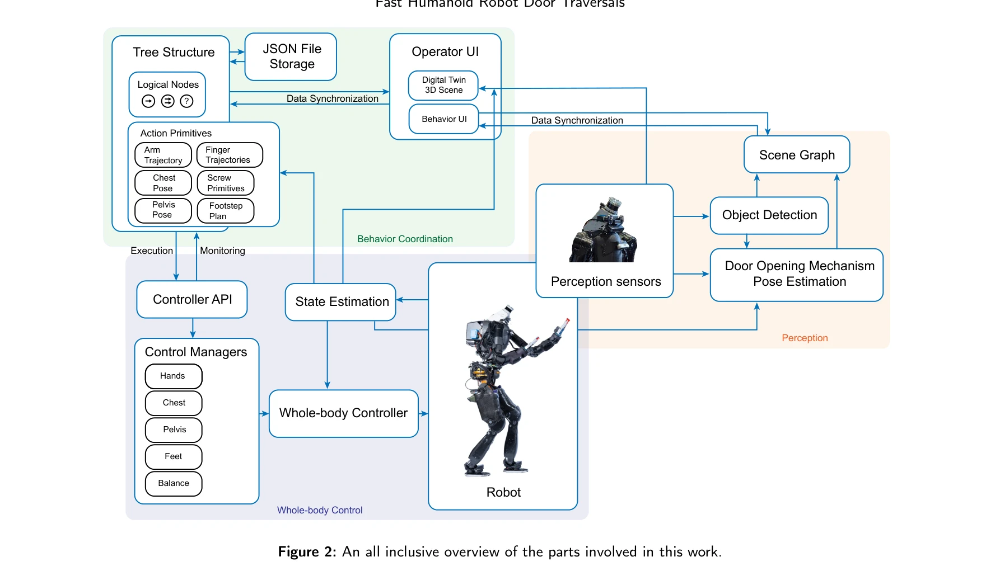
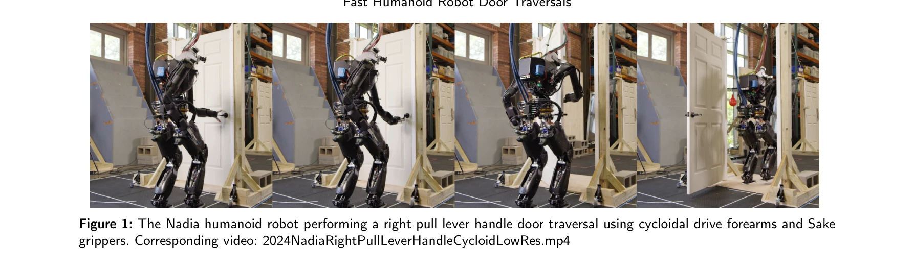

# A Behavior Architecture for Fast Humanoid Robot Door Traversals

> **저자**: Duncan Calvert, Luigi Penco, Dexton Anderson, Tomasz Bialek, Arghya Chatterjee, Bhavyansh Mishra, Geoffrey Clark, Sylvain Bertrand, Robert Griffin | **날짜**: 2024-11-05 | **URL**: [https://arxiv.org/abs/2411.03532](https://arxiv.org/abs/2411.03532)

---

## Essence

*Figure 2: An all inclusive overview of the parts involved in this work.*

휴머노이드 로봇의 다양한 도어 통과 작업을 수행하기 위해 GPU 가속 인식, Behavior Tree 기반 행동 조정 시스템, 전신 제어기를 통합한 아키텍처를 제시한다. 실제 Nadia 휴머노이드 로봇에서 빠른 도어 통과 성능을 달성했다.

## Motivation

- **Known**: 휴머노이드 로봇은 인간 크기의 환경에 적합한 형태이며, 행동 생성을 위해 Affordance Template, Behavior Tree 등의 프레임워크가 연구되어 왔다. 바퀴 기반 로봇의 도어 통과 연구는 존재하지만 이족 휴머노이드의 도어 통과는 미개발 영역이다.
- **Gap**: 현재까지 이족 휴머노이드 로봇의 도어 통과(door traversal) 연구가 거의 없으며, 빠른 행동 저작(behavior authoring)과 재사용성을 지원하는 통합 시스템의 부재가 있다.
- **Why**: 휴머노이드 로봇이 도시 작전, 재난 대응, 우주 탐사 등 실제 환경에서 유용하게 동작하려면 도어 통과 능력이 필수적이며, 이는 일반적인 loco-manipulation 작업의 중요한 사례이다.
- **Approach**: Affordance Template 프레임워크로 저수준 행동을 모델링하고, Behavior Tree로 이들을 조율하며, Coactive Design 원칙에 기반해 인간-로봇 상호작용을 설계했다. 신경망과 고전 컴퓨터 비전을 결합한 인식 시스템을 구축했다.

## Achievement

*Figure 1: The Nadia humanoid robot performing a right pull lever handle door traversal using cycloidal drive forearms an*

- **행동 저작 시스템**: 런타임에 Behavior Tree와 Action Sequence를 온라인으로 생성 및 수정 가능하여 1년 내에 20개 이상의 다양한 loco-manipulation 행동 구현
- **통합 아키텍처**: 전신 제어기, 행동 조정, GPU 가속 인식, 디지털 트윈을 포함한 완전한 시스템 제시
- **실제 로봇 성능**: Nadia 휴머노이드 로봇에서 다양한 도어 타입(lever handle, push, pull 등)의 빠른 통과 달성
- **방법론 기여**: 순차 구성(sequential composition), 동시 층화 실행(layered concurrent execution), Screw Primitive를 이용한 임피던스 제어 기법 제시

## How

*Figure 2: An all inclusive overview of the parts involved in this work.*

- Affordance Template 프레임워크를 사용하여 파라미터화된 행동 시퀀스 정의
- Behavior Tree의 logical operator node(sequence, fallback, parallel)를 통해 행동 조율
- Ticking 메커니즘으로 트리 전체를 지속적으로 재평가하여 반응성 확보
- Action Primitive를 전신 제어기 위에 계층화하여 manipulation과 walking 동시 실행
- 신경망 기반 object detection과 classical computer vision을 결합한 도어 메커니즘 인식
- Coactive Design 원칙으로 operator-robot 상호작용 구조화
- JSON 파일 저장 및 디지털 트윈을 통한 행동 검증

## Originality

- 이족 휴머노이드의 도어 통과 작업을 다룬 최초의 연구
- Behavior Tree를 이족 휴머노이드 loco-manipulation에 적용한 사례 부재 상황에서 처음 구현
- 런타임 행동 생성 및 수정을 지원하는 빠른 저작 시스템의 창의적 설계
- Affordance Template, Action Primitive, Behavior Tree, Coactive Design을 통합한 novel implementation

## Limitation & Further Study

- 실험이 주로 한 종류의 로봇(Nadia)에 제한되어 다른 휴머노이드 플랫폼의 일반화 가능성 미검증
- 인식 시스템이 실내 환경에 중점을 두고 있으며, 다양한 조명·날씨 조건에서의 강건성 평가 부재
- 도어 메커니즘 종류가 제한적이며(lever, push, pull), 더 복잡한 자동 도어나 비표준 형태에 대한 확장성 미검토
- 인간-로봇 협력 측면의 Coactive Design 분석이 주로 인터페이스 설계에만 초점, 실제 협력 성능 측정 부족
- **후속 연구**: 다중 플랫폼 검증, 실외 환경 확장, 더 다양한 도어 타입 포함, 동적 장애물 대응, 완전 자율 행동 생성 알고리즘 개발

## Evaluation

- Novelty: 4/5
- Technical Soundness: 3/5
- Significance: 4/5
- Clarity: 4/5
- Overall: 4/5

**총평**: 이족 휴머노이드의 도어 통과라는 미개발 영역을 처음 체계적으로 다루고, 실제 로봇에서 동작하는 통합 시스템을 구현한 의미 있는 연구이다. 행동 저작의 속도와 재사용성 향상, 다층적 시스템 설계 관점에서 독창성과 실용성이 우수하나, 단일 플랫폼 검증과 일반화 가능성에 대한 보완이 필요하다.
