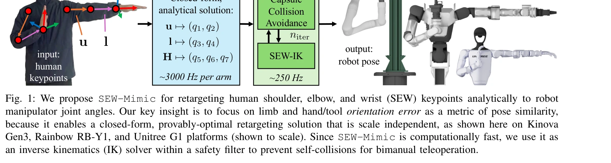
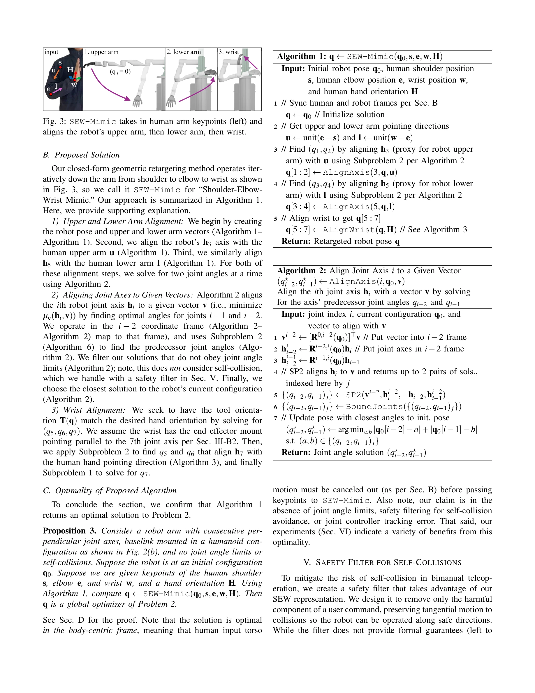

# A Closed-Form Geometric Retargeting Solver for Upper Body Humanoid Robot Teleoperation

> **저자**: Chuizheng Kong, Yunho Cho, Wonsuhk Jung, Idris Wibowo, Parth Shinde, Sundhar Vinodh-Sangeetha, Long Kiu Chung, Zhenyang Chen, Andrew Mattei, Advaith Nidumukkala, Alexander Elias, Danfei Xu, Taylor Higgins, Shreyas Kousik | **날짜**: 2026-02-02 | **URL**: [https://arxiv.org/abs/2602.01632](https://arxiv.org/abs/2602.01632)

---

## Essence

*Fig. 1: We propose SEW-Mimic for retargeting human shoulder, elbow, and wrist (SEW) keypoints analytically to robot*

SEW-Mimic은 인간의 어깨, 팔꿈치, 손목(SEW) 키포인트를 7-DoF 로봇 팔의 관절각으로 변환하는 폐형식(closed-form) 기하학적 역운동학 솔버로, 3kHz의 고속 추론과 최적성 보장을 제공한다.

## Motivation

- **Known**: 기존 로봇 텔레오퍼레이션 방법들은 손-끝-이펙터(end-effector) 위치·방향 추적에 기반하거나 최적화 기반 접근으로 계산 지연이 발생한다. 일부 학습 기반 방법들은 높은 유사도를 보이지만 0.7초 이상의 지연시간으로 인해 실시간 제어에 부적합하다.
- **Gap**: 7-DoF 인간형 로봇의 팔꿈치 제어 불일치 문제, Jacobian 특이점(singularity) 근처의 수치 불안정성, 그리고 실시간 텔레오퍼레이션을 위한 계산 속도와 정확도 간의 트레이드오프가 해결되지 않았다.
- **Why**: 저지연의 고속 인간 동작 캡처는 텔레오퍼레이션 성공률 향상과 자율 정책 학습 데이터 품질 개선에 직접적으로 기여하므로, 실용적인 로봇 조작 및 humanoid 로봇 텔레오퍼레이션의 기초 구성 요소로서 중요하다.
- **Approach**: 팔의 상·하완 방향벡터를 로봇 링크 벡터와 정렬하는 기하학적 부분문제(geometric subproblems)로 재구성하여, Jacobian 행렬이나 반복 최적화 없이 폐형식 해석해를 도출한다. 방향 오차를 기반으로 한 정의로 인해 휴먼-로봇 크기 차이에 대해 스케일 독립적이다.

## Achievement

*Fig. 1: We propose SEW-Mimic for retargeting human shoulder, elbow, and wrist (SEW) keypoints analytically to robot*

- **초고속 추론**: 3kHz의 연산 속도로 표준 CPU에서 실시간 처리 가능하며, 충돌 회피 안전필터 등 다운스트림 애플리케이션을 위한 계산 여유 제공
- **최적성 보증**: 폐형식 기하학적 솔루션으로 수렴 보장 및 Jacobian 특이점 제약 없음
- **높은 포즈 유사도**: 기존 방법 대비 향상된 방향 정렬 정확도와 팔꿈치 제어 일관성
- **범용 호환성**: 대부분의 7-DoF 로봇팔 및 humanoid에 적용 가능하며 키포인트 소스에 무관
- **텔레오퍼레이션 성공률 개선**: 파일럿 사용자 연구에서 작업 성공률 향상 입증
- **정책 학습 가속화**: SEW-Mimic으로 수집한 데이터의 매끄러움으로 인해 자율 정책 학습 개선
- **Full-body humanoid 가속화**: TWIST와의 통합으로 GMR 대비 1-3 자릿수 계산 속도 향상
- **하드웨어 검증**: Kinova Gen3, Rainbow RB-Y1, Unitree G1 플랫폼에서의 실시간 데모 제시

## How

*Fig. 3: SEW-Mimic takes in human arm keypoints (left) and*

- 인간 상하완을 단위벡터로 표현(shoulder-elbow, elbow-wrist 벡터)
- 로봇 링크의 해당 방향벡터와의 방향 오차(orientation error)를 정의
- Paden-Kahan 부분문제들을 기하학적으로 분해하여 각 관절각에 대한 폐형식 해를 유도
- 7번째 DoF(손목 회전)는 nullspace에서 최적화로 결정
- 이분(bimanual) 자기충돌 회피를 위해 capsule 기반 안전필터 적용
- MediaPipe 또는 Meta Quest 헤드셋과의 통합으로 키포인트 소스 유연성 제공

## Originality

- 기존 end-effector IK 중심에서 limb orientation alignment 중심으로의 패러다임 전환
- 방향 오차 정의를 통한 스케일 독립성으로 휴먼-로봇 크기 차이 자동 보정
- Jacobian 없는 폐형식 해로 특이점 제약 완전 회피
- Paden-Kahan 부분문제를 전신 humanoid retargeting 문제에 체계적으로 적용한 최초 사례
- real-time teleoperation 맥락에서 computation latency 획기적 감소

## Limitation & Further Study

- **키포인트 추출 오차의 영향**: MediaPipe 등 키포인트 검출 정확도에 의존하므로 입력 노이즈에 민감할 수 있음
- **상반신 제한**: full-body humanoid의 하반신(다리) 제어는 SEW-Mimic을 hip-knee-ankle에 적용하는 추가 과정 필요
- **통신 지연 미해결**: 무선 통신 latency는 별도로 해결되지 않았으므로 실제 원격 텔레오퍼레이션에서 전체 지연 개선은 제한적
- **접촉 힘 피드백 부재**: kinematic 중심의 방법으로 작업 보조 또는 안정성 향상을 위한 힘 제어 미지원
- **후속 연구 방향**: 더블-매니퓰레이터 협력 제어, 실시간 장애물 회피, 신경망 기반 키포인트 신뢰도 가중치 적응

## Evaluation

- Novelty: 4/5
- Technical Soundness: 4/5
- Significance: 4/5
- Clarity: 4/5
- Overall: 4/5

**총평**: SEW-Mimic은 인간형 로봇 텔레오퍼레이션의 근본적 병목(계산 지연, 팔꿈치 제어 불일치)을 폐형식 기하학적 해석으로 우아하게 해결하며, 실증적 성과와 다중 플랫폼 검증으로 실무 임팩트가 높은 기여이다.

## Related Papers

- 🔗 후속 연구: [[papers/1839_CLONE_Closed-Loop_Whole-Body_Humanoid_Teleoperation_for_Long/review]] — CLONE의 closed-loop teleoperation이 SEW-Mimic의 실시간 inverse kinematics와 결합되어 더 정확한 원격조작을 가능하게 합니다.
- 🔄 다른 접근: [[papers/2043_Learning_Adaptive_Neural_Teleoperation_for_Humanoid_Robots_F/review]] — 둘 다 humanoid teleoperation을 위한 수학적 솔버를 제공하지만 adaptive neural vs closed-form geometric 접근법이 다릅니다.
- 🔗 후속 연구: [[papers/1967_HandX_Scaling_Bimanual_Motion_and_Interaction_Generation/review]] — HandX의 bimanual motion generation이 SEW-Mimic의 상체 제어와 결합되어 전신 manipulation을 완성합니다.
- 🏛 기반 연구: [[papers/2021_Implicit_Kinodynamic_Motion_Retargeting_for_Human-to-humanoi/review]] — 인간-휴머노이드 간 암시적 운동 역학 리타겟팅의 이론적 기반을 SEW-Mimic의 기하학적 솔버에서 찾을 수 있습니다.
- 🔗 후속 연구: [[papers/1690_Stability-Aware_Retargeting_for_Humanoid_Multi-Contact_Teleo/review]] — 다중 접촉 원격조작을 위한 안정성 인식 리타겟팅에 고속 역운동학 솔버를 적용할 수 있습니다.
- 🧪 응용 사례: [[papers/1988_HuMam_Humanoid_Motion_Control_via_End-to-End_Deep_Reinforcem/review]] — end-to-end 심층 강화학습에서 상체 제어를 위한 실시간 관절각 변환 솔루션을 제공합니다.
- 🏛 기반 연구: [[papers/1853_Coordinated_Humanoid_Manipulation_with_Choice_Policies/review]] — 휴머노이드 시각-촉각-행동 데이터셋이 Choice Policy의 모듈식 텔레오퍼레이션과 모방 학습에 필요한 멀티모달 훈련 데이터를 제공한다.
- 🧪 응용 사례: [[papers/1785_A_Whole-Body_Motion_Imitation_Framework_from_Human_Data_for/review]] — closed-form 기하학적 리타겟팅 solver가 전신 동작 모방의 상반신 제어 정밀도를 향상시키는 데 활용될 수 있다.
- 🔄 다른 접근: [[papers/1891_DynaRetarget_Dynamically-Feasible_Retargeting_using_Sampling/review]] — DynaRetarget의 SBTO 기반 동작 변환과 closed-form 기하학적 리타겟팅은 서로 다른 인간-로봇 동작 변환 방식입니다.
- 🧪 응용 사례: [[papers/1918_ExBody2_Advanced_Expressive_Humanoid_Whole-Body_Control/review]] — 상체 휴머노이드를 위한 폐형식 기하학적 retargeting 솔버가 ExBody2의 decoupled motion-velocity 제어를 실제 로봇 배포에 적용하는 구체적인 방법을 제공한다.
- 🏛 기반 연구: [[papers/1997_Humanoid_Manipulation_Interface_Humanoid_Whole-Body_Manipula/review]] — Closed-form geometric retargeting이 HuMI의 IK 기반 적응에 기하학적 기반을 제공합니다.
- 🔄 다른 접근: [[papers/2021_Implicit_Kinodynamic_Motion_Retargeting_for_Human-to-humanoi/review]] — 둘 다 인간-휴머노이드 모션 리타게팅이지만 IKMR은 암시적 키노다이나믹, Closed-Form은 기하학적 접근
- 🔗 후속 연구: [[papers/2115_OKAMI_Teaching_Humanoid_Robots_Manipulation_Skills_through_S/review]] — A Closed-Form Geometric Retargeting Solver의 upper body retargeting이 OKAMI의 object-aware retargeting으로 확장된 것이다
