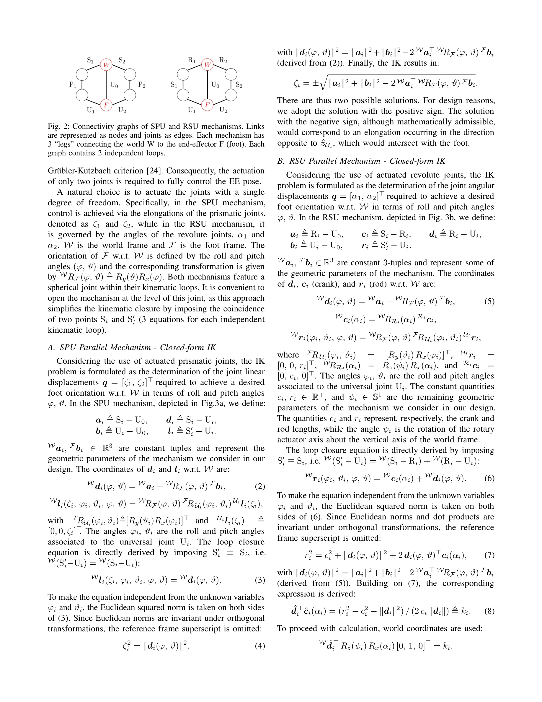

# A Framework for Optimal Ankle Design of Humanoid Robots

> **저자**: Guglielmo Cervettini, Roberto Mauceri, Alex Coppola, Fabio Bergonti, Luca Fiorio, Marco Maggiali, Daniele Pucci | **날짜**: 2025-09-19 | **URL**: [https://arxiv.org/abs/2509.16469](https://arxiv.org/abs/2509.16469)

---

## Essence

*Fig. 1: Examples of two-degrees-of-freedom ankle mechanisms.*

휴머노이드 로봇의 발목 설계를 위한 통합 프레임워크를 제시하며, SPU 및 RSU 병렬 메커니즘에 대한 다목적 최적화를 통해 최적 구성을 도출한다.

## Motivation

- **Known**: 병렬 메커니즘 구조는 액추에이터를 근위에 배치하여 질량 분포를 개선하고 기계적 순응성을 높여 발목 설계에 유리하다는 점이 알려져 있다.
- **Gap**: 여러 병렬 메커니즘 구조 중 최적 아키텍처를 선택하고 기하학적 파라미터를 체계적으로 튜닝할 수 있는 정량적 기준과 통합 설계 방법론이 부재하다.
- **Why**: 발목은 지면 상호작용의 첫 번째 접점으로 민첩성과 안전성에 직접적인 영향을 미치므로, 최적의 발목 설계는 휴머노이드 로봇의 전체 성능 향상에 필수적이다.
- **Approach**: Scalar cost function을 통해 다양한 성능 지표를 집계하여 cross-architecture 비교를 가능하게 하고, RSU에 대한 새로운 parameterization을 도입하여 workspace feasibility를 보장하면서 최적화를 가속화한다.

## Achievement

- **통합 설계 프레임워크**: SPU 및 RSU 메커니즘에 대한 통일된 kinematic modeling 및 최적화 방법론 제시
- **RSU Parameterization**: Workspace feasibility를 보장하는 새로운 parameterization 개발으로 최적화 수렴성 개선
- **성능 개선**: 최적화된 RSU 설계가 원래 serial 설계 대비 41%, 관례적 RSU 대비 14% 비용 함수 감소 달성
- **실제 검증**: 기존 휴머노이드 로봇의 발목을 재설계하여 방법론의 실용성 입증

## How

*Fig. 2: Connectivity graphs of SPU and RSU mechanisms. Links*

- Closed kinematic chain 및 loop closure equation을 기반으로 SPU와 RSU의 역기구학(IK) 해석 수행
- Jacobian matrix 분석을 통해 singularity 회피 및 manipulability ellipsoid를 고려한 성능 평가
- 다목적 최적화 알고리즘을 적용하여 메커니즘 기하학적 파라미터 종합
- Scalar cost function으로 joint torque, actuator mass, workspace size, manipulability 등의 성능 지표 통합
- Gröbbler-Kutzbach criterion을 이용한 자유도 검증

## Originality

- SPU와 RSU 두 대표적 병렬 메커니즘을 통일된 프레임워크 내에서 비교 분석한 최초의 체계적 접근
- RSU 메커니즘에 대한 새로운 parameterization 도입으로 최적화 문제의 해결성 향상
- Cost function 기반의 cross-architecture 비교 방법론이 기존 연구의 정성적 평가를 정량화
- 실제 휴머노이드 로봇 재설계를 통한 방법론의 실증적 검증

## Limitation & Further Study

- 두 가지 메커니즘(SPU, RSU)만 대상으로 하며 다른 병렬 구조(예: 3-RPS, 6-DOF parallel platform)의 비교 부재
- 동역학적 특성(dynamic performance, energy consumption) 분석이 kinematic 평가에 국한되어 있음
- 최적화 과정에서 제조 공차, 마모, 실제 액추에이터의 비선형성 등 실무 제약 조건 미반영
- Cost function의 가중치 설정이 task-dependent하므로 일반화 가능성 제한
- 후속 연구로 동역학 시뮬레이션 및 실제 보행 실험 기반 검증, 추가 메커니즘 구조 확장, 제조 공차 고려한 robust 설계 방법론 개발 필요

## Evaluation

- Novelty: 4/5
- Technical Soundness: 3/5
- Significance: 4/5
- Clarity: 4/5
- Overall: 4/5

**총평**: 본 논문은 휴머노이드 로봇 발목 설계의 오랜 난제인 아키텍처 선택과 파라미터 최적화를 체계적이고 정량적으로 해결하는 통합 프레임워크를 제시하며, 실제 로봇 재설계를 통한 유의미한 성능 개선으로 실용성을 입증하였다.
