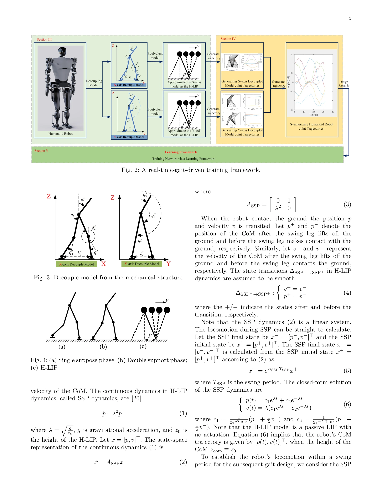

# A Gait Driven Reinforcement Learning Framework for Humanoid Robots

> **저자**: Bolin Li, Yuzhi Jiang, Linwei Sun, Xuecong Huang, Lijun Zhu, Han Ding | **날짜**: 2025-06-10 | **URL**: [https://arxiv.org/abs/2506.08416](https://arxiv.org/abs/2506.08416)

---

## Essence

*Fig. 2: A real-time-gait-driven training framework.*

본 논문은 humanoid robot의 bipedal gait 학습을 위해 실시간 gait planner와 structured reward composition을 결합한 reinforcement learning framework를 제시한다.

## Motivation

- **Known**: 전통적 gait generation 방법은 model-based optimization이나 heuristic rules에 의존하고, 최근 RL 기반 접근은 학습 가능하지만 긴 training time과 불규칙한 periodicity 문제를 가진다.
- **Gap**: model-based robustness와 data-driven adaptability 사이의 괴리 존재하며, 실시간 whole-body joint trajectory planning 효율성과 학습 탐색 요구 사항의 균형을 맞추는 기존 방법들의 부족함.
- **Why**: Humanoid robot의 안정적이고 효율적인 bipedal locomotion은 동적이고 구조화되지 않은 환경에서 중요한 과제이며, 실시간 처리와 주기적 gait의 동시 만족이 물리 플랫폼 배포에 필수적이다.
- **Approach**: 3D humanoid model을 두 개의 2D subsystem으로 decoupling하여 H-LIP 모델로 근사화하는 dynamic-aware gait planner를 설계하고, periodicity enforcement, trajectory tracking, time efficiency를 결합한 structured reward composition으로 policy learning을 유도한다.

## Achievement

*Fig. 2: A real-time-gait-driven training framework.*

- **Dynamical decoupling 전략**: 3D humanoid motion을 계산 가능한 2D H-LIP 근사로 단순화하여 balance와 kinematic constraints 하에서 feasible reference trajectory 생성
- **Multi-objective reward design**: Periodic, time-efficient, tracking-consistent gaits를 명시적으로 촉진하는 reward composition이 local optima와 erratic behavior 같은 RL 문제 해결
- **Superior learning efficiency**: Simulation 환경에서 baseline 방법 대비 우수한 학습 효율성과 locomotion quality 달성, 실제 humanoid platform 배포 가능성 시사

## How

*Fig. 3: Decouple model from the mechanical structure.*

- Humanoid robot을 mass가 무시할 수 있는 upper body를 rigid body로 가정하여 X-axis 5-link 모델과 Y-axis 3-link 모델로 decoupling
- 각 decoupled model을 H-LIP (hybrid inverted pendulum) model로 근사화: SSP(single support phase)에서는 passive LIP, DSP(double support phase)는 instantaneous로 가정
- SSP dynamics를 선형 시스템으로 표현 (¨p = λ²p)하여 closed-form solution 도출 및 실시간 joint trajectory 계산
- Decoupled model에서 생성된 trajectories를 combination하여 full robot model의 final joint trajectory 획득
- Gait planner로부터 생성된 joint trajectories를 RL framework의 reward function에 통합하여 periodicity, tracking accuracy, time efficiency를 종합 평가
- Multi-objective reward composition으로 policy network training 수행하여 periodic bipedal gait 달성

## Originality

- H-LIP model을 기반으로 한 real-time 3D-to-2D decoupling 전략의 novel 적용으로 whole-body joint trajectory planning의 효율성 확보
- RL의 exploratory 능력과 model-based planning의 dynamical fidelity를 systematic하게 결합하는 hybrid framework 제안
- Periodicity enforcement, trajectory tracking, time efficiency를 명시적으로 다루는 structured reward composition의 design로 pure RL 방식의 periodicity 문제 해결
- Real-time parallel gait planning이 robot's learning environment 내에서 작동하는 통합 framework 구현

## Limitation & Further Study

- Decoupling 과정에서 orthogonal 방향의 영향을 무시하는 가정 (qR−hpz, qL−hpz = 0)이 복잡한 동역학 상황에서 정확도 저하 가능성
- DSP를 instantaneous로 가정하는 H-LIP model의 단순화가 실제 robot의 double support dynamics 재현 정확도 제한
- 현재 simulation 환경에서의 결과만 제시되어 있으므로 실제 physical humanoid platform에서의 성능 검증 필요
- Reward composition의 three 항목들 간의 가중치 설정과 hyperparameter tuning에 대한 상세한 ablation study 부족
- 다양한 robot morphology와 환경 조건에 대한 일반화 가능성에 대한 분석 필요

## Evaluation

- Novelty: 4/5
- Technical Soundness: 3/5
- Significance: 4/5
- Clarity: 4/5
- Overall: 4/5

**총평**: 본 논문은 model-based planning과 data-driven learning을 효과적으로 결합하여 humanoid robot의 bipedal gait 학습을 위한 실용적인 framework를 제시한다. H-LIP 기반 decoupling과 structured reward composition의 조합이 학습 효율성과 periodicity를 동시에 향상시키는 점에서 기술적 독창성이 있으나, 물리 실험 검증과 복잡한 환경 적응성 평가가 추가되면 더욱 강화될 것이다.
