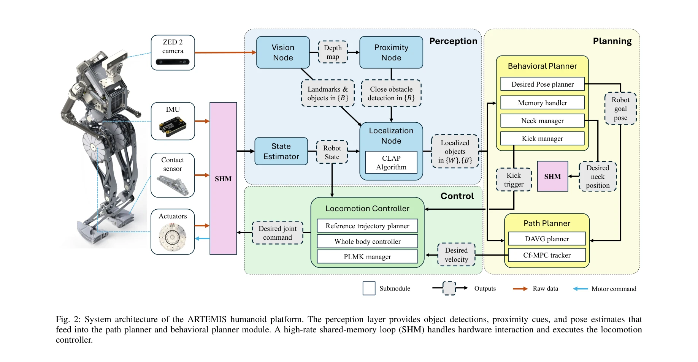
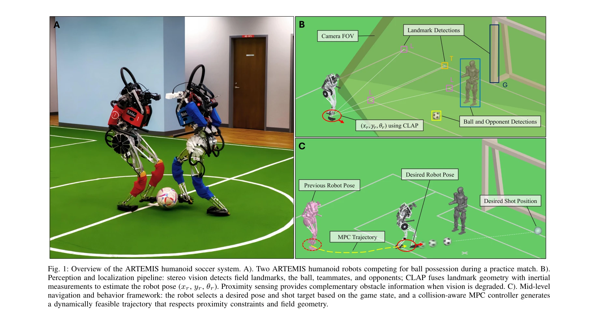

# A Hierarchical, Model-Based System for High-Performance Humanoid Soccer

> **저자**: Quanyou Wang, Mingzhang Zhu, Ruochen Hou, Kay Gillespie, Alvin Zhu, Shiqi Wang, Yicheng Wang, Gaberiel I. Fernandez, Yeting Liu, Colin Togashi, Hyunwoo Nam, Aditya Navghare, Alex Xu, Taoyuanmin Zhu, Min Sung Ahn, Arturo Flores Alvarez, Justin Quan, Ethan Hong, Dennis W. Hong | **날짜**: 2025-12-10 | **URL**: [https://arxiv.org/abs/2512.09431](https://arxiv.org/abs/2512.09431)

---

## Essence

*Fig. 2: System architecture of the ARTEMIS humanoid platform. The perception layer provides object detections, proximity*

RoboCup 2024 우승팀의 완전히 통합된 성인용 휴머노이드 축구 로봇 시스템으로, QDD 액추에이터 기반 하드웨어와 계층적 perception-planning-control 아키텍처를 결합하여 동적이고 전술적으로 효과적인 게임플레이를 실현했다.

## Motivation

- **Known**: 휴머노이드 로봇의 동적 제어 및 QDD 액추에이터의 우수성은 알려져 있으며, 기존 RoboCup 팀들은 ZMP 기반 보행과 정적 킥을 사용하는 모듈식 아키텍처를 개발해왔다.
- **Gap**: 기존 시스템들은 perception과 control 간의 느슨한 결합, 제한적인 동적 킹(in-gait kick) 성능, 그리고 실시간 global path planning과 충돌 회피 기능 부재로 인해 동적이고 대적인 경기 조건에서 성능 저하를 겪고 있다.
- **Why**: 성인용 휴머노이드 축구는 무거운 로봇의 균형 회복, 충돌 완화, 빠른 운동량 변화를 요구하는 복잡한 실시간 환경으로, 이를 극복하는 완전히 통합된 시스템의 개발은 로봇 축구와 동적 휴머노이드 제어의 상한선을 높일 수 있다.
- **Approach**: 하드웨어 측면에서는 특수화된 발 설계와 고토크 QDD 액추에이터를 결합하여 보행 중 강력한 킥을 가능하게 했고, 소프트웨어 측면에서는 stereo vision, 객체 탐지, landmark-based fusion을 통한 통합 perception 프레임워크, CLAP 알고리즘 기반 localization, DAVG planner와 Cf-MPC를 사용한 mid-level 네비게이션, 그리고 behavior manager를 통한 고수준 의사결정을 계층적으로 설계했다.

## Achievement

*Fig. 1: Overview of the ARTEMIS humanoid soccer system. A). Two ARTEMIS humanoid robots competing for ball possession du*

- **동적 킹 성능**: 특수화된 발 설계와 in-gait locomotion control을 통해 보행 중 강력한 킥 실행 가능
- **통합 Perception 시스템**: stereo vision, object detection, landmark fusion, proximity sensing을 결합하여 robust한 ball, goal, teammate, opponent 추정
- **실시간 충돌 회피 네비게이션**: DAVG planner와 collision-aware Cf-MPC를 사용한 dynamically feasible trajectory 생성
- **계층적 행동 관리**: centralized behavior manager를 통한 seamless한 role selection, 킥 실행, 게임 상태 기반 의사결정
- **RoboCup 2024 우승**: 위 모든 컴포넌트의 통합을 통해 adult-sized humanoid soccer championship 획득

## How

*Fig. 2: System architecture of the ARTEMIS humanoid platform. The perception layer provides object detections, proximity*

- QDD 액추에이터 기반 고토크, 고가속도 플랫폼으로 impact-resilient 동작 구현
- 특수화된 발 구조(foot attachment)를 통해 in-gait kick 중 안정성 유지
- ZED 2 stereo camera에서 60Hz로 depth map과 객체 탐지 수행
- CLAP 알고리즘으로 landmark 기하학 및 IMU 측정값 fusion을 통한 pose 추정
- Proximity sensing을 vision과 보완적으로 사용하여 close obstacle detection 수행
- DAVG planner로 desired pose 기반 global path 생성
- Cf-MPC tracker로 proximity constraints와 field geometry를 고려한 trajectory tracking
- 1kHz shared-memory loop에서 whole-body controller 실행으로 real-time 균형 제어
- Memory handler, neck manager, kick manager로 구성된 modular behavior planner

## Originality

- 기존 servo 기반 ZMP 시스템 대신 QDD 액추에이터 기반 dynamic locomotion으로 전환한 하드웨어 혁신
- Perception, localization, planning, control 간의 tight integration을 통해 모듈식 아키텍처의 한계 극복
- In-gait kicking의 안정성을 특수 발 설계와 locomotion 제어의 결합으로 달성
- Vision degradation 시 proximity sensing의 complementary 역할을 설계적으로 통합
- Landmark-based CLAP localization과 객체 탐지의 fusion으로 noisy visual perception 극복
- Centralized behavior manager를 통한 role reasoning과 motion prediction의 통합

## Limitation & Further Study

- 성인용 로봇에만 적용되었으므로 kid-sized humanoid로의 확장 검증 필요
- Soft turf와 specific field dimensions에 튜닝된 시스템으로 다양한 환경에서의 일반화 성능 미확인
- Learning-based approach와의 비교 평가 부재 - 순수 model-based vs learning-based의 상대적 이점 명확화 필요
- RoboCup 규제 범위 내(onboard camera, proprioception만)의 성능이므로 외부 센서 활용 시 추가 개선 가능성
- Real match 데이터 분석의 상세 통계(충돌 횟수, 실패 킥 분석 등) 제시 미흡
- 후속 연구로는 multi-agent coordination 강화, adversarial scenario 대응력 개선, learning-based 컴포넌트 통합 등이 고려될 수 있음

## Evaluation

- Novelty: 4/5
- Technical Soundness: 4/5
- Significance: 4/5
- Clarity: 4/5
- Overall: 4/5

**총평**: QDD 액추에이터 기반 하드웨어와 perception-planning-control의 tight integration을 통해 RoboCup 우승을 달성한 고성숙도의 시스템으로, 동적 휴머노이드 제어와 실시간 자율 네비게이션의 실제 구현 사례로서 상당한 실질적 가치를 제공한다.
