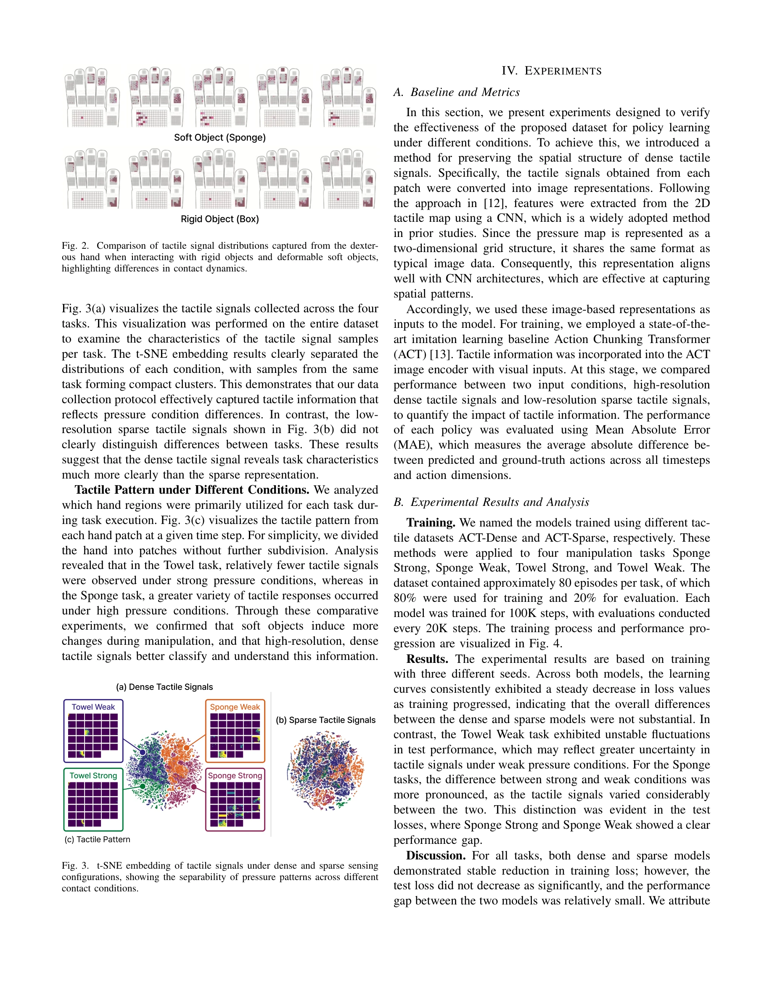

# A Humanoid Visual-Tactile-Action Dataset for Contact-Rich Manipulation

> **저자**: Eunju Kwon, Seungwon Oh, In-Chang Baek, Yucheon Park, Gyungbo Kim, JaeYoung Moon, Yunho Choi, Kyung-Joong Kim | **날짜**: 2025-10-28 | **URL**: [https://arxiv.org/abs/2510.25725](https://arxiv.org/abs/2510.25725)

---

## Essence

*Fig. 1.*

인형로봇의 시각-촉각-행동 다중모달 데이터셋을 제시하여 접촉 기반 조작, 특히 부드러운 물체 조작을 위한 로봇 학습을 지원한다.

## Motivation

- **Known**: 로봇 학습 데이터셋은 주로 경직된 물체에 초점을 맞춰왔으며, 다중모달 센싱의 통합이 조작 성능을 향상시킬 수 있다는 것이 알려져 있다.
- **Gap**: 기존 연구는 부드러운 물체 조작 시 다양한 압력 조건을 반영한 촉각 데이터가 부족하며, 인형로봇의 손재주 있는 손(dexterous hands)으로부터의 고밀도 촉각 신호를 포함한 데이터셋이 존재하지 않는다.
- **Why**: 접촉 기반 조작은 실세계 로봇 작업의 핵심이며, 부드러운 물체는 조작 중 형태가 지속적으로 변하기 때문에 고해상도 촉각 정보의 캡처와 학습이 필수적이다.
- **Approach**: 원격 조종 방식으로 Inspire Hand(1,062개 고해상도 센서)와 egocentric 비전 카메라를 장착한 인형로봇을 통해 타올과 스펀지 같은 부드러운 물체를 강한 압력/약한 압력 조건에서 조작하는 데이터를 수집하였다.

## Achievement

*Fig. 3(a) visualizes the tactile signals collected across the four*

- **첫 인형로봇 촉각-비전-행동 데이터셋**: 부드러운 물체를 다양한 제어 조건 하에서 캡처한 101.9K 프레임의 다중모달 데이터셋을 제시
- **고밀도 촉각 융합 아키텍처**: 밀집된 촉각 정보의 효율적 융합을 위한 신경망 구조 도입으로 접촉 기반 조작 성능 향상
- **촉각 신호 특성 분석**: 부드러운 물체 조작 시 촉각 신호의 시간 변동 분포가 경직된 물체와 본질적으로 다르며, 고밀도 센싱이 필수임을 실증

## How

*Fig. 2. Comparison of tactile signal distributions captured from the dexter-*

- Unitree 워크플로우 확장을 통한 인형로봇 원격 조종 시스템 구축 (head-mounted camera 848×480, third-person RealSense D435, piezo-resistive tactile carpet)
- 2,124개 고밀도 센서와 42개 저밀도 센서(sparse representation) 간 비교 분석을 통해 고해상도 촉각 신호의 중요성 검증
- t-SNE 임베딩을 이용한 촉각 신호 분포 분석으로 압력 조건별 태스크 특성 분류
- 부드러운 물체(타올, 스펀지) vs 경직된 물체에 대한 촉각 패턴 비교 분석
- State-of-the-art imitation learning baseline을 통한 촉각 센싱 해상도의 중요도 평가

## Originality

- 인형로봇의 **anthropomorphic hands**(Inspire Hand RH56-DFX)로부터 고밀도 촉각 신호(2,124개 센서)를 수집한 첫 시도
- 부드러운 물체 조작에 특화된 데이터셋으로, 압력 조건 변화에 따른 촉각 신호의 동적 변화를 체계적으로 캡처
- Dense vs. Sparse 촉각 표현 비교를 통해 고해상도 촉각 센싱의 필요성을 정량적으로 입증

## Limitation & Further Study

- 데이터셋이 2개 유형의 부드러운 물체(타올, 스펀지)만 포함하여 물체 다양성이 제한적
- 3명의 원격 조종자에 의해 수집되어 개인 차이의 영향 가능성
- 실제 로봇 조작에서의 정책 학습 성과를 보여주는 실제 로봇 실험이 부재하거나 제한적
- 후속 연구는 더 다양한 부드러운 물체, 복잡한 조작 태스크, 그리고 self-supervised 또는 unsupervised 학습 방법의 적용이 필요

## Evaluation

- Novelty: 4/5
- Technical Soundness: 3/5
- Significance: 4/5
- Clarity: 4/5
- Overall: 4/5

**총평**: 본 논문은 접촉 기반 조작 연구의 중요한 격차를 메우기 위해 인형로봇 기반의 고밀도 시각-촉각-행동 데이터셋을 처음으로 제시하며, 고해상도 촉각 신호의 필요성을 명확하게 입증하는 가치 있는 기여다.
