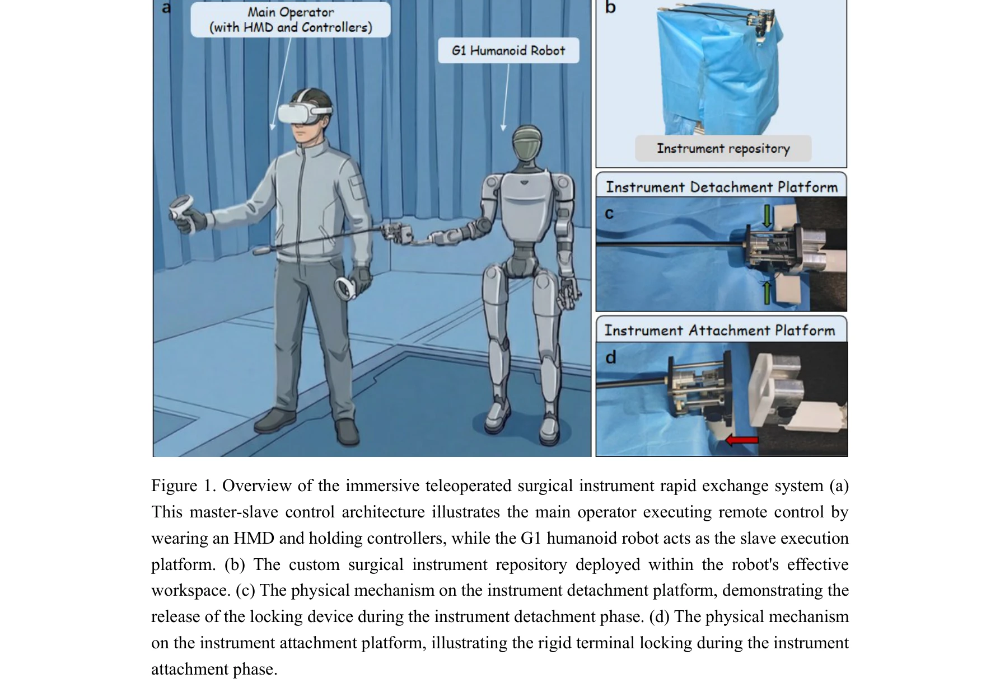
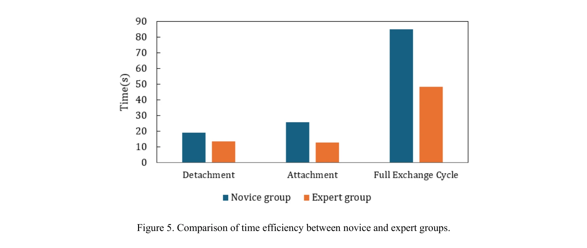

# A Rapid Instrument Exchange System for Humanoid Robots in Minimally Invasive Surgery

> **저자**:  | **날짜**: 2026-04-03 | **URL**: [https://arxiv.org/abs/2604.02707](https://arxiv.org/abs/2604.02707)

---

## Essence

*Figure 1. Overview of the immersive teleoperated surgical instrument rapid exchange system (a)*

휴머노이드 로봇의 이중 팔 구성을 활용하여 HMD 기반 몰입형 원격조작과 단축 컴플라이언트 도킹 메커니즘을 통합한 최소침습 수술용 고속 기구 교환 시스템을 제안한다.

## Motivation

- **Known**: 산업용 Automatic Tool Changers와 기존 다중팔 의료로봇의 기구 교환 기술이 성숙해 있으나, 이들은 휴머노이드 로봇의 생체모방적 이중팔 구조와 공간 제약에 직접 적용하기 어렵다.
- **Gap**: 휴머노이드 로봇을 위한 전문화된 고속 기구 교환 메커니즘 및 원격조작 기반 수술 시스템이 부족하며, 기존 그리퍼 기반 솔루션은 최소침습 수술의 정밀한 도킹 요구사항을 충족하지 못한다.
- **Why**: 휴머노이드 로봇이 다중팔 플랫폼의 높은 비용과 공간점유율 문제를 해결할 수 있지만, 효율적인 기구 교환 능력이 수술 효율성과 임상 안전성의 핵심 결정 요소가 된다.
- **Approach**: Master-slave 협력 제어 구조에서 HMD를 통한 실시간 1인칭 시점 시각 피드백과 단축 컴플라이언스 기반 도킹 메커니즘을 통합하여 직관적이고 안정적인 기구 교환을 구현한다.

## Achievement

*Figure 5. Comparison of time efficiency between novice and expert groups.*

- **도킹 메커니즘 설계**: 로봇 팔 단말에 장착된 능동 컴포넌트(구동 모터)와 수술 기구 기저부의 수동 컴포넌트(와이어 구동 메커니즘)로 구성된 정밀 도킹 시스템 개발
- **몰입형 원격조작 인터페이스**: HMD 기반 FPV 시각 피드백과 자연스러운 3차원 공간 운동 매핑을 통해 인지 부하 감소 및 직관적 조작 가능
- **성능 검증**: 전문가와 초보자 비교 평가에서 높은 조작 견고성과 빠른 학습 곡선 수렴 입증, 기구 부착·분리 성능이 간단한 훈련으로 현저히 향상
- **임상 환경 적용성**: 제약된 임상 환경 내에서 안정적인 기구 교환 실행의 기술적 타당성 검증

## How

- G1 humanoid robot(총 29 DoF, 상하 팔당 7 DoF)을 slave 실행 플랫폼으로 선정
- 로봇 팔 말단에 능동 컴포넌트(구동 모터 탑재)를 강체 고정하고 수술 기구 기저부에 수동 컴포넌트(와이어 구동 메커니즘) 통합
- HMD를 통해 로봇의 1인칭 시점 시각 피드백 제공 및 master-slave 제어 구조 구현
- 단축 컴플라이언트 도킹 메커니즘으로 환경 제약 해제 및 저지연 기구 교환 실현
- 기구 부착/분리 단계별 작동 프로세스 설계 및 검증(Fig 2, Fig 3)

## Originality

- 휴머노이드 로봇의 생체모방적 이중팔 구조라는 고유한 제약 조건을 극복하기 위한 전문화된 도킹 메커니즘 개발
- HMD 기반 몰입형 원격조작과 단축 컴플라이언스를 결합한 창의적 접근
- 휴머노이드 로봇 플랫폼에서 기구 교환의 임상 적용 가능성을 최초로 체계적으로 검증

## Limitation & Further Study

- **장거리 공간 정렬의 시간 비용**: 초기 도킹 전 장거리 공간 정렬 단계에서 시간 소요 및 협력 안정성 문제 존재
- **원격조작의 완전 자율화 미실현**: 현재 단계에서는 복잡한 고정밀 작업에 대한 완전 자율 운영 기술 미성숙으로 인한 원격조작 의존성
- **임상 대규모 검증 부재**: 제한된 실험 환경에서의 검증으로 임상 현장 적용 전 추가 실증 필요
- **후속 연구 방향**: 머신러닝 기반 자동 정렬, 촉각 피드백 통합, 완전 자율 도킹 알고리즘 개발, 다양한 휴머노이드 플랫폼으로의 확장 필요

## Evaluation

- Novelty: 4/5
- Technical Soundness: 3/5
- Significance: 4/5
- Clarity: 4/5
- Overall: 4/5

**총평**: 휴머노이드 로봇을 최소침습 수술에 실질적으로 적용하기 위한 핵심 기술 과제를 체계적으로 해결하였으며, HMD 기반 몰입형 원격조작과 맞춤형 도킹 메커니즘의 통합이 효과적임을 입증한 중요한 연구이다.

## Related Papers

- 🔗 후속 연구: [[papers/2040_LapSurgie_Humanoid_Robots_Performing_Surgery_via_Teleoperate/review]] — 일반적인 복강경 수술 원격조작을 휴머노이드 로봇 플랫폼으로 확장하여 기구 교환 시스템을 통합한 연구입니다.
- 🧪 응용 사례: [[papers/1819_Beyond_Tools_and_Persons_Who_Are_They_Classifying_Robots_and/review]] — 로봇과 AI 에이전트 분류 프레임워크를 의료용 휴머노이드 로봇의 법적 지위와 거버넌스에 적용할 수 있습니다.
- 🏛 기반 연구: [[papers/1866_Development_of_an_Intuitive_GUI_for_Non-Expert_Teleoperation/review]] — 비전문가를 위한 직관적 원격조작 GUI가 외과의사를 위한 HMD 기반 몰입형 인터페이스의 기반 기술을 제공합니다.
- 🧪 응용 사례: [[papers/1819_Beyond_Tools_and_Persons_Who_Are_They_Classifying_Robots_and/review]] — CPST 기반 로봇 분류 프레임워크를 의료용 휴머노이드 로봇의 법적 지위와 거버넌스 정책 수립에 적용할 수 있습니다.
- 🔗 후속 연구: [[papers/2011_Humanoids_in_Hospitals_A_Technical_Study_of_Humanoid_Robot_S/review]] — Rapid instrument exchange system이 의료 시술용 휴머노이드를 수술 도구 교환으로 확장합니다.
