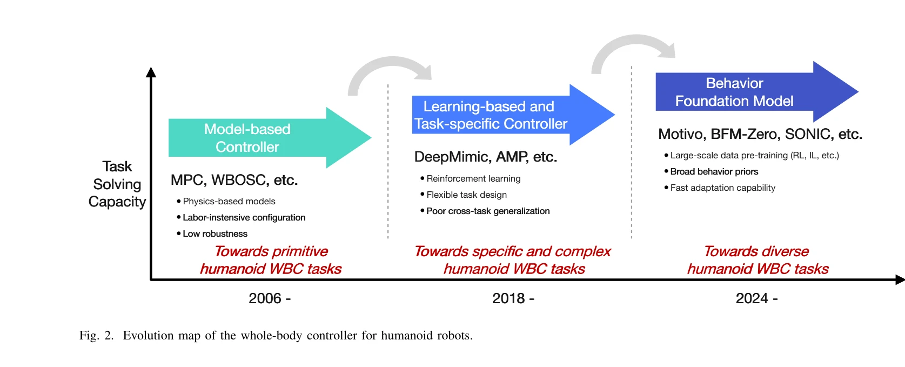

# A Survey of Behavior Foundation Model: Next-Generation Whole-Body Control System of Humanoid Robots

> **저자**: Mingqi Yuan, Tao Yu, Wenqi Ge, Xiuyong Yao, Huijiang Wang, Jiayu Chen, Bo Li, Wei Zhang, Wenjun Zeng, Hua Chen, Xin Jin | **날짜**: 2025-06-25 | **URL**: [https://arxiv.org/abs/2506.20487](https://arxiv.org/abs/2506.20487)

---

## Essence

*Fig. 1. A behavior foundation model learns broad behavior priors from large-*

본 논문은 휴머노이드 로봇의 전신 제어(WBC)를 위한 행동 기초 모델(BFM)의 발전과 응용을 종합적으로 조사하며, 대규모 사전학습을 통해 재사용 가능한 행동 기초를 학습하여 다양한 작업에 빠르게 적응할 수 있는 차세대 제어 시스템을 제시한다.

## Motivation

- **Known**: 전통적 MPC/WBOSC 기반 모델 제어는 강건하지만 작업 재설계가 번거롭고, RL/IL 기반 학습 제어는 유연하나 일반화 능력이 제한적이며 시뮬레이션-현실 간극 문제가 있다.
- **Gap**: 기존 학습 기반 제어기는 새로운 작업마다 노동집약적인 재학습을 요구하고 태스크 간 일반화가 약하여, 실제 세계에서 확장 가능한 휴머노이드 제어의 기본 병목이 되고 있다.
- **Why**: 휴머노이드 로봇은 복잡한 동역학, 접촉 변화, 다양한 작업 요구사항을 동시에 처리해야 하므로 일반화 가능하고 효율적인 제어 패러다임이 필수적이며, BFM은 이러한 요구를 충족할 수 있는 유망한 새로운 접근 방식이다.
- **Approach**: 본 논문은 BFM의 개념을 확대 정의하여 광범위한 행동 데이터에 대한 대규모 사전학습으로부터 행동 기초를 학습하고, 이를 다양한 다운스트림 작업으로 신속하게 적응시킬 수 있는 체계적 개요를 제공한다.

## Achievement

*Fig. 2. Evolution map of the whole-body controller for humanoid robots.*

- **포괄적 진화 지도**: 모델 기반 → 학습 기반 → BFM으로 진행하는 휴머노이드 WBC 제어의 역사적 발전 과정을 시각화하고 각 패러다임의 장단점을 분석
- **BFM 정의 확장**: Foundation model의 원리를 로봇 제어에 적용하여 vision-language-action(VLA) 모델을 통합하는 다중모달 행동 기초 모델 개념 정립
- **다양한 사전학습 파이프라인 추적**: 데모, 상호작용, 시뮬레이션, 합성 등 다양한 데이터 소스와 RL/IL 기반 사전학습 방식의 동향 분석
- **실세계 응용 및 도전 과제 논의**: BFM의 실제 적용 사례, 현재 제한사항, 긴급 과제, 향후 기회를 체계적으로 정리

## How

- 전통 모델 기반 제어(MPC, WBOSC, 계층적 QP)의 이론적 기초와 실제 적용 사례(Atlas, HRP-2) 검토
- DeepMimic, AMP 등 RL/IL 기반 학습 제어의 기술적 진전과 한계점(샘플 비효율성, Sim2Real 갭, 태스크별 특화) 분석
- 행동 데이터의 다중 소스(인간 시연, 에이전트-환경 상호작용, 시뮬레이션)에서 광범위한 행동 기초를 학습하는 사전학습 체계
- 학습된 기초 모델의 다양한 다운스트림 작업(움직임 추적, 목표 도달, 명령 추종, 텍스트-모션) 적응 메커니즘
- GitHub 저장소(awesome-bfm-papers)를 통한 BFM 관련 논문과 프로젝트의 지속적 수집 및 업데이트

## Originality

- Foundation model의 원리를 로봇 전신 제어에 체계적으로 적용한 BFM 개념의 확대 및 재정의
- 휴머노이드 WBC의 40년 역사를 모델 기반→학습 기반→BFM의 3단계 진화로 명확히 구조화
- Vision-language-action(VLA) 모델을 통합한 다중모달 행동 기초 모델의 새로운 패러다임 제시
- 대규모 다원적 데이터 소스(데모, 상호작용, 시뮬레이션, 합성)를 활용한 다양한 사전학습 파이프라인 분류 체계 구축

## Limitation & Further Study

- **조사 논문의 한계**: 구체적인 새로운 방법론이나 알고리즘 제안 보다는 기존 연구의 종합이므로 기술적 혁신성이 제한적
- **BFM의 실현 성숙도**: 논문에서 논의하는 BFM 적용 사례가 초기 단계이며, 실세계 휴머노이드에서의 장기적 성능 검증 부족
- **Sim2Real 갭의 해결책 미흡**: BFM이 Sim2Real 문제를 근본적으로 해결하는 방식에 대한 구체적 기술 및 실증 결과 부족
- **일반화 한계 논의 부족**: 제한된 데이터 또는 분포 외(OOD) 상황에서의 BFM 성능 저하 및 대책에 대한 깊이 있는 분석 필요
- **후속 연구**: BFM의 확장성을 검증하기 위한 다양한 휴머노이드 플랫폼에서의 대규모 비교 실험과, 인간 선호도 기반 강화학습(RLHF) 등 성능 최적화 기법의 체계적 연구

## Evaluation

- Novelty: 4/5
- Technical Soundness: 3/5
- Significance: 4/5
- Clarity: 4/5
- Overall: 4/5

**총평**: 본 논문은 휴머노이드 로봇 제어의 역사적 진화를 명확히 하고 BFM을 차세대 통합 제어 패러다임으로 체계적으로 정의하여, 로봇 제어 커뮤니티에 명확한 비전과 구조화된 개요를 제공하는 가치 높은 조사 논문이다. 다만 구체적인 기술적 혁신과 실세계 검증 결과는 추가 개발이 필요하다.
