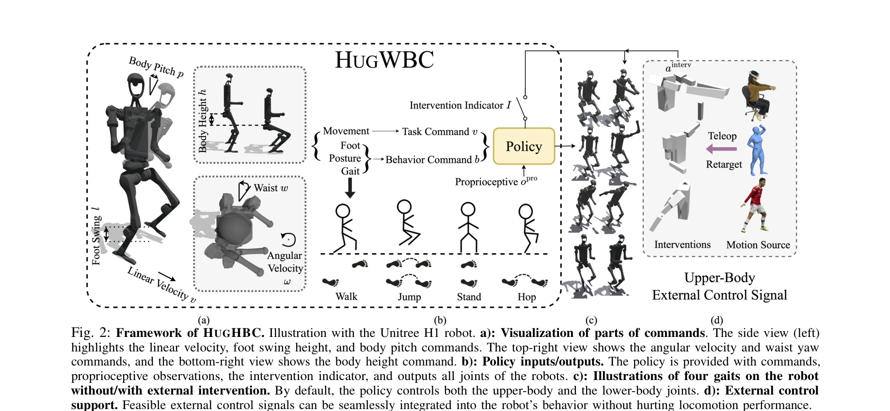
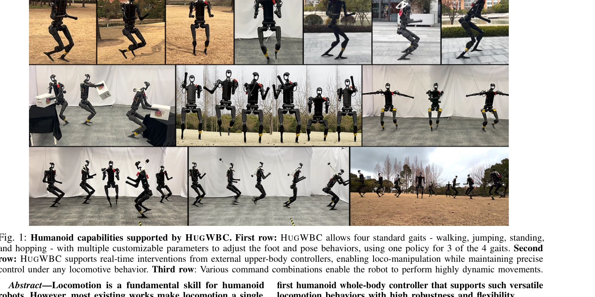

# A Unified and General Humanoid Whole-Body Controller for Versatile Locomotion

> **저자**: Yufei Xue, Wentao Dong, Minghuan Liu, Weinan Zhang, Jiangmiao Pang | **날짜**: 2025-02-05 | **URL**: [https://arxiv.org/abs/2502.03206](https://arxiv.org/abs/2502.03206)

---

## Essence

*Fig. 2: Framework of HUGHBC. Illustration with the Unitree H1 robot. a): Visualization of parts of commands. The side vi*

HugWBC는 시뮬레이션에서 학습한 통일된 강화학습 기반 정책으로 휴머노이드 로봇이 걷기, 뛰기, 서기, 깡충뛰기 등 다양한 보행 행동을 자유롭게 조절 가능하도록 하며, 상반신 외부 제어 개입도 지원하는 전신 컨트롤러이다.

## Motivation

- **Known**: 기존 휴머노이드 로봇 컨트롤러는 단순하고 제한된 보행만 지원하며, 모델 기반 방식은 계산 복잡도가 높고 학습 기반 방식은 특정 과제나 모션 추적에만 집중하고 있다.
- **Gap**: 기존 연구는 다양한 보행 스타일(가속도, 발 높이, 빈도 등)을 통합된 정책으로 제어하지 못하고, 상반신 외부 개입과 하반신 보행 제어를 함께 수행하는 robust한 전신 컨트롤러가 부재하다.
- **Why**: 휴머노이드 로봇이 현실 환경에서 다양한 작업(로코-조작, 텔레작업 등)을 수행하려면 유연하고 적응성 높은 보행 제어가 필수이며, 인간 수준의 운동 능력 구현은 휴머노이드 로봇의 실용성을 크게 향상시킨다.
- **Approach**: 일반화된 명령 공간(선형/각속도, 발 높이, 주파수, 자세 등)을 설계하고, symmetrical loss와 intervention training 기법을 활용하여 RL 기반 정책을 시뮬레이션에서 학습한 후 실제 로봇으로 직접 전이한다.

## Achievement

*Fig. 1: Humanoid capabilities supported by HUGWBC. First row: HUGWBC allows four standard gaits - walking, jumping, stan*

- **통합 정책**: 4개 보행 행동 중 3개를 하나의 정책으로 제어 가능하며 8가지 명령에 대해 높은 추적 정확도 달성
- **명령 공간 확장**: 속도, 발 높이, 주파수, 자세(높이, 허리 회전, 상체 피치) 등 기존 연구를 초과하는 포괄적 제어 인터페이스 제공
- **로코-조작 지원**: 상반신 외부 제어기(텔레작업, IK 등)의 실시간 개입을 견딜 수 있는 robust 전신 컨트롤러로 다양한 조작 작업 가능
- **실제 로봇 검증**: Unitree H1 로봇에서 광범위한 실험을 통해 높은 안정성과 강건성을 입증

## How

*Fig. 2: Framework of HUGHBC. Illustration with the Unitree H1 robot. a): Visualization of parts of commands. The side vi*

- 강화학습 정책 학습: proprioceptive observation, 명령, intervention indicator를 입력받아 전신 관절을 출력하는 신경망 정책 설계
- Symmetrical loss: 좌우 대칭 보행 구조를 활용하여 학습 효율성 및 안정성 향상
- Intervention training: 상반신 외부 제어 신호를 노이즈로 시뮬레이션하는 curriculum learning으로 robust하게 학습
- Phase-based gait control: phase variable과 clock function을 통해 다양한 주파수와 발 높이 조절 구현
- Sim-to-real transfer: 시뮬레이션에서 학습한 정책을 실제 로봇에 직접 배포

## Originality

- 기존 선행 연구(발 높이, 주파수 제어)를 넘어 자세 제어(허리 회전, 상체 피치, 신체 높이)까지 통합한 확장된 명령 공간 제시
- Intervention training 기법으로 상반신 외부 제어와 하반신 보행 제어의 동시 안정화라는 새로운 문제 해결
- 4개 보행 행동 중 3개를 단일 정책으로 제어하는 효율적인 설계로 기존 다중 정책 방식의 한계 극복
- Phase variable 기반 gait 제어로 연속적인 명령 공간에서의 부드러운 전환 실현

## Limitation & Further Study

- 호핑(hopping) 행동은 별도의 정책 필요로 완전한 통합이 아님
- 고르지 않은 지형이나 동적 장애물 회피 능력 언급 부족
- 상반신 개입이 하반신 보행에 미치는 영향에 대한 정량적 분석 제한적
- Unitree H1 단일 로봇에서만 검증되어 다양한 휴머노이드 플랫폼으로의 일반화 검증 필요
- 실제 환경에서의 장기 안정성 및 에너지 효율성 평가 부재

## Evaluation

- Novelty: 4/5
- Technical Soundness: 3/5
- Significance: 4/5
- Clarity: 4/5
- Overall: 4/5

**총평**: HugWBC는 확장된 명령 공간과 intervention training 기법을 통해 휴머노이드 로봇의 다양한 보행과 로코-조작을 통합적으로 제어하는 첫 번째 전신 컨트롤러로서, 우수한 추적 성능과 강건성으로 휴머노이드 로봇의 실용 능력을 크게 향상시키는 의미 있는 기여이다.

## Related Papers

- 🔗 후속 연구: [[papers/2006_Humanoid-Gym_Reinforcement_Learning_for_Humanoid_Robot_with/review]] — Humanoid-Gym의 다양한 환경에서 HugWBC의 통일된 정책을 효과적으로 훈련하고 평가할 수 있다
- 🔄 다른 접근: [[papers/1665_Scalable_and_General_Whole-Body_Control_for_Cross-Humanoid_L/review]] — 휴머노이드 간 교차 학습과 통일된 전신 제어라는 서로 다른 관점에서 범용성 문제를 해결한다
- 🏛 기반 연구: [[papers/1759_Whole-Body_Model-Predictive_Control_of_Legged_Robots_with_Mu/review]] — 다중 접촉 상황에서의 MPC 기반 전신 제어가 HugWBC의 versatile locomotion 구현에 필요한 기초 이론을 제공한다
- 🔗 후속 연구: [[papers/2165_ULC_A_Unified_and_Fine-Grained_Controller_for_Humanoid_Loco-/review]] — 통합되고 세밀한 휴머노이드 보행 제어를 HugWBC의 다목적 전신 제어 시스템으로 확장할 수 있습니다.
- 🏛 기반 연구: [[papers/1944_General_Humanoid_Whole-Body_Control_via_Pretraining_and_Fast/review]] — 사전 훈련과 빠른 적응을 통한 일반적 전신 제어의 이론적 기반을 HugWBC의 통합 정책에서 찾을 수 있습니다.
- 🔄 다른 접근: [[papers/1760_X-Loco_Towards_Generalist_Humanoid_Locomotion_Control_via_Sy/review]] — 둘 다 통일된 휴머노이드 제어를 목표로 하지만 HugWBC는 RL 기반 다양한 보행에, X-Loco는 정책 증류 기반 범용성에 중점을 둔다.
- 🔗 후속 연구: [[papers/2166_ULTRA_Unified_Multimodal_Control_for_Autonomous_Humanoid_Who/review]] — ULTRA의 unified multimodal 제어가 HugWBC의 다양한 보행 행동을 더 포괄적인 자율 시스템으로 확장할 수 있다.
- 🏛 기반 연구: [[papers/1937_FRoM-W1_Towards_General_Humanoid_Whole-Body_Control_with_Lan/review]] — 통합 범용 휴머노이드 제어기가 언어 기반 전신 제어의 기반 기술이다.
- 🔄 다른 접근: [[papers/1944_General_Humanoid_Whole-Body_Control_via_Pretraining_and_Fast/review]] — 둘 다 통합된 휴머노이드 전신 제어를 다루지만 FAST는 사전학습 기반이고 Unified는 일반적인 제어 접근법을 사용한다.
- 🔄 다른 접근: [[papers/1985_HOVER_Versatile_Neural_Whole-Body_Controller_for_Humanoid_Ro/review]] — 통합 전신 제어를 HOVER는 15개 제어 모드로, Unified and General Controller는 일반적 접근으로 해결한다.
- 🔄 다른 접근: [[papers/2165_ULC_A_Unified_and_Fine-Grained_Controller_for_Humanoid_Loco-/review]] — 기존 unified controller와 ULC의 loco-manipulation 통합 접근법을 비교하여 각각의 장단점을 분석할 수 있음
