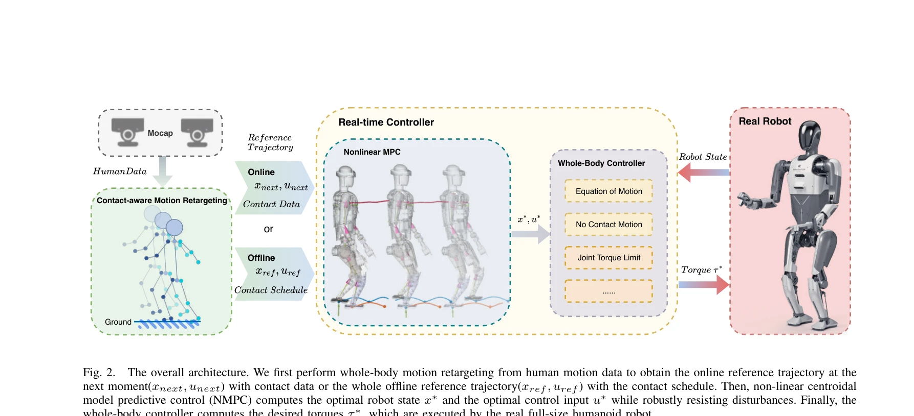

# A Whole-Body Motion Imitation Framework from Human Data for Full-Size Humanoid Robot

> **저자**: Zhenghan Chen, Haodong Zhang, Dongqi Wang, Jiyu Yu, Haocheng Xu, Yue Wang, Rong Xiong | **날짜**: 2025-08-01 | **URL**: [https://arxiv.org/abs/2508.00362](https://arxiv.org/abs/2508.00362)

---

## Essence

*Fig. 2.*

전신 동작 모방을 위해 contact-aware 전신 모션 리타겟팅과 비선형 중심 MPC를 결합한 휴머노이드 로봇 제어 프레임워크를 제안한다. 실제 휴머노이드 로봇에서 인간의 다양한 전신 동작을 정확하고 안정적으로 모방할 수 있음을 입증한다.

## Motivation

- **Known**: 모션 리타겟팅과 모델 기반 제어를 결합한 접근법이 휴머노이드 로봇의 인간다운 동작 모방에 효과적이다. 온라인 최적화 기반 MPC는 실시간 계산과 정확한 동역학 모델 사이의 균형을 잘 맞출 수 있다.
- **Gap**: 기존 방법들은 인간과 로봇 간의 운동학적·동역학적 차이를 다루면서도 발 접촉 정보를 활용한 전신 모션 리타겟팅과 실시간 비선형 MPC를 함께 적용하지 못했다. 특히 발의 contact constraints를 고려한 고품질 참조 궤적 생성이 부족했다.
- **Why**: 휴머노이드 로봇이 인간과 자연스럽게 상호작용하고 복잡한 작업을 수행하려면 정확하고 안정적인 전신 모션 모방이 필수적이다. 실제 로봇에서 안정성을 유지하면서 인간다운 움직임을 구현하는 것은 실용적 응용에 중요하다.
- **Approach**: Contact-aware whole-body motion retargeting으로 인간 동작에서 로봇 참조 궤적을 생성한 후, nonlinear centroidal MPC를 통해 동역학 제약과 균형을 보장하고, whole-body controller로 최종 토크를 계산하는 3단계 파이프라인을 제안한다.

## Achievement

*Fig. 2.*

- **통합 프레임워크**: 모션 리타겟팅과 모델 기반 제어를 유기적으로 결합한 unified framework를 구축하여 휴머노이드 로봇의 인간다운 전신 동작 모방을 가능하게 함
- **Contact-aware 리타겟팅**: 발 접촉 정보를 고려한 전신 모션 리타겟팅으로 다양하고 표현력 있는 인간 동작을 추적하면서 고품질 참조 궤적을 제공
- **실시간 NMPC 확장**: nonlinear centroidal MPC를 휴머노이드 로봇에 적용하여 실시간 동작 추적 정확도를 보장하고 동적 균형을 강건하게 유지
- **실제 로봇 검증**: 상체 움직임, 한 다리 서기 등 다양한 준정적 동작을 포함하여 실제 전신 휴머노이드 로봇에서 실시간 모션 모방을 성공적으로 구현

## How

*Fig. 2.*

- 인간 모션 캡처 데이터의 joint positions에서 발 접촉 시퀀스 및 타이밍을 추출하는 contact detection 수행
- 로봇의 kinematics constraints를 고려한 optimization-based 역운동학으로 로봇 joint angles로 변환
- pelvis 기반의 root state 추적과 IK 결과의 morphological 적응을 통해 kinematically feasible 참조 궤적 생성
- Centroidal dynamics 모델을 기반으로 center of mass 운동과 contact forces를 최적화하는 NMPC 공식화
- Whole-body controller에서 역동역학을 이용하여 joint torque limits와 contact constraints를 만족하는 토크 계산
- 실시간으로 생성된 참조 궤적과 NMPC 출력을 whole-body controller에 입력하여 로봇 실행

## Originality

- 발 접촉 정보를 명시적으로 활용한 contact-aware whole-body motion retargeting은 기존 방법들과 구별되는 핵심 기여
- Centroidal MPC와 전신 모션 리타겟팅의 seamless 통합으로 고품질 참조 궤적 + 실시간 동역학 제약 만족을 동시에 달성
- 실제 전신 휴머노이드 로봇(full-size)에서 상체 움직임, 한 다리 서기 등 다양한 동작을 포함한 광범위한 검증

## Limitation & Further Study

- 논문에서는 주로 준정적(quasi-static) 동작을 다루고 있으며, 고속 동적 동작(예: 점프, 복잡한 달리기)에 대한 적용 가능성이 명시되지 않음
- Centroidal model 기반 접근이 단순화된 모델을 사용하므로, 복잡한 비선형 동역학이나 friction 변화에 대한 강건성 분석 부재
- Contact detection 정확도와 리타겟팅 최적화 시간에 대한 정량적 분석 및 계산 복잡도 논의 부족
- 후속 연구에서는 고속 동작으로의 확장, uncertainty에 강건한 제어, learning-based 리타겟팅 개선 등이 필요

## Evaluation

- Novelty: 4/5
- Technical Soundness: 3/5
- Significance: 4/5
- Clarity: 4/5
- Overall: 4/5

**총평**: Contact-aware motion retargeting과 nonlinear centroidal MPC를 체계적으로 결합하여 실제 휴머노이드 로봇에서 정확하고 안정적인 전신 모션 모방을 달성한 강력한 연구이다. 실제 로봇 플랫폼에서의 광범위한 검증은 실용적 가치를 높이나, 고속 동작 확장 및 강건성 분석에서 추가 개선이 필요하다.

## Related Papers

- 🏛 기반 연구: [[papers/1862_DeepMimic_Example-Guided_Deep_Reinforcement_Learning_of_Phys/review]] — DeepMimic의 motion capture 기반 모방 학습 방법론이 인간 데이터로부터 전신 동작을 학습하는 핵심 기반을 제공한다
- 🔗 후속 연구: [[papers/2095_MeshMimic_Geometry-Aware_Humanoid_Motion_Learning_through_3D/review]] — 3D 형태 정보를 활용한 기하학적 인식 방법이 contact-aware 모션 리타겟팅의 정확성을 더욱 향상시킬 수 있다
- 🔄 다른 접근: [[papers/1640_ResMimic_From_General_Motion_Tracking_to_Humanoid_Whole-body/review]] — 동일한 whole-body motion tracking 목표를 ResNet 기반 geometric prior와 contact-aware MPC라는 다른 방법으로 달성한다
- 🏛 기반 연구: [[papers/2088_Make_Tracking_Easy_Neural_Motion_Retargeting_for_Humanoid_Wh/review]] — 신경망 기반 모션 리타겟팅 기술이 contact-aware 전신 모션 리타겟팅의 이론적 기반을 제공합니다.
- 🔗 후속 연구: [[papers/1971_Heracles_Bridging_Precise_Tracking_and_Generative_Synthesis/review]] — 정확한 추적과 생성적 합성을 연결하는 Heracles의 접근법을 전신 동작 모방 프레임워크로 확장할 수 있습니다.
- 🔄 다른 접근: [[papers/1758_Whole-body_Humanoid_Robot_Locomotion_with_Human_Reference/review]] — 둘 다 인간 데이터 기반 동작 모방을 다루지만 하나는 전신 동작에, 다른 하나는 보행에 특화되어 있다.
- 🔗 후속 연구: [[papers/2120_OmniRetarget_Interaction-Preserving_Data_Generation_for_Huma/review]] — OmniRetarget의 상호작용 보존 데이터 생성이 contact-aware 전신 모션 리타겟팅의 정확성과 안정성을 향상시킬 수 있다.
- 🧪 응용 사례: [[papers/1775_A_Closed-Form_Geometric_Retargeting_Solver_for_Upper_Body_Hu/review]] — closed-form 기하학적 리타겟팅 solver가 전신 동작 모방의 상반신 제어 정밀도를 향상시키는 데 활용될 수 있다.
- 🔄 다른 접근: [[papers/1758_Whole-body_Humanoid_Robot_Locomotion_with_Human_Reference/review]] — 둘 다 인간 동작 데이터 기반 모방을 다루지만 Adam은 보행에, 다른 연구는 전신 동작에 초점을 둔다.
- 🔄 다른 접근: [[papers/1860_Deep_Imitation_Learning_for_Humanoid_Loco-manipulation_throu/review]] — VR 텔레오퍼레이션을 통한 휴머노이드 loco-manipulation 학습에서 deep imitation learning과 whole-body motion imitation의 서로 다른 데이터 활용 방식을 제시한다.
- 🔗 후속 연구: [[papers/1862_DeepMimic_Example-Guided_Deep_Reinforcement_Learning_of_Phys/review]] — 전신 동작 모방 프레임워크가 DeepMimic의 motion capture 기반 학습을 실제 휴머노이드 로봇에 적용할 수 있는 구체적인 구현 방법을 제공한다
