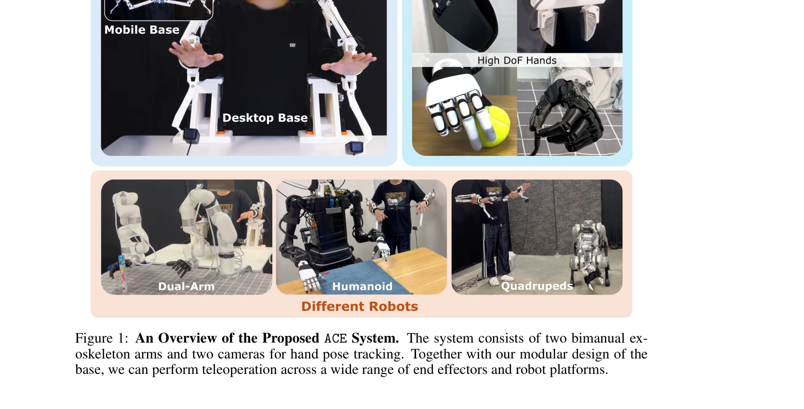
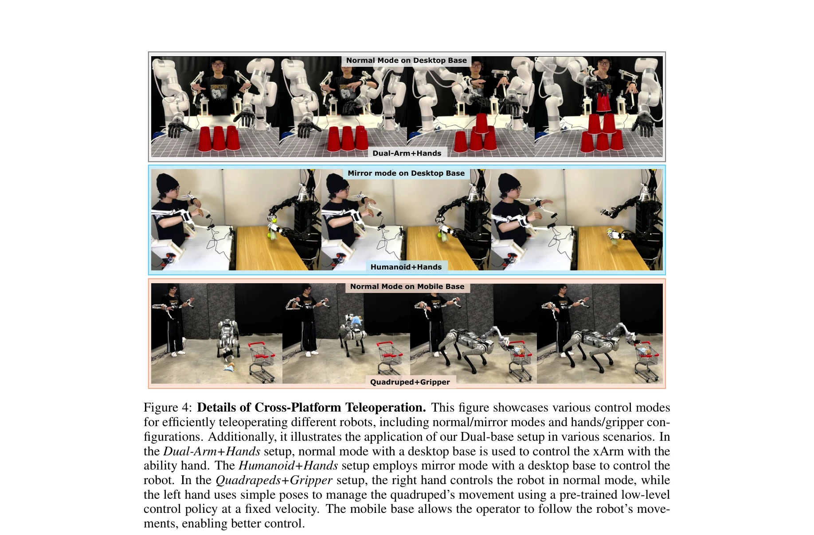
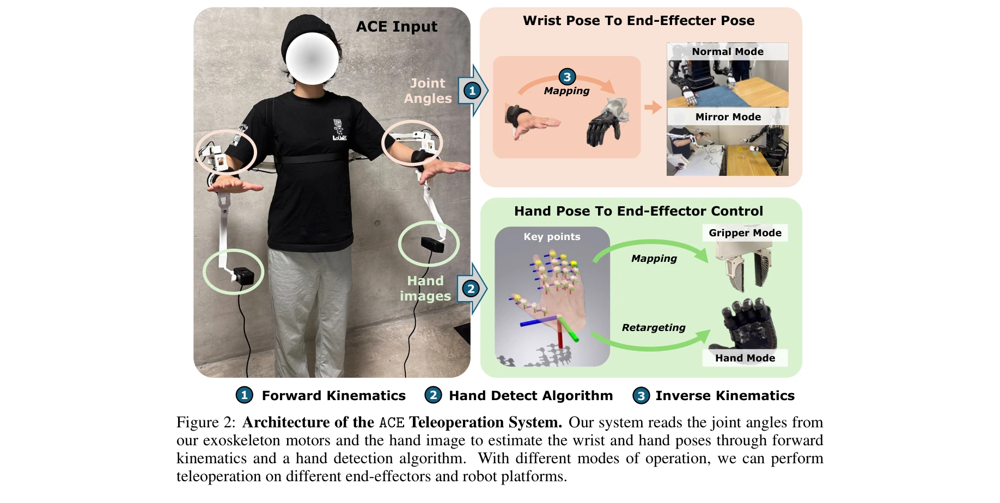

# ACE: A Cross-Platform Visual-Exoskeletons System for Low-Cost Dexterous Teleoperation

> **저자**: Shiqi Yang, Minghuan Liu, Yuzhe Qin, Runyu Ding, Jialong Li, Xuxin Cheng, Ruihan Yang, Sha Yi, Xiaolong Wang | **날짜**: 2024-08-21 | **URL**: [https://arxiv.org/abs/2408.11805](https://arxiv.org/abs/2408.11805)

---

## Essence

*Figure 1: An Overview of the Proposed ACE System. The system consists of two bimanual ex-*

ACE는 3D 프린팅된 이중팔 exoskeleton과 hand-facing 카메라를 결합한 저비용 cross-platform 시각 기반 원격 조종 시스템으로, 다양한 로봇 플랫폼과 end-effector에 대해 정밀한 손과 손목 자세 추적을 가능하게 한다.

## Motivation

- **Known**: VR 시스템, motion capture, wearable glove 등 다양한 원격 조종 방식과 ALOHA, GELLO 등 로봇 기반 데이터 수집 시스템이 개발되었으며, 최근 teleoperation을 통한 대규모 로봇 데이터 수집이 강조되고 있다.
- **Gap**: 기존 시스템들은 높은 비용, 특정 로봇에만 맞춘 hardware customization 필요, 또는 제한된 정확도의 문제를 가지고 있어서 다양한 end-effector와 플랫폼에 걸쳐 작동하는 저비용의 사용자 친화적 시스템이 부족하다.
- **Why**: 로봇 재단 모델 학습을 위한 대규모 실세계 데이터 수집에 효율적이고 cross-platform 호환성을 갖춘 원격 조종 시스템이 필수적이며, 이를 통해 다양한 로봇 플랫폼에서의 복잡한 조작 작업 학습이 가능해진다.
- **Approach**: Hand-facing 카메라로 3D 손 자세를 추적하고 exoskeleton의 forward kinematics로 end-effector 위치를 측정한 후, inverse kinematics를 통해 로봇 팔의 end-effector에 매핑하는 모듈식 설계 기반의 시각-kinematics 하이브리드 접근법을 사용한다.

## Achievement

*Figure 4: Details of Cross-Platform Teleoperation. This figure showcases various control modes*

- **Cross-platform 호환성**: 단일 시스템으로 humanoid hands, arm-hands, arm-gripper, quadruped-gripper 등 다양한 end-effector와 fixed/mobile base 로봇 플랫폼을 지원
- **저비용 설계**: 3D 프린팅 exoskeleton과 저비용 웹캠을 사용하여 약 $0.6k의 비용으로 ALOHA($20k), Mobile-ALOHA($32k), DexCap($4k)보다 훨씬 저렴한 시스템 구현
- **높은 정확도**: Hand pose 추적에 vision과 kinematics를 결합하여 vision 단독 방식(AnyTeleop)보다 정확한 hand root end-effector 위치 측정
- **사용자 친화성**: 최소한의 calibration으로 서로 다른 체형의 사용자가 직관적으로 조작 가능하도록 설계
- **실증된 성능**: Imitation learning 실험을 통해 다양한 정밀도와 workspace 요구사항을 가진 작업에서 효율적인 데이터 수집 및 학습 능력 입증

## How

*Figure 2: Architecture of the ACE Teleoperation System. Our system reads the joint angles from*

- Hand detection algorithm을 통한 3D 손 자세 추적 (hand-facing 카메라로 occlusion 문제 해결)
- Exoskeleton의 motor joint angles를 읽어 forward kinematics으로 손목(wrist) 자세 계산
- Hand Mode와 Gripper Mode를 통해 anthropomorphic hands와 parallel-jaw grippers 모두 지원
- Inverse kinematics 기반 motion retargeting으로 인간의 손 end-effector 위치를 로봇 arm end-effector에 매핑
- Modular base design으로 fixed desktop base와 mobile base 간 쉬운 전환 가능
- 3D 프린팅 기반 exoskeleton으로 비용 절감 및 유지보수 용이성 확보

## Originality

- **Vision-kinematics 하이브리드 접근**: 기존의 순수 vision 기반(AnyTeleop)이나 순수 kinematics 기반(ALOHA, GELLO) 시스템과 달리, hand pose tracking은 vision으로, end-effector 위치는 exoskeleton의 forward kinematics로 측정하여 두 장점을 결합
- **Camera-on-exoskeleton design**: Hand-facing 카메라를 exoskeleton end-effector에 탑재하여 vision 기반 시스템의 근본적인 occlusion 문제 해결
- **Cross-platform motion retargeting**: 인간의 손 morphology와 로봇 손의 morphology가 일치하지 않아도 inverse kinematics를 통해 정밀한 control 가능하도록 설계
- **비용-정확도-유연성의 최적 조합**: 기존 시스템들이 비용, 정확도, 유연성 중 일부를 포기했다면, ACE는 세 가지 모두를 동시에 달성

## Limitation & Further Study

- Hand pose estimation 알고리즘의 정확도 한계로 인한 finger-level control 오류 가능성
- Mobile base 상황에서의 wrist pose 추적 안정성 및 latency에 대한 상세한 분석 부족
- 매우 복잡한 손가락 상호작용이 필요한 작업(예: 세밀한 조작)에서의 성능 검증 제한적
- Different robot morphology로의 motion transfer 시 손실되는 정보와 그에 따른 데이터 품질 영향 분석 필요
- **후속 연구**: (1) 더 정교한 hand pose estimation 모델 적용, (2) Force feedback을 포함한 haptic teleoperation으로 확장, (3) 더 다양한 robot platform과 작업에 대한 large-scale 검증

## Evaluation

- Novelty: 4/5
- Technical Soundness: 3/5
- Significance: 4/5
- Clarity: 4/5
- Overall: 4/5

**총평**: ACE는 기존 원격 조종 시스템의 비용-정확도-유연성 trade-off를 효과적으로 해결한 실용적인 솔루션으로, 저비용의 3D 프린팅 exoskeleton과 vision-kinematics 하이브리드 방식을 통해 다양한 로봇 플랫폼에서의 대규모 데이터 수집을 가능하게 한다는 점에서 높은 가치를 제공한다.
