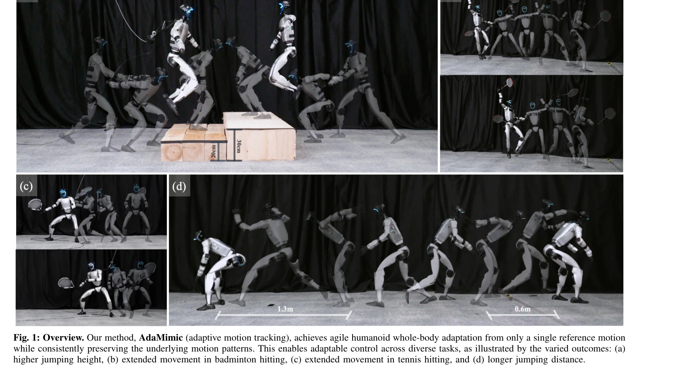

# AdaMimic: Towards Adaptable Humanoid Control via Adaptive Motion Tracking

> **저자**:  | **날짜**:  | **URL**: [https://taohuang13.github.io/adamimic.github.io/](https://taohuang13.github.io/adamimic.github.io/)

---

## Essence

*Fig. 1: Overview. Our method, AdaMimic (adaptive motion tracking), achieves agile humanoid whole-body adaptation from on*

AdaMimic은 단 하나의 참조 동작으로부터 휴머노이드 로봇의 적응형 제어를 가능하게 하는 동작 추적 알고리즘으로, 동작 패턴을 정확히 보존하면서 다양한 조건에 적응한다.

## Motivation

- **Known**: 기존 동작 사전 기반 강화학습은 높은 적응성을 제공하지만 모방 정확도를 희생하며, 동작 추적 방법은 정확한 모방을 달성하지만 많은 학습 동작과 테스트 시간 참조 동작을 필요로 한다.
- **Gap**: 단일 참조 동작으로부터 정확한 모방과 광범위한 적응성을 동시에 달성하는 방법이 없었다.
- **Why**: 휴머노이드 로봇이 전문가 동작을 모방한 후 새로운 상황에 적응하는 능력은 실제 배포에서 핵심적이기 때문이다.
- **Approach**: 단일 참조 동작을 키프레임으로 희소화하고 최소한의 물리 가정으로 편집하여 augmented dataset을 생성한 후, 고정 phase interval을 사용한 1단계 정책 학습과 phase adapter 및 tracking adapter를 활용한 2단계 적응형 학습을 수행한다.

## Achievement

*Fig. 1: Overview. Our method, AdaMimic (adaptive motion tracking), achieves agile humanoid whole-body adaptation from on*

- **단일 동작 학습**: 대규모 동작 데이터셋 없이 단 하나의 참조 동작만으로 적응형 제어 정책 학습
- **시뮬레이션 성능**: 기존 방법 대비 유의미하게 향상된 모방 정확도와 적응성 달성
- **실제 로봇 배포**: Unitree G1 휴머노이드 로봇에서 다양한 적응 조건의 여러 작업에서 우수한 성능 입증 (점프 높이 향상, 배드민턴/테니스 스윙 범위 확장, 장거리 점프 등)

## How

*Fig. 2: Method overview. (a) Human motions are reconstructed into SMPL motions via GVHMR [21] and retargeted to the huma*

- Human motion을 GVHMR을 사용하여 SMPL 형식으로 재구성하고 로봇에 맞게 retarget
- 참조 동작에서 중요한 키프레임을 선택하고 global trajectory만 편집하여 local joint trajectories는 보존 (식 3)
- 고정된 phase interval Δϕ_k로 sparse keyframes을 추적하는 tracking policy π_track을 1단계에서 학습
- Dense critic과 sparse critic을 사용하여 local 패턴과 global trajectory 추적을 동시에 최적화
- 2단계에서 phase adapter π^phase와 tracking adapter π^tracking을 학습하여 동적 time warping으로 추적 성능 향상
- 학습된 정책을 추가 참조 동작 없이 실제 로봇에 직접 배포

## Originality

- Single reference motion에서 augmented dataset 생성을 위한 keyframe sparsification 및 minimal editing 전략의 독창성
- Motion tracking과 motion prior 접근법의 강점을 결합한 novel 문제 재정의 (식 3의 제약)
- Fixed phase interval 학습 후 adaptive phase interval을 통한 2단계 학습 구조로 flexible time warping 실현
- Dense critic과 sparse critic의 이중 평가 구조로 local 패턴 보존과 global 적응성 동시 달성

## Limitation & Further Study

- Keyframe 선택 및 편집 과정에서의 '최소한의 물리 가정'이 명확히 정의되지 않아 재현성 저하 가능", '단일 동작만 사용하므로 매우 다양한 스타일의 동작으로 확장 시 효과 검증 필요
- 실제 로봇 실험이 제한된 환경에서만 수행되었으며, 야외 또는 더 복잡한 상황에서의 일반화 능력 미검증
- 추가 동작 스타일(예: 춤, 느린 움직임)에 대한 적응성 평가 필요
- Sim-to-real gap에 대한 상세한 분석 및 domain randomization 수준에 대한 논의 부족

## Evaluation

- Novelty: 4/5
- Technical Soundness: 3/5
- Significance: 4/5
- Clarity: 4/5
- Overall: 4/5

**총평**: AdaMimic은 단일 참조 동작으로 정확한 모방과 광범위한 적응을 달성하는 혁신적인 접근법으로, 실제 휴머노이드 로봇 배포에서 우수한 성능을 보여준 고도로 실용적이고 영향력 있는 연구이다.
