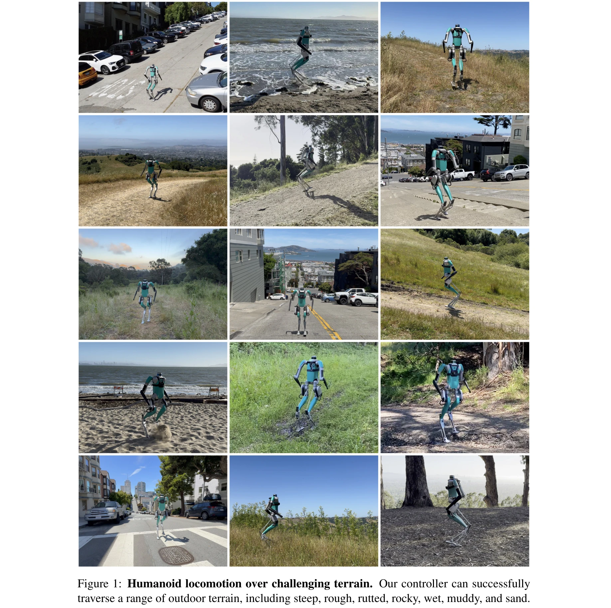

# Adapting Humanoid Locomotion over Challenging Terrain via Two-Phase Training

> **저자**:  | **날짜**:  | **URL**: [https://sites.google.com/view/adapting-humanoid-locomotion/two-phase-training](https://sites.google.com/view/adapting-humanoid-locomotion/two-phase-training)

---

## Essence

*Figure 1: Humanoid locomotion over challenging terrain. Our controller can successfully*

Transformer 기반 humanoid 제어기를 flat ground에서 sequence modeling으로 사전학습한 후 challenging terrain에서 reinforcement learning으로 fine-tuning하는 두 단계 학습 방법을 제안하여, 시뮬레이션과 실제 로봇에서 다양한 복잡한 지형 보행을 성공적으로 달성했다.

## Motivation

- **Known**: Humanoid locomotion은 quadrupedal이나 bipedal 로봇보다 복잡하며, 기존 classical controller들은 일반화가 어렵고 learning-based 방법들은 주로 완만한 지형에 초점을 맞춰왔다. Transformer 기반 proprioceptive controller는 flat ground에서 성공적으로 학습될 수 있다.
- **Gap**: Learning-based humanoid locomotion이 challenging terrain으로 확장되지 못했으며, 사전학습 없이 처음부터 학습하기 위해서는 대규모 시뮬레이션과 복잡한 환경 설계가 필요하다.
- **Why**: Humanoid robot이 실제 세계의 다양한 자연 및 인공 지형에서 작동해야 하며, 이는 로봇 배포의 실용성을 크게 향상시킬 수 있다.
- **Approach**: Pre-training 단계에서 sequence modeling으로 flat ground 데이터셋에서 transformer 모델을 학습한 후, fine-tuning 단계에서 reinforcement learning을 통해 uneven terrain 능력을 추가하는 두 단계 학습 방식을 적용한다.

## Achievement

- **실제 환경 성과**: Digit humanoid robot이 Berkeley에서 4마일 이상의 hiking trail과 San Francisco의 31% 이상 경사의 가파른 거리를 성공적으로 보행했다.
- **지형 다양성**: 단일 신경망 제어기로 rough, rutted, rocky, steep, wet, muddy, sand 등 다양한 미학습 지형을 포함한 여러 지형을 보행할 수 있다.
- **신흥 표현**: 모델의 latent representation이 지형별로 자동으로 군집화되고, kinematic 및 dynamic adaptation이 context에 따라 emergent하게 나타난다.
- **성능 개선**: 기존 learning-based controller 대비 일관되게 우수한 성능을 보이며, pre-training이 sample efficiency를 크게 향상시킨다.

## How

- Transformer 신경망을 이용해 과거 proprioceptive observation과 action의 history를 입력으로 받아 다음 action을 예측한다.
- Pre-training 단계: prior policy, model-based controller, human sequence로 구성된 flat ground 데이터셋에 대해 sequence modeling을 수행한다.
- Fine-tuning 단계: uneven terrain 환경에서 reinforcement learning으로 모델을 최적화한다.
- Controller는 50 Hz에서 desired joint position과 PD gain을 예측하고, 2000 Hz의 PD controller를 통해 토크로 변환한다.
- Digit humanoid robot의 36 DoF (floating base 포함, 각 팔 4개 관절, 각 다리 11개 측정 관절 중 6개 구동)를 제어한다.
- Vision을 사용하지 않는 blind controller로 omni-directional walking을 지원한다.

## Originality

- NLP의 generative pre-training 패러다임을 humanoid locomotion에 최초로 체계적으로 적용한다.
- Flat ground sequence modeling을 통한 효율적인 pre-training 후 challenging terrain에서의 fine-tuning이라는 새로운 two-phase 학습 전략을 제안한다.
- Blind proprioceptive controller만으로 다양한 실제 환경에서의 robustness를 달성한다.
- Emergent terrain representation과 context-based adaptation이 명시적 설계 없이 자동으로 나타나는 현상을 실증적으로 보여준다.

## Limitation & Further Study

- Method는 Digit 로봇 특정 하드웨어에 대해서만 검증되었으며, 다른 humanoid 플랫폼으로의 일반화 가능성이 불명확하다.
- Pre-training 데이터셋 구성 방식 (prior policy, model-based controller, human sequence의 조합)에 대한 상세한 기여도 분석이 부족하다.
- Fine-tuning에 필요한 challenging terrain 데이터의 양과 다양성에 대한 구체적인 요구사항이 명시되지 않았다.
- Sim-to-real transfer 기법의 상세한 설명과 simulation 환경의 fidelity 수준에 대한 정보가 제한적이다.
- 후속 연구는 다중 로봇 플랫폼에 대한 확장, 더 복잡한 환경 (계단, 장애물 등)에서의 평가, vision 정보 통합의 효과 분석을 포함할 수 있다.

## Evaluation

- Novelty: 4/5
- Technical Soundness: 3/5
- Significance: 4/5
- Clarity: 4/5
- Overall: 4/5

**총평**: 본 논문은 NLP의 pre-training 패러다임을 humanoid locomotion에 창의적으로 적용하여, 실제 로봇이 복잡한 자연 지형을 성공적으로 보행하는 실증적 성과를 달성했다. 체계적인 two-phase 학습 방법과 emergent behavior 분석은 로봇 제어 분야에 중요한 기여를 제공한다.
