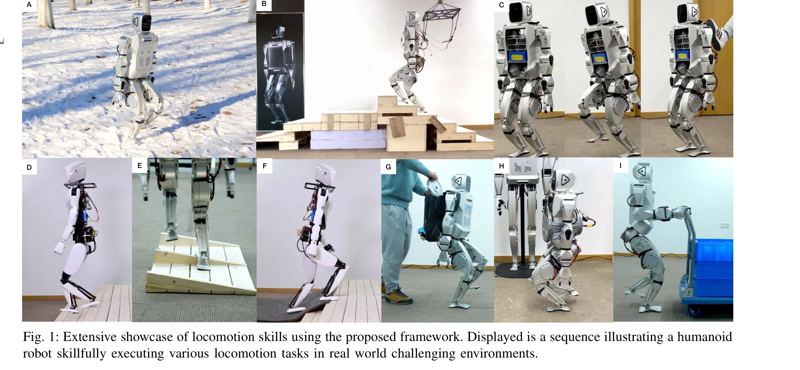
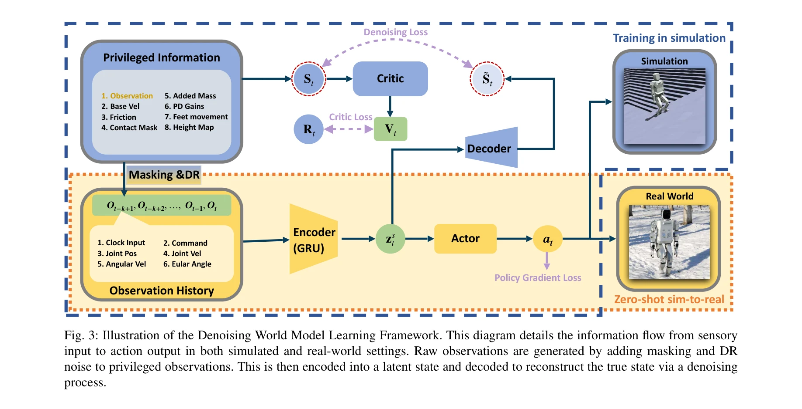

# Advancing Humanoid Locomotion: Mastering Challenging Terrains with Denoising World Model Learning

> **저자**: Xinyang Gu, Yen-Jen Wang, Xiang Zhu, Chengming Shi, Yanjiang Guo, Yichen Liu, Jianyu Chen | **날짜**: 2024-08-26 | **URL**: [https://arxiv.org/abs/2408.14472](https://arxiv.org/abs/2408.14472)

---

## Essence

*Fig. 1: Extensive showcase of locomotion skills using the proposed framework. Displayed is a sequence illustrating a hum*

Denoising World Model Learning (DWL)이라는 end-to-end 강화학습 프레임워크를 통해 휴머노이드 로봇이 눈덮인 언덕, 계단, 불규칙한 지형 등 현실의 복잡한 지형을 처음으로 마스터했으며, zero-shot sim-to-real transfer로 같은 신경망을 모든 시나리오에서 구동한다.

## Motivation

- **Known**: 기존의 model-based control (ZMP, MPC, WBC)과 model-free RL은 각각의 장단점을 갖고 있으며, quadrupedal 및 bipedal 로봇에 대한 RL 기반 보행 제어 연구는 진행되어왔으나 휴머노이드 로봇의 현실 적용은 단순 지형에만 제한되어 있었다.
- **Gap**: 휴머노이드 로봇의 높은 무게중심, 다리 흔들림 불안정성, 큰 다리 관성, 몸통과 팔의 추가 무게 등으로 인해 현실의 복잡한 지형에서 robust한 end-to-end RL 기반 보행 제어가 달성되지 못했다.
- **Why**: 휴머노이드 로봇이 인간 중심의 환경에 최적화되어 있으므로, 현실의 다양한 지형을 안정적으로 통과할 수 있는 능력이 실제 응용 배포에 필수적이다.
- **Approach**: 부분 관찰성을 갖는 POMDP 환경에서 encoder-decoder 구조의 world model을 통해 환경 노이즈, 동역학 노이즈, 센서 노이즈, masking 노이즈를 denoising하여 true state를 복원하고, 이를 policy gradient 방법과 결합하여 sim-to-real gap을 극복한다.

## Achievement

*Fig. 1: Extensive showcase of locomotion skills using the proposed framework. Displayed is a sequence illustrating a hum*

- **최초 달성**: 휴머노이드 로봇이 end-to-end RL과 zero-shot sim-to-real transfer로 현실의 도전적 지형(눈덮인 경사지, 계단, 극도로 불규칙한 지형)을 마스터한 최초 사례
- **일반화 및 견고성**: 단일의 학습된 신경망이 모든 시나리오에서 동작하며 외부 간섭에 대한 저항력 시연
- **하드웨어 혁신**: 2-DoF Closed Kinematic Chain Ankle Mechanism을 활용한 active ankle control로 다리 관성 감소와 안정성 향상을 동시 달성
- **두 가지 로봇 플랫폼 검증**: XBot-S (38kg, 1.2m)와 XBot-L (57kg, 1.65m)에서 모두 성공적으로 작동 입증

## How

*Fig. 3: Illustration of the Denoising World Model Learning Framework. This diagram details the information flow from sen*

- POMDP 기반 강화학습 문제 정식화로 부분 관찰성을 명시적으로 모델링
- 시뮬레이션 내에서 네 가지 유형의 노이즈(environmental, dynamics, sensory, masking)를 주입하여 현실 조건 모방
- Encoder-decoder 아키텍처로 noisy observation을 latent space에 임베딩하고 true state를 복원
- Policy gradient 방법으로 world model과 제어 정책을 end-to-end로 최적화
- Closed Kinematic Chain Ankle Mechanism의 2-DoF active ankle 제어로 안정성과 유연성 확보

## Originality

- 휴머노이드 로봇에 대한 DWL 프레임워크의 최초 제안으로 sim-to-real gap을 체계적으로 denoising하는 접근
- 네 가지 노이즈 타입(환경, 동역학, 센서, masking)을 명시적으로 분류하고 각각을 다루는 통합 방식
- Active 2-DoF ankle control이 closed kinematic chain을 통해 구현되어 기존의 passive ankle 또는 1-DoF ankle 연구와 차별화
- Zero-shot sim-to-real transfer로 사전 fine-tuning 없이 현실 적용이 가능한 점이 획기적

## Limitation & Further Study

- 논문 발췌본에서 구체적인 실험 결과(성공률, 안정성 메트릭, 비교 대상과의 정량적 비교)가 제시되지 않아 성능 검증 범위 불명확
- DWL의 세부 손실 함수, masking loss 설계, encoder-decoder 네트워크 구조에 대한 상세 설명 부족
- computational cost, 실시간 추론 성능, 배터리 지속 시간 등 실용적 제약 사항에 대한 논의 없음
- 후속 연구로는 다른 로봇 플랫폼(bipedal 로봇, quadrupedal 로봇)에 대한 DWL의 일반화 가능성, 더욱 극단적 지형 조건, 동적 환경(이동 장애물 등)에서의 성능 검증이 필요

## Evaluation

- Novelty: 4/5
- Technical Soundness: 3/5
- Significance: 4/5
- Clarity: 4/5
- Overall: 4/5

**총평**: DWL은 휴머노이드 로봇의 현실 복잡 지형 보행 문제를 처음으로 해결한 혁신적 연구이며, noisy observation으로부터 true state를 복원하는 encoder-decoder 기반 denoising 접근과 2-DoF ankle mechanism의 하드웨어 혁신이 결합되어 높은 영향력을 기대할 수 있다.

## Related Papers

- 🔄 다른 접근: [[papers/1712_The_Role_of_Domain_Randomization_in_Training_Diffusion_Polic/review]] — 복잡한 지형에서의 humanoid 제어를 위해 DWL은 denoising world model을, diffusion policies는 domain randomization을 활용합니다.
- 🔗 후속 연구: [[papers/1949_Generative_World_Modelling_for_Humanoids_1X_World_Model_Chal/review]] — 1X World Model의 생성형 세계 모델링이 DWL의 denoising 접근법을 더욱 정교하게 발전시킵니다.
- 🧪 응용 사례: [[papers/2060_Learning_Perceptive_Humanoid_Locomotion_over_Challenging_Ter/review]] — DWL의 복잡한 지형 마스터 기술이 perceptive locomotion over challenging terrain의 핵심 방법론입니다.
- 🔄 다른 접근: [[papers/1843_CMR_Contractive_Mapping_Embeddings_for_Robust_Humanoid_Locom/review]] — 복잡한 지형에서의 강건한 휴머노이드 보행을 위해 하나는 denoising world model, 다른 하나는 contractive mapping을 사용한다.
- ⚖️ 반론/비판: [[papers/2061_Learning_Sim-to-Real_Humanoid_Locomotion_in_15_Minutes/review]] — 복잡한 지형 마스터링에 비해 15분만에 기본 보행 학습이 가능함을 보여주는 대조적 접근법이다.
- 🏛 기반 연구: [[papers/1828_Booster_Gym_An_End-to-End_Reinforcement_Learning_Framework_f/review]] — end-to-end RL 프레임워크의 이론적 기반을 제공하며 실제 휴머노이드에서의 적용 가능성을 보여준다.
- 🔄 다른 접근: [[papers/1789_Adapting_Humanoid_Locomotion_over_Challenging_Terrain_via_Tw/review]] — 둘 다 복잡한 지형 보행을 다루지만 DWL은 end-to-end 학습에, Transformer 접근법은 두 단계 학습에 중점을 둔다.
- 🧪 응용 사례: [[papers/2162_TTT-Parkour_Rapid_Test-Time_Training_for_Perceptive_Robot_Pa/review]] — TTT-Parkour의 test-time training 기법이 DWL의 zero-shot sim-to-real transfer 성능을 동적 환경에서 향상시킬 수 있다.
- 🔄 다른 접근: [[papers/1712_The_Role_of_Domain_Randomization_in_Training_Diffusion_Polic/review]] — 복잡한 지형에서의 humanoid 제어를 위해 Diffusion과 World Model Learning이라는 서로 다른 접근법을 사용합니다.
- 🔄 다른 접근: [[papers/1828_Booster_Gym_An_End-to-End_Reinforcement_Learning_Framework_f/review]] — 휴머노이드 locomotion을 위한 end-to-end RL 프레임워크에서 서로 다른 구현과 적용 환경을 제시한다.
- 🔄 다른 접근: [[papers/1843_CMR_Contractive_Mapping_Embeddings_for_Robust_Humanoid_Locom/review]] — 복잡한 지형에서의 강건한 휴머노이드 보행을 위해 서로 다른 노이즈 처리 방법론을 제시하는 상호 보완적 접근이다.
- 🔗 후속 연구: [[papers/1789_Adapting_Humanoid_Locomotion_over_Challenging_Terrain_via_Tw/review]] — DWL의 end-to-end 강화학습이 Transformer 기반 두 단계 학습을 단일 프레임워크로 통합할 수 있는 가능성을 제시한다.
