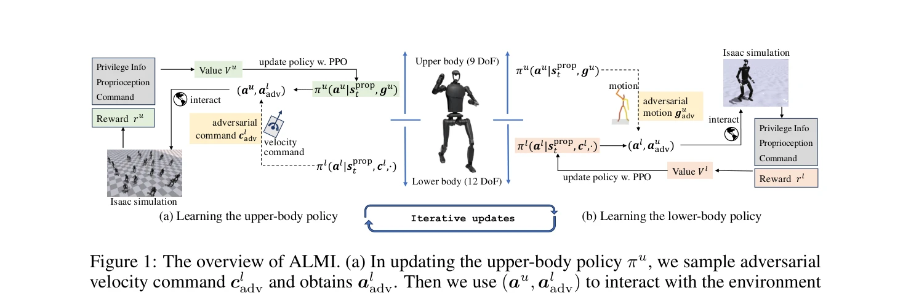
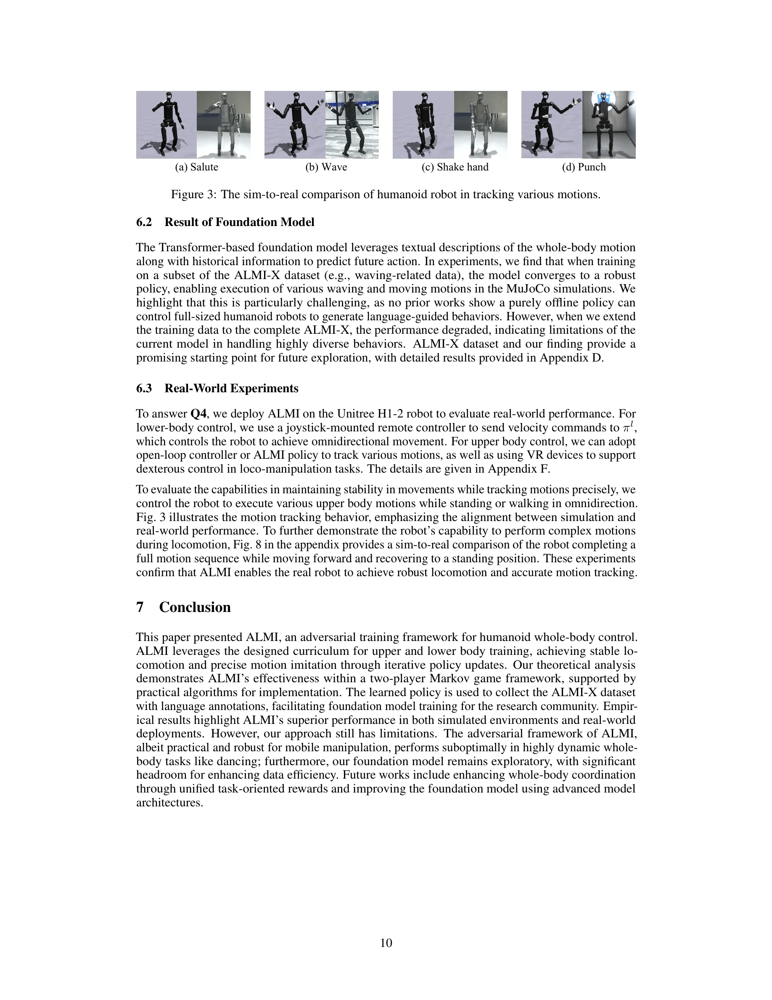

# Adversarial Locomotion and Motion Imitation for Humanoid Policy Learning

> **저자**: Jiyuan Shi, Xinzhe Liu, Dewei Wang, Ouyang Lu, Sören Schwertfeger, Chi Zhang, Fuchun Sun, Chenjia Bai, Xuelong Li | **날짜**: 2025-04-19 | **URL**: [https://arxiv.org/abs/2504.14305](https://arxiv.org/abs/2504.14305)

---

## Essence

*Figure 1: The overview of ALMI. (a) In updating the upper-body policy πu, we sample adversarial*

인간형 로봇의 상반신과 하반신의 서로 다른 역할을 분리하여 학습하는 대적적 학습 프레임워크 ALMI를 제안하고, 시뮬레이션과 실제 로봇에서 강건한 보행과 정확한 모션 추적을 달성한다.

## Motivation

- **Known**: 인간형 로봇의 전신 모션 모방은 conventional 접근법으로 가능하지만, 높은 DoF로 인한 계산 비용이 크고 실제 환경에서 불안정성과 낙상 문제가 발생한다.
- **Gap**: 기존 연구들은 전신 정책을 통일적으로 학습하면서 하반신의 강건한 보행과 상반신의 정확한 모션 추적이라는 상충되는 목표를 동시에 달성하기 어려워하고 있다.
- **Why**: 인간형 로봇의 안정적이고 표현력 있는 전신 제어는 로봇 응용의 실용성을 높이며, loco-manipulation 작업의 기반이 되기 때문에 중요하다.
- **Approach**: 하반신을 agent로, 상반신을 adversary로 하는 two-player zero-sum Markov game 기반의 대적적 학습을 통해 각 부위가 서로 다른 목표를 추구하면서도 Nash equilibrium으로 수렴하는 coordinated control을 달성한다.

## Achievement

*Figure 3: The sim-to-real comparison of humanoid robot in tracking various motions.*

- **ALMI 프레임워크**: 상반신과 하반신을 분리하여 대적적으로 학습하는 novel framework 제안, Theorem 3.1을 통해 ε-approximate Nash equilibrium 수렴 보장
- **ALMI-X 데이터셋**: 80K 이상의 궤적 데이터와 언어 설명을 포함한 첫 번째 대규모 전신 제어 데이터셋 구축, foundation model 학습 기반 제공
- **실험 검증**: Unitree H1-2 로봇에서 robust locomotion과 precise motion tracking 달성, 시뮬레이션과 실제 로봇 간 sim-to-real 성공 입증

## How

*Figure 1: The overview of ALMI. (a) In updating the upper-body policy πu, we sample adversarial*

- State space S를 상반신과 하반신이 공유하되, 각각 distinct action space Al과 Au를 가지도록 설계
- Lower body policy πl은 velocity command following reward rl을 최대화하면서 upper body의 disturbance에 견디도록 학습
- Upper body policy πu는 reference motion tracking reward ru을 최대화하면서 lower body의 움직임에 적응하도록 학습
- Independent RL optimization process로 두 정책을 병렬 업데이트하되, two-timescale learning rate rule로 안정성 보장
- Phase parameter ϕt를 도입하여 gaiting 정보를 인코딩, PD controller로 target joint positions을 torques로 변환
- Joystick commands와 velocity commands의 조합으로 teleoperation을 통한 loco-manipulation 확장

## Originality

- 상반신과 하반신의 separate control이 기존에도 있으나, adversarial training을 통해 coordination을 강제하는 novel approach는 새로운 contribution
- Two-player zero-sum Markov game을 humanoid control에 적용하면서 theoretical convergence guarantee (Theorem 3.1)를 제공
- Large-scale whole-body control dataset (ALMI-X)를 language annotations와 함께 공개하여 foundation model 학습 기반 제공
- Separate action spaces로 인한 모듈화로 각 부위의 역할을 명확히 하면서도 coordinated behavior를 달성하는 설계

## Limitation & Further Study

- Theorem 3.1의 convergence guarantee는 ε-greedy exploration과 specific two-timescale learning rate rule에 의존하므로 실제 구현과의 갭 존재 가능성
- 상반신과 하반신의 action space 분리로 인해 특정 전신 coordination이 필요한 복잡한 동작의 표현력 제한 가능성
- Dataset이 MuJoCo simulation에서만 생성되었으므로 real-world motion diversity 부족 가능성
- Foundation model의 preliminary study만 제시되어 end-to-end control의 완전한 성능 평가 부재
- Upper body가 joystick으로만 제어되는 제약이 있어 완전한 자율적 전신 제어와의 차이 존재

## Evaluation

- Novelty: 4/5
- Technical Soundness: 3/5
- Significance: 4/5
- Clarity: 4/5
- Overall: 4/5

**총평**: 상반신과 하반신의 역할 분리를 adversarial learning으로 구현한 novel framework이며, 이론적 수렴 보장과 실제 로봇 구현의 성공이 결합되어 높은 실용성을 보유하고 있다. 대규모 dataset 공개로 향후 연구의 기반을 제공하는 점도 의미 있다.

## Related Papers

- 🔄 다른 접근: [[papers/1795_Agility_Meets_Stability_Versatile_Humanoid_Control_with_Hete/review]] — 둘 다 휴머노이드 제어의 민첩성과 안정성을 다루지만 ALMI는 대적 학습에, AMS는 heterogeneous data 결합에 중점을 둔다.
- 🏛 기반 연구: [[papers/1801_AMP_Adversarial_Motion_Priors_for_Stylized_Physics-Based_Cha/review]] — AMP의 adversarial motion prior 학습 방법론이 ALMI의 대적적 학습 프레임워크의 이론적 기반이 된다.
- 🧪 응용 사례: [[papers/1973_Hierarchical_Planning_and_Control_for_Box_Loco-Manipulation/review]] — 계층적 계획과 제어 접근법이 ALMI의 상반신-하반신 분리 학습을 box manipulation 작업에 적용하는 데 활용될 수 있다.
- 🔗 후속 연구: [[papers/1695_StyleLoco_Generative_Adversarial_Distillation_for_Natural_Hu/review]] — 적대적 학습을 통한 휴머노이드 제어에서 보행과 전반적인 locomotion/motion imitation이라는 보완적 응용을 다룬다.
- 🔗 후속 연구: [[papers/1801_AMP_Adversarial_Motion_Priors_for_Stylized_Physics-Based_Cha/review]] — AMP의 adversarial motion prior 학습이 ALMI의 대적적 휴머노이드 정책 학습에 방법론적 기초를 제공한다.
- 🔄 다른 접근: [[papers/1795_Agility_Meets_Stability_Versatile_Humanoid_Control_with_Hete/review]] — 둘 다 민첩성과 안정성을 추구하지만 AMS는 heterogeneous data 결합에, ALMI는 대적 학습에 중점을 둔다.
- 🏛 기반 연구: [[papers/2045_Learning_agile_and_dynamic_motor_skills_for_legged_robots/review]] — 적대적 locomotion과 모션 모방의 기본 원리가 사족 로봇의 민첩한 제어 정책 학습에 대한 이론적 토대를 제공한다.
- 🏛 기반 연구: [[papers/2074_Learning_Vision-Driven_Reactive_Soccer_Skills_for_Humanoid_R/review]] — 적대적 학습을 통한 모션 모방이 시각 기반 반응형 축구 기술의 기반 제공
- 🔄 다른 접근: [[papers/2105_MoRE_Mixture_of_Residual_Experts_for_Humanoid_Lifelike_Gaits/review]] — 복잡한 지형에서의 인간다운 보행을 위한 다른 접근법으로, adversarial learning과 mixture of experts의 차이를 비교할 수 있다.
- 🏛 기반 연구: [[papers/2158_Track_Any_Motions_under_Any_Disturbances/review]] — 적대적 학습을 통한 동작 모방의 견고성 향상 기법이 다양한 교란 상황에서의 동작 추적 능력 개발의 이론적 토대가 됩니다.
