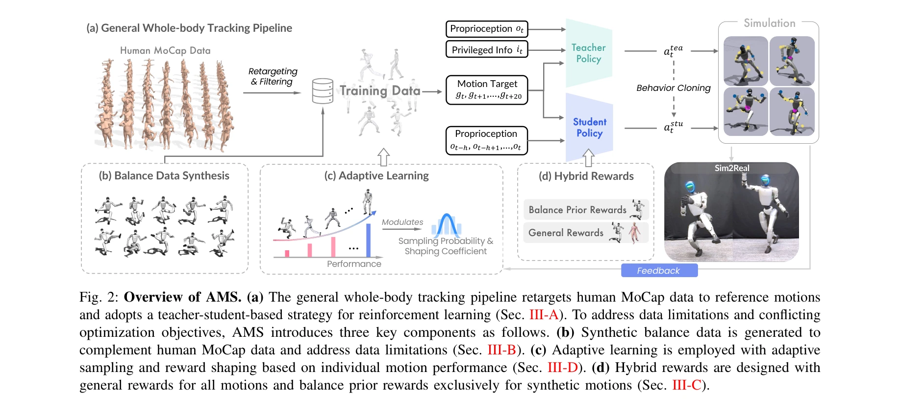
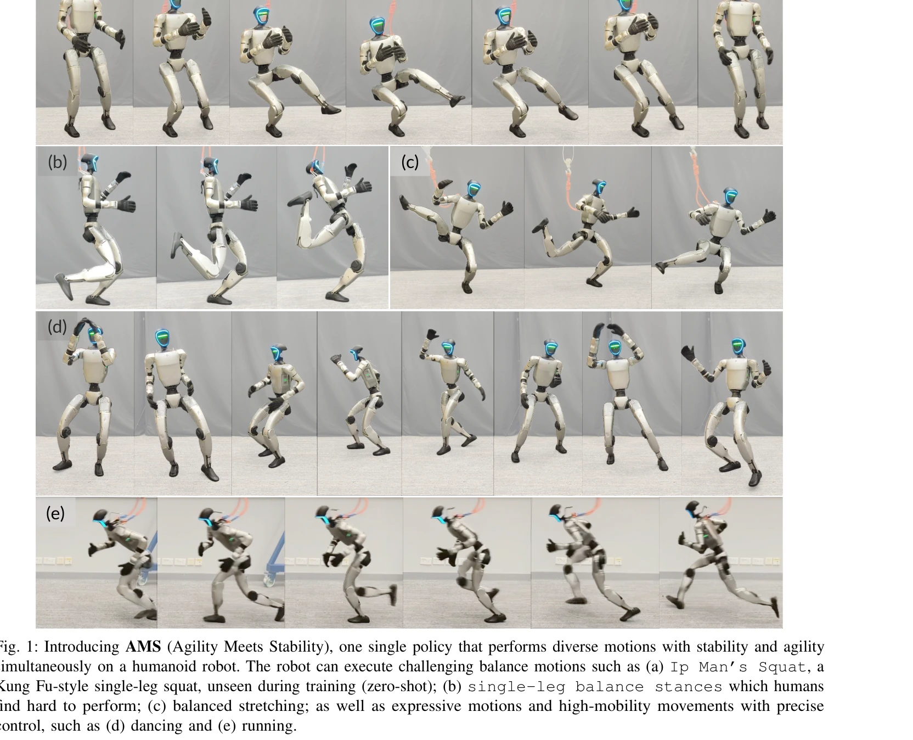

# Agility Meets Stability: Versatile Humanoid Control with Heterogeneous Data

> **저자**: Yixuan Pan, Ruoyi Qiao, Li Chen, Kashyap Chitta, Liang Pan, Haoguang Mai, Qingwen Bu, Hao Zhao, Cunyuan Zheng, Ping Luo, Hongyang Li | **날짜**: 2026-03-03 | **DOI**: [10.48550/arXiv.2511.17373](https://doi.org/10.48550/arXiv.2511.17373)

---

## Essence

*Fig. 2: Overview of AMS. (a) The general whole-body tracking pipeline retargets human MoCap data to reference motions*

AMS는 휴먼 모션캡처 데이터와 합성 밸런스 데이터를 결합하여 단일 정책으로 민첩한 동작과 극한의 밸런스 유지를 동시에 수행할 수 있는 휴머노이드 제어 프레임워크다.

## Motivation

- **Known**: 최근 강화학습 기반 접근법이 민첩한 동작(춤, 달리기) 또는 안정적인 밸런스 제어를 각각 성공적으로 학습했으나, 두 능력을 통합하는 단일 정책은 아직 구현되지 못했다.
- **Gap**: 기존 방법은 휴먼 모션캡처 데이터에 의존하므로 극한의 밸런스 시나리오가 부족하고, 민첩성과 안정성의 상충하는 최적화 목표를 동시에 해결하지 못한다.
- **Why**: 휴머노이드 로봇이 인간 중심 환경에서 다양한 작업을 수행하려면 민첩함과 강건한 밸런스를 동시에 갖춰야 하며, 이는 실용적인 자율 휴머노이드 응용의 핵심이다.
- **Approach**: 이질적 데이터 소스(인간 MoCap 데이터와 물리적으로 제약된 합성 밸런스 모션)를 활용하고, 일반 추적 보상과 밸런스 특화 보상으로 구성된 하이브리드 보상 스킴, 그리고 적응형 학습 전략(성능 기반 샘플링 및 모션별 보상 형성)을 적용한다.

## Achievement

*Fig. 1: Introducing AMS (Agility Meets Stability), one single policy that performs diverse motions with stability and ag*

- **이질적 데이터 활용**: 휴먼 모션캡처의 다양성과 합성 밸런스 데이터의 물리적 정확성을 결합하여 장꼬리 분포 문제 해결
- **하이브리드 보상 체계**: 모든 데이터에 일반 추적 목표를 적용하면서 합성 모션에만 밸런스 특화 사전 지식을 주입하여 상충하는 최적화 목표 조화
- **적응형 학습 전략**: 성능 기반 샘플링과 모션별 보상 형성으로 이질적 모션 분포에 걸친 효율적 학습 실현
- **실제 로봇 검증**: Unitree G1 휴머노이드에서 춤, 달리기 등의 민첩한 동작과 Ip Man's Squat 같은 제로샷 극한 밸런스 동작 모두 성공적으로 실행

## How

*Fig. 2: Overview of AMS. (a) The general whole-body tracking pipeline retargets human MoCap data to reference motions*

- Teacher-student 기반 강화학습 파이프라인으로 일반적인 전신 추적(whole-body tracking) 구현
- 특정 밸런스 포즈의 CenterOfMass를 생성기로 샘플링하여 물리적으로 실현 가능한 합성 밸런스 모션 데이터 생성
- 일반 보상(tracking loss, action regularization)에 밸런스 특화 보상(COM 제약, support foot 안정성)을 조건부로 적용하는 하이브리드 보상 함수 설계
- 각 모션의 성능에 기반하여 샘플링 확률과 보상 형성 계수를 동적으로 조정하는 적응형 학습 메커니즘 구현
- 시뮬레이션에서 학습한 정책을 Sim2Real 전이를 통해 실제 로봇에 적용

## Originality

- 이질적 데이터 소스(휴먼 MoCap + 합성 밸런스 데이터)를 체계적으로 결합하여 민첩성과 안정성을 동시에 달성하는 첫 번째 통합 프레임워크
- 밸런스 특화 보상을 합성 데이터에만 선택적으로 적용하여 상충하는 최적화 목표 간의 갈등 해결하는 창의적 하이브리드 보상 설계
- 성능 기반 적응형 샘플링과 모션별 보상 형성으로 이질적 데이터 분포에서의 효율적 학습 실현
- 제로샷 일반화를 통해 학습 중 보지 못한 극한 밸런스 동작(예: Ip Man's Squat) 수행 가능

## Limitation & Further Study

- 합성 밸런스 데이터 생성의 물리적 제약이 로봇의 실제 능력을 완전히 포괄하지 못할 가능성
- 하이브리드 보상 스킴의 가중치 설정과 적응형 학습 파라미터의 민감도 분석 부족
- 단일 로봇(Unitree G1)에서만 검증되었으므로 다양한 휴머노이드 플랫폼에 대한 일반화 가능성 미확인
- 실시간 텔레오퍼레이션 성능과 안정성에 대한 상세한 정량적 분석 필요
- 후속 연구: 더 복잡한 조작 작업(loco-manipulation)으로 확장, 언어 명령 기반 고수준 제어 통합, 다양한 로봇 플랫폼에서의 일반화 검증

## Evaluation

- Novelty: 4/5
- Technical Soundness: 3/5
- Significance: 4/5
- Clarity: 4/5
- Overall: 4/5

**총평**: 본 논문은 휴머노이드 로봇 제어의 오랫동안의 과제인 민첩성과 안정성의 통합을 처음으로 체계적으로 해결하며, 이질적 데이터와 하이브리드 보상 설계를 통한 창의적 접근과 실제 로봇에서의 강력한 성과를 보여준다.
