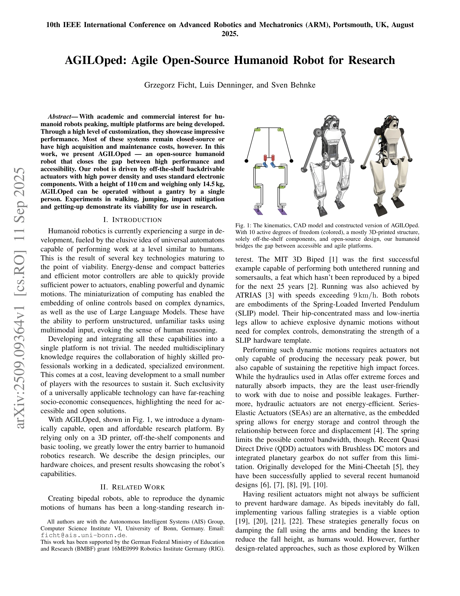

# AGILOped: Agile Open-Source Humanoid Robot for Research

> **저자**: Grzegorz Ficht, Luis Denninger, Sven Behnke | **날짜**: 2025-09-11 | **URL**: [https://arxiv.org/abs/2509.09364](https://arxiv.org/abs/2509.09364)

---

## Essence

*Fig. 1: The kinematics, CAD model and constructed version of AGILOped.*

AGILOped는 오픈소스 휴머노이드 로봇으로서 높은 성능과 접근성 사이의 간극을 해소하며, 3D 프린팅과 상용 부품을 활용해 6,380 USD의 저렴한 가격으로 동적 운동 능력을 제공한다.

## Motivation

- **Known**: 최근 휴머노이드 로봇 플랫폼들은 높은 커스터마이제이션을 통해 인상적인 성능을 보여주고 있으며, QDD 액추에이터는 Mini-Cheetah부터 시작해 여러 휴머노이드 설계에 성공적으로 적용되고 있다.
- **Gap**: 기존 동적 능력이 우수한 휴머노이드 플랫폼들은 비용이 높거나 폐쇄적이며, 오픈소스이면서도 동적 운동을 수행할 수 있는 접근 가능한 플랫폼이 부족하다.
- **Why**: 휴머노이드 로봇 기술의 민주화는 다양한 연구 그룹의 참여를 촉진하고 결과의 재현성을 높이며, 저렴한 플랫폼은 교육 및 산업 응용으로의 확대를 가능하게 한다.
- **Approach**: 3D 프린팅 기반 구조와 MyActuator RMD X6-40 QDD 액추에이터를 활용하고, 선택적 컴플라이언스 설계로 강성과 유연성을 결합하며, 모든 설계 파일을 오픈소싱함으로써 접근 가능한 동적 플랫폼을 구현한다.

## Achievement

*Fig. 1: The kinematics, CAD model and constructed version of AGILOped.*

- **가성비 최고의 소형 휴머노이드**: 110 cm 높이, 14.5 kg 무게로 동급 로봇 중 가장 저렴한 6,380 USD 가격 달성
- **오픈소스 설계**: CAD 모델과 설계 파일 전체를 온라인 공개해 재현성과 커스터마이제이션 가능성 제공
- **상용 부품 활용**: 3D 프린터와 기본 도구만으로 제작 가능하며 유지보수와 개선이 용이
- **동적 운동 능력**: 보행, 점프, 충격 완화, 일어나기 등의 실험으로 연구 플랫폼으로서의 타당성 입증
- **간단한 액추에이션**: 10개 액추에이터로 12개 조인트를 제어하여 복잡성과 비용 최소화

## How

- MyActuator RMD X6-40 QDD 액추에이터를 모든 조인트에 적용해 높은 토크 밀도와 고대역폭 제어 제공
- 알루미늄 프레임과 PLA/Nylon, TPU 플라스틱의 선택적 컴플라이언스 조합으로 강성과 유연성 균형
- Raspberry Pi 3B+를 기본 컨트롤러로 사용하고 선택적으로 NVIDIA Jetson 통합 가능한 모듈식 구조
- 2×26.1V LiPo 배터리 (4.5 Ah)로 1.5-2.5시간 동작 시간 확보
- CAN 통신 프로토콜을 통해 모터의 위치, 속도, 토크 피드백 수집
- 3D 프린팅 기반의 모듈식 부품 설계로 손쉬운 수정 및 개선 가능

## Originality

- 오픈소스이면서도 높은 동적 능력을 갖춘 소형 휴머노이드의 첫 구현 사례
- 3D 프린팅과 상용 QDD 액추에이터의 결합으로 비용-성능 최적화의 새로운 기준 제시
- 선택적 컴플라이언스 설계 철학으로 강성과 유연성의 효율적인 조화 달성
- 모듈식 아키텍처와 완전한 설계 공개로 학계 커뮤니티의 확장성 있는 플랫폼 제공

## Limitation & Further Study

- Raspberry Pi 3B+의 제한된 계산 능력으로 인해 복잡한 온라인 제어 알고리즘 실행에 제약
- 낙상 시 손상 완화를 위한 생체모방적 부드러운 재료 설계의 미흡 (논문에서 확인되지 않음)
- 1.5-2.5시간의 배터리 수명이 장시간 연속 운용을 제한
- 10개 액추에이터 구성으로 인한 자유도 제한으로 복잡한 조작 작업 불가능
- 후속 연구로 충돌 회복 전략(falling strategy) 및 컴플라이언트 암 설계의 개발 필요

## Evaluation

- Novelty: 4/5
- Technical Soundness: 3/5
- Significance: 4/5
- Clarity: 4/5
- Overall: 4/5

**총평**: AGILOped는 오픈소스, 저가격, 높은 성능을 결합한 획기적인 휴머노이드 로봇으로, 휴머노이드 로봇 연구의 진입장벽을 크게 낮추고 학계의 민주화를 촉진하는 중요한 기여를 한다.
