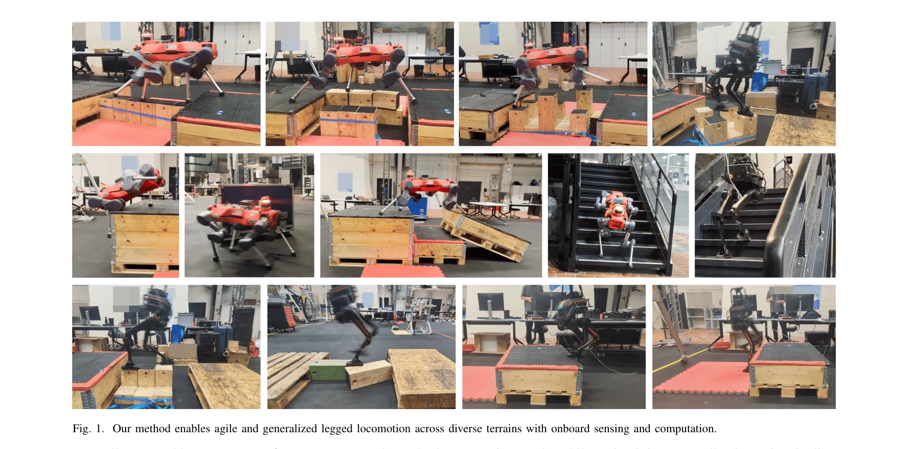
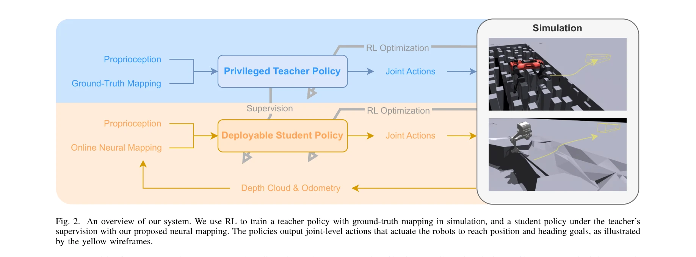

# AME-2: Agile and Generalized Legged Locomotion via Attention-Based Neural Map Encoding

> **저자**: Chong Zhang, Victor Klemm, Fan Yang, Marco Hutter | **날짜**: 2026-01-13 | **URL**: [https://arxiv.org/abs/2601.08485](https://arxiv.org/abs/2601.08485)

---

## Essence

*Fig. 1. Our method enables agile and generalized legged locomotion across diverse terrains with onboard sensing and comp*

AME-2는 Attention 기반 맵 인코더를 통합한 통합 RL 프레임워크로, 민첩성과 일반화를 동시에 달성하는 사족/이족 로봇 보행 제어 방법이다. 학습 기반의 불확실성 인식 elevation mapping 파이프라인과 teacher-student 학습 체계를 통해 sim-to-real 이전을 개선한다.

## Motivation

- **Known**: 기존 RL 기반 보행 제어는 민첩성, 일반화, 맵핑 효율성, 해석 가능성 중 일부를 선택적으로 달성했으며, 고전적 매핑 파이프라인은 정확한 모델에 의존하지만 폐쇄된 시야와 센서 노이즈에 취약하다.
- **Gap**: 민첩한 보행과 다양한 지형에 대한 일반화를 모두 달성하면서도 해석 가능하고 효율적인 맵 표현을 제공하는 통합 프레임워크가 부재한다.
- **Why**: 자율 로봇이 복잡한 실제 환경에서 신뢰성 있게 작동하려면 실시간 perception과 agile control을 균형 있게 통합해야 하며, 이는 다양한 지형과 폐쇄 상황에서 특히 중요하다.
- **Approach**: Attention 메커니즘을 활용한 neural map encoder를 RL 정책에 통합하여 elevation map의 local/global 특징을 추출하고, Bayesian learning 기반의 경량 neural network로 불확실성 인식 elevation map을 생성하며, teacher-student 학습 체계로 실제 맵핑 파이프라인을 반영한다.

## Achievement

*Fig. 1. Our method enables agile and generalized legged locomotion across diverse terrains with onboard sensing and comp*

- **Attention 기반 맵 인코더**: Global 특징과 고유 정보로 local 특징에 attention 가중치를 할당하여 현재 과제와 무관한 영역의 가중치를 낮춤으로써 새로운 지형으로의 일반화 향상
- **불확실성 인식 elevation mapping**: Depth 이미지를 local grid로 투영하고 Bayesian neural network로 per-cell 불확실성을 추정하여 occlusion과 센서 노이즈에 강건한 표현 제공
- **Teacher-student 학습**: Ground-truth elevation map으로 teacher 정책 훈련 후, 실제 맵핑 파이프라인 하에서 student 정책을 teacher 감시 + RL로 훈련하여 배포 가능한 agile 제어기 획득
- **다중 로봇 및 지형 검증**: ANYmal-D 사족 로봇과 LimX TRON1 이족 로봇에서 simulation과 실제 하드웨어 모두에서 우수한 민첩성과 일반화 능력 입증
- **Parallel simulation 통합**: 훈련 중 online mapping을 지원하여 sim-to-real 이전 격차 완화

## How

*Fig. 2. An overview of our system. We use RL to train a teacher policy with ground-truth mapping in simulation, and a st*

- AME-2 encoder는 elevation map에서 local feature (pixel-wise 지형 세부사항)와 global feature (전역 지형 맥락)를 추출
- Global feature와 proprioception을 기반으로 local feature에 attention 가중치를 할당하는 attention 메커니즘 적용
- 가중치 있는 local feature를 global feature와 proprioception과 concatenate하여 terrain-aware representation 생성
- Goal-reaching locomotion 보상 함수 설계로 다양한 로봇에 동일한 훈련 설정 적용 가능하게 구성
- Depth 이미지를 local elevation grid로 변환하는 경량 neural network를 Bayesian learning으로 훈련
- Odometry와의 fusion을 통해 local elevation map들을 일관된 global frame으로 통합
- Parallel simulation과 실제 로봇 모두에서 동일한 맵핑 파이프라인 실행
- 다양한 훈련 지형 분포를 합성하여 실행 불가능한 지형도 포함해 맵 예측 일반화 개선

## Originality

- Attention 메커니즘을 elevation map 인코딩에 적용하여 terrain-aware 정책이 관련성 낮은 영역을 적응적으로 무시하도록 설계
- Bayesian neural network를 기반으로 per-cell 불확실성을 명시적으로 모델링하는 학습 기반 elevation mapping 파이프라인 제시
- Teacher-student 학습 체계로 ground-truth map 가정과 실제 맵핑 파이프라인 간 격차 해소
- Parallel simulation에서 online mapping을 통해 이상적이지 않은 맵이나 수동 조정을 거치지 않는 end-to-end 훈련 가능화
- 통일된 훈련 설정으로 quadruped과 biped 로봇 모두에 동일한 프레임워크 적용

## Limitation & Further Study

- Attention 메커니즘의 계산 비용 및 실시간 성능에 미치는 영향에 대한 정량적 분석 부재
- Bayesian neural network의 불확실성 추정 정확도와 실제 sensor noise 분포 간의 명시적 검증 부족
- 극한 occlusion 상황이나 매우 동적인 지형에서의 성능 평가 제한적
- Teacher 정책의 성능이 student 정책의 상한을 제약하는데, teacher 정책의 한계에 대한 분석 부재
- 다양한 센서 모달리티(예: LiDAR, stereo camera)에 대한 일반화 검증 필요
- 후속 연구에서 multimodal sensor fusion을 통한 robustness 향상, 더 효율적인 attention 메커니즘 개발, 온라인 adaptation 능력 추가 필요

## Evaluation

- Novelty: 4/5
- Technical Soundness: 3/5
- Significance: 4/5
- Clarity: 4/5
- Overall: 4/5

**총평**: AME-2는 Attention 기반 맵 인코더와 불확실성 인식 elevation mapping을 통해 agile과 generalized 보행을 통합적으로 달성하는 우수한 프레임워크이며, quadruped과 biped 양쪽에서 실증된 강력한 일반화 능력과 sim-to-real 이전 효과를 입증함으로써 legged locomotion 분야에 중요한 기여를 한다.
