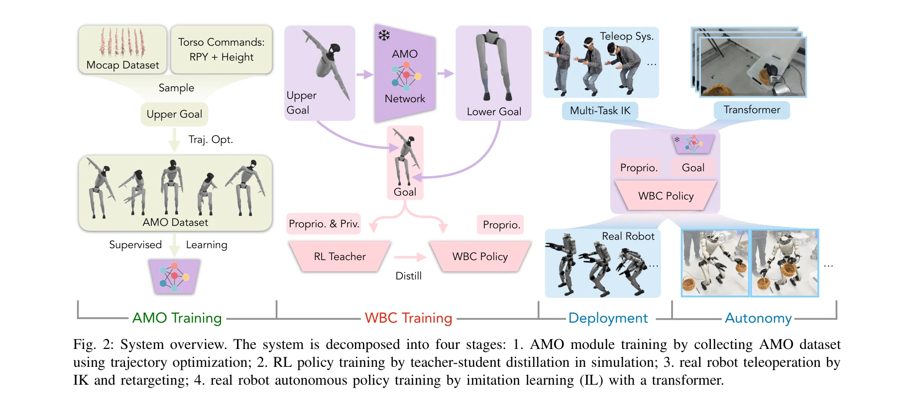
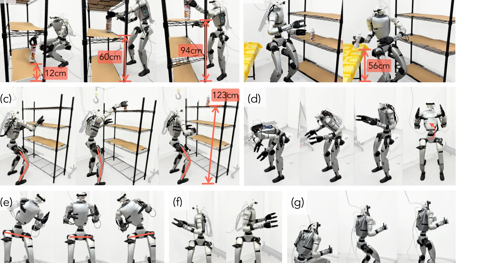

# AMO: Adaptive Motion Optimization for Hyper-Dexterous Humanoid Whole-Body Control

> **저자**: Jialong Li, Xuxin Cheng, Tianshu Huang, Shiqi Yang, Ri-Zhao Qiu, Xiaolong Wang | **날짜**: 2025-05-06 | **URL**: [https://arxiv.org/abs/2505.03738](https://arxiv.org/abs/2505.03738)

---

## Essence

*Fig. 2: System overview. The system is decomposed into four stages: 1. AMO module training by collecting AMO dataset*

AMO는 sim-to-real RL과 trajectory optimization을 결합하여 29-DoF 인형로봇의 실시간 적응형 전신 제어를 구현하며, hybrid dataset 구성과 O.O.D. 명령에 대한 강건한 일반화를 통해 기존 방법의 운동 공간 제한을 극복한다.

## Motivation

- **Known**: Motion capture 기반 모방 학습과 trajectory optimization 기반 제어는 각각 동력학 제약과 실시간성에서 한계를 가지며, 현존하는 인형로봇 제어는 단순한 보행 패턴이나 분리된 팔-다리 제어에 주로 국한되어 있다.
- **Gap**: MoCap 방식은 이족보행 중심의 데이터로 인한 운동학적 편향을 가지고, TO 방식은 계산 비효율과 제한된 모션 프리미티브로 인해 동적 시나리오에서 빠른 적응이 불가능하다.
- **Why**: 인형로봇의 고자유도 전신 운동은 바닥에서의 물체 집기 같은 실용적 조작 작업에 필수적이며, 실시간 적응형 제어는 VR 원격 조작 및 자율 작업 실행을 가능하게 한다.
- **Approach**: AMO는 MoCap 팔 궤적과 확률적으로 샘플링된 몸통 방향을 융합하여 hybrid 상위체 명령을 생성하고, dynamics-aware trajectory optimizer로 전신 참조 운동을 생성한 후, 연속 매핑 가능한 AMO network를 훈련하여 O.O.D. 명령에 강건한 정책을 학습한다.

## Achievement

*Fig. 1: AMO enables hyper-dexterous whole-body movements for humanoid robots. (a): The robot picks and places a can on*

- **Hybrid Motion Synthesis**: MoCap 데이터와 확률적 샘플링된 몸통 방향(SO(3) + Height)을 결합하여 운동학적 편향을 제거하고 dynamics-aware trajectory optimization으로 동력학적 실행 가능성을 보장하는 첫번째 인형로봇 민첩 조작용 AMO dataset 구성
- **O.O.D. Generalization**: 연속 입력 공간에서의 강건한 보간을 통해 기존 방법이 달성하지 못한 O.O.D. 원격 조작 명령에 대한 강건한 성능 입증
- **Expanded Workspace**: 29-DoF Unitree G1 로봇의 운동 공간을 획기적으로 확대하여 지면에서의 물체 집기 같은 hyper-dexterous 전신 운동 달성
- **Real-time Adaptive Control**: VR 원격 조작 시스템과 통합되어 sparse task-space 목표로부터 실시간 제어 신호 생성
- **Autonomous Task Execution**: 모방 학습 기반 autonomous policy 훈련으로 일관된 성능 유지 및 시스템 다재다능성 입증

## How

*Fig. 2: System overview. The system is decomposed into four stages: 1. AMO module training by collecting AMO dataset*

- **AMO Dataset Construction**: MoCap 팔 궤적에서 상위체 목표를 추출하고 확률적으로 샘플링된 몸통 방향(RPY + Height)과 베이스 속도를 결합하여 hybrid 명령 생성
- **Trajectory Optimization**: whole-body reference motion을 생성하는 dynamics-aware trajectory optimizer 설계로 운동학적 실행 가능성과 동력학적 제약 동시 만족
- **AMO Network Training**: supervised learning으로 명령-운동 매핑을 학습하는 neural network 훈련으로 연속 입력 공간에서의 강건한 일반화 달성
- **RL Policy Training**: teacher-student distillation을 통해 simulation에서 WBC (Whole-Body Control) policy 훈련으로 sim-to-real transfer 준비
- **Multi-Target IK Retargeting**: VR 원격 조작 시스템으로부터 sparse pose 추출 후 multi-target inverse kinematics로 상위체 목표 생성
- **Deployment**: 훈련된 AMO network와 RL policy를 결합하여 실시간 제어 신호 출력, 자율 작업 시 transformer 기반 autonomous policy 적용

## Originality

- **Hybrid Motion Synthesis의 창의성**: MoCap의 운동학적 편향과 TO의 계산 비효율을 동시에 해결하기 위해 두 접근법을 융합한 novel architecture
- **O.O.D. Robustness 강조**: 기존 motion imitation 연구가 간과한 O.O.D. 명령 처리 능력을 명시적으로 설계하고 평가
- **SE(3) Task Space Control**: 상위체 뿐만 아니라 몸통의 orientation과 height를 동적으로 조정하여 운동 공간 확대하는 novel formulation
- **No Reference Deployment**: deployment 단계에서 참조 운동이 불필요한 autonomous capability 제공으로 실용성 증가

## Limitation & Further Study

- **Dataset의 MoCap 의존성**: 여전히 MoCap 팔 궤적을 기초로 하므로 인간 운동 범위의 제약 상속 가능
- **Simulator-Reality Gap**: sim-to-real transfer의 완전한 검증이 일부 부족할 수 있으며, 다양한 환경 조건에서의 robust성 추가 검증 필요
- **계산 복잡도 분석 미흡**: trajectory optimization의 real-time 실행 가능성에 대한 상세한 계산 시간 분석 부재
- **일반화 범위 제한**: 현재 Unitree G1 로봇에만 검증되었으므로 다른 humanoid 플랫폼에 대한 generalization 미지수
- **후속 연구**: (1) 더욱 복잡한 환경 상호작용을 포함한 dynamics 모델 고도화, (2) 다양한 humanoid 플랫폼 검증, (3) O.O.D. 명령의 물리적 실현 가능성 판정 mechanism 추가

## Evaluation

- Novelty: 4/5
- Technical Soundness: 3/5
- Significance: 4/5
- Clarity: 4/5
- Overall: 4/5

**총평**: AMO는 hybrid motion synthesis와 O.O.D. robust 정책 학습을 통해 인형로봇의 운동 공간을 획기적으로 확대한 혁신적 연구로, MoCap과 trajectory optimization의 상보적 장점을 효과적으로 결합하며 sim-to-real transfer와 실시간 적응형 제어에서 탁월한 성과를 보여준다.
