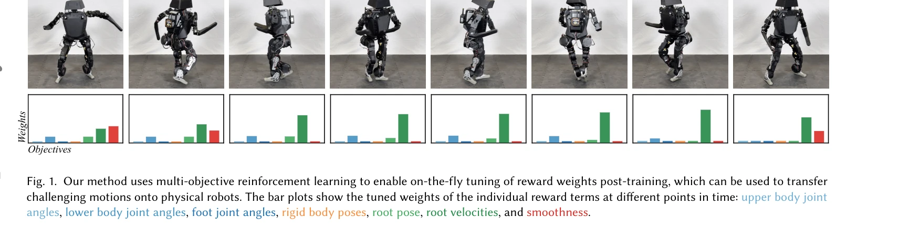
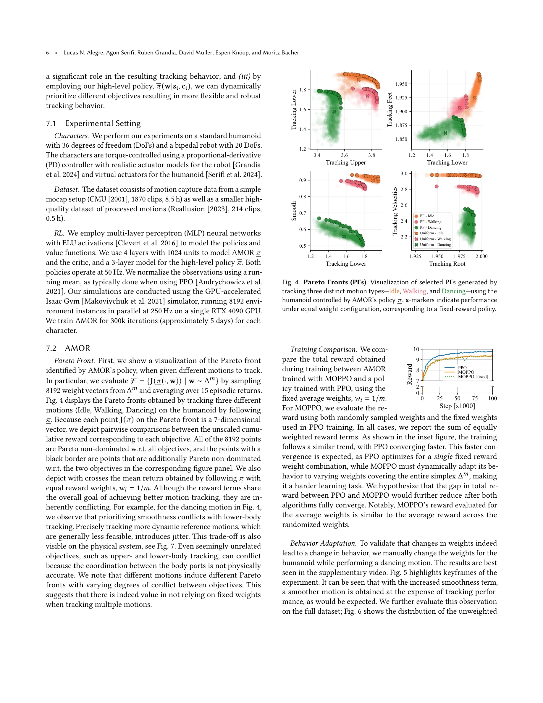
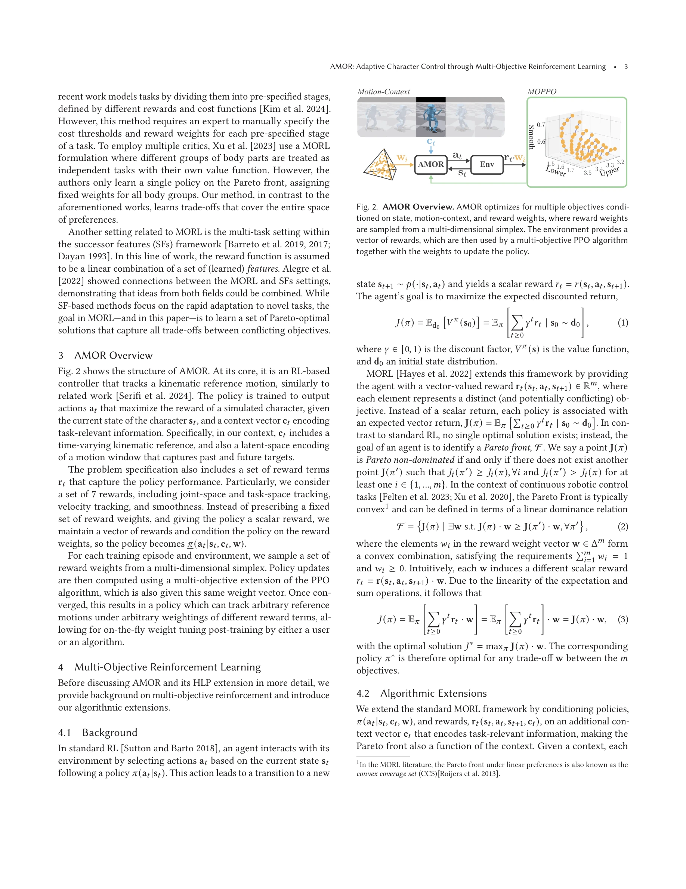

# AMOR: Adaptive Character Control through Multi-Objective Reinforcement Learning

> **저자**: Lucas N. Alegre, Agon Serifi, Ruben Grandia, David Müller, Espen Knoop, Moritz Bächer | **날짜**: 2025-05-29 | **URL**: [https://arxiv.org/abs/2505.23708](https://arxiv.org/abs/2505.23708)

---

## Essence

*Fig. 1. Our method uses multi-objective reinforcement learning to enable on-the-fly tuning of reward weights post-traini*

본 논문은 Multi-Objective Reinforcement Learning(MORL)을 활용하여 보상 함수의 가중치를 학습 후 조정할 수 있는 AMOR 프레임워크를 제안하며, 이를 통해 물리 기반 캐릭터 제어의 반복 튜닝 시간을 단축하고 실제 로봇으로의 전이를 용이하게 한다.

## Motivation

- **Known**: RL 기반 캐릭터 제어는 kinematic reference motion 추적에 효과적이나, 일반적으로 가중 합산된 보상 함수에 의존하며 이는 광범위한 튜닝이 필요하고 sim-to-real gap을 고려할 때 실제 로봇 적용이 어렵다.
- **Gap**: 기존 방법들은 훈련 전에 보상 가중치를 고정해야 하므로, 가중치 조정을 위해 전체 재훈련이 필요하며, 여러 동작에서 서로 다른 가중치 조합이 필요한 경우를 다루지 못한다.
- **Why**: 물리 기반 캐릭터 제어에서 보상 가중치 튜닝은 계산 비용이 크며 반복적이므로, 훈련 후 가중치를 조정할 수 있다면 개발 워크플로우를 크게 개선할 수 있고 로봇 실제 적용 시 sim-to-real gap 대응이 용이해진다.
- **Approach**: MORL을 이용하여 Pareto front를 형성하는 다양한 가중치에 조건화된 단일 정책을 훈련하고, 훈련 후 가중치를 선택·조정할 수 있도록 하며, 계층적 구조에서 고수준 정책이 현재 과제에 따라 동적으로 가중치를 선택하도록 구성한다.

## Achievement

*Fig. 4. Pareto Fronts (PFs). Visualization of selected PFs generated by*

- **Context-conditioned MORL 문제 정식화**: 단일 정책으로 서로 다른 문맥에 따른 Pareto front를 추출할 수 있는 새로운 문제 정식화 제시
- **AMOR 컨트롤러**: 보상 가중치와 과제 문맥에 조건화되어 있으며, zero-shot으로 목표 가중치 조합에 적응 가능
- **계층적 정책 구조**: 고수준 정책이 실시간으로 보상 가중치를 동적 조정하며 암시적 보상의 해석가능성 제공
- **실제 로봇 검증**: 시뮬레이션에서 훈련된 정책을 물리 로봇으로 전이하며 복잡한 동적 동작 수행 달성
- **빠른 반복 개발**: 훈련 후 가중치 조정으로 재훈련 없이 원하는 동작 달성 가능

## How

*Fig. 2 shows the structure of AMOR. At its core, it is an RL-based*

- Multi-objective RL 알고리즘을 사용하여 Pareto optimal policies의 front를 학습
- 정책을 보상 가중치 벡터 w에 대해 조건화(weight-conditioned policy π(·|w))
- Generator-discriminator 접근법을 활용하여 암시적 보상 신호 학습
- 고수준 정책(HLP)이 저수준 weight-conditioned 정책을 선택하는 두 레벨의 계층 구조 구성
- Pareto front 상의 다양한 가중치 조합에 대해 정책 성능 평가 및 시각화
- 실제 로봇 환경에서 가중치 조정을 통한 sim-to-real 전이 검증

## Originality

- MORL을 물리 기반 캐릭터 제어에 적용하되, 단일 정책으로 전체 Pareto front를 표현하는 점이 새로운 시도
- 훈련 후 가중치 조정을 가능하게 함으로써 기존의 훈련 전 고정 가중치 방식을 근본적으로 개선
- 계층적 구조에서 고수준 정책이 저수준 가중치를 동적으로 선택하는 아이디어는 기존 방법에서 찾기 어려움
- Generator-discriminator 기반 암시적 보상과 명시적 다중 목표를 결합한 하이브리드 접근법
- Pareto optimality 개념을 동적 캐릭터 제어에 명시적으로 도입한 최초 사례

## Limitation & Further Study

- Pareto front의 크기와 정책 복잡도 간의 트레이드오프에 대한 분석 부족
- 다양한 캐릭터 형태(quadrupeds, humanoids 등)에서의 확장성 검증 미흡
- 실제 로봇 실험이 제한적이며 더 다양한 동작과 로봇 플랫폼에서의 검증 필요
- 가중치 선택의 최적성 보장 부재 및 고수준 정책 학습의 수렴성 분석 부족
- 계산 비용 분석 및 훈련 시간 비교가 명시적으로 제시되지 않음
- **후속 연구**: (1) 더 복잡한 다중 목표 설정에서의 확장성 검토, (2) 자동 가중치 선택 알고리즘 개발, (3) 다양한 로봇 플랫폼과 실제 환경 조건에서의 광범위한 검증

## Evaluation

- Novelty: 4/5
- Technical Soundness: 3/5
- Significance: 4/5
- Clarity: 4/5
- Overall: 4/5

**총평**: 본 논문은 MORL을 물리 기반 캐릭터 제어에 창의적으로 적용하여 훈련 후 가중치 조정을 가능하게 함으로써 개발 워크플로우를 크게 개선하고, 실제 로봇 적용에서의 sim-to-real 전이를 용이하게 하는 실용적이고 혁신적인 접근법을 제시한다.
