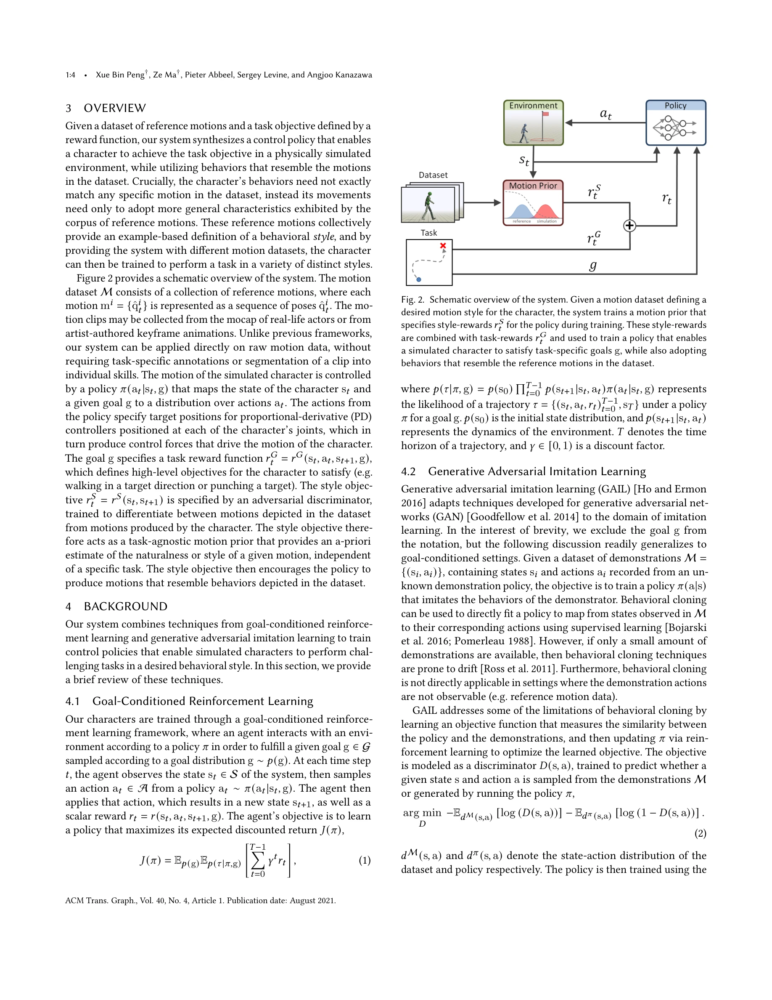
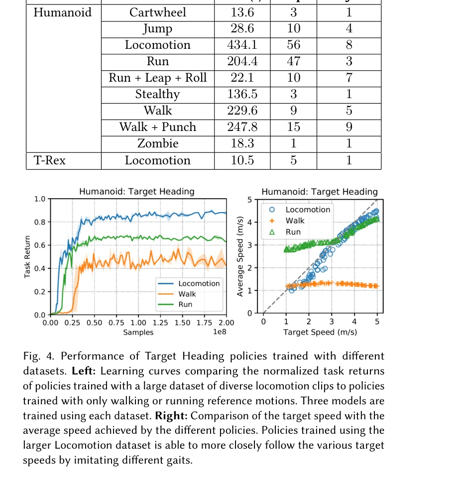

# AMP: Adversarial Motion Priors for Stylized Physics-Based Character Control

> **저자**: Xue Bin Peng, Ze Ma, Pieter Abbeel, Sergey Levine, Angjoo Kanazawa | **날짜**: 2021-04-05 | **URL**: [https://arxiv.org/abs/2104.02180](https://arxiv.org/abs/2104.02180)

---

## Essence

*Fig. 2. Schematic overview of the system. Given a motion dataset defining a*

물리 기반 캐릭터 애니메이션에서 adversarial motion prior를 학습하여 비구조화된 모션 클립 데이터셋으로부터 자동으로 스타일을 추출하고, 간단한 보상 함수로 정의된 고수준 태스크 목표를 달성하면서도 자연스러운 움직임을 생성하는 방법을 제안한다.

## Motivation

- **Known**: 데이터 기반 모션 추적 방법은 실제 배우의 모션 클립으로부터 고품질 애니메이션을 생성할 수 있으나, 대규모 비구조화 데이터셋에 적용할 때 적절한 모션 클립 선택과 시퀀싱을 위한 모션 플래너가 필요하며 이는 수작업 설계와 annotation을 요구한다.
- **Gap**: 기존 추적 기반 방법들은 클립 선택 메커니즘과 명시적 목표 함수 설계에 의존하므로, 비구조화된 대규모 모션 데이터셋을 자동으로 활용하면서 다양한 스타일을 학습하고 조합하는 일반화된 방법이 부재하다.
- **Why**: 자동화된 스타일 학습은 모션 데이터의 활용을 극대화하고 애니메이터의 수작업을 줄이며, 비인간 생물이나 가상 캐릭터에 적용 시 모션 데이터가 부족한 상황에서 현실적 움직임을 생성할 수 있어 게임, VR, 로봇 제어 등 다양한 분야에 가치가 있다.
- **Approach**: Adversarial discriminator를 통해 데이터셋의 모션과 학습된 정책의 모션을 구분하도록 훈련하여 motion prior를 학습하고, 이를 goal-conditioned reinforcement learning 프레임워크에 통합하여 스타일 보상과 태스크 보상을 결합한다.

## Achievement

*Fig. 4. Performance of Target Heading policies trained with different*

- **자동 모션 선택 및 보간**: Adversarial motion prior가 명시적 클립 선택이나 sequencing 메커니즘 없이 동적으로 적절한 모션을 선택하고 일반화할 수 있음을 입증
- **스킬 조합의 자동 출현**: 모션 플래너나 task-specific annotation 없이 이질적인 동작들(예: 달리기, 점프, 구르기)이 자동으로 조합되어 복잡한 태스크 수행 가능
- **기존 추적 기반 방법 대비 성능**: 최첨단 추적 기반 기법과 비슷한 수준의 고품질 모션 생성
- **확장성**: 비구조화된 대규모 모션 데이터셋을 효과적으로 수용 가능한 첫 번째 adversarial learning 기반 전신 모션 생성 시스템

## How

*Fig. 2. Schematic overview of the system. Given a motion dataset defining a*

- Discriminator를 adversary로 하여 데이터셋 모션과 정책 생성 모션의 분포 차이를 학습
- Motion prior의 판별 확률을 style reward로 변환하여 RL 학습 신호로 활용
- Goal-conditioned RL에서 task reward와 style reward를 결합
- 물리 시뮬레이션 기반 캐릭터 컨트롤러를 정책으로 학습
- 학습된 정책이 자동으로 다양한 모션 클립에서 관련 행동을 선택하고 목표 태스크 수행
- 추가적인 motion planner나 clip annotation 없이 end-to-end 학습

## Originality

- Adversarial imitation learning을 물리 기반 전신 캐릭터 애니메이션에 처음으로 체계적으로 적용하고 실제 복잡한 동작 학습에 성공
- Motion prior를 일반적인 스타일 유사성 측정 지표로 사용하여 명시적 모션 선택이 불필요한 자동화된 접근법 제시
- 비구조화 모션 클립 데이터셋으로부터 자동 스킬 조합이 가능함을 시연
- 기존 adversarial imitation learning 기법의 설계 결정(예: network architecture, reward formulation 등)을 개선하여 고품질 전신 모션 생성 달성

## Limitation & Further Study

- Adversarial discriminator 학습의 안정성: 적대적 학습의 불안정성이 모션 생성 품질에 영향을 미칠 가능성
- 모션 데이터셋의 품질 의존성: 비구조화된 클립 품질이 최종 결과에 직접 영향
- 복잡한 멀티-모달 행동 조합: 근본적으로 서로 다른 스타일의 모션 혼합 시 부자연스러움 가능성
- 후속 연구: 더 안정적인 adversarial 학습 알고리즘, 다중 스타일의 조건부 제어, 정적 안정성과 동적 응답성의 트레이드-오프 개선, 실제 로봇 시스템으로의 전이 학습

## Evaluation

- Novelty: 4/5
- Technical Soundness: 3/5
- Significance: 4/5
- Clarity: 4/5
- Overall: 4/5

**총평**: 본 논문은 adversarial motion prior를 통해 비구조화 모션 데이터의 자동 활용을 실현한 물리 기반 캐릭터 애니메이션 분야의 중요한 기여로, 모션 선택 메커니즘 설계의 부담을 제거하면서도 최첨단 성능을 달성하며 게임, 영상, 로봇 등 다양한 응용 분야에 실질적 가치를 제공한다.
