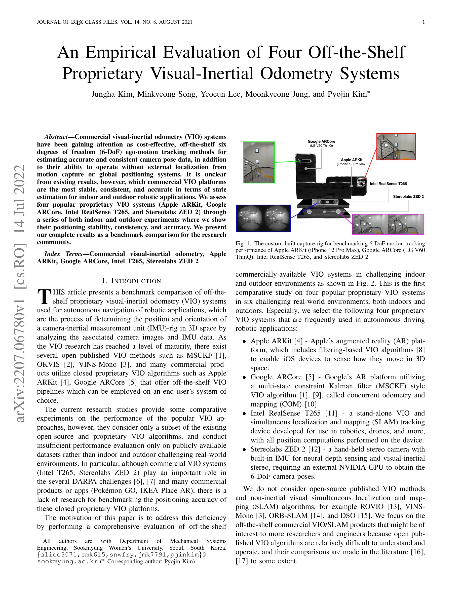
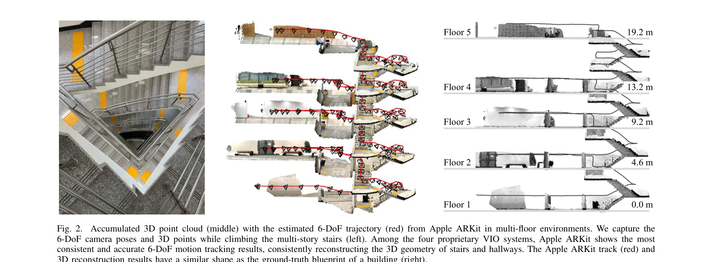

# An Empirical Evaluation of Four Off-the-Shelf Proprietary Visual-Inertial Odometry Systems

> **저자**: Jungha Kim, Minkyeong Song, Yeoeun Lee, Moonkyeong Jung, Pyojin Kim | **날짜**: 2022-07-14 | **URL**: [https://arxiv.org/abs/2207.06780](https://arxiv.org/abs/2207.06780)

---

## Essence

*Fig. 1. The custom-built capture rig for benchmarking 6-DoF motion tracking*

Apple ARKit, Google ARCore, Intel RealSense T265, Stereolabs ZED 2 등 4개의 상용 VIO 시스템을 실내외 환경에서 실험하여 6-DoF 위치 추정 성능을 벤치마크 비교한 연구이다.

## Motivation

- **Known**: VIO는 카메라와 IMU 데이터를 분석하여 3D 공간에서 카메라-IMU 리그의 위치와 방향을 결정하는 기술이며, MSCKF, OKVIS, VINS-Mono 등의 오픈소스 VIO 방법들이 존재한다.
- **Gap**: 기존 연구들은 오픈소스 VIO 알고리즘의 부분적 비교만 수행하거나 공개 데이터셋에서만 평가하였으며, 상용 VIO 시스템(Intel T265, Stereolabs ZED 2)의 위치 정확도에 대한 체계적인 벤치마킹이 부족하다.
- **Why**: 상용 VIO 시스템은 DARPA 챌린지, AR/VR 앱, 자율 주행 로봇 등에서 광범위하게 활용되고 있으나 어떤 플랫폼이 가장 안정적이고 정확한지 불명확하기 때문이다.
- **Approach**: 4개의 상용 VIO 시스템을 통합한 커스텀 캡처 리그를 개발하여 실내(좁은 복도, 계단, 지하 주차장) 및 실외(3.1km 도시 환경) 6개의 도전적 환경에서 동시에 실험을 수행한다.

## Achievement

*Fig. 2.*

- **포괄적 벤치마크 제공**: 4개의 인기 있는 상용 VIO 시스템(Apple ARKit, Google ARCore, Intel RealSense T265, Stereolabs ZED 2)에 대한 최초의 실내외 종합 비교 평가
- **다양한 환경 테스트**: 좁은 복도, 넓은 개방 공간, 반복적 계단, 조명 부족한 지하 주차장, 3.1km 도시 주행 등 6개의 현실적 도전 환경에서 검증
- **정성적·정량적 결과**: 위치 안정성, 일관성, 정확도를 포함한 6-DoF 모션 추적 성능 평가 및 3D 점군 재구성 품질 비교
- **산업 활용 참고**: 로봇 플랫폼과 자율 주행 차량 선택에 필요한 구체적인 성능 참고 자료 제공

## How

*Fig. 1. The custom-built capture rig for benchmarking 6-DoF motion tracking*

- iPhone 12 Pro Max(Apple ARKit), LG V60 ThinQ(Google ARCore), Intel RealSense T265, Stereolabs ZED 2를 통합한 커스텀 캡처 리그 개발
- 각 시스템에 맞게 iOS 및 Android 데이터 수집 앱 구현(ARKit 60Hz, ARCore 30Hz, T265 200Hz 샘플링)
- 6개의 실내외 환경에서 장기간 실험 수행(보행 및 차량 주행 모션 포함)
- 각 VIO 시스템의 6-DoF 카메라 포즈, RGB 이미지, IMU 측정값 동시 수집
- 추정 궤적의 일관성, 안정성, 정확도를 정성적·정량적으로 분석

## Originality

- 4개의 상용 VIO 시스템을 단일 통합 캡처 리그로 동시 벤치마킹한 최초 연구
- 오픈소스 VIO와 달리 상용 폐쇄 소스 시스템의 실제 성능 평가에 중점
- EuRoC 데이터셋 같은 기존 공개 데이터셋이 아닌 실제 도전적 환경에서의 검증
- 스마트폰 AR 플랫폼(ARKit, ARCore)과 전용 하드웨어(T265, ZED 2)의 직접 비교

## Limitation & Further Study

- 폐쇄 소스 시스템이므로 내부 알고리즘 상세 분석 불가능
- 평가 지표가 정성적 분석(3D 점군 재구성 시각적 비교)에 다소 의존할 수 있음
- 특정 하드웨어(iPhone 12 Pro Max, LG V60 ThinQ)에 한정된 결과로 다른 기기에의 일반화 가능성 제한
- 지면 진실(ground truth) 데이터 없이 설계 도면과의 정성적 비교만 가능
- 후속 연구로는 더 다양한 환경(수중, 극단적 저조도), 다양한 기기 모델, 정량적 오차 메트릭(RMSE, ATE) 추가 평가 필요

## Evaluation

- Novelty: 4/5
- Technical Soundness: 3/5
- Significance: 4/5
- Clarity: 4/5
- Overall: 4/5

**총평**: 본 연구는 산업 및 로봇 분야에서 광범위하게 사용되는 상용 VIO 시스템의 실제 성능을 최초로 체계적으로 벤치마킹한 중요한 기여이며, 실내외 도전적 환경에서의 포괄적 평가를 통해 연구자와 엔지니어에게 실용적인 참고 자료를 제공한다.
