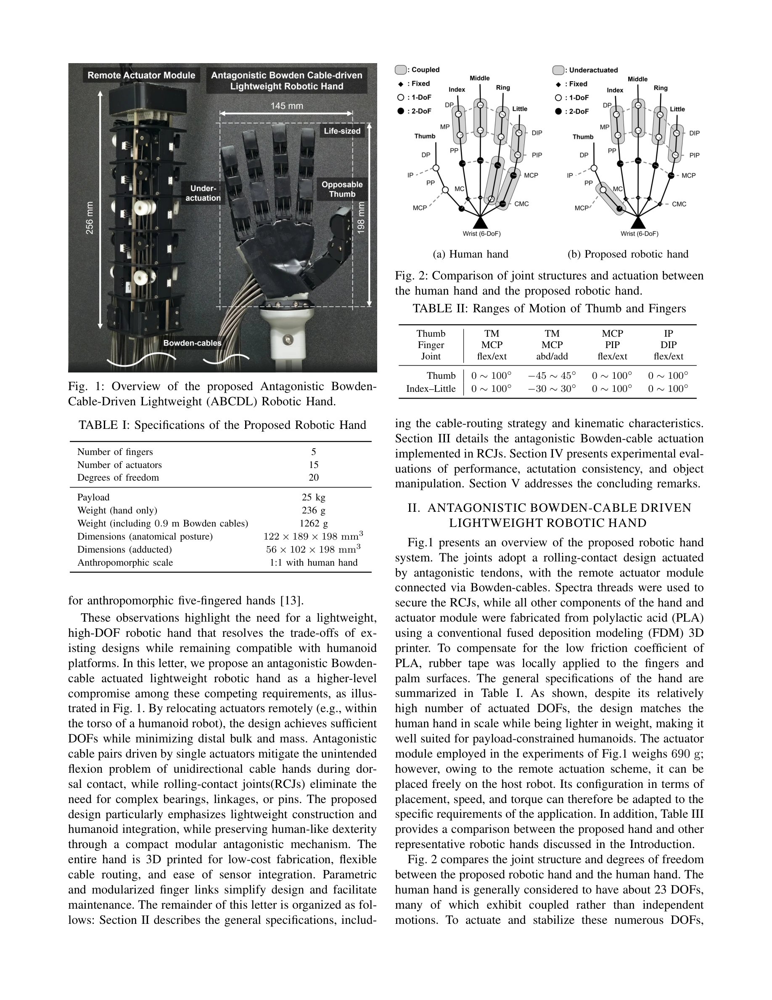
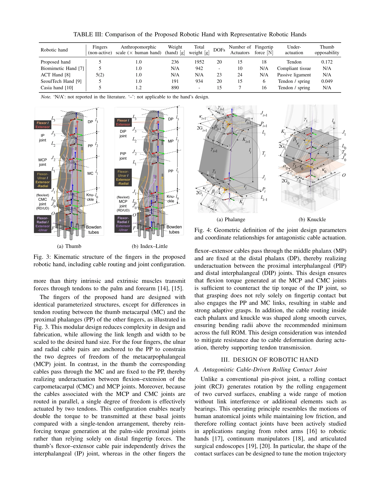

# Antagonistic Bowden-Cable Actuation of a Lightweight Robotic Hand: Toward Dexterous Manipulation for Payload Constrained Humanoids

> **저자**: Sungjae Min, Hyungjoo Kim, David Hyunchul Shim | **날짜**: 2025-12-31 | **URL**: [https://arxiv.org/abs/2512.24657](https://arxiv.org/abs/2512.24657)

---

## Essence

*Fig. 1: Overview of the proposed Antagonistic Bowden-*

Bowden 케이블을 이용한 원격 구동 방식의 경량 인간형 로봇 손으로, 길항적 케이블 작동과 rolling-contact joints를 결합하여 20개 DOF를 236g의 극히 낮은 질량으로 구현하였다.

## Motivation

- **Known**: 케이블 구동 로봇 손은 인간형 치수와 다중 자유도를 제공할 수 있지만, 구동기의 무거운 질량과 부피로 인해 팔의 payload 용량을 제한한다. 기존 설계들은 원격 구동과 길항적 케이블 작동 사이의 설계 트레이드오프를 충분히 해결하지 못했다.
- **Gap**: 기존 케이블 구동 손들은 distal 질량과 제한된 손목 호환성으로 인해 실제 인간형 로봇에 통합하기 어렵고, 단방향 케이블 구동 시 배측 접촉 중 의도하지 않은 굽힘 문제를 겪는다.
- **Why**: 인간형 로봇이 인간 수준의 손재주로 복합 작업을 수행하려면 고 파지력, 빠른 구동 속도, 다중 DOF, 인간형 크기 제약을 동시에 만족하는 경량 손이 필수적이다. 또한 Physical AI와 모방학습 플랫폼의 확산으로 5개 손가락 인간형 손에 대한 수요가 증가하고 있다.
- **Approach**: Rolling-contact joints(RCJs)와 길항적 Bowden 케이블 구동을 결합하여 단일 모터-관절 제어를 실현하였으며, 구동기를 로봇 몸통으로 원격 배치하여 손의 distal 질량을 최소화하면서 인간형 규모와 손재주를 유지한다.

## Achievement

*Fig. 3: Kinematic structure of the fingers in the proposed*

- **극도의 경량화**: 손 어셈블리만 236g의 초경량 달성으로 one hundred배 이상의 payload 리프팅 가능
- **높은 구동 성능**: 18N 이상의 fingertip force 발휘 및 20개 DOF, 15개 구동기로 인간형 손 수준의 dexterity 구현
- **설계 최적화**: Rolling-contact joints를 이용한 복잡한 베어링/링크/핀 제거로 구조 단순화 및 제조 용이성 증진
- **robust 검증**: Cutkosky taxonomy grasps와 perturbed actuator-hand transformations 하에서 궤적 일관성 입증

## How

*Fig. 2: Comparison of joint structures and actuation between*

- Rolling-contact joints(RCJs)를 관절 설계의 핵심으로 채택하여 마찰과 복잡성을 최소화
- 길항적 케이블 쌍을 단일 구동기로 제어하여 모터 간 동기화 불필요 및 단방향 케이블의 unintended flexion 문제 해결
- Bowden 케이블을 통한 원격 구동으로 구동기를 로봇 몸통에 배치하여 손의 distal 질량 감소
- FDM 3D 프린터로 PLA 소재를 이용해 구동기 모듈과 손을 제작하여 저비용 및 유연한 케이블 라우팅과 센서 통합 용이
- Spectra threads를 사용하여 RCJs를 고정하고, PLA의 낮은 마찰 계수 보완을 위해 rubber tape 국소 적용
- 모듈화된 parametric 손가락 링크 설계로 다양한 크기로의 확장성 및 유지보수 편의성 제공

## Originality

- Rolling-contact joints와 길항적 Bowden 케이블 구동의 결합은 기존 설계에서 보이지 않는 독창적 접근
- 원격 구동 개념을 체계적으로 적용하여 극도로 경량화된 손 설계로 기존 cable-driven hands의 distal weight 문제 근본적 해결
- single-motor-per-joint 제어와 negligible cable-length deviation을 동시에 달성한 길항적 케이블 메커니즘
- FDM 3D 인쇄 기반의 완전 제작 가능한 설계로 재현성과 접근성 증대

## Limitation & Further Study

- Bowden 케이블의 마찰, 현 길이 편차(cable-length deviation) 및 hysteresis 문제에 대한 상세한 보상 메커니즘 분석 부족
- 18N의 fingertip force는 인간 손의 400N에 비해 현저히 낮으며, 세밀한 manipulation task에서의 성능 평가 미흡
- 로봇 몸통 내 actuator 모듈의 배치 공간 제약과 케이블 라우팅의 실제 통합 복잡성에 대한 논의 부족
- PLA 소재의 내구성 및 장기 반복 사용에 따른 wear 분석 부재
- 후속연구: 더 강력한 소재 및 정밀한 가공을 통한 성능 향상, 실제 인간형 로봇 플랫폼 통합 및 복잡 조작 작업 검증 필요

## Evaluation

- Novelty: 4/5
- Technical Soundness: 3/5
- Significance: 4/5
- Clarity: 4/5
- Overall: 4/5

**총평**: 본 논문은 극도로 경량화된 원격 구동 로봇 손의 설계를 통해 payload 제약이 있는 인간형 로봇에 고 dexterity를 부여하는 실용적 솔루션을 제시한다. Rolling-contact joints와 길항적 케이블 구동의 결합은 독창적이며, 3D 프린팅 기반의 완전 제작 가능한 설계로 재현성과 확장성이 우수하다.

## Related Papers

- ⚖️ 반론/비판: [[papers/1773_A_21-DOF_Humanoid_Dexterous_Hand_with_Hybrid_SMA-Motor_Actua/review]] — Bowden 케이블 기반 경량 설계와 SMA-모터 하이브리드 구동 방식의 CYJ Hand가 서로 다른 설계 철학을 대조적으로 보여줍니다.
- 🔄 다른 접근: [[papers/1631_RAPID_Hand_A_Robust_Affordable_Perception-Integrated_Dextero/review]] — 두 연구 모두 고성능 인간형 손을 개발하지만 하나는 Bowden 케이블 원격 구동을, 다른 하나는 다른 구동 메커니즘을 사용합니다.
- 🏛 기반 연구: [[papers/2169_UniDex_A_Robot_Foundation_Suite_for_Universal_Dexterous_Hand/review]] — universal dexterous handling의 기반 기술을 경량 Bowden 케이블 구동 로봇 손에서 찾을 수 있습니다.
- 🔗 후속 연구: [[papers/1659_RUKA_Rethinking_the_Design_of_Humanoid_Hands_with_Learning/review]] — 학습 기반 휴머노이드 손 설계 재고찰이 Bowden 케이블 구동 방식의 20 DOF 극경량 구현을 더욱 최적화할 수 있다.
- ⚖️ 반론/비판: [[papers/1773_A_21-DOF_Humanoid_Dexterous_Hand_with_Hybrid_SMA-Motor_Actua/review]] — CYJ Hand의 하이브리드 구동과 달리 순수 Bowden 케이블 기반의 경량 설계를 대조적으로 보여줍니다.
