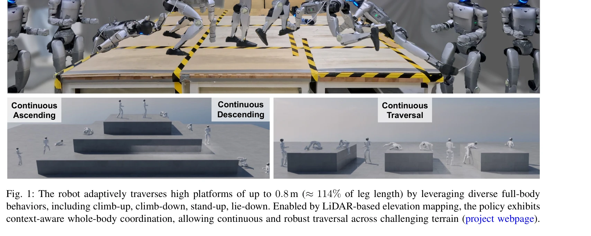
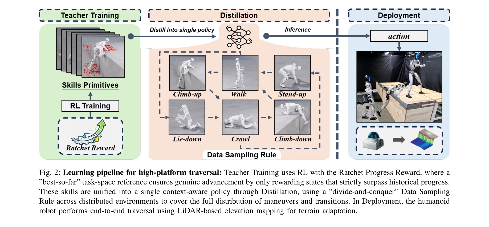

# APEX: Learning Adaptive High-Platform Traversal for Humanoid Robots

> **저자**: Yikai Wang, Tingxuan Leng, Changyi Lin, Shiqi Liu, Shir Simon, Bingqing Chen, Jonathan Francis, Ding Zhao | **날짜**: 2026-02-11 | **URL**: [https://arxiv.org/abs/2602.11143](https://arxiv.org/abs/2602.11143)

---

## Essence

*Fig. 1: The robot adaptively traverses high platforms of up to 0.8 m (≈114% of leg length) by leveraging diverse full-bo*

APEX는 humanoid 로봇이 다리 길이의 114%에 달하는 높은 플랫폼을 traversal할 수 있도록 하는 시스템으로, ratchet progress reward를 통해 학습한 6가지 기술(climb-up, climb-down, stand-up, lie-down, walking, crawling)을 하나의 정책으로 통합한다.

## Motivation

- **Known**: Deep reinforcement learning을 통해 humanoid 로봇의 발 기반 이동성이 불규칙한 지형에서 개선되었고, 점프 기반 솔루션은 다리 길이의 63% 정도까지 높이를 달성했다.
- **Gap**: 현재 RL 훈련 패러다임은 높은 임팩트와 높은 토크가 필요한 점프 같은 솔루션으로 수렴하여 다리 길이를 초과하는 플랫폼 traversal이 어렵고, 여러 상이한 기술을 단일 정책으로 통합하면서도 seamless하게 전환하는 문제가 미해결되어 있다.
- **Why**: Humanoid 로봇이 건설현장, 재난 구조, 복잡한 환경 탐색 등 실제 응용 환경에서 높은 장애물을 넘을 수 있어야 하므로 안전하고 적응력 있는 고플랫폼 traversal 능력이 중요하다.
- **Approach**: APEX는 두 단계 프레임워크를 제안하는데: (1) ratchet progress reward를 사용하여 6가지 skill을 개별적으로 학습하고, (2) 이들을 teacher-student distillation을 통해 단일 정책으로 통합하며, LiDAR 기반 elevation mapping과 sim-to-real 간극 감소 전략을 적용한다.

## Achievement

*Fig. 1: The robot adaptively traverses high platforms of up to 0.8 m (≈114% of leg length) by leveraging diverse full-bo*

- **고플랫폼 traversal**: 0.8m(다리 길이의 약 114%)에 달하는 플랫폼을 zero-shot sim-to-real transfer로 traversal하는 것을 달성
- **다중 기술 통합**: climb-up, climb-down, stand-up, lie-down, walking, crawling의 6가지 기술을 하나의 정책으로 통합
- **견고한 적응성**: 플랫폼 높이와 초기 로봇 자세 변동에 대한 robust adaptation 및 smooth한 다중 기술 전환 실현
- **실제 로봇 검증**: 29-DoF Unitree G1 humanoid 로봇에서 실제 실험으로 검증
- **contact-rich 학습**: ratchet progress reward를 통해 접촉이 많은 goal-reaching 기동을 효율적으로 학습

## How

*Fig. 2: Learning pipeline for high-platform traversal: Teacher Training uses RL with the Ratchet Progress Reward, where *

- **Ratchet Progress Reward**: best-so-far 작업 상태를 추적하고 개선되지 않는 단계를 페널티 부여하여 밀도 있고 속도-무관한 감독 신호 제공
- **Teacher Training**: 각 skill을 DRL로 개별 학습하되, reward shaping과 data sampling 전략으로 predecessor와 successor 간 상태 분포 매칭 개선
- **LiDAR-based Perception**: LiDAR elevation mapping을 사용하여 지형 인식, 훈련 시점에는 mapping artifacts 모델링, 배포 시점에는 filtering과 inpainting 적용
- **Policy Distillation**: 6개의 teacher 정책을 single student 정책으로 distill하되, skill-focused와 transition-focused 환경의 혼합 사용
- **Autonomous Behavior Selection**: 학습된 정책이 local geometry와 사용자 명령어에 기반하여 자동으로 행동 선택 및 전환

## Originality

- **Generalized Ratchet Progress Reward**: Contact-rich, goal-reaching maneuver 학습을 위한 새로운 reward 공식으로, 기존의 tracking 기반 reward와는 달리 velocity-free이면서도 dense supervision 제공
- **Heterogeneous Multi-Skill Integration**: Humanoid의 full-body maneuver와 cyclic locomotion을 모두 포함하여 distill하는 것은 기존의 quadruped 다중기술 정책보다 복잡함
- **Dual Sim-to-Real Strategy**: Training-time artifact modeling과 deployment-time filtering/inpainting을 조합한 perception gap 감소 전략
- **Reference-Free Climbing**: Motion tracking이나 사전 녹화된 궤적에 의존하지 않고 지형 인식 기반의 adaptive climbing 정책 학습

## Limitation & Further Study

- **플랫폼 구조 제한**: 테스트는 주로 단순한 수직 모서리의 플랫폼에 제한되어 있으며, 복잡한 형태의 장애물이나 슬로프 형태의 높은 구조에 대한 일반화 성능은 미평가
- **지형 인식 범위**: LiDAR 기반 elevation mapping의 유효 범위와 정확도에 따른 성능 제한 가능성
- **대역폭 제약**: 실시간 policy 평가 시 계산 복잡도와 로봇의 onboard 처리 능력이 충분한지 명확하지 않음
- **후속 연구 방향**: 더 복잡한 3D 구조, 동적 장애물, 악천후 환경에 대한 확장; multi-robot coordination이나 협력적 높은 플랫폼 traversal 연구

## Evaluation

- Novelty: 4/5
- Technical Soundness: 4/5
- Significance: 4/5
- Clarity: 4/5
- Overall: 4/5

**총평**: APEX는 humanoid 로봇의 고플랫폼 traversal에 대한 실질적 해결책을 제시하는 논문으로, 새로운 ratchet progress reward 공식과 다중기술 통합 framework가 창의적이며, 실제 로봇에서 다리 길이의 114%에 달하는 높이를 달성한 점이 매우 인상적이다. 다만 평가 환경이 상대적으로 제한적이고 더 복잡한 실제 환경으로의 확장성에 대한 검증이 필요하다.
