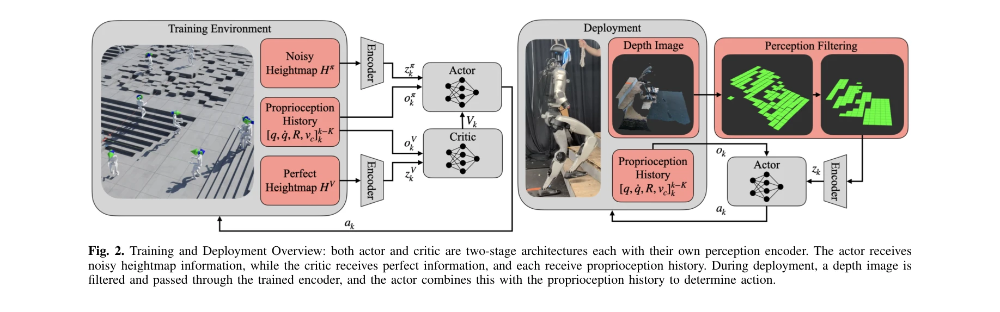
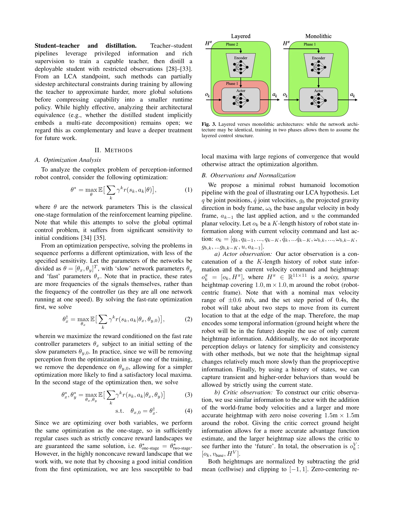

# Architecture Is All You Need: Diversity-Enabled Sweet Spots for Robust Humanoid Locomotion

> **저자**: Blake Werner, Lizhi Yang, Aaron D. Ames | **날짜**: 2025-10-16 | **URL**: [https://arxiv.org/abs/2510.14947](https://arxiv.org/abs/2510.14947)

---

## Essence

*Fig. 2. Training and Deployment Overview: both actor and critic are two-stage architectures each with their own percepti*

휴머노이드 로봇의 견고한 보행을 위해 빠른 고주파 안정화 제어기와 느린 저주파 지각 정책을 분리하는 계층화 제어 구조(LCA)가 단일 end-to-end 설계보다 우월함을 보였다.

## Motivation

- **Known**: 휴머노이드 로봇의 보행 제어는 빠른 저수준 안정화와 느린 고수준 의사결정의 균형이 필요하며, 항공우주 분야의 GNC 패러다임에서 이러한 다층 구조의 효과가 입증되어 있다.
- **Gap**: 기존 연구들은 복잡한 환경 추정기, 월드 모델, 정교한 네트워크 아키텍처에 집중하는 반면, 최소한의 구성요소로 견고한 다층 제어 구조의 효과를 체계적으로 검증하지 못했다.
- **Why**: 휴머노이드 로봇이 비정형 지형에서 안정적으로 운동하려면 구조적 설계가 네트워크 복잡도보다 중요함을 보이는 것이 로봇 제어의 근본적인 원리를 명확히 하는 데 의의가 있다.
- **Approach**: blind stabilizer pretraining 단계에서 고유수용성 피드백만으로 안정화 제어기를 학습한 후, perceptual fine-tuning 단계에서 heightmap 기반 지각 정책을 추가하는 2단계 커리큘럼 학습을 제안한다.

## Achievement

*Fig. 3. Layered verses monolithic architectures: while the network archi-*

- **아키텍처 우월성**: 동일한 네트워크 복잡도 하에서 계층화 구조(LCA)가 end-to-end 단일단계 설계를 크게 능가함을 검증
- **최소 구성 달성**: 복잡한 월드 모델, mixed-integer 최적화, 복잡한 인코더 없이도 stairs, ledge 등 복잡한 지형에서 성공
- **하드웨어 검증**: Unitree G1 휴머노이드에서 실제 환경에서 동작하는 것을 입증하여 시뮬레이션 갭 극복
- **최적화 분석**: 2단계 최적화가 sensitivity를 감소시킨다는 수학적 분석 제공

## How

*Fig. 2. Training and Deployment Overview: both actor and critic are two-stage architectures each with their own percepti*

- **2단계 학습**: 첫 번째 단계에서 지각 입력을 0으로 설정하여 pure proprioceptive stabilizer 학습, 두 번째 단계에서 고정된 stabilizer 위에서 perception policy 학습
- **최소 LCA 인스턴스화**: 고속 저수준 stabilizer (joint-space tracking with standard RL rewards)와 저속 navigation policy (compact local heightmap 기반)의 두 개 레이어만 구성
- **정보 인터페이스 분리**: perception encoder에서 생성된 latent space는 stabilizer의 조건으로만 사용되어 tight coupling 방지
- **다양성 기반 최적화**: θ = [θx, θy]로 네트워크 매개변수를 분리하여 sequence 최적화 수행
- **아키텍처 고정 비교**: 네트워크 아키텍처 변형과 학습 커리큘럼 변형에 대한 ablation study로 구조의 중요성 입증

## Originality

- 기존 다양한 two-stage 커리큘럼 연구들을 LCA 프레임워크로 통합적으로 해석하고 최소 구성의 원칙을 도출
- Diversity-Enabled Sweet Spots (DeSS) 개념을 humanoid locomotion에 처음 적용하여 구조적 다양성이 성능 향상의 핵심임을 보임
- 최소한의 아키텍처(compact local heightmap encoder)로도 복잡한 지형 주행이 가능함을 입증하여 기존의 과도한 설계 경향에 반박
- optimization 관점에서 2단계 학습의 수학적 정당성을 sensitivity 감소로 설명

## Limitation & Further Study

- 최적화 분석(식 1-4)이 strictly concave reward landscape 가정 하에서만 동일 해를 보장하나, 실제 RL은 non-convex이므로 이론과 실제 갭 존재
- heightmap 기반 local perception만 사용하여 global long-horizon planning 능력이 제한될 수 있으며, 더 복잡한 환경 구조(예: dynamic obstacles)에서의 확장성 미검증
- Unitree G1 단일 로봇 플랫폼에서만 검증되어 다른 형태의 휴머노이드에 대한 일반화 가능성 불명확
- student-teacher distillation 등 다른 2단계 학습 방식과의 아키텍처 동등성 분석 미흡
- 후속 연구: (1) strictly concave가 아닌 환경에서 2단계 최적화의 수렴 보장 조건 분석, (2) global planning layer 추가 시 성능 변화 연구, (3) 다양한 로봇 플랫폼 및 복잡한 지형에서의 확장 검증

## Evaluation

- Novelty: 4/5
- Technical Soundness: 3/5
- Significance: 4/5
- Clarity: 4/5
- Overall: 4/5

**총평**: 휴머노이드 로봇 제어에서 네트워크 복잡도보다 구조적 설계(계층화 다중 주파수)가 견고성의 핵심임을 명확히 입증한 중요한 연구로, 최소한의 아키텍처로 복잡한 실제 환경 과제를 해결함으로써 로봇 제어 설계의 원칙을 제시한다.
