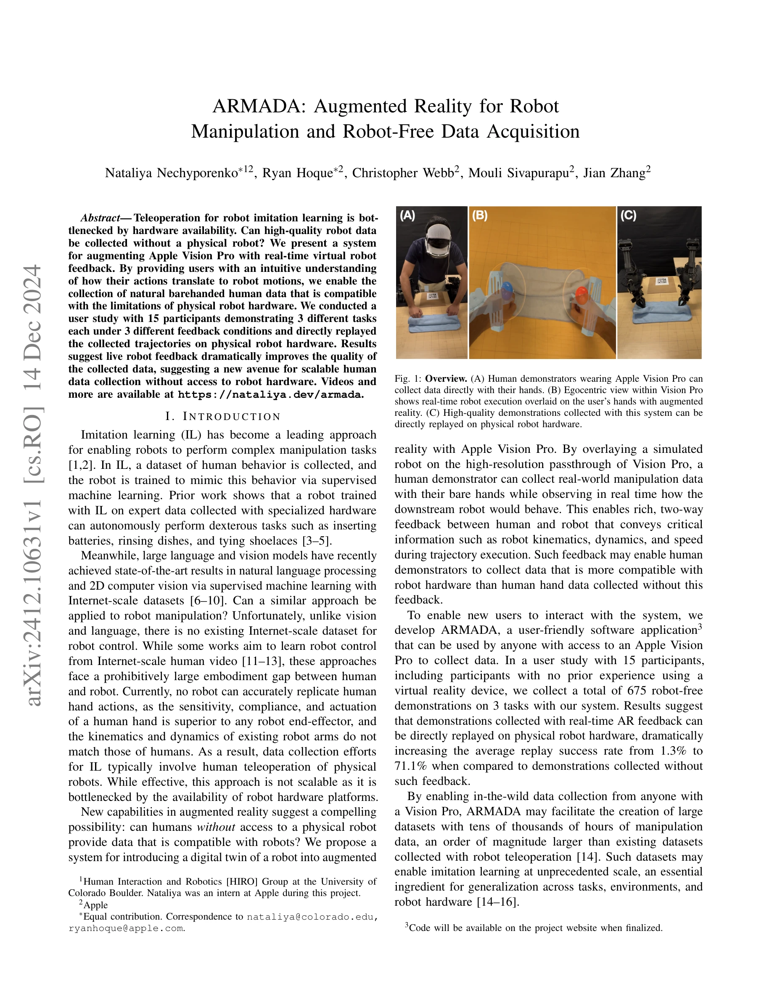

# ARMADA: Augmented Reality for Robot Manipulation and Robot-Free Data Acquisition

> **저자**: Nataliya Nechyporenko, Ryan Hoque, Christopher Webb, Mouli Sivapurapu, Jian Zhang | **날짜**: 2024-12-14 | **URL**: [https://arxiv.org/abs/2412.10631](https://arxiv.org/abs/2412.10631)

---

## Essence

*Fig. 1: Overview. (A) Human demonstrators wearing Apple Vision Pro can*

Apple Vision Pro의 AR을 활용하여 물리적 로봇 없이 로봇 조작 데이터를 수집하는 ARMADA 시스템을 제시하며, 실시간 로봇 피드백이 데이터 품질을 1.3%에서 71.1%로 향상시킨다.

## Motivation

- **Known**: 모방 학습(imitation learning)은 로봇 조작을 위한 주요 접근법이지만, 전문 하드웨어를 통한 원격 조종 데이터 수집은 하드웨어 가용성에 의해 병목된다.
- **Gap**: 인간과 로봇 간의 embodiment gap을 극복하면서도 물리적 로봇 없이 확장 가능한 데이터 수집 방법이 부재하다.
- **Why**: 인터넷 규모의 로봇 조작 데이터셋이 존재하지 않아 대규모 모방 학습이 불가능하며, AR을 통한 스케일링 가능한 데이터 수집은 로봇 학습의 일반화를 크게 향상시킬 수 있다.
- **Approach**: Apple Vision Pro에서 손 뼈대 추적(skeleton tracking)을 통해 인간의 행동을 감지하고, 실시간 kinematic 시뮬레이션된 로봇 디지털 트윈을 AR로 오버레이하여 사용자에게 로봇 운동학, 동역학, 속도 피드백을 제공한다.

## Achievement

*Fig. 1: Overview. (A) Human demonstrators wearing Apple Vision Pro can*

- **스케일러블 데이터 수집**: 15명의 참여자로부터 3개 작업에 대해 675개의 로봇 없는 데모를 수집
- **성능 향상**: 실시간 AR 피드백을 통해 직접 재현(replay) 성공률이 1.3%에서 71.1%로 증가
- **하드웨어 독립성**: 물리적 로봇 접근 없이도 로봇 호환 데이터 수집 가능
- **사용성**: Vision Pro만 필요한 착용 불편 요소 없는 맨손(barehanded) 데이터 수집 가능

## How

*Fig. 2: Overview of the system architecture described in Section III-A. Human skeletal data is sent over websockets to a*

- ARKit을 통해 손가락과 손목 위치를 추적하여 로봇 제어 명령으로 변환
- ROS와 websocket을 결합한 아키텍처로 Vision Pro와 외부 compute device 간 30Hz 루프 통신
- QR 코드 기준으로 로봇 기저를 배치하고 각 링크를 상대 프레임으로 추가하여 AR 시각화
- singularity, speed, workspace 위반 등의 constraint 정보를 실시간으로 계산하여 시각적 피드백 제공
- 이미지 프레임과 인간 뼈대 데이터를 캡처하여 proprioceptive data와 함께 저장

## Originality

- Apple Vision Pro의 egocentric passthrough 카메라와 고급 손 추적을 활용한 최초의 실시간 로봇 디지털 트윈 AR 시스템
- 물리적 로봇 하드웨어 없이도 embodiment gap을 고려한 데이터 수집이 가능함을 실증
- AR2-D2와 달리 실시간 피드백을 제공하며, ARCap 대비 간편한 맨손 인터페이스 제시
- plug-and-play 아키텍처로 다양한 로봇 플랫폼(Franka, UR5 등)에 호환 가능

## Limitation & Further Study

- 15명의 소규모 사용자 연구로 대규모 데이터 수집 가능성을 충분히 검증하지 못함
- Apple Vision Pro의 높은 비용으로 인한 보편적 접근성 제한
- 복잡한 손-물체 접촉 모델링이 필요한 과제에서의 성능 미검증
- 시스템의 지연시간(latency)과 추적 정확도에 대한 상세한 분석 부족
- 후속 연구: 더 많은 참여자와 다양한 과제에 대한 대규모 검증, 시뮬레이션-실제 로봇 간 성능 격차 분석, 손 접촉 감각 피드백 추가

## Evaluation

- Novelty: 4/5
- Technical Soundness: 4/5
- Significance: 4/5
- Clarity: 4/5
- Overall: 4/5

**총평**: ARMADA는 AR 기술을 창의적으로 활용하여 로봇 데이터 수집의 실제적 병목을 해결하는 혁신적 시스템을 제시하며, 실시간 피드백의 극적인 효과를 실증함으로써 대규모 로봇 학습의 새로운 가능성을 열었다.

## Related Papers

- 🔄 다른 접근: [[papers/1839_CLONE_Closed-Loop_Whole-Body_Humanoid_Teleoperation_for_Long/review]] — 두 논문 모두 AR/MR 기술을 활용한 원격조종 시스템이지만 ARMADA는 데이터 수집, CLONE은 실시간 제어에 집중한다.
- 🔗 후속 연구: [[papers/2124_Open-TeleVision_Teleoperation_with_Immersive_Active_Visual_F/review]] — Open-TeleVision과 함께 immersive 원격조종의 발전 방향을 제시하며 AR 기반 데이터 수집의 토대를 마련했다.
- 🔄 다른 접근: [[papers/1824_BiGym_A_Demo-Driven_Mobile_Bi-Manual_Manipulation_Benchmark/review]] — 로봇 조작 데이터 수집에서 하나는 AR 기반 물리적 로봇 없는 방식, 다른 하나는 실제 로봇 데모 방식을 사용한다.
- 🔗 후속 연구: [[papers/2164_TWIST2_Scalable_Portable_and_Holistic_Humanoid_Data_Collecti/review]] — AR 기반 데이터 수집을 확장하여 scalable하고 holistic한 휴머노이드 데이터 수집 시스템을 구현한다.
- 🏛 기반 연구: [[papers/1750_Vision_in_Action_Learning_Active_Perception_from_Human_Demon/review]] — 인간 데모로부터 active perception을 학습하는 기초 방법론을 AR 환경에서 구현한 응용 사례이다.
- 🔗 후속 연구: [[papers/1814_Being-H0_Vision-Language-Action_Pretraining_from_Large-Scale/review]] — 대규모 인간 비디오 사전 훈련에 Apple Vision Pro를 활용한 로봇 없는 데이터 수집 방식을 통합할 수 있습니다.
- 🏛 기반 연구: [[papers/1830_Bunny-VisionPro_Real-Time_Bimanual_Dexterous_Teleoperation_f/review]] — 실시간 이중팔 원격조작 기술이 ARMADA의 AR 기반 로봇 조작 데이터 수집에 피드백 시스템의 기반을 제공합니다.
- 🔗 후속 연구: [[papers/1814_Being-H0_Vision-Language-Action_Pretraining_from_Large-Scale/review]] — Apple Vision Pro를 활용한 로봇 없는 데이터 수집 방식을 Being-H0의 대규모 인간 비디오 사전 훈련에 통합할 수 있습니다.
- 🔄 다른 접근: [[papers/1824_BiGym_A_Demo-Driven_Mobile_Bi-Manual_Manipulation_Benchmark/review]] — 데모 수집에서 하나는 인간이 직접 수집한 실제 데모, 다른 하나는 AR 기반 가상 데모를 활용한다.
- 🏛 기반 연구: [[papers/1839_CLONE_Closed-Loop_Whole-Body_Humanoid_Teleoperation_for_Long/review]] — ARMADA의 AR 기반 데이터 수집 기술이 CLONE의 MR 기반 원격조종 시스템 개발에 중요한 기반을 제공했다.
- 🔗 후속 연구: [[papers/1960_Guided_Motion_Diffusion_for_Controllable_Human_Motion_Synthe/review]] — ARMADA의 augmented reality 기반 robot manipulation을 텍스트 기반 제어 가능한 인간 모션 합성으로 확장하여 더 직관적인 인터페이스를 제공합니다.
