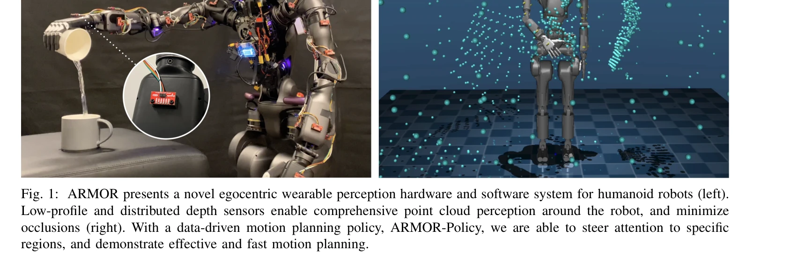
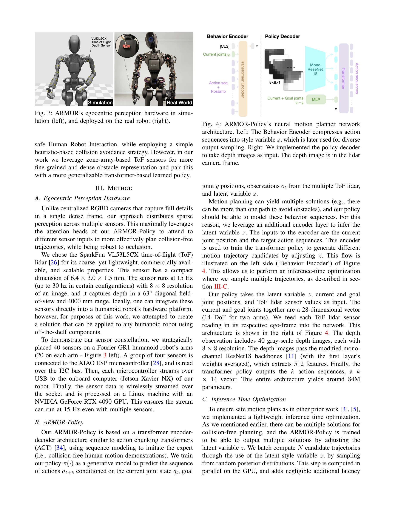

# ARMOR: Egocentric Perception for Humanoid Robot Collision Avoidance and Motion Planning

> **저자**: Daehwa Kim, Mario Srouji, Chen Chen, Jian Zhang | **날짜**: 2024-11-30 | **URL**: [https://arxiv.org/abs/2412.00396](https://arxiv.org/abs/2412.00396)

---

## Essence

*Fig. 3: ARMOR’s egocentric perception hardware in simu-*

휴머노이드 로봇의 팔과 손에 분산 배치된 ToF 센서 기반의 자아중심 지각 시스템 ARMOR과 transformer 기반 모방학습 정책을 제시하여 밀집 환경에서의 충돌 회피 및 동작 계획을 수행한다.

## Motivation

- **Known**: 휴머노이드 로봇은 고도의 자유도를 가지고 있으며, 기존 연구는 머리 또는 몸통에 중앙집중식 RGB-D 카메라/라이다를 사용하거나 샘플링 기반 동작 계획 알고리즘(cuRobo 등)을 활용해왔다.
- **Gap**: 중앙집중식 카메라는 팔과 손의 폐색 문제를 해결하지 못하고, 촉각 센싱은 비용이 높으며, 학습 기반 방법들은 작업별 행동에 의존하는 제한이 있다.
- **Why**: 실제 환경에서 휴머노이드 로봇이 안전하게 조작과 이동을 수행하려면 우수한 지각과 효율적인 동작 계획이 필수이며, 자아중심 센서는 외부 인프라에 의존하지 않는 자율적 배치를 가능하게 한다.
- **Approach**: 40개의 VL53L5CX ToF 센서를 팔에 분산 배치하여 폐색 없는 지각을 확보하고, AMASS 데이터셋의 86시간 분량 인간 동작을 전문가 궤적으로 사용하여 transformer 기반 imitation learning 정책을 학습한다.

## Achievement

*Fig. 1: ARMOR presents a novel egocentric wearable perception hardware and software system for humanoid robots (left).*

- **지각 성능**: 머리 장착 및 외부 카메라 설정 대비 충돌 63.7% 감소, 성공률 78.7% 향상
- **정책 성능**: cuRobo 샘플링 기반 계획법 대비 충돌 31.6% 감소, 성공률 16.9% 향상, 계산 지연 26배 감소
- **실제 배포**: Fourier Intelligence GR1 휴머노이드에 ARMOR 지각 시스템 구현 및 검증

## How

*Fig. 4: ARMOR-Policy’s neural motion planner network*

- SparkFun VL53L5CX ToF 센서 40개를 각 팔에 20개씩 전략적으로 배치 (6.4×3.0×1.5mm 컴팩트 사이즈, 15Hz, 8×8 해상도)
- 4개 센서당 XIAO ESP 마이크로컨트롤러로 관리, I2C 버스로 연결, Jetson Xavier NX를 통해 RTX 4090 GPU로 처리
- AMASS 데이터셋에서 311,922개 인간 동작(86.6시간) 추출 후 GR1 로봇 팔 관절로 재타겟팅
- 재타겟 궤적 주변에 타이트한 장애물 생성하여 충돌 없는 학습 데이터 생성
- Transformer encoder-decoder 아키텍처 기반 ARMOR-Policy 학습
- 추론 시 다중 궤적 샘플링을 통한 최적화 수행

## Originality

- 분산 ToF 센서 배치의 novelty: 기존 proximity 센싱이 아닌 zone-array 기반 세밀한 장애물 표현으로 transformer attention 메커니즘과 결합
- 인간 중심 데이터 활용: 작업별 pick-and-place가 아닌 AMASS의 일반적 인간 동작(조작, 사회적 행동, 춤 등)을 전문가 궤적으로 사용
- 통합 하드웨어-소프트웨어 설계: 기성품 off-the-shelf 센서와 마이크로컨트롤러로 기존 휴머노이드에 적용 가능한 확장성
- egocentric 완전 자율성: 외부 카메라 의존 없이 모바일 로봇의 이동 가능성 극대화

## Limitation & Further Study

- 현재 40개 센서 기반이나 최적 센서 개수와 배치 위치에 대한 체계적 분석 부재
- ToF 센서의 낮은 해상도(8×8)가 복잡한 기하학적 장애물에서의 성능 제약 가능성
- 시뮬레이션에서 학습하고 실제 로봇에 배포했으나 sim-to-real gap에 대한 상세한 논의 부족
- 비교 기준이 주로 외부 카메라 또는 cuRobo에 한정되어 최근 다른 learning-based 방법들과의 비교 미흡
- 센서 비용, 전력 소비, 마이크로컨트롤러 관리의 확장성 문제에 대한 분석 필요
- 후속 연구: 센서 배치 최적화, 더 높은 해상도 ToF 센서 활용, 다양한 robot 형태에 대한 일반화, 실제 환경 노이즈 강건성 검증

## Evaluation

- Novelty: 4/5
- Technical Soundness: 3/5
- Significance: 4/5
- Clarity: 4/5
- Overall: 4/5

**총평**: 휴머노이드 로봇의 지각-계획 문제를 분산 ToF 센서와 인간 중심의 imitation learning으로 창의적으로 해결하며, 실제 배포와 의미 있는 성능 향상으로 실용성 높은 연구이다. 다만 센서 배치 최적화와 sim-to-real gap 논의 강화가 필요하다.

## Related Papers

- 🏛 기반 연구: [[papers/1845_Collision-Free_Humanoid_Traversal_in_Cluttered_Indoor_Scenes/review]] — 두 논문 모두 밀집 환경에서의 충돌 회피를 다루지만 ARMOR은 ToF 센서 기반, HumanoidPF는 potential field 기반 접근법을 사용한다.
- 🔗 후속 연구: [[papers/2117_Omni-Perception_Omnidirectional_Collision_Avoidance_for_Legg/review]] — Omni-Perception과 함께 전방향 충돌 회피 시스템의 완성된 형태를 보여주며 센서 융합의 중요성을 입증한다.
- 🏛 기반 연구: [[papers/1871_Dexterity_from_Smart_Lenses_Multi-Fingered_Robot_Manipulatio/review]] — 분산 센서를 활용한 dexterous manipulation의 기초 기술이 전신 충돌 회피 시스템에 응용된다.
- 🔄 다른 접근: [[papers/1978_Hiking_in_the_Wild_A_Scalable_Perceptive_Parkour_Framework_f/review]] — 밀집 환경에서 충돌 회피를 위해 ToF 센서 기반 자아중심 지각 vs 시각적 지각 파쿠르 프레임워크라는 다른 센서 모달리티를 비교할 수 있다
- 🏛 기반 연구: [[papers/1932_FocusNav_Spatial_Selective_Attention_with_Waypoint_Guidance/review]] — 충돌 회피를 위한 공간적 선택적 주의 메커니즘이 ARMOR의 transformer 기반 지각 정책의 이론적 기반을 제공한다
- 🔄 다른 접근: [[papers/1746_VB-Com_Learning_Vision-Blind_Composite_Humanoid_Locomotion_A/review]] — 둘 다 humanoid의 인식 기반 충돌 회피를 다루지만 ARMOR은 egocentric 접근법을 사용합니다.
- 🔄 다른 접근: [[papers/1845_Collision-Free_Humanoid_Traversal_in_Cluttered_Indoor_Scenes/review]] — 밀집 환경에서의 충돌 회피를 다루지만 HumanoidPF는 potential field, ARMOR은 ToF 센서 기반으로 서로 다른 접근법을 사용한다.
- 🔗 후속 연구: [[papers/1911_Emergent_Active_Perception_and_Dexterity_of_Simulated_Humano/review]] — 에고센트릭 비전을 통한 충돌 회피가 능동적 인식 프레임워크의 확장된 응용이다.
- 🔗 후속 연구: [[papers/2010_HumanoidPano_Hybrid_Spherical_Panoramic-LiDAR_Cross-Modal_Pe/review]] — ARMOR의 egocentric 충돌 회피를 HumanoidPano가 spherical panoramic vision으로 확장하여 360도 환경 인식을 달성합니다.
